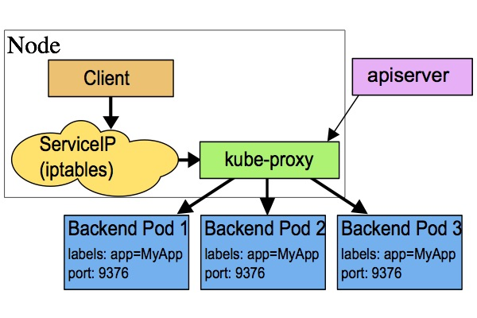
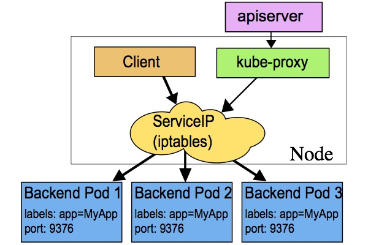
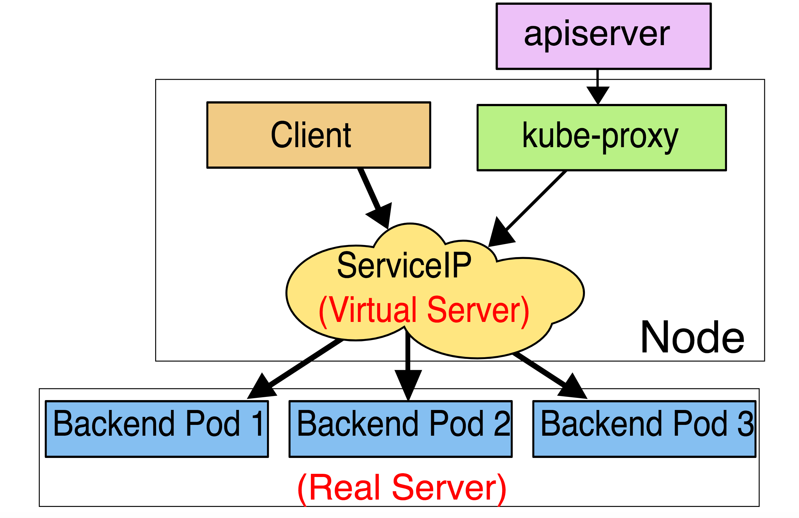

# Service

Kubernetes [`Pod`](https://kubernetes.io/docs/user-guide/pods) 是有生命周期的，它们可以被创建，也可以被销毁，然而一旦被销毁生命就永远结束。 
通过 [`ReplicationController`](https://kubernetes.io/docs/user-guide/replication-controller) 能够动态地创建和销毁 `Pod`。 
每个 `Pod` 都会获取它自己的 IP 地址，即使这些 IP 地址不总是稳定可依赖的。
这会导致一个问题：在 Kubernetes 集群中，如果一组 `Pod`（称为 backend）为其它 `Pod` （称为 frontend）提供服务，那么那些 frontend 该如何发现，并连接到这组 `Pod` 中的哪些 backend 呢？

关于 `Service`

Kubernetes `Service` 定义了这样一种抽象：一个 `Pod` 的逻辑分组，一种可以访问它们的策略 —— 通常称为微服务。
这一组 `Pod` 能够被 `Service` 访问到，通常是通过 [`Label Selector`](https://kubernetes.io/docs/concepts/overview/working-with-objects/labels/#label-selectors)（查看下面了解，为什么可能需要没有 selector 的 `Service`）实现的。

举个例子，考虑一个图片处理 backend，它运行了3个副本。这些副本是可互换的 —— frontend 不需要关心它们调用了哪个 backend 副本。
然而组成这一组 backend 程序的 `Pod` 实际上可能会发生变化，frontend 客户端不应该也没必要知道，而且也不需要跟踪这一组 backend 的状态。
`Service` 定义的抽象能够解耦这种关联。

对 Kubernetes 集群中的应用，Kubernetes 提供了简单的 `Endpoints` API，只要 `Service` 中的一组 `Pod` 发生变更，应用程序就会被更新。
对非 Kubernetes 集群中的应用，Kubernetes 提供了基于 VIP 的网桥的方式访问 `Service`，再由 `Service` 重定向到 backend `Pod`。

## 定义 Service

一个 `Service` 在 Kubernetes 中是一个 REST 对象，和 `Pod` 类似。
像所有的 REST 对象一样， `Service` 定义可以基于 POST 方式，请求 apiserver 创建新的实例。
例如，假定有一组 `Pod`，它们对外暴露了 9376 端口，同时还被打上 `"app=MyApp"` 标签。

```yaml
kind: Service
apiVersion: v1
metadata:
  name: my-service
spec:
  selector:
    app: MyApp
  ports:
    - protocol: TCP
      port: 80
      targetPort: 9376
```

上述配置将创建一个名称为 “my-service” 的 `Service` 对象，它会将请求代理到使用 TCP 端口 9376，并且具有标签 `"app=MyApp"` 的 `Pod` 上。
这个 `Service` 将被指派一个 IP 地址（通常称为 “Cluster IP”），它会被服务的代理使用（见下面）。
该 `Service` 的 selector 将会持续评估，处理结果将被 POST 到一个名称为 “my-service” 的 `Endpoints` 对象上。

需要注意的是， `Service` 能够将一个接收端口映射到任意的 `targetPort`。
默认情况下，`targetPort` 将被设置为与 `port` 字段相同的值。
可能更有趣的是，`targetPort` 可以是一个字符串，引用了 backend `Pod` 的一个端口的名称。
但是，实际指派给该端口名称的端口号，在每个 backend `Pod` 中可能并不相同。
对于部署和设计 `Service` ，这种方式会提供更大的灵活性。
例如，可以在 backend 软件下一个版本中，修改 Pod 暴露的端口，并不会中断客户端的调用。

Kubernetes `Service` 能够支持 `TCP` 和 `UDP` 协议，默认 `TCP` 协议。 

### 没有 selector 的 Service

Service 抽象了该如何访问 Kubernetes `Pod`，但也能够抽象其它类型的 backend，例如：

* 希望在生产环境中使用外部的数据库集群，但测试环境使用自己的数据库。
* 希望服务指向另一个 [`Namespace`](https://kubernetes.io/docs/user-guide/namespaces) 中或其它集群中的服务。
* 正在将工作负载转移到 Kubernetes 集群，和运行在 Kubernetes 集群之外的 backend。

在任何这些场景中，都能够定义没有 selector 的 `Service` ：

```yaml
kind: Service
apiVersion: v1
metadata:
  name: my-service
spec:
  ports:
    - protocol: TCP
      port: 80
      targetPort: 9376
```
由于这个 `Service` 没有 selector，就不会创建相关的 `Endpoints` 对象。可以手动将 `Service` 映射到指定的 `Endpoints`：

```yaml
kind: Endpoints
apiVersion: v1
metadata:
  name: my-service
subsets:
  - addresses:
      - ip: 1.2.3.4
    ports:
      - port: 9376
```

注意：Endpoint IP 地址不能是 loopback（127.0.0.0/8）、 link-local（169.254.0.0/16）、或者 link-local 多播（224.0.0.0/24）。

访问没有 selector 的 `Service`，与有 selector 的 `Service` 的原理相同。请求将被路由到用户定义的 Endpoint（该示例中为 `1.2.3.4:9376`）。

ExternalName `Service` 是 `Service` 的特例，它没有 selector，也没有定义任何的端口和 Endpoint。
相反地，对于运行在集群外部的服务，它通过返回该外部服务的别名这种方式来提供服务。

```yaml
kind: Service
apiVersion: v1
metadata:
  name: my-service
  namespace: prod
spec:
  type: ExternalName
  externalName: my.database.example.com
```

当查询主机 `my-service.prod.svc.CLUSTER`时，集群的 DNS 服务将返回一个值为 `my.database.example.com` 的 `CNAME` 记录。
访问这个服务的工作方式与其它的相同，唯一不同的是重定向发生在 DNS 层，而且不会进行代理或转发。
如果后续决定要将数据库迁移到 Kubernetes 集群中，可以启动对应的 Pod，增加合适的 Selector 或 Endpoint，修改 `Service` 的 `type`。

## VIP 和 Service 代理

在 Kubernetes 集群中，每个 Node 运行一个 `kube-proxy` 进程。`kube-proxy` 负责为 `Service` 实现了一种 VIP（虚拟 IP）的形式，而不是 `ExternalName` 的形式。
在 Kubernetes v1.0 版本，代理完全在 userspace。在 Kubernetes v1.1 版本，新增了 iptables 代理，但并不是默认的运行模式。
从 Kubernetes v1.2 起，默认就是 iptables 代理。

在Kubernetes v1.8.0-beta.0中，添加了ipvs代理。

在 Kubernetes v1.0 版本，`Service` 是 “4层”（TCP/UDP over IP）概念。
在 Kubernetes v1.1 版本，新增了 `Ingress` API（beta 版），用来表示 “7层”（HTTP）服务。

### userspace 代理模式

这种模式，kube-proxy 会监视 Kubernetes master 对 `Service` 对象和 `Endpoints` 对象的添加和移除。
对每个 `Service`，它会在本地 Node 上打开一个端口（随机选择）。
任何连接到“代理端口”的请求，都会被代理到 `Service` 的backend `Pods` 中的某个上面（如 `Endpoints` 所报告的一样）。
使用哪个 backend `Pod`，是基于 `Service` 的 `SessionAffinity` 来确定的。
最后，它安装 iptables 规则，捕获到达该 `Service` 的 `clusterIP`（是虚拟 IP）和 `Port` 的请求，并重定向到代理端口，代理端口再代理请求到 backend `Pod`。

网络返回的结果是，任何到达 `Service` 的 IP:Port 的请求，都会被代理到一个合适的 backend，不需要客户端知道关于 Kubernetes、`Service`、或 `Pod` 的任何信息。

默认的策略是，通过 round-robin 算法来选择 backend `Pod`。
实现基于客户端 IP 的会话亲和性，可以通过设置 `service.spec.sessionAffinity` 的值为 `"ClientIP"` （默认值为 `"None"`）。




### iptables 代理模式

这种模式，kube-proxy 会监视 Kubernetes master 对 `Service` 对象和 `Endpoints` 对象的添加和移除。
对每个 `Service`，它会安装 iptables 规则，从而捕获到达该 `Service` 的 `clusterIP`（虚拟 IP）和端口的请求，进而将请求重定向到 `Service` 的一组 backend 中的某个上面。
对于每个 `Endpoints` 对象，它也会安装 iptables 规则，这个规则会选择一个 backend `Pod`。

默认的策略是，随机选择一个 backend。
实现基于客户端 IP 的会话亲和性，可以将 `service.spec.sessionAffinity` 的值设置为 `"ClientIP"` （默认值为 `"None"`）。

和 userspace 代理类似，网络返回的结果是，任何到达 `Service` 的 IP:Port 的请求，都会被代理到一个合适的 backend，不需要客户端知道关于 Kubernetes、`Service`、或 `Pod` 的任何信息。
这应该比 userspace 代理更快、更可靠。然而，不像 userspace 代理，如果初始选择的 `Pod` 没有响应，iptables 代理不能自动地重试另一个 `Pod`，所以它需要依赖 [readiness probes](https://kubernetes.io/docs/tasks/configure-pod-container/configure-liveness-readiness-probes/#defining-readiness-probes)。




### ipvs 代理模式

这种模式，kube-proxy会监视Kubernetes `Service`对象和`Endpoints`，调用`netlink`接口以相应地创建ipvs规则并定期与Kubernetes `Service`对象和`Endpoints`对象同步ipvs规则，以确保ipvs状态与期望一致。访问服务时，流量将被重定向到其中一个后端Pod。

与iptables类似，ipvs基于netfilter 的 hook 功能，但使用哈希表作为底层数据结构并在内核空间中工作。这意味着ipvs可以更快地重定向流量，并且在同步代理规则时具有更好的性能。此外，ipvs为负载均衡算法提供了更多选项，例如：

- `rr`：轮询调度
- `lc`：最小连接数
- `dh`：目标哈希
- `sh`：源哈希
- `sed`：最短期望延迟
- `nq`： 不排队调度

**注意：** ipvs模式假定在运行kube-proxy之前在节点上都已经安装了IPVS内核模块。当kube-proxy以ipvs代理模式启动时，kube-proxy将验证节点上是否安装了IPVS模块，如果未安装，则kube-proxy将回退到iptables代理模式。



## 多端口 Service

很多 `Service` 需要暴露多个端口。对于这种情况，Kubernetes 支持在 `Service` 对象中定义多个端口。
当使用多个端口时，必须给出所有的端口的名称，这样 Endpoint 就不会产生歧义，例如：

```yaml
kind: Service
apiVersion: v1
metadata:
  name: my-service
spec:
    selector:
      app: MyApp
    ports:
      - name: http
        protocol: TCP
        port: 80
        targetPort: 9376
      - name: https
        protocol: TCP
        port: 443
        targetPort: 9377
```

## 选择自己的 IP 地址

在 `Service` 创建的请求中，可以通过设置 `spec.clusterIP` 字段来指定自己的集群 IP 地址。
比如，希望替换一个已经存在的 DNS 条目，或者遗留系统已经配置了一个固定的 IP 且很难重新配置。
用户选择的 IP 地址必须合法，并且这个 IP 地址在 `service-cluster-ip-range` CIDR 范围内，这对 API Server 来说是通过一个标识来指定的。
如果 IP 地址不合法，API Server 会返回 HTTP 状态码 422，表示值不合法。

### 为何不使用 round-robin DNS？

一个不时出现的问题是，为什么我们都使用 VIP 的方式，而不使用标准的 round-robin DNS，有如下几个原因：

* 长久以来，DNS 库都没能认真对待 DNS TTL、缓存域名查询结果
* 很多应用只查询一次 DNS 并缓存了结果
   * 就算应用和库能够正确查询解析，每个客户端反复重解析造成的负载也是非常难以管理的

我们尽力阻止用户做那些对他们没有好处的事情，如果很多人都来问这个问题，我们可能会选择实现它。

## 服务发现

Kubernetes 支持2种基本的服务发现模式 —— 环境变量和 DNS。

### 环境变量

当 `Pod` 运行在 `Node` 上，kubelet 会为每个活跃的 `Service` 添加一组环境变量。
它同时支持 [Docker links 兼容](https://docs.docker.com/userguide/dockerlinks/) 变量（查看 makeLinkVariables）、简单的 `{SVCNAME}_SERVICE_HOST` 和 `{SVCNAME}_SERVICE_PORT` 变量，这里 `Service` 的名称需大写，横线被转换成下划线。

举个例子，一个名称为 `"redis-master"` 的 Service 暴露了 TCP 端口 6379，同时给它分配了 Cluster IP 地址 10.0.0.11，这个 Service 生成了如下环境变量：

```bash
REDIS_MASTER_SERVICE_HOST=10.0.0.11
REDIS_MASTER_SERVICE_PORT=6379
REDIS_MASTER_PORT=tcp://10.0.0.11:6379
REDIS_MASTER_PORT_6379_TCP=tcp://10.0.0.11:6379
REDIS_MASTER_PORT_6379_TCP_PROTO=tcp
REDIS_MASTER_PORT_6379_TCP_PORT=6379
REDIS_MASTER_PORT_6379_TCP_ADDR=10.0.0.11
```
*这意味着需要有顺序的要求* ——  `Pod` 想要访问的任何 `Service` 必须在 `Pod` 自己之前被创建，否则这些环境变量就不会被赋值。DNS 并没有这个限制。

### DNS

一个可选（尽管强烈推荐）[集群插件](http://releases.k8s.io/master/cluster/addons/README.md) 是 DNS 服务器。
DNS 服务器监视着创建新 `Service` 的 Kubernetes API，从而为每一个 `Service` 创建一组 DNS 记录。
如果整个集群的 DNS 一直被启用，那么所有的 `Pod` 应该能够自动对 `Service` 进行名称解析。

例如，有一个名称为 `"my-service"` 的 `Service`，它在 Kubernetes 集群中名为 `"my-ns"` 的 `Namespace` 中，为 `"my-service.my-ns"` 创建了一条 DNS 记录。
在名称为 `"my-ns"` 的 `Namespace` 中的 `Pod` 应该能够简单地通过名称查询找到 `"my-service"`。
在另一个 `Namespace` 中的 `Pod` 必须限定名称为 `"my-service.my-ns"`。
这些名称查询的结果是 Cluster IP。

Kubernetes 也支持对端口名称的 DNS SRV（Service）记录。
如果名称为 `"my-service.my-ns"` 的 `Service` 有一个名为 `"http"` 的 `TCP` 端口，可以对 `"_http._tcp.my-service.my-ns"` 执行 DNS SRV 查询，得到 `"http"` 的端口号。

Kubernetes DNS 服务器是唯一的一种能够访问 `ExternalName` 类型的 Service 的方式。
更多信息可以查看 [DNS Pod 和 Service](https://kubernetes.io/docs/concepts/services-networking/dns-pod-service/)。

## Headless Service

有时不需要或不想要负载均衡，以及单独的 Service IP。
遇到这种情况，可以通过指定 Cluster IP（`spec.clusterIP`）的值为 `"None"` 来创建 `Headless` Service。

这个选项允许开发人员自由寻找他们自己的方式，从而降低与 Kubernetes 系统的耦合性。
应用仍然可以使用一种自注册的模式和适配器，对其它需要发现机制的系统能够很容易地基于这个 API 来构建。

对这类 `Service` 并不会分配 Cluster IP，kube-proxy 不会处理它们，而且平台也不会为它们进行负载均衡和路由。
DNS 如何实现自动配置，依赖于 `Service` 是否定义了 selector。

### 配置 Selector

对定义了 selector 的 Headless Service，Endpoint 控制器在 API 中创建了 `Endpoints` 记录，并且修改 DNS 配置返回 A 记录（地址），通过这个地址直接到达 `Service` 的后端  `Pod` 上。

### 不配置 Selector

对没有定义 selector 的 Headless Service，Endpoint 控制器不会创建 `Endpoints` 记录。
然而 DNS 系统会查找和配置，无论是：

* `ExternalName` 类型 Service 的 CNAME 记录
  * 记录：与 Service 共享一个名称的任何 `Endpoints`，以及所有其它类型

## 发布服务 —— 服务类型

对一些应用（如 Frontend）的某些部分，可能希望通过外部（Kubernetes 集群外部）IP 地址暴露 Service。

Kubernetes `ServiceTypes` 允许指定一个需要的类型的 Service，默认是 `ClusterIP` 类型。

`Type` 的取值以及行为如下：

* `ClusterIP`：通过集群的内部 IP 暴露服务，选择该值，服务只能够在集群内部可以访问，这也是默认的 `ServiceType`。
* `NodePort`：通过每个 Node 上的 IP 和静态端口（`NodePort`）暴露服务。`NodePort` 服务会路由到 `ClusterIP` 服务，这个 `ClusterIP` 服务会自动创建。通过请求 `<NodeIP>:<NodePort>`，可以从集群的外部访问一个 `NodePort` 服务。
* `LoadBalancer`：使用云提供商的负载均衡器，可以向外部暴露服务。外部的负载均衡器可以路由到 `NodePort` 服务和 `ClusterIP` 服务。
* `ExternalName`：通过返回 `CNAME` 和它的值，可以将服务映射到 `externalName` 字段的内容（例如， `foo.bar.example.com`）。
    没有任何类型代理被创建，这只有 Kubernetes 1.7 或更高版本的 `kube-dns` 才支持。

### NodePort 类型

如果设置 `type` 的值为 `"NodePort"`，Kubernetes master 将从给定的配置范围内（默认：30000-32767）分配端口，每个 Node 将从该端口（每个 Node 上的同一端口）代理到 `Service`。该端口将通过 `Service` 的 `spec.ports[*].nodePort` 字段被指定。

如果需要指定的端口号，可以配置 `nodePort` 的值，系统将分配这个端口，否则调用 API 将会失败（比如，需要关心端口冲突的可能性）。 

这可以让开发人员自由地安装他们自己的负载均衡器，并配置 Kubernetes 不能完全支持的环境参数，或者直接暴露一个或多个 Node 的 IP 地址。

需要注意的是，Service 将能够通过 `<NodeIP>:spec.ports[*].nodePort` 和 `spec.clusterIp:spec.ports[*].port` 而对外可见。

### LoadBalancer 类型

使用支持外部负载均衡器的云提供商的服务，设置 `type` 的值为 `"LoadBalancer"`，将为 `Service` 提供负载均衡器。
负载均衡器是异步创建的，关于被提供的负载均衡器的信息将会通过 `Service` 的 `status.loadBalancer` 字段被发布出去。

```yaml
kind: Service
apiVersion: v1
metadata:
  name: my-service
spec:
  selector:
    app: MyApp
  ports:
    - protocol: TCP
      port: 80
      targetPort: 9376
      nodePort: 30061
  clusterIP: 10.0.171.239
  loadBalancerIP: 78.11.24.19
  type: LoadBalancer
status:
  loadBalancer:
    ingress:
      - ip: 146.148.47.155
```
来自外部负载均衡器的流量将直接打到 backend `Pod` 上，不过实际它们是如何工作的，这要依赖于云提供商。
在这些情况下，将根据用户设置的 `loadBalancerIP` 来创建负载均衡器。
某些云提供商允许设置 `loadBalancerIP`。如果没有设置 `loadBalancerIP`，将会给负载均衡器指派一个临时 IP。
如果设置了 `loadBalancerIP`，但云提供商并不支持这种特性，那么设置的 `loadBalancerIP` 值将会被忽略掉。

### AWS 内部负载均衡器
在混合云环境中，有时从虚拟私有云（VPC）环境中的服务路由流量是非常有必要的。
可以通过在 `Service` 中增加 `annotation` 来实现，如下所示：

```yaml
[...]
metadata: 
    name: my-service
    annotations: 
        service.beta.kubernetes.io/aws-load-balancer-internal: 0.0.0.0/0
[...]
```
在水平分割的 DNS 环境中，需要两个 `Service` 来将外部和内部的流量路由到 Endpoint 上。

### AWS SSL 支持
对运行在 AWS 上部分支持 SSL 的集群，从 1.3 版本开始，可以为 `LoadBalancer` 类型的 `Service` 增加两个 annotation：

```
    metadata:
      name: my-service
      annotations:
        service.beta.kubernetes.io/aws-load-balancer-ssl-cert: arn:aws:acm:us-east-1:123456789012:certificate/12345678-1234-1234-1234-123456789012
```

第一个 annotation 指定了使用的证书。它可以是第三方发行商发行的证书，这个证书或者被上传到 IAM，或者由 AWS 的证书管理器创建。

```yaml
    metadata:
      name: my-service
      annotations:
         service.beta.kubernetes.io/aws-load-balancer-backend-protocol: (https|http|ssl|tcp)
```
第二个 annotation 指定了 `Pod` 使用的协议。
对于 HTTPS 和 SSL，ELB 将期望该 `Pod` 基于加密的连接来认证自身。

HTTP 和 HTTPS 将选择7层代理：ELB 将中断与用户的连接，当转发请求时，会解析 Header 信息并添加上用户的 IP 地址（`Pod` 将只能在连接的另一端看到该 IP 地址）。

TCP 和 SSL 将选择4层代理：ELB 将转发流量，并不修改 Header 信息。

### 外部 IP

如果外部的 IP 路由到集群中一个或多个 Node 上，Kubernetes `Service` 会被暴露给这些 `externalIPs`。
通过外部 IP（作为目的 IP 地址）进入到集群，打到 `Service` 的端口上的流量，将会被路由到 `Service` 的 Endpoint 上。
`externalIPs` 不会被 Kubernetes 管理，它属于集群管理员的职责范畴。

根据 `Service` 的规定，`externalIPs` 可以同任意的 `ServiceType` 来一起指定。
在下面的例子中，`my-service` 可以在 80.11.12.10:80（外部 IP:端口）上被客户端访问。

```yaml
kind: Service
apiVersion: v1
metadata:
  name: my-service
spec:
  selector:
    app: MyApp
  ports:
    - name: http
      protocol: TCP
      port: 80
      targetPort: 9376
  externalIPs: 
    - 80.11.12.10
```

## 不足之处

为 VIP 使用 userspace 代理，将只适合小型到中型规模的集群，不能够扩展到上千 `Service` 的大型集群。
查看 [最初设计方案](http://issue.k8s.io/1107) 获取更多细节。

使用 userspace 代理，隐藏了访问 `Service` 的数据包的源 IP 地址。
这使得一些类型的防火墙无法起作用。
iptables 代理不会隐藏 Kubernetes 集群内部的 IP 地址，但却要求客户端请求必须通过一个负载均衡器或 Node 端口。

`Type` 字段支持嵌套功能 —— 每一层需要添加到上一层里面。
不会严格要求所有云提供商（例如，GCE 就没必要为了使一个 `LoadBalancer` 能工作而分配一个 `NodePort`，但是 AWS 需要 ），但当前 API 是强制要求的。

## 未来工作

未来我们能预见到，代理策略可能会变得比简单的 round-robin 均衡策略有更多细微的差别，比如 master 选举或分片。
我们也能想到，某些 `Service` 将具有 “真正” 的负载均衡器，这种情况下 VIP 将简化数据包的传输。

我们打算为 L7（HTTP）`Service` 改进我们对它的支持。

我们打算为 `Service` 实现更加灵活的请求进入模式，这些 `Service` 包含当前 `ClusterIP`、`NodePort` 和 `LoadBalancer` 模式，或者更多。

## VIP 的那些骇人听闻的细节

对很多想使用 `Service` 的人来说，前面的信息应该足够了。
然而，有很多内部原理性的内容，还是值去理解的。

### 避免冲突

Kubernetes 最主要的哲学之一，是用户不应该暴露那些能够导致他们操作失败、但又不是他们的过错的场景。
这种场景下，让我们来看一下网络端口 —— 用户不应该必须选择一个端口号，而且该端口还有可能与其他用户的冲突。
这就是说，在彼此隔离状态下仍然会出现失败。

为了使用户能够为他们的 `Service` 选择一个端口号，我们必须确保不能有2个 `Service` 发生冲突。
我们可以通过为每个 `Service` 分配它们自己的 IP 地址来实现。

为了保证每个 `Service` 被分配到一个唯一的 IP，需要一个内部的分配器能够原子地更新 etcd 中的一个全局分配映射表，这个更新操作要先于创建每一个 `Service`。
为了使 `Service` 能够获取到 IP，这个映射表对象必须在注册中心存在，否则创建 `Service` 将会失败，指示一个 IP 不能被分配。
一个后台 Controller 的职责是创建映射表（从 Kubernetes 的旧版本迁移过来，旧版本中是通过在内存中加锁的方式实现），并检查由于管理员干预和清除任意 IP 造成的不合理分配，这些 IP 被分配了但当前没有 `Service` 使用它们。

### IP 和 VIP

不像 `Pod` 的 IP 地址，它实际路由到一个固定的目的地，`Service` 的 IP 实际上不能通过单个主机来进行应答。
相反，我们使用 `iptables`（Linux 中的数据包处理逻辑）来定义一个虚拟IP地址（VIP），它可以根据需要透明地进行重定向。
当客户端连接到 VIP 时，它们的流量会自动地传输到一个合适的 Endpoint。
环境变量和 DNS，实际上会根据 `Service` 的 VIP 和端口来进行填充。

#### Userspace

作为一个例子，考虑前面提到的图片处理应用程序。
当创建 backend `Service` 时，Kubernetes master 会给它指派一个虚拟 IP 地址，比如 10.0.0.1。
假设 `Service` 的端口是 1234，该 `Service` 会被集群中所有的 `kube-proxy` 实例观察到。
当代理看到一个新的 `Service`， 它会打开一个新的端口，建立一个从该 VIP 重定向到新端口的 iptables，并开始接收请求连接。

当一个客户端连接到一个 VIP，iptables 规则开始起作用，它会重定向该数据包到 `Service代理` 的端口。
`Service代理` 选择一个 backend，并将客户端的流量代理到 backend 上。

这意味着 `Service` 的所有者能够选择任何他们想使用的端口，而不存在冲突的风险。
客户端可以简单地连接到一个 IP 和端口，而不需要知道实际访问了哪些 `Pod`。

#### Iptables

再次考虑前面提到的图片处理应用程序。
当创建 backend `Service` 时，Kubernetes master 会给它指派一个虚拟 IP 地址，比如 10.0.0.1。
假设 `Service` 的端口是 1234，该 `Service` 会被集群中所有的 `kube-proxy` 实例观察到。
当代理看到一个新的 `Service`， 它会安装一系列的 iptables 规则，从 VIP 重定向到 per-`Service` 规则。
该 per-`Service` 规则连接到 per-`Endpoint` 规则，该 per-`Endpoint` 规则会重定向（目标 NAT）到 backend。

当一个客户端连接到一个 VIP，iptables 规则开始起作用。一个 backend 会被选择（或者根据会话亲和性，或者随机），数据包被重定向到这个 backend。
不像 userspace 代理，数据包从来不拷贝到用户空间，kube-proxy 不是必须为该 VIP 工作而运行，并且客户端 IP 是不可更改的。
当流量打到 Node 的端口上，或通过负载均衡器，会执行相同的基本流程，但是在那些案例中客户端 IP 是可以更改的。

## API 对象

在 Kubernetes REST API 中，Service 是 top-level 资源。

## 更多信息

- [使用 Service 连接 Frontend 到 Backend](https://kubernetes.io/docs/tutorials/connecting-apps/connecting-frontend-backend/)
