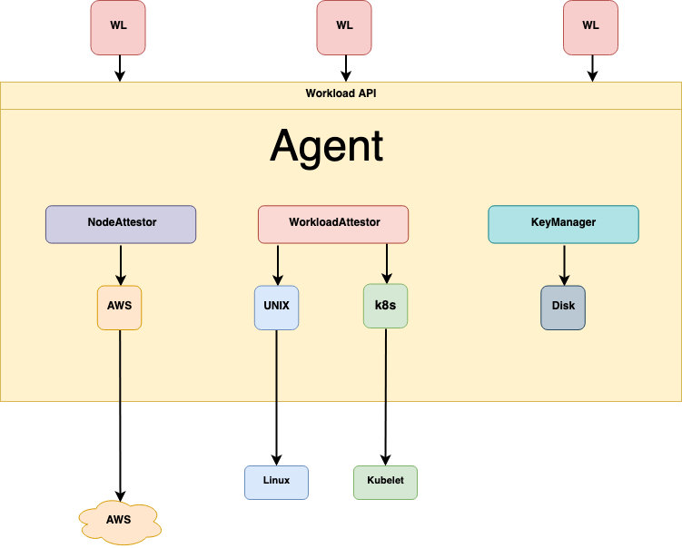

# SPIRE

这篇文章将向你介绍 SPIRE 的架构和基本原理。

SPIRE 是 [SPIFFE API](spiffe.md) 的一个生产就绪的实现，它执行节点和工作负载认证，以便根据一组预先定义的条件，安全地向工作负载发出 SVID，并验证其他工作负载的 SVID。

## SPIRE 架构和组件

SPIRE 部署由一个 SPIRE 服务器和一个或多个 SPIRE 代理组成。服务器充当通过代理向一组工作负载发放身份的签名机构。它还维护一个工作负载身份的注册表，以及为签发这些身份而必须验证的条件。代理在本地向工作负载公开 SPIFFE 工作负载 API，必须安装在工作负载运行的每个节点上。

## 服务器

SPIRE 服务器负责管理和发布其配置的 SPIFFE 信任域中的所有身份。它存储注册条目（指定决定特定 SPIFFE ID 应被签发的条件的选择器）和签名密钥，使用节点证明来自动验证代理的身份，并在被验证的代理请求时为工作负载创建 SVID。

服务器的行为是通过一系列的插件决定的。SPIRE 包含几个插件，你但可以建立额外的插件来扩展 SPIRE 以满足特定的使用情况。插件的类型包括：

-**节点证明者插件**：与代理节点证明者一起，验证代理运行的节点的身份。
-**节点解析器插件**：它通过验证关于节点的额外属性来扩展服务器可以用来识别节点的选择器集合。
-**数据存储插件**：服务器用它来存储、查询和更新各种信息，如注册条目、哪些节点已认证、这些节点的选择器是什么。有一个内置的数据存储插件，可以使用 MySQL、SQLite3 或 PostgresSQL 数据库来存储必要的数据。默认情况下，使用 SQLite 3。
-**密钥管理器插件**：控制服务器如何存储用于签署 X.509-SVID 和 JWT-SVID 的私钥。
-**上游权威机构插件**：默认情况下，SPIRE 服务器充当其自身的证书授权机构。但是，你可以使用上游权威机构插件来使用来自不同 PKI 系统的不同 CA。

你可以通过配置插件和其他各种配置变量来定制服务器的行为。详见 [SPIRE 服务器配置参考](https://spiffe.io/docs/latest/deploying/spire_server/)。

## 代理

一个 SPIRE 代理在确定的工作负载所运行的每个节点上运行。该代理：

-   从服务器上请求 SVID，并将其缓存起来，直到工作负载请求其 SVID 为止。

-   将 SPIFFE 工作负载 API 暴露给节点上的工作负载，并证明调用它的工作负载的身份。

-   提供已确定的工作负载及其 SVID

该代理的主要组成部分包括：

-  **节点证明者插件**：与服务器节点证明者一起，验证代理运行的节点的身份。

-  **工作负载证明者插件**：通过从节点操作系统中查询有关工作负载进程的信息，并将其与你在使用选择器注册工作负载属性时提供给服务器的信息进行比较，来验证节点上工作负载进程的身份。
   
-  **密钥管理器插件**：代理用来生成和使用发给工作负载的 X.509-SVID 的私钥。

你可以通过配置插件和其他配置变量来定制代理的行为。详见《[SPIRE 代理配置参考》](https://spiffe.io/docs/latest/deploying/spire_agent/)。

## 自定义服务器和代理插件

你可以为特定的平台和架构创建自定义的服务器和代理插件，而 SPIRE 并不包括这些插件。例如，你可以为一个架构创建服务器和代理节点验证器，而不是在节点验证下总结的那些。或者你可以创建一个自定义密钥管理器插件，以 SPIRE 目前不支持的方式处理私钥。因为 SPIRE 在运行时加载自定义插件，你不需要重新编译 SPIRE 来启用它们。

## 参考

- [SPIRE Concepts - spiffe.io](https://spiffe.io/docs/latest/spire-about/spire-concepts/)

