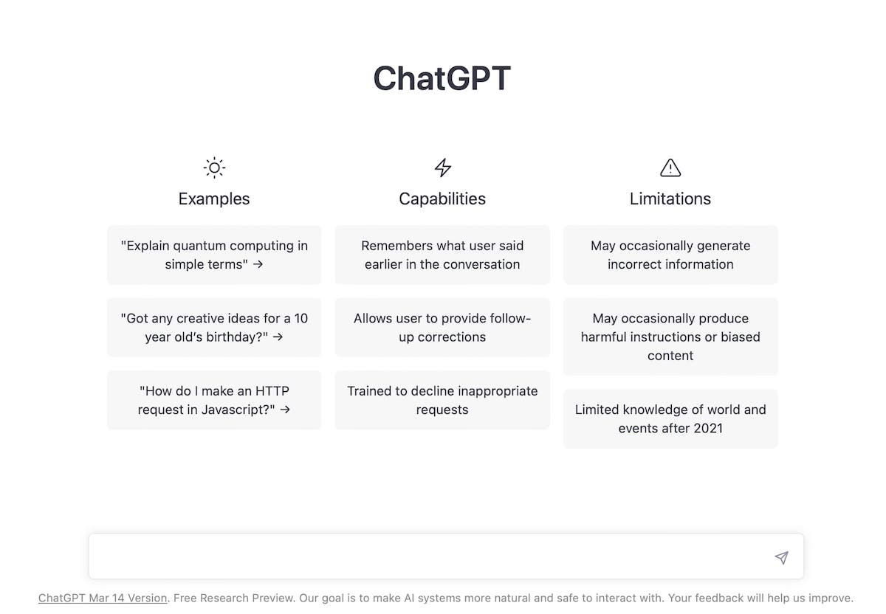
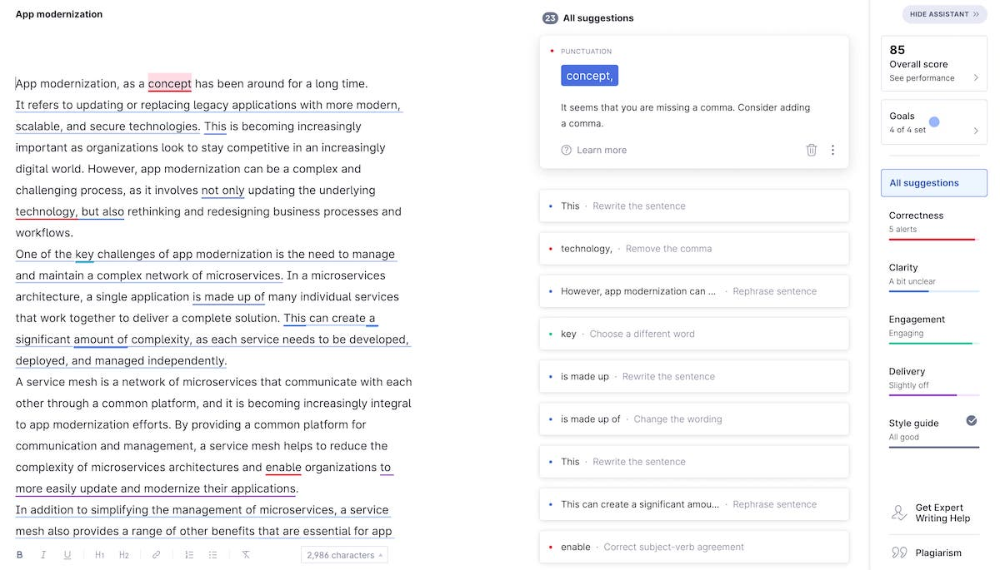

Artificial Intelligence (AI) is changing our lives, making our work more efficient and intelligent. In this rapidly developing field, there are many practical AI tools that can help us better accomplish our work. In the future, mastering various AI tools to optimize your workflow and improve work efficiency will be a necessary skill for everyone. It's time to gather some cheap and practical AI tools. Below are some recommended practical AI tools that are worth collecting. You can directly use these tools without additional programming knowledge. Most of these tools are free to use, or provide free usage quotas, or have low usage costs.

## 1. ChatGPT



[ChatGPT](https://chat.chatgpt.com/) is an intelligent chatbot based on GPT technology, which can interact with users in natural language. It uses deep learning technology and large-scale trained language models to understand users' questions and provide useful answers.

ChatGPT can answer various questions, and users can directly input questions or topics on the website and get quick and accurate answers. It should be noted that ChatGPT is an online chatbot, and its answers may not be 100% accurate. In addition, the data that ChatGPT model is trained on is up to 2021, and it is still in the early development stage, and is constantly improving and optimizing.

**Recommendation Reasons**

ChatGPT's response speed is super fast, and you can get an answer in a few seconds, which is especially suitable for situations where quick replies are needed. You can also use OpenAI's API to create your own tools. However, the free version of ChatGPT's response speed is sometimes slow, and frequently refreshing the page is required when following up, and there are also limits on the number of characters for questions and answers.

The commonly used functions include:

- Writing code
- Translation
- Proofreading articles
- Summarizing an article (you can output a URL)
- Learning a knowledge area that you are not familiar with

In addition, a ChatGPT desktop application is recommended: [https://github.com/lencx/ChatGPT](https://github.com/lencx/ChatGPT), as well as the ChatGPT prompt project [https://github.com/f/awesome-chatgpt-prompts](https://github.com/f/awesome-chatgpt-prompts).

### ChatGPT Plus

[ChatGPT Plus](https://chat.chatgpt.com/plus) is an enhanced version of ChatGPT that utilizes GPT-3 technology to provide more powerful and intelligent natural language processing capabilities. It can assist users in completing various tasks such as generating articles, translation, Q&A, speech conversion, and chatbots.

ChatGPT Plus has a sleek and beautiful interface that is very intuitive and user-friendly. Users can input text using various methods such as keyboard input, voice input, and image input. ChatGPT Plus also offers multiple language and style options, making it easy for users to generate high-quality text and speech.

## 2. Smodin


[Smodin.io](http://smodin.io/) is an online tool based on artificial intelligence and natural language processing technology that can help users generate content such as articles, press releases, blog posts, and social media posts. The website uses deep learning technology and language models to automatically generate high-quality text and offers a variety of language and style options.

Using [Smodin.io](http://smodin.io/) is very simple. Simply enter the topic, keywords, desired language, and style you wish to generate, then click the "Generate" button to obtain a high-quality article. You can also make adjustments and edits as needed to meet your specific needs.

In addition to generating text, [Smodin.io](http://smodin.io/) also offers other useful features such as grammar and spell check, SEO optimization suggestions, and real-time translation. The website is very flexible and convenient to use, making it suitable for individuals and businesses who require high-quality text, such as marketers, editors, writers, and bloggers.

It's important to note that while [Smodin.io](http://smodin.io/) can save you a lot of time and effort, since the text is generated automatically, there may be some syntax or logic errors. Therefore, appropriate review and editing are necessary when using it.

**Recommended Reasons**

The website supports over 40 languages, limits input to 1000 characters per session, and returns rewritten results quickly. Free users have a limit on the number of calls they can make, while paid users have a limit. There are two payment tiers, both of which are relatively inexpensive.

## 3. Bing


[Bing](https://bing.com) is a search engine developed by Microsoft that integrates artificial intelligence technology to provide more intelligent search results. Recently, Microsoft announced a new feature called "Chat" added to Bing, where users can input questions in the chat box and Bing will automatically answer them, just like an intelligent chatbot. Bing also provides multiple conversation styles to choose from.

It should be noted that the chat function is currently in the testing phase and may have some issues and limitations. Additionally, Bing's availability may be restricted in some countries and regions. However, it is still a very useful search engine that can help users quickly find the information they need.

**Recommended Reasons**

The newly integrated Chat feature in Bing is quite stable as it can connect to the internet and crawl real-time data. You can use it as an auxiliary tool for search engines or ask it for real-time information.

## 4. GitHub Copilot


GitHub Copilot is an AI code assistant developed jointly by OpenAI and GitHub, which can help developers write code faster and more accurately. It uses natural language processing and machine learning technologies to automatically generate high-quality code for users, improving development efficiency and code quality.

GitHub Copilot can be integrated with various development tools and programming languages, such as VS Code, Visual Studio, Python, and JavaScript. Users only need to input a small amount of natural language description in the editor, and Copilot can automatically generate high-quality code for them. For example, when a user inputs "Create a function that takes two arrays as arguments and returns their dot product." Copilot can automatically generate the following code:

```go
function dotProduct(arr1, arr2) {
  return arr1.map((n, i) => n * arr2[i]).reduce((a, b) => a + b);
}
```

It is worth noting that GitHub Copilot is currently in beta and is constantly being optimized and improved. Additionally, the quality and accuracy of code generated by GitHub Copilot may be impacted by various factors such as input descriptions, programming languages, coding standards, and more.

**Recommended Reasons**

GitHub Copilot's code generation speed is very fast and can help developers save a lot of time and effort. Additionally, GitHub Copilot can learn from users' code repositories, improving the quality and accuracy of code generation.

## 5. Notion


[Notion](https://www.notion.so/) is a comprehensive tool that combines note-taking, to-do lists, project management, knowledge base, and team collaboration functions. It provides powerful editing and organizing features that can help users easily create various types of documents, including text, images, videos, tables, and databases.

Notion has a clean and beautiful interface, making it very intuitive and user-friendly. Users can organize and find their documents in various ways, such as using tags, directories, and searches. In addition, Notion also provides rich collaboration and sharing features, making it easy for users to collaborate and share documents with team members.

For AI developers, Notion is a very useful tool that can help them easily manage projects, record experimental data, share notes, translations, and documents, etc. Notion also provides rich third-party applications and APIs, making it easy to integrate with other tools and services.

It should be noted that the free version of Notion has some limitations, such as file upload size limits and API call limits, etc. However, the paid version provides more features and services, such as unlimited file uploads, API calls, and team members, etc., suitable for team and enterprise users.

**Recommended Features**

Notion provides rich templates and plugins that can help users quickly create various types of documents and projects, such as product roadmaps, project plans, and work logs, etc. In addition, Notion's API and webhook features are also very powerful, allowing users to easily integrate with other tools and services. Free users can create an unlimited number of documents, but only have 20 calls to Notion AI. If you exceed this limit, you need to subscribe for $10/month (Note: Notion AI functionality requires a separate subscription).

Notion is my favorite AI text editor, and it supports Chinese very well. Moreover, it supports Markdown format, making it easy to export. It can replace some of the functions of Smodin, but the effect of text rewriting still needs to be verified.

## 6. Grammarly



[Grammarly](https://app.grammarly.com/) is a writing assistant that uses artificial intelligence to help users improve their writing skills. It can recognize and correct grammar, spelling, and punctuation errors, as well as provide suggestions for improving writing clarity and style. Grammarly can be used as a browser extension, desktop application, and mobile application, and is suitable for various writing tasks, such as emails, social media posts, and academic papers. Grammarly has free and premium versions, which offer additional features.

Using Grammarly is simple. Users just need to install its extension in their browser or download the application on their computer or mobile device, and start typing in the text box where they need assistance. Grammarly will automatically check the text and provide suggestions and corrections when necessary. Users can also choose different writing styles and language settings to adapt to their writing needs.

In addition to basic spelling and grammar checks, Grammarly also offers advanced features such as vocabulary enhancement, sentence structure adjustment, text simplification, and style suggestions. These features can help users improve their writing skills and enhance their writing quality. Furthermore, Grammarly provides other useful tools such as writing goal setting, commenting, and feedback, which can help users better organize and manage their writing tasks.

It should be noted that while Grammarly can provide useful suggestions and corrections, it cannot completely replace human editing or review. When using Grammarly, users should still perform appropriate review and editing to ensure writing quality and accuracy.

**Recommended Reasons**

Grammarly's grammar check and correction features are very accurate and practical, helping users quickly correct spelling and grammar errors. In addition, Grammarly offers advanced features such as sentence structure adjustment and text simplification, which can help users improve their writing style and quality. For those who need to write frequently, Grammarly is a very useful tool that can improve writing efficiency and quality.

## 7. Quillbot


[Quillbot](https://quillbot.com/) is a tool that uses artificial intelligence technology to help users rewrite and translate text. It can help users convert existing text into a more concise, clear, and understandable version to meet different writing needs.

Using Quillbot is very simple. Just paste the text that needs to be rewritten or translated into the specified text box, and then select the desired rewriting or translation option to get high-quality rewriting or translation results. Quillbot also offers a variety of language and style options to meet the needs of different users.

In addition to rewriting and translating text, Quillbot also provides other useful features such as grammar check, spell check, synonym replacement, and academic paper check. These features can help users improve writing quality and efficiency, saving time and effort.

It is important to note that although Quillbot can save users a lot of time and effort, rewriting and translating text requires some skill and experience, so appropriate review and editing are necessary when using it.

**Recommended Reasons**

Quillbot's rewriting and translation functions are very powerful and practical, which can help users quickly convert existing text into a more concise, clear, and understandable version. In addition, Quillbot also provides other useful features such as grammar check, spell check, and synonym replacement, which can help users improve writing quality and efficiency. Quillbot offers multiple plugins that can be easily integrated into browsers and other applications.

## 8. ChatPDF


ChatPDF is a tool that allows you to communicate with any PDF file, just like chatting with another person. It works by analyzing the PDF file to create a semantic index, and then sending relevant paragraphs to a text-generating AI to provide explanations based on your questions.

ChatPDF was developed by German developer Mathis Lichtenberger, who previously worked on other data processing tools such as firefoo. ChatPDF is currently free to use, but has a limit of 120 pages.

You can use ChatPDF to quickly extract information from large PDF files such as manuals, papers, contracts, and books. It supports both Chinese and English, and can also automatically translate.

ChatPDF also has an app version that can be used on iPhone, iPad, iPod touch, or Mac OS X 13.0 or higher.

**Recommended Reasons**

You can use ChatPDF to quickly extract key information from PDF files, which is sufficient for PDF books up to 200 pages. If you need to process more than 120 pages, you will need to upgrade to a Plus account.

## Conclusions

These AI tools all have the characteristics of being efficient, easy to use, and scalable, which can help people better complete various tasks. If you are looking for an excellent AI tool, then these tools are worth considering. If you have more useful AI tools, please feel free to add them in the comments section. This recommended list will continue to be updated, so stay tuned.
