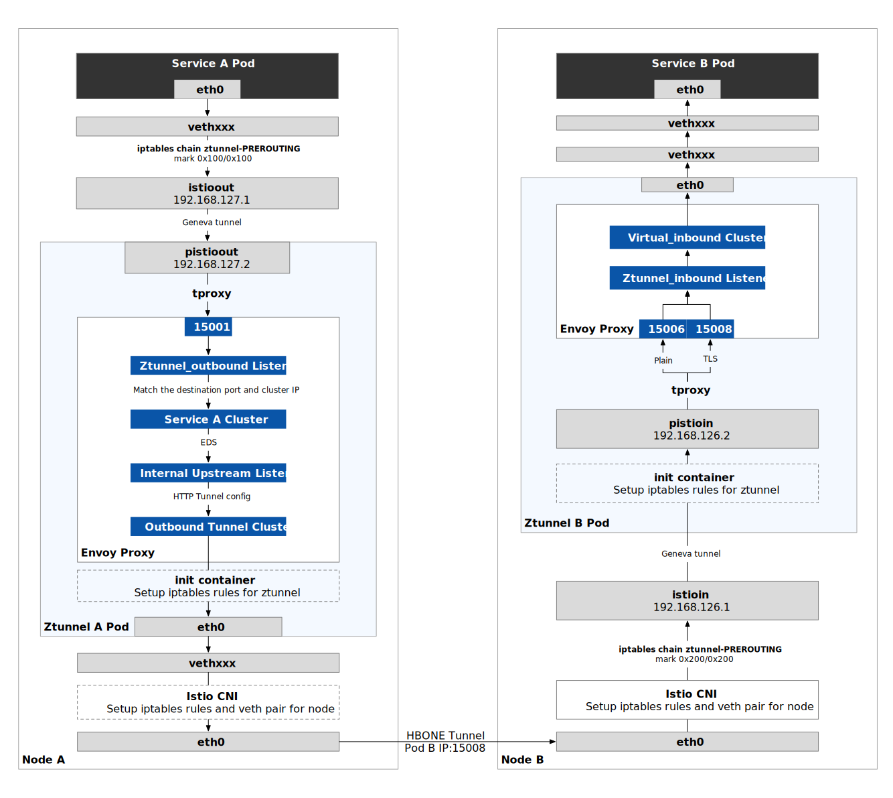

Ambient mesh is an experimental new deployment model recently introduced to Istio. It splits the duties currently performed by the Envoy sidecar into two separate components: a node-level component for encryption (called “ztunnel”) and an L7 Envoy instance deployed per service for all other processing (called “waypoint”). The ambient mesh model is an attempt to gain some efficiencies in potentially improved lifecycle and resource management. You can learn more about what ambient mesh is and how it differs from the Sidecar pattern [here](https://tetrate.io/blog/ambient-mesh-what-you-need-to-know-about-this-experimental-new-deployment-model-for-istio/).

This article takes you step-by-step through a hands-on approach to the transparent traffic intercepting and routing of L4 traffic paths in the Istio’s Ambient mode. If you don’t know what Ambient mode is, [this article](https://tetrate.io/blog/ambient-mesh-what-you-need-to-know-about-this-experimental-new-deployment-model-for-istio/) can help you understand.

If you want to skip the actual hands-on steps and just want to know the L4 traffic path in Ambient mode, please see the figure below, it shows a Pod of Service A calling a Pod of Service B on a different node below.



### Principles

Ambient mode uses [tproxy](https://www.kernel.org/doc/Documentation/networking/tproxy.txt) and [HTTP Based Overlay Network Environment (HBONE)](https://pkg.go.dev/github.com/costinm/hbone) as key technologies for transparent traffic intercepting and routing:

- Using tproxy to intercept the traffic from the host Pod into the Ztunnel (Envoy Proxy).
- Using HBONE to establish a tunnel for passing TCP traffic between Ztunnels.

### What Is tproxy?

tproxy is a transparent proxy supported by the Linux kernel since version 2.2, where the t stands for transparent. You need to enable *NETFILTER_TPROXY* and policy routing in the kernel configuration. With tproxy, the Linux kernel can act as a router and redirect packets to user space. See the [tproxy documentation](http://lxr.linux.no/linux+v3.10/Documentation/networking/tproxy.txt) for details.

### What Is HBONE?

HBONE is a method of providing tunneling capabilities using the HTTP protocol. A client sends an [HTTP CONNECT](https://developer.mozilla.org/en-US/docs/Web/HTTP/Methods/CONNECT) request (which contains the destination address) to an HTTP proxy server to establish a tunnel, and the proxy server establishes a TCP connection to the destination on behalf of the client, which can then transparently transport TCP data streams to the destination server through the proxy. In Ambient mode, Ztunnel (Envoy inside) acts as a transparent proxy, using [Envoy Internal Listener](https://www.envoyproxy.io/docs/envoy/latest/configuration/other_features/internal_listener) to receive HTTP CONNECT requests and pass TCP streams to the upstream cluster.

## Environment

Before starting the hands-on, it is necessary to explain the demo environment, and the corresponding object names in this article:

| Items             | Name                                           | IP            |
| :---------------- | :--------------------------------------------- | :------------ |
| Service A Pod     | `sleep-5644bdc767-2dfg7`                       | 10.4.4.19     |
| Service B Pod     | productpage-v1-5586c4d4ff-qxz9f                | 10.4.3.20     |
| Ztunnel A Pod     | `ztunnel-rts54`                                | 10.4.4.18     |
| Ztunnel B Pod     | `ztunnel-z4qmh`                                | 10.4.3.14     |
| Node A            | `gke-jimmy-cluster-default-pool-d5041909-d10i` | 10.168.15.222 |
| Node B            | `gke-jimmy-cluster-default-pool-d5041909-c1da` | 10.168.15.224 |
| Service B Cluster | `productpage`                                  | 10.8.14.226   |

Because these names will be used in subsequent command lines, the text will use pronouns, so that you can experiment in your own environment.

For the tutorial, I installed Istio Ambient mode in GKE. You can refer to this [Istio blog post](https://istio.io/latest/blog/2022/get-started-ambient/) for installation instructions. Be careful not to install the Gateway, so as not to enable the L7 functionality; otherwise, the traffic path will be different from the descriptions in this blog.

In the following, we will experiment and dive into the L4 traffic path of a pod of *sleep* service to a pod of *productpage* service on different nodes. We will look at the outbound and inbound traffic of the Pods separately.

## Outbound Traffic Intercepting

The transparent traffic intercepting process for outbound traffic from a pod in Ambient mesh is as follows:

1. Istio CNI creates the *istioout* NIC and iptables rules on the node, adds the Pods’ IP in Ambient mesh to the [IP set](https://ipset.netfilter.org/), and transparently intercepts outbound traffic from Ambient mesh to *pistioout* virtual NIC through [Geneve (Generic Network Virtualization Encapsulation)](https://datatracker.ietf.org/doc/rfc8926/) tunnels with netfilter *nfmark* tags and routing rules.
2. The init container in Ztunnel creates iptables rules that forward all traffic from the *pistioout* NIC to port 15001 of the Envoy proxy in Ztunnel.
3. Envoy processes the packets and establishes an HBONE tunnel (HTTP CONNECT) with the upstream endpoints to forward the packets upstream.

### Check The Routing Rules On Node A

Log in to Node A, where Service A is located, and use `iptables-save` to check the rules.


$ iptables-save
/* omit */
-A PREROUTING -j ztunnel-PREROUTING
-A PREROUTING -m comment --comment "kubernetes service portals" -j KUBE-SERVICES
-A ztunnel-POSTROUTING -m mark --mark 0x100/0x100 -j ACCEPT
-A ztunnel-PREROUTING -m mark --mark 0x100/0x100 -j ACCEPT
/* omit */
*mangle
/* omit */
-A PREROUTING -j ztunnel-PREROUTING
-A INPUT -j ztunnel-INPUT
-A FORWARD -j ztunnel-FORWARD
-A OUTPUT -j ztunnel-OUTPUT
-A OUTPUT -s 169.254.169.254/32 -j DROP
-A POSTROUTING -j ztunnel-POSTROUTING
-A ztunnel-FORWARD -m mark --mark 0x220/0x220 -j CONNMARK --save-mark --nfmask 0x220 --ctmask 0x220
-A ztunnel-FORWARD -m mark --mark 0x210/0x210 -j CONNMARK --save-mark --nfmask 0x210 --ctmask 0x210
-A ztunnel-INPUT -m mark --mark 0x220/0x220 -j CONNMARK --save-mark --nfmask 0x220 --ctmask 0x220
-A ztunnel-INPUT -m mark --mark 0x210/0x210 -j CONNMARK --save-mark --nfmask 0x210 --ctmask 0x210
-A ztunnel-OUTPUT -s 10.4.4.1/32 -j MARK --set-xmark 0x220/0xffffffff
-A ztunnel-PREROUTING -i istioin -j MARK --set-xmark 0x200/0x200
-A ztunnel-PREROUTING -i istioin -j RETURN
-A ztunnel-PREROUTING -i istioout -j MARK --set-xmark 0x200/0x200
-A ztunnel-PREROUTING -i istioout -j RETURN
-A ztunnel-PREROUTING -p udp -m udp --dport 6081 -j RETURN
-A ztunnel-PREROUTING -m connmark --mark 0x220/0x220 -j MARK --set-xmark 0x200/0x200
-A ztunnel-PREROUTING -m mark --mark 0x200/0x200 -j RETURN
-A ztunnel-PREROUTING ! -i veth300a1d80 -m connmark --mark 0x210/0x210 -j MARK --set-xmark 0x40/0x40
-A ztunnel-PREROUTING -m mark --mark 0x40/0x40 -j RETURN
-A ztunnel-PREROUTING ! -s 10.4.4.18/32 -i veth300a1d80 -j MARK --set-xmark 0x210/0x210
-A ztunnel-PREROUTING -m mark --mark 0x200/0x200 -j RETURN
-A ztunnel-PREROUTING -i veth300a1d80 -j MARK --set-xmark 0x220/0x220
-A ztunnel-PREROUTING -p udp -j MARK --set-xmark 0x220/0x220
-A ztunnel-PREROUTING -m mark --mark 0x200/0x200 -j RETURN
-A ztunnel-PREROUTING -p tcp -m set --match-set ztunnel-pods-ips src -j MARK --set-xmark 0x100/0x100


IPtables rule descriptions:

- Line 3: the *PREROUTING* chain is the first to run, and all packets will go to the *ztunnel-PEROUTING* chain first.
- Line 4: packets are sent to the *KUBE-SERVICES* chain, where the Cluster IP of the Kubernetes Service is DNAT’d to the Pod IP.
- Line 6: packets with 0x100/0x100 flags pass through the *PREROUTING* chain and no longer go through the *KUBE-SERVICES* chain.
- Line 35: this is the last rule added to the *ztunnel-PREROUTING* chain; all TCP packets entering the *ztunnel-PREROUTING* chain that are in the *ztunnel-pods-ips* [IP set](https://ipset.netfilter.org/) (created by the Istio CNI) are marked with 0x100/0x100, which overrides all previous marks. See the [Netfilter documentation](https://ipset.netfilter.org/iptables-extensions.man.html#lbDD) for more information about *nfmark*.

By implementing the above iptables rules, we can ensure that ambient mesh only intercepts packets from the *ztunnel-pods-ips* IP set pods and marks the packets with 0x100/0x100 (*nfmark*, in value/mask format, both value and mask are 32-bit binary integers) without affecting other pods.

Let’s look at the routing rules for this node.

```bash
$ ip rule
0:      from all lookup local
100:    from all fwmark 0x200/0x200 goto 32766
101:    from all fwmark 0x100/0x100 lookup 101
102:    from all fwmark 0x40/0x40 lookup 102
103:    from all lookup 100
32766:  from all lookup main
32767:  from all lookup default
```

The routing table will be executed sequentially, with the first column indicating the priority of the routing table and the second column indicating the routing table to look for or jump to. You will see that all packets marked with 0x100/0x100 will look for the 101 routing table. Let’s look at that routing table.

```bash
$ ip route show table 101
default via 192.168.127.2 dev istioout 
10.4.4.18 dev veth52b75946 scope link 
```

You will see the 101 routing table with the keyword via, which indicates that the packets will be transmitted through the gateway, [see the usage of the ip route command](http://linux-ip.net/html/tools-ip-route.html#tools-ip-route-show). All packets are sent through the *istioout* NIC to the gateway (IP is 192.168.127.2). The other line indicates the routing link for the *ztunnel* pod on the current node.

Let’s look at the details of the *istioout* NIC.


$ ip -d addr show istioout
24: istioout: <BROADCAST,MULTICAST,UP,LOWER_UP> mtu 1410 qdisc noqueue state UNKNOWN group default 
    link/ether 62:59:1b:ad:79:01 brd ff:ff:ff:ff:ff:ff
    geneve id 1001 remote 10.4.4.18 ttl auto dstport 6081 noudpcsum udp6zerocsumrx numtxqueues 1 numrxqueues 1 gso_max_size 65536 gso_max_segs 65535
    inet 192.168.127.1/30 brd 192.168.127.3 scope global istioout
       valid_lft forever preferred_lft forever
    inet6 fe80::6059:1bff:fead:7901/64 scope link 
       valid_lft forever preferred_lft forever


The *istioout* NIC in Pod A is connected to the *pstioout* NIC in *ztunnel* A through the Geneve tunnel.

### Check The Routing Rules On Ztunnel A

Go to the *Ztunnel* A Pod and use the *ip -d* a command to check its NIC information.


$ ip -d a
1: lo: <LOOPBACK,UP,LOWER_UP> mtu 65536 qdisc noqueue state UNKNOWN group default qlen 1000
    link/loopback 00:00:00:00:00:00 brd 00:00:00:00:00:00 promiscuity 0 minmtu 0 maxmtu 0 numtxqueues 1 numrxqueues 1 gso_max_size 65536 gso_max_segs 65535 
    inet 127.0.0.1/8 scope host lo
       valid_lft forever preferred_lft forever
2: eth0@if16: <BROADCAST,MULTICAST,UP,LOWER_UP> mtu 1460 qdisc noqueue state UP group default 
    link/ether 06:3e:d1:5d:95:16 brd ff:ff:ff:ff:ff:ff link-netnsid 0 promiscuity 0 minmtu 68 maxmtu 65535 
    veth numtxqueues 1 numrxqueues 1 gso_max_size 65536 gso_max_segs 65535 
    inet 10.4.2.1/24 brd 10.4.4.255 scope global eth0
       valid_lft forever preferred_lft forever
3: pistioin: <BROADCAST,MULTICAST,UP,LOWER_UP> mtu 1410 qdisc noqueue state UNKNOWN group default qlen 1000
    link/ether 06:18:ee:29:7e:e4 brd ff:ff:ff:ff:ff:ff promiscuity 0 minmtu 68 maxmtu 65485 
    geneve id 1000 remote 10.4.2.1 ttl auto dstport 6081 noudpcsum udp6zerocsumrx numtxqueues 1 numrxqueues 1 gso_max_size 65536 gso_max_segs 65535 
    inet 192.168.126.2/30 scope global pistioin
       valid_lft forever preferred_lft forever
4: pistioout: <BROADCAST,MULTICAST,UP,LOWER_UP> mtu 1410 qdisc noqueue state UNKNOWN group default qlen 1000
    link/ether aa:40:40:7c:07:b2 brd ff:ff:ff:ff:ff:ff promiscuity 0 minmtu 68 maxmtu 65485 
    geneve id 1001 remote 10.4.2.1 ttl auto dstport 6081 noudpcsum udp6zerocsumrx numtxqueues 1 numrxqueues 1 gso_max_size 65536 gso_max_segs 65535 
    inet 192.168.127.2/30 scope global pistioout
       valid_lft forever preferred_lft forever


You will find two NICs:

- *pistioin* ：192.168.126.2, for the inbound traffic
- *pistioout*：192.168.127.2 for the outbound traffic

How do you handle traffic from Pod A after it enters ztunnel? The answer is iptables. Look at the iptables rules in ztunnel A:


$ iptables-save
/* omit */
*mangle
:PREROUTING ACCEPT [185880:96984381]
:INPUT ACCEPT [185886:96984813]
:FORWARD ACCEPT [0:0]
:OUTPUT ACCEPT [167491:24099839]
:POSTROUTING ACCEPT [167491:24099839]
-A PREROUTING -j LOG --log-prefix "mangle pre [ ztunnel-rts54] "
-A PREROUTING -i pistioin -p tcp -m tcp --dport 15008 -j TPROXY --on-port 15008 --on-ip 127.0.0.1 --tproxy-mark 0x400/0xfff
-A PREROUTING -i pistioout -p tcp -j TPROXY --on-port 15001 --on-ip 127.0.0.1 --tproxy-mark 0x400/0xfff
-A PREROUTING -i pistioin -p tcp -j TPROXY --on-port 15006 --on-ip 127.0.0.1 --tproxy-mark 0x400/0xfff
/* omit */


You can see that all TCP traffic in Ztunnel A destined for the pistioin NIC is transparently forwarded to port 15001 (Envoy’s outbound port) and tagged with 0x400/0xfff. This marker ensures that packets are sent to the correct NIC.

Check the routing rules In Ztunnel A:

```bash
$ ip rule
0:      from all lookup local
20000:  from all fwmark 0x400/0xfff lookup 100
20001:  from all fwmark 0x401/0xfff lookup 101
20002:  from all fwmark 0x402/0xfff lookup 102
20003:  from all fwmark 0x4d3/0xfff lookup 100
32766:  from all lookup main
32767:  from all lookup default
```

You will see that all packets marked 0x400/0xfff go to the 101 routing table, and we look at the details of that routing table:

```bash
$ ip route show table 100
local default dev lo scope host 
```

You will see that this is a local route and the packet is sent to the loopback NIC, which is 127.0.0.1.

This is the transparent intercepting process of outbound traffic in the pod.

## Outbound Traffic Routing On Ztunnel A

Outbound traffic is intercepted onto Ztunnel and processed into Envoy’s port 15001. Let’s see how Ztunnel routes outbound traffic.

> Note: The Envoy filter rules in Ztunnel are completely different from the Envoy filter rules in Sidecar mode, so instead of using the *istioctl proxy-config* command to inspect the configuration of Listener, Cluster, Endpoint, etc., we directly export the complete Envoy configuration in Ztunnel.

You can get the Envoy configuration in Ztunnel A directly and remotely on your local machine

```bash
kubectl exec -n istio-system ztunnel-hptxk -c istio-proxy -- curl "127.0.0.1:15000/config_dump?include_eds">ztunnel-a-all-include-eds.json
```

> Note: Do not use *istioctl proxy-config all ztunnel-rts54 -n istio-system* command to get the Envoy configuration, because the configuration so obtained does not contain the EDS part. The exported JSON file will have tens of thousands of lines, so it is recommended to use [fx ](https://github.com/antonmedv/fx)or other tools to parse the file for readability.

### Ztunnel_outbound Listener

The Envoy configuration contains the traffic rule configuration for all pods on this node. Let’s inspect the *ztunnel_outbound* Listener section configuration (some parts are omitted due to too much configuration):


{
 "name": "ztunnel_outbound",
 "active_state": {
  "version_info": "2022-11-11T07:10:40Z/13",
  "listener": {
   "@type": "type.googleapis.com/envoy.config.listener.v3.Listener",
   "name": "ztunnel_outbound",
   "address": {
    "socket_address": {
     "address": "0.0.0.0",
     "port_value": 15001
    }
   },
   "filter_chains": [{...},...],
   "use_original_dst": true,
   "listener_filters": [
    {
     "name": "envoy.filters.listener.original_dst",
     "typed_config": {
      "@type": "type.googleapis.com/envoy.extensions.filters.listener.original_dst.v3.OriginalDst"
     }
    },
    {
     "name": "envoy.filters.listener.original_src",
     "typed_config": {
      "@type": "type.googleapis.com/envoy.extensions.filters.listener.original_src.v3.OriginalSrc",
      "mark": 1234
     }
    },
    {
     "name": "envoy.filters.listener.workload_metadata",
     "config_discovery": {
      "config_source": {
       "ads": {},
       "initial_fetch_timeout": "30s"
      },
      "type_urls": [
       "type.googleapis.com/istio.telemetry.workloadmetadata.v1.WorkloadMetadataResources"
      ]
     }
    }
   ],
   "transparent": true,
   "socket_options": [
    {
     "description": "Set socket mark to packets coming back from outbound listener",
     "level": "1",
     "name": "36",
     "int_value": "1025"
    }
   ],
   "access_log": [{...}],
   "default_filter_chain": {"filters": [...], ...},
   "filter_chain_matcher": {
    "matcher_tree": {
     "input": {
      "name": "port",
      "typed_config": {
       "@type": "type.googleapis.com/envoy.extensions.matching.common_inputs.network.v3.DestinationPortInput"
      }
     },
     "exact_match_map": {
      "map": {
       "15001": {
        "action": {
         "name": "BlackHoleCluster",
         "typed_config": {
          "@type": "type.googleapis.com/google.protobuf.StringValue",
          "value": "BlackHoleCluster"
         }
        }
       }
      }
     }
    },
    "on_no_match": {
     "matcher": {
      "matcher_tree": {
       "input": {
        "name": "source-ip",
        "typed_config": {
         "@type": "type.googleapis.com/envoy.extensions.matching.common_inputs.network.v3.SourceIPInput"
        }
       },
       "exact_match_map": {
        "map": {
         "10.168.15.222": {...},
         "10.4.4.19": {
          "matcher": {
           "matcher_tree": {
            "input": {
             "name": "ip",
             "typed_config": {
              "@type": "type.googleapis.com/envoy.extensions.matching.common_inputs.network.v3.DestinationIPInput"
             }
            },
            "exact_match_map": {
             "map": {
              "10.8.4.226": {
               "matcher": {
                "matcher_tree": {
                 "input": {
                  "name": "port",
                  "typed_config": {
                   "@type": "type.googleapis.com/envoy.extensions.matching.common_inputs.network.v3.DestinationPortInput"
                  }
                 },
                 "exact_match_map": {
                  "map": {
                   "9080": {
                    "action": {
                     "name": "spiffe://cluster.local/ns/default/sa/sleep_to_http_productpage.default.svc.cluster.local_outbound_internal",
                     "typed_config": {
                      "@type": "type.googleapis.com/google.protobuf.StringValue",
                      "value": "spiffe://cluster.local/ns/default/sa/sleep_to_http_productpage.default.svc.cluster.local_outbound_internal"
                     }
                    }
                   }
                  }
                 }
                }
               }
              },
              {...}
             }
            }
           }
          }
         },
         "10.4.4.7": {...},
         "10.4.4.11": {...},
        }
       }
      },
      "on_no_match": {
       "action": {
        "name": "PassthroughFilterChain",
        "typed_config": {
         "@type": "type.googleapis.com/google.protobuf.StringValue",
         "value": "PassthroughFilterChain"
        }
       }
      }
     }
    }
   }
  },
  "last_updated": "2022-11-11T07:33:10.485Z"
 }
}


Descriptions:

- Lines 10, 11, 59, 62, 64, 69, 76, 82, 85: Envoy listens to port 15001 and processes traffic forwarded using tproxy in the kernel; packets destined for port 15001 are directly discarded, and packets destined for other ports are then matched according to the source IP address to determine their destination.
- Line 43: Use the `IP_TRANSPARENT` socket option to enable tproxy transparent proxy to forward traffic packets with destinations other than Ztunnel IPs.
- Lines 88 to 123: based on the source IP (10.4.4.19 is the IP of Pod A), destination IP (10.8.14.226 is the Cluster IP of Service B) and port (9080) rule match, the packet will be sent to `spiffe://cluster.local/ns/default/sa/sleep_to_http_productpage.default.svc.cluster.local_outbound_internal` cluster.

### Sleep Cluster

Let’s check the cluster’s configuration:


{
 "version_info": "2022-11-08T06:40:06Z/63",
 "cluster": {
  "@type": "type.googleapis.com/envoy.config.cluster.v3.Cluster",
  "name": "spiffe://cluster.local/ns/default/sa/sleep_to_http_productpage.default.svc.cluster.local_outbound_internal",
  "type": "EDS",
  "eds_cluster_config": {
   "eds_config": {
    "ads": {},
    "initial_fetch_timeout": "0s",
    "resource_api_version": "V3"
   }
  },
  "transport_socket_matches": [
   {
    "name": "internal_upstream",
    "match": {
     "tunnel": "h2"
    },
    "transport_socket": {
     "name": "envoy.transport_sockets.internal_upstream",
     "typed_config": {
      "@type": "type.googleapis.com/envoy.extensions.transport_sockets.internal_upstream.v3.InternalUpstreamTransport",
      "passthrough_metadata": [
       {
        "kind": {
         "host": {}
        },
        "name": "tunnel"
       },
       {
        "kind": {
         "host": {}
        },
        "name": "istio"
       }
      ],
      "transport_socket": {
       "name": "envoy.transport_sockets.raw_buffer",
       "typed_config": {
        "@type": "type.googleapis.com/envoy.extensions.transport_sockets.raw_buffer.v3.RawBuffer"
       }
      }
     }
    }
   },
   {
    "name": "tlsMode-disabled",
    "match": {},
    "transport_socket": {
     "name": "envoy.transport_sockets.raw_buffer",
     "typed_config": {
      "@type": "type.googleapis.com/envoy.extensions.transport_sockets.raw_buffer.v3.RawBuffer"
     }
    }
   }
  ]
 },
 "last_updated": "2022-11-08T06:40:06.619Z"
}


Descriptions:

- Line 6: This Cluster configuration uses EDS to get endpoints.
- Line 18: [InternalUpstreamTransport](https://www.envoyproxy.io/docs/envoy/latest/api-v3/extensions/transport_sockets/internal_upstream/v3/internal_upstream.proto#envoy-v3-api-msg-extensions-transport-sockets-internal-upstream-v3-internalupstreamtransport) is applied to all byte streams with a tunnel: h2 metadata for internal addresses, defining loopback userspace sockets located in the same proxy instance. In addition to regular byte streams, this extension allows the additional structured state to be passed across userspace sockets (`passthrough_metadata`). The purpose is to facilitate communication between downstream filters and upstream internal connections. All filter state objects shared with the upstream connection are also shared with the downstream inner connection via this transportation socket.
- Lines 23 to 37: structured data passed upstream.

### Endpoints of The Sleep Cluster

Let’s check the EDS again, and you will find this entry in one of the many `endpoint_config`:


{
 "endpoint_config": {
  "@type": "type.googleapis.com/envoy.config.endpoint.v3.ClusterLoadAssignment",
  "cluster_name": "spiffe://cluster.local/ns/default/sa/sleep_to_http_productpage.default.svc.cluster.local_outbound_internal",
  "endpoints": [
   {
    "locality": {},
    "lb_endpoints": [
     {
      "endpoint": {
       "address": {
        "envoy_internal_address": {
         "server_listener_name": "outbound_tunnel_lis_spiffe://cluster.local/ns/default/sa/sleep",
         "endpoint_id": "10.4.3.20:9080"
        }
       },
       "health_check_config": {}
      },
      "health_status": "HEALTHY",
      "metadata": {
       "filter_metadata": {
        "envoy.transport_socket_match": {
         "tunnel": "h2"
        },
        "tunnel": {
         "address": "10.4.3.20:15008",
         "destination": "10.4.3.20:9080"
        }
       }
      },
      "load_balancing_weight": 1
     }
    ]
   }
  ],
  "policy": {
   "overprovisioning_factor": 140
  }
 }
}


Descriptions:

Line 4: As of the first release of Ambient mesh, this field was not actually present when the Envoy configuration was exported, but it is should have it. Otherwise, it would be impossible to determine which Cluster the Endpoint belongs to. The mandatory `cluster_name` field is missing from the `endpoint_config` here, probably due to a bug in Ambient mode that caused the field to be missing when exporting Envoy’s configuration.

Line 13: the address of the Endpoint is an `envoy_internal_address`，` Envoy internal listener `outbound_tunnel_lis_spiffe://cluster.local/ns/default/sa/sleep`.

Lines 20 – 30: defining filter metadata to be passed to the Envoy internal listener using the HBONE tunnel.

### Establishing an HBONE Tunnel Through Envoy’s Internal Listener

Let’s look into the listener `outbound_tunnel_lis_spiffe://cluster.local/ns/default/sa/sleep`:


{
 "name": "outbound_tunnel_lis_spiffe://cluster.local/ns/default/sa/sleep",
 "active_state": {
  "version_info": "2022-11-08T06:40:06Z/63",
  "listener": {
   "@type": "type.googleapis.com/envoy.config.listener.v3.Listener",
   "name": "outbound_tunnel_lis_spiffe://cluster.local/ns/default/sa/sleep",
   "filter_chains": [
    {
     "filters": [
      {
       "name": "envoy.filters.network.tcp_proxy",
       "typed_config": {
        "@type": "type.googleapis.com/envoy.extensions.filters.network.tcp_proxy.v3.TcpProxy",
        "stat_prefix": "outbound_tunnel_lis_spiffe://cluster.local/ns/default/sa/sleep",
        "cluster": "outbound_tunnel_clus_spiffe://cluster.local/ns/default/sa/sleep",
        "access_log": [{...}, ...],
        "tunneling_config": {
         "hostname": "%DYNAMIC_METADATA(tunnel:destination)%",
         "headers_to_add": [
          {
           "header": {
            "key": "x-envoy-original-dst-host",
            "value": "%DYNAMIC_METADATA([\"tunnel\", \"destination\"])%"
           }
          }
         ]
        }
       }
      }
     ]
    }
   ],
   "use_original_dst": false,
   "listener_filters": [
    {
     "name": "set_dst_address",
     "typed_config": {
      "@type": "type.googleapis.com/xds.type.v3.TypedStruct",
      "type_url": "type.googleapis.com/istio.set_internal_dst_address.v1.Config",
      "value": {}
     }
    }
   ],
   "internal_listener": {}
  },
  "last_updated": "2022-11-08T06:40:06.750Z"
 }
}


Descriptions:

- Line 14: packets will be forwarded to the `outbound_tunnel_clus_spiffe://cluster.local/ns/default/sa/sleep cluster`.
- Lines 18 – 28: [tunneling_config](https://www.envoyproxy.io/docs/envoy/latest/api-v3/extensions/filters/network/tcp_proxy/v3/tcp_proxy.proto#envoy-v3-api-msg-extensions-filters-network-tcp-proxy-v3-tcpproxy-tunnelingconfig) , used to configure the upstream HTTP CONNECT tunnel. In addition, the TcpProxy filter in this listener passes traffic to the upstream p cluster. HTTP CONNECT tunnels (which carry traffic sent to `10.4.3.20:9080`) are set up on the TCP filter for use by the Ztunnel on the node where the productpage is located. As many tunnels are created, as there are endpoints. HTTP tunnels are the bearer protocol for secure communication between Ambient components. The packet in the tunnel also adds the `x-envoy-original-dst-host` header, which sets the destination address based on the parameters in the metadata of the endpoint selected in the previous EDS step. The endpoint selected in the previous EDS is 10.4.3.20:9080, so the tunnel listener here sets the header value to 10.4.3.20:9080, so keep an eye on this header as it will be used at the other end of the tunnel.
- Line 40: The listener filter is executed first in the listener. The `set_dst_address` filter sets the upstream address to the downstream destination address.

### HBONE Tunnel Endpoints For The Sleep Cluster

Let’s look into the configuration of the `outbound_tunnel_clus_spiffe://cluster.local/ns/default/sa/sleep cluster`.


 {
 "version_info": "2022-11-11T07:30:10Z/37",
 "cluster": {
  "@type": "type.googleapis.com/envoy.config.cluster.v3.Cluster",
  "name": "outbound_pod_tunnel_clus_spiffe://cluster.local/ns/default/sa/sleep",
  "type": "ORIGINAL_DST",
  "connect_timeout": "2s",
  "lb_policy": "CLUSTER_PROVIDED",
  "cleanup_interval": "60s",
  "transport_socket": {
   "name": "envoy.transport_sockets.tls",
   "typed_config": {
    "@type": "type.googleapis.com/envoy.extensions.transport_sockets.tls.v3.UpstreamTlsContext",
    "common_tls_context": {
     "tls_params": {
      "tls_minimum_protocol_version": "TLSv1_3",
      "tls_maximum_protocol_version": "TLSv1_3"
     },
     "alpn_protocols": [
      "h2"
     ],
     "tls_certificate_sds_secret_configs": [
      {
       "name": "spiffe://cluster.local/ns/default/sa/sleep~sleep-5644bdc767-2dfg7~85c8c34e-7ae3-4d29-9582-0819e2b10c69",
       "sds_config": {
        "api_config_source": {
         "api_type": "GRPC",
         "grpc_services": [
          {
           "envoy_grpc": {
            "cluster_name": "sds-grpc"
           }
          }
         ],
         "set_node_on_first_message_only": true,
         "transport_api_version": "V3"
        },
        "resource_api_version": "V3"
       }
      }
     ]
    }
   }
  },
  "original_dst_lb_config": {
   "upstream_port_override": 15008
  },
  "typed_extension_protocol_options": {
   "envoy.extensions.upstreams.http.v3.HttpProtocolOptions": {
    "@type": "type.googleapis.com/envoy.extensions.upstreams.http.v3.HttpProtocolOptions",
    "explicit_http_config": {
     "http2_protocol_options": {
      "allow_connect": true
     }
    }
   }
  }
 },
 "last_updated": "2022-11-11T07:30:10.754Z"
}


Descriptions:

- Line 6: the type of this cluster is `ORIGINAL_DST`, i.e. the address 10.4.3.20:9080 obtained by EDS in the previous section.
- Lines 22 – 41: the upstream TLS certificate is configured.
- lines 45 – 48: the upstream port is overridden with 15008.

The above is the whole process of transparent outbound traffic intercepting using tproxy and HBONE tunnel.

## Inbound Traffic Intercepting

Node B receives requests from Node A to `10.4.3.20:15008`. Inbound traffic intercepting in Ambient mode is similar to outbound. It also uses tproxy and HBONE to achieve transparent traffic intercepting.

The transparent traffic intercepting process for inbound traffic to the pod of Ambient mesh is as follows:

1. Istio CNI creates the istioin NIC and iptables rules on the node, adds the pods IP in Ambient mesh to the IP set, and transparently hijacks outbound traffic from Ambient mesh to the pistioin VM through the Geneve tunnel by using Netfilter nfmark tags and routing rules. NICs.
2. The init container in Ztunnel creates iptables rules that forward all traffic from the pistioin NIC to port 15008 of the Envoy proxy in Ztunnel.
3. Envoy processes the packets and forwards them to Pod B.

Since the checking procedure is similar to the outbound traffic, some of the output will be omitted below.

### Check the Routing Rules on Node B

Log in to Node B, where Service B is located, and check the iptables on the node:

```bash
$ iptables-save
/* omit */
-A ztunnel-PREROUTING -m mark --mark 0x200/0x200 -j RETURN
-A ztunnel-PREROUTING -p tcp -m set --match-set ztunnel-pods-ips src -j MARK --set-xmark 0x100/0x100
/* omit */
```

You will see the previous command mentioned in the previous section to mark all packets sent by the pods in the `ztunnel-pods-ips` IP set with 0x100/0x100: mark all packets with 0x200/0x200, and then continue with iptables.

Look into the routing table on node B:

```bash
0:      from all lookup local
100:    from all fwmark 0x200/0x200 goto 32766
101:    from all fwmark 0x100/0x100 lookup 101
102:    from all fwmark 0x40/0x40 lookup 102
103:    from all lookup 100
32766:  from all lookup main
32767:  from all lookup default
```

The number of routing tables and rules are the same in all the nodes which belong to the ambient mesh. The routing table rules will be executed sequentially, looking first for the local table, then all packets with 0x200/0x200 flags will first jump to the main table (where veth routes are defined), and then to the 100 table, where the following rules are in place:


$ ip route show table 100
10.4.3.14 dev veth28865c45 scope link 
10.4.3.15 via 192.168.126.2 dev istioin src 10.4.3.1
10.4.3.16 via 192.168.126.2 dev istioin src 10.4.3.1
10.4.3.17 via 192.168.126.2 dev istioin src 10.4.3. 
10.4.3.18 via 192.168.126.2 dev istioin src 10.4.3. 
10.4.3.19 via 192.168.126.2 dev istioin src 10.4.3.1
10.4.3.20 via 192.168.126.2 dev istioin src 10.4.3.1


You will see that packets destined for `10.4.3.20` will be routed to the `192.168.126.2` gateway on the istioin NIC.

Look into the details of the istioin NIC:


$ ip -d addr show istioin 
17: istioin: <BROADCAST,MULTICAST,UP,LOWER_UP> mtu 1410 qdisc noqueue state UNKNOWN group default 
    link/ether 36:2a:2f:f1:5c:97 brd ff:ff:ff:ff:ff:ff promiscuity 0 minmtu 68 maxmtu 65485 
    geneve id 1000 remote 10.4.3.14 ttl auto dstport 6081 noudpcsum udp6zerocsumrx numtxqueues 1 numrxqueues 1 gso_max_size 65536 gso_max_segs 65535 
    inet 192.168.126.1/30 brd 192.168.126.3 scope global istioin
       valid_lft forever preferred_lft forever
    inet6 fe80::342a:2fff:fef1:5c97/64 scope link 
       valid_lft forever preferred_lft forever


As you can see from the output, istioin is a Geneve type virtual NIC that creates a Geneve tunnel with a remote IP of 10.4.3.14, which is the Pod IP of Ztunnel B.

###  Check The Routing Rules On Ztunnel B Pod

Go to the Ztunnel B Pod and use the ip -d a command to check its NIC information. You will see that there is a pistioout NIC with an IP of 192.168.127.2, which is the far end of the Geneve tunnel created with the istioin virtual NIC.

Use iptables-save to view the iptables rules within the Pod, and you will see that:

```bash
-A PREROUTING -i pistioin -p tcp -m tcp --dport 15008 -j TPROXY --on-port 15008 --on-ip 127.0.0.1 --tproxy-mark 0x400/0xfff
-A PREROUTING -i pistioin -p tcp -j TPROXY --on-port 15006 --on-ip 127.0.0.1 --tproxy-mark 0x400/0xfff
```

All traffic destined for 10.4.3.20:15008 will be routed to port 15008 using tproxy.

**15006 and 15008**

- Port 15006 is used to process non-encrypted (plain) TCP packets.

- Port 15008 is used to process encrypted (TLS) TCP packets.

The above is the transparent intercepting process of inbound traffic in the Pod.

## Inbound Traffic Routing On Ztunnel B

The outbound TLS encrypted traffic is intercepted on Ztunnel and goes to Envoy’s port 15008 for processing. Let’s look at how Ztunnel routes inbound traffic.

Let’s remotely get the Envoy configuration in Ztunnel B directly on our local machine.

```bash
kubectl exec -n istio-system 	ztunnel-z4qmh -c istio-proxy -- curl "127.0.0.1:15000/config_dump?include_eds">ztunnel-b-all-include-eds.json
```

### Ztunnel_inbound Listener

Look into the details of the ztunnel_inbound listener:



{
 "name": "ztunnel_inbound",
 "active_state": {
  "version_info": "2022-11-11T07:12:01Z/16",
  "listener": {
   "@type": "type.googleapis.com/envoy.config.listener.v3.Listener",
   "name": "ztunnel_inbound",
   "address": {
    "socket_address": {
     "address": "0.0.0.0",
     "port_value": 15008
    }
   },
   "filter_chains": [
    {
     "filter_chain_match": {
      "prefix_ranges": [
       {
        "address_prefix": "10.4.3.20",
        "prefix_len": 32
       }
      ]
     },
     "filters": [
      {
       "name": "envoy.filters.network.rbac",
       "typed_config": {
        "@type": "type.googleapis.com/envoy.extensions.filters.network.rbac.v3.RBAC",
        "rules": {...},
        "stat_prefix": "tcp.",
        "shadow_rules_stat_prefix": "istio_dry_run_allow_"
       }
      },
      {
       "name": "envoy.filters.network.http_connection_manager",
       "typed_config": {
        "@type": "type.googleapis.com/envoy.extensions.filters.network.http_connection_manager.v3.HttpConnectionManager",
        "stat_prefix": "inbound_hcm",
        "route_config": {
         "name": "local_route",
         "virtual_hosts": [
          {
           "name": "local_service",
           "domains": [
            "*"
           ],
           "routes": [
            {
             "match": {
              "connect_matcher": {}
             },
             "route": {
              "cluster": "virtual_inbound",
              "upgrade_configs": [
               {
                "upgrade_type": "CONNECT",
                "connect_config": {}
               }
              ]
             }
            }
           ]
          }
         ]
        },
        "http_filters": [
         {
          "name": "envoy.filters.http.router",
          "typed_config": {
           "@type": "type.googleapis.com/envoy.extensions.filters.http.router.v3.Router"
          }
         }
        ],
        "http2_protocol_options": {
         "allow_connect": true
        },
        "access_log": [{...}],
        "upgrade_configs": [
         {
          "upgrade_type": "CONNECT"
         }
        ]
       }
      }
     ],
     "transport_socket": {
      "name": "envoy.transport_sockets.tls",
      "typed_config": {...} 
     },
     "name": "inbound_10.4.3.20"
    },
    {...}
   ],
   "use_original_dst": true,
   "listener_filters": [{},...],
   "transparent": true,
   "socket_options": [{...}}],
   "access_log": [{...} ]
  },
  "last_updated": "2022-11-14T03:54:07.040Z"
 }
}



You will see that:

- Traffic destined for 10.4.3.20 will be routed to the `virtual_inbound` cluster.
- Lines 78 – 82: `upgrade_type: "CONNECT"` Enables the HTTP Connect tunnel for Envoy’s HCM to send TCP packets in that tunnel upstream.

###  Virtual_inbound Cluster

Look into the configuration of the `virtual_inbound` cluster:



{
 "version_info": "2022-11-11T07:10:40Z/13",
 "cluster": {
  "@type": "type.googleapis.com/envoy.config.cluster.v3.Cluster",
  "name": "virtual_inbound",
  "type": "ORIGINAL_DST",
  "lb_policy": "CLUSTER_PROVIDED",
  "original_dst_lb_config": {
   "use_http_header": true
  }
 },
 "last_updated": "2022-11-11T07:10:42.111Z"
}



Descriptions:

- Line 7: the type of this cluster is ORIGINAL_DST, indicating that the original downstream destination is used as the route destination, i.e. 10.4.3.20:15008, which obviously has an incorrect port in this address.
- Line 9: a use_http_header of true will use the HTTP header x-envoy-original-dst-host as the destination, which has been set to 10.4.3.20:9080 in the outbound Ztunnel, and it will override the previously set destination address.

At this point, the inbound traffic is accurately routed to the destination by Ztunnel. The above is the flow of L4 traffic hijacking and routing between nodes in Ambient mode.

## Summary

For demonstration purposes, this article shows the paths of L4 network access packets for services on different nodes, even if the paths are similar for two services on the same node. Istio’s Ambient mode is still in its infancy, and during my testing, I also found that the EDS in the exported Envoy configuration was missing the cluster_name field. After understanding the L4 traffic path, I will share the L7 traffic path in Ambient mode in the future. Stay tuned.

---

If you’re new to service mesh and Kubernetes security, we have a bunch of free online courses [available at Tetrate Academy](https://tetr8.io/academy) that will quickly get you up to speed with Istio and Envoy.

If you’re looking for a fast way to get to production with Istio, check out [Tetrate Istio Distribution (TID)](https://tetr8.io/tid) . TID is Tetrate’s hardened, fully upstream Istio distribution, with FIPS-verified builds and support available. It’s a great way to get started with Istio knowing you have a trusted distribution to begin with, have an expert team supporting you, and also have the option to get to FIPS compliance quickly if you need to.Once you have Istio up and running, you will probably need simpler ways to manage and secure your services beyond what’s available in Istio, that’s where Tetrate Service Bridge comes in. You can learn more about how Tetrate Service Bridge makes service mesh more secure, manageable, and resilient [here](https://tetr8.io/tsb) , or [contact us for a quick demo](https://tetr8.io/contact) .

*This blog was originally published at [tetrate.io](https://tetrate.io/blog/transparent-traffic-intercepting-and-routing-in-the-l4-network-of-istio-ambient-mesh/).*
