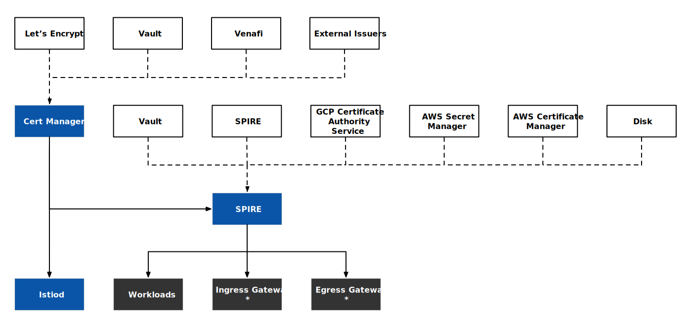
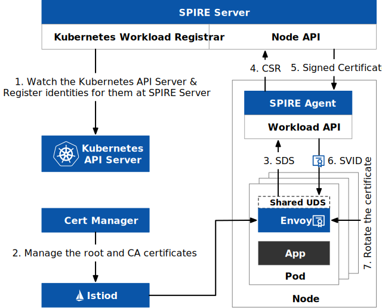

In [the previous blog post](/en/blog/istio-certificates-management/), I introduced how Istio manages certificates, and in this article, I will guide you on how to use an external certificate authority (CA) to achieve fine-grained certificate management and automatic certificate rotation through the integration of [SPIRE](https://spiffe.io/docs/latest/spire-about/spire-concepts/) and [*cert-manager*](https://cert-manager.io/).

If you are not familiar with SPIRE and what it’s used for, we recommend reading the following articles:

- [Why Would You Need SPIRE for Authentication with Istio?](https://tetrate.io/blog/why-would-you-need-spire-for-authentication-with-istio/)
- [How to integrate SPIRE in Istio](https://istio.io/latest/docs/ops/integrations/spire/)

## Introduction to the Certificate Issuance and Management Process

Figure 1 shows the certificate trust chain used in this article based on *cert-manager* and SPIRE:



- *cert-manager* acts as the root CA to issue certificates to *istiod* and SPIRE. We use a [self-signed issuer](https://cert-manager.io/docs/configuration/selfsigned/), but you can also configure it to use built-in issuers such as Let’s Encrypt, Vault, Venafi, or other external issuers. You can also choose to use other [UpstreamAuthorities](https://spiffe.io/docs/latest/deploying/spire_server/), such as Vault, SPIRE Federation, etc.
- SPIRE issues SVID certificates to the workloads and ingress Gateway and egress Gateway in the Istio mesh for mTLS between services.
- The certificates used when accessing the ingress Gateway from outside the mesh and when the egress Gateway access services outside the mesh need to be configured separately.

Figure 2 shows the certificate issuance and update process after integrating SPIRE and *cert-manager* in Istio.



1. The Kubernetes Workload Registrar in the SPIRE Server automatically registers the workloads in Kubernetes and generates SPIFFE standard identities for all workloads.
2. *cert-manager* issues and manages the CA certificates for *istiod*.
3. The Envoy proxies in the workloads send certificate signing request (CSR) requests to the SPIRE Agent on the same node through the SDS API via a Unix domain socket (UDS).
4. The SPIRE Agent sends the CSR to the SPIRE Server.
5. The SPIRE Server returns the signed certificate to the SPIRE Agent.
6. The SPIRE Agent returns the signed certificate to the workloads.
7. SPIRE is responsible for the certificate management and updates for the workloads.

Now that we have a general understanding of the process, let’s install the components manually.

## Install *cert-manager*

Run the following command to install *cert-manager*, which we will use for automatic certificate rotation:

```bash
kubectl apply -f https://github.com/cert-manager/cert-manager/releases/download/v1.10.1/cert-manager.yaml
```

The root CA is a self-signed certificate. Run the following command to configure the root CA:

```yaml
cat << EOF | kubectl apply -f -
---
apiVersion: cert-manager.io/v1
kind: Issuer
metadata:
  name: selfsigned
  namespace: cert-manager
spec:
  selfSigned: {}
---
apiVersion: cert-manager.io/v1
kind: Certificate
metadata:
  name: selfsigned-ca
  namespace: cert-manager
spec:
  isCA: true
  duration: 21600h
  secretName: selfsigned-ca
  commonName: certmanager-ca
  subject:
    organizations:
      - cert-manager
  issuerRef:
    name: selfsigned
    kind: Issuer
    group: cert-manager.io
---
apiVersion: cert-manager.io/v1
kind: ClusterIssuer
metadata:
  name: selfsigned-ca
spec:
  ca:
    secretName: selfsigned-ca
EOF
```

Then configure certificates for *istiod*:

```yaml
kubectl create namespace istio-system
cat << EOF | kubectl apply -f -
---
apiVersion: cert-manager.io/v1
kind: Certificate
metadata:
  name: cacerts
  namespace: istio-system
spec:
  secretName: cacerts
  duration: 1440h
  renewBefore: 360h
  commonName: istiod.istio-system.svc
  isCA: true
  usages:
    - digital signature
    - key encipherment
    - cert sign
  dnsNames:
    - istiod.istio-system.svc
  issuerRef:
    name: selfsigned-ca
    kind: ClusterIssuer
    group: cert-manager.io
EOF
```

Now that we have installed *cert-manager* and created a ClusterIssuer named *selfsigned-ca*, let’s install SPIRE and use *cert-manager* as the [UpstreamAuthority](https://github.com/spiffe/spire/blob/main/doc/plugin_server_upstreamauthority_cert_manager.md) for SPIRE.

## Installing SPIRE

Quickly install SPIRE by running the following command:

```bash
kubectl apply -f https://gist.githubusercontent.com/rootsongjc/5dac0518cc432cbf844114faca74aa40/raw/814587f94bbef8fb1dd376282249dcb2a8f7fa1b/spire-with-cert-manager-upstream-authority-quick-start.yaml
```

This YAML file adapts to *cert-manager* compared to the `samples/security/spire/spire-quickstart.yaml` file in the Istio 1.16 installation package, such as:

- Adding permissions for the cert-manager.io API group to the spire-server-trust-role ClusterRole;
- Adding an UpstreamAuthority “cert-manager” configuration in the SPIRE Server configuration.

Note: The trust_domain in the SPIRE Server configuration should be consistent with the **TRUST_DOMAIN** environment variable specified when installing Istio.

This command installs the [Kubernetes Workload Registrar](https://github.com/spiffe/spire/blob/main/support/k8s/k8s-workload-registrar/README.md), automatically registering the workloads in Kubernetes. All workloads will be registered with the SPIFFE standard service identity format `spiffe://<trust-domain>/ns/<namespace>/sa/<service-account>` based on their service accounts.

If you want to adjust the TTL of the SPIRE CA and SVID certificates, you can modify ca_ttl (default 24h) and default_svid_ttl (default 1h) in the SPIRE Server configuration. See [SPIRE Server configuration](https://spiffe.io/docs/latest/deploying/spire_server/).

## Install Istio

Run the following command to install Istio and enable CA certificate rotation:

```yaml
istioctl operator init
istioctl install --skip-confirmation -f - <<EOF
apiVersion: install.istio.io/v1alpha1
kind: IstioOperator
metadata:
  namespace: istio-system
spec:
  profile: default
  meshConfig:
    trustDomain: example.org
  values:
    global:
    # This is used to customize the sidecar template
    sidecarInjectorWebhook:
      templates:
        spire: |
          spec:
            containers:
            - name: istio-proxy
              volumeMounts:
              - name: workload-socket
                mountPath: /run/secrets/workload-spiffe-uds
                readOnly: true
            volumes:
              - name: workload-socket
                csi:
                  driver: "csi.spiffe.io"
                  readOnly: true
  components:
    pilot:
      k8s:
        env:
          # If enabled, if user introduces new intermediate plug-in CA, user need not to restart istiod to pick up certs. Istiod picks newly added intermediate plug-in CA certs and updates it. Plug-in new Root-CA not supported.
          - name: AUTO_RELOAD_PLUGIN_CERTS
            value: "true" 
    ingressGateways:
      - name: istio-ingressgateway
        enabled: true
        label:
          istio: ingressgateway
        k8s:
          overlays:
            - apiVersion: apps/v1
              kind: Deployment
              name: istio-ingressgateway
              patches:
                - path: spec.template.spec.volumes.[name:workload-socket]
                  value:
                    name: workload-socket
                    csi:
                      driver: "csi.spiffe.io"
                      readOnly: true
                - path: spec.template.spec.containers.[name:istio-proxy].volumeMounts.[name:workload-socket]
                  value:
                    name: workload-socket
                    mountPath: "/run/secrets/workload-spiffe-uds"
                    readOnly: true
EOF
```

Since we are going to deploy the workload using the spire template declared in the Istio Operator, we run the following command to deploy the Bookinfo application.

```bash
istioctl kube-inject -f bookinfo-with-spire-template.yaml | kubectl apply -f -
```

Note: The `bookinfo-with-spire-template.yaml` file used in the above command can be found in [this Gist](https://gist.githubusercontent.com/rootsongjc/5dac0518cc432cbf844114faca74aa40/raw/5f4ce4c857cfb9f45121b6e4d26d01b8d4e29b84/), and the only difference with the *`samples/bookinfo/platform/kube/bookinfo.yaml` file in the Istio installer is that the following annotation has been added to the template for each Deployment:

```yaml
annotations:
  inject.istio.io/templates: "sidecar,spire"
```

Use the following command to check whether SPIRE has issued an identity to the workload:

```bash
kubectl exec -i -t spire-server-0 -n spire -c spire-server -- /bin/sh -c "bin/spire-server entry show -socketPath /run/spire/sockets/server.sock"
```

You can see the identity of the *productpage* service in the output:

```
Entry ID         : 68182621-aa9d-448d-9020-9b6ab3640b94
SPIFFE ID        : spiffe://example.org/ns/default/sa/bookinfo-productpage
Parent ID        : spiffe://example.org/k8s-workload-registrar/demo-cluster/node/gke-jimmy-cluster-default-pool-d5041909-5tzd
Revision         : 1
TTL              : default
Selector         : k8s:node-name:gke-jimmy-cluster-default-pool-d5041909-5tzd
Selector         : k8s:ns:default
Selector         : k8s:pod-uid:6244a82c-2862-4452-a592-f79a41e5ccff
DNS name         : productpage-v1-6999d7b9d9-7szxm
DNS name         : productpage.default.svc
```

View the certificate trust chain for the *productpage* pod:

```bash
istioctl proxy-config secret deployment/productpage-v1 -o json | jq -r \
'.dynamicActiveSecrets[0].secret.tlsCertificate.certificateChain.inlineBytes' | base64 --decode > chain.pem
```

View the root certificate:

```bash
istioctl proxy-config secret deployment/productpage-v1 -o json | jq -r \
'.dynamicActiveSecrets[1].secret.validationContext.trustedCa.inlineBytes' | base64 --decode > root.pem
```

Open the *chain.pem* file with a text editor, and you will see two certificates. Save the two certificates in separate files and use the *openssl* command `openssl x509 -noout -text -in $FILE` to parse the certificate contents, and you will see the certificate trust chain in Figure 3.


View the certificate of istiod:

```bash
istioctl proxy-config secret deployment/istiod -o json | jq -r \
'.dynamicActiveSecrets[0].secret.tlsCertificate.certificateChain.inlineBytes' | base64 --decode > chain.pem
```

From the certificate trust chain, we can see that

- *cert-manager* acts as the root node of the PKI to issue certificates for *istiod*.
- SPIRE acts as an intermediate CA and then issues certificates for individual workloads.
- The URI in the X.509 v3 principal alias of the workloads in the Istio mesh follows the SPIFFE identity specification.

## Setting up Automatic Certificate Rotation

If you want to modify the rotation period for *istiod* certificates from 60 days (1440 hours) to 30 days (720 hours), run the following command:

```yaml
cat << EOF | kubectl apply -f -
---
apiVersion: cert-manager.io/v1
kind: Certificate
metadata:
  name: cacerts
  namespace: istio-system
spec:
  secretName: cacerts
  duration: 720h 
  renewBefore: 360h
  commonName: istiod.istio-system.svc
  isCA: true
  usages:
    - digital signature
    - key encipherment
    - cert sign
  dnsNames:
    - istiod.istio-system.svc
  issuerRef:
    name: selfsigned-ca
    kind: ClusterIssuer
    group: cert-manager.io
EOF
```

Run the following command to view *istiod*‘s logs:

```bash
kubectl logs -l app=istiod -n istio-system -f
```

After two minutes, you will see a certificate change log similar to the following:

```
2022-12-23T03:48:42.697360Z	info	Update Istiod cacerts
2022-12-23T03:48:42.697503Z	info	Using kubernetes.io/tls secret type for signing ca files
2022-12-23T03:48:42.778241Z	info	Istiod has detected the newly added intermediate CA and updated its key and certs accordingly
2022-12-23T03:48:42.779459Z	info	x509 cert - Issuer: "CN=istiod.istio-system.svc", Subject: "", SN: d7acac2301045f741e5e30cff380deaf, NotBefore: "2022-12-23T03:46:42Z", NotAfter: "2032-12-20T03:48:42Z"
2022-12-23T03:48:42.779561Z	info	x509 cert - Issuer: "CN=certmanager-ca,O=cert-manager", Subject: "CN=istiod.istio-system.svc", SN: 164bf045670a1716ed3f0f1c89b56122, NotBefore: "2022-12-23T03:48:14Z", NotAfter: "2023-01-22T03:48:14Z"
2022-12-23T03:48:42.779642Z	info	x509 cert - Issuer: "CN=certmanager-ca,O=cert-manager", Subject: "CN=certmanager-ca,O=cert-manager", SN: 8533dbfe0b84ed1fc4e3c76be7ef612f, NotBefore: "2022-12-20T07:50:12Z", NotAfter: "2025-06-07T07:50:12Z"
2022-12-23T03:48:42.779657Z	info	Istiod certificates are reloaded
```

To modify the automatic rotation period for workload certificates, you can set the environment variable `SECRET_TTL` of the pilot-agent command, which defaults to 24h0m0s.

## Summary

In this article, we used *cert-manager* as the PKI, integrated SPIRE into our certificate chain of trust, and created identities and certificates for workloads in the Istio mesh. Using cert-manager means you don’t have to worry about istiod certificate expiration, and you can renew certificates as needed. You can also integrate cert-manager with certificate providers, such as [Let’s Encrypt](https://letsencrypt.org/), [HashiCorp Vault](https://www.vaultproject.io/), [Venafi](https://www.venafi.com/), etc. You can also use [*istio-csr*](https://github.com/cert-manager/istio-csr) to let the *cert-manager* manage certificates in Istio directly. [Use *istio-csr* to integrate an external CA with a certificate manager](https://istio.tetratelabs.io/blog/external-ca-integration-with-cert-manager-using-istio-csr/) or [use Vault to store certificates](https://tetrate.io/blog/how-to-use-hashicorp-vault-as-a-more-secure-way-to-store-istio-certificates/).

---

If you’re new to service mesh and Kubernetes security, we have a bunch of free online courses [available at Tetrate Academy](https://tetr8.io/academy) that will quickly get you up to speed with Istio and Envoy.

If you’re looking for a fast way to get to production with Istio, check out [Tetrate Istio Distribution (TID)](https://tetr8.io/tid). TID is Tetrate’s hardened, fully upstream Istio distribution, with FIPS-verified builds and support available. It’s a great way to get started with Istio knowing you have a trusted distribution to begin with, have an expert team supporting you, and also have the option to get to FIPS compliance quickly if you need to.Once you have Istio up and running, you will probably need simpler ways to manage and secure your services beyond what’s available in Istio, that’s where Tetrate Service Bridge comes in. You can learn more about how Tetrate Service Bridge makes service mesh more secure, manageable, and resilient [here](https://tetr8.io/tsb), or [contact us for a quick demo](https://tetr8.io/contact).

*This blog was originally published at [tetrate.io](https://tetrate.io/blog/managing-certificates-in-istio-with-cert-manager-and-spire/).*
