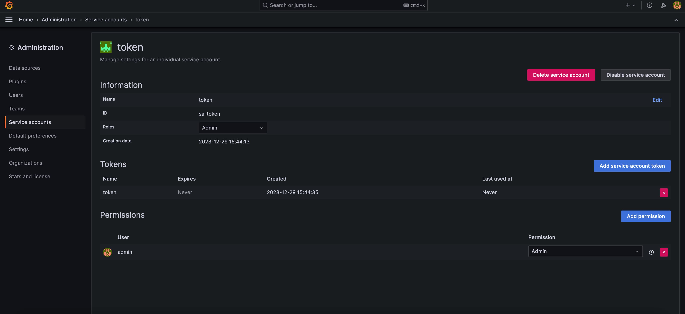

In this blog, I’ll guide you through installing [Tetrate Istio Subscription (TIS)](https://tetrate.io/tetrate-istio-subscription/) and activating its monitoring add-on.

## Understanding Tetrate Istio Subscription

Tetrate Istio Subscription is a comprehensive, enterprise-grade product offered by Tetrate. It provides thoroughly tested Istio versions compatible with all major cloud platforms. Derived from the open-source Tetrate Istio Distro project, TIS adds extensive support to these builds, including optional FIPS-validated cryptographic modules and a range of tested add-ons and integrations.

## Why Choose TIS?

TIS is not a fork but an upstream distribution of Istio tailored for specific environments. Enhancements made to Istio are integrated upstream. Key benefits of TIS include:

1. **Extended Support**: TIS offers 14 months of security update support.
2. **Commercial Support**: TIS provides business support options for enterprise use cases, including compliance needs.
3. **Ease of Management**: TIS simplifies installation and management processes.
4. **Multi-Environment Adaptability**: TIS supports various cloud environments.
5. **FIPS Validation**: TIS offers FIPS-validated versions for high-security requirements.

[Visit the TIS docs for more information ›](https://docs.tetrate.io/istio-subscription/)

## Pre-Installation Requirements

Before installing TIS and its plugins, you’ll need:

- [Terraform](https://www.terraform.io/) for importing dashboards into Grafana.
- Credentials from Tetrate for installing TIS.
  - tis_username
  - tis_password

## Installing Istio and Monitoring Addons

First, check the supported Istio versions with TIS:

```
helm search repo tetratelabs/base --versions
NAME            CHART VERSION  APP VERSION    DESCRIPTION
tetratelabs/base1.20.1+tetrate01.20.1-tetrate0Helm chart for deploying Istio cluster resource...
tetratelabs/base1.20.0+tetrate01.20.0-tetrate0Helm chart for deploying Istio cluster resource...
tetratelabs/base1.19.5+tetrate01.19.5-tetrate0Helm chart for deploying Istio cluster resource...
tetratelabs/base1.19.4+tetrate01.19.4-tetrate0Helm chart for deploying Istio cluster resource...
tetratelabs/base1.19.3+tetrate01.19.3-tetrate0Helm chart for deploying Istio cluster resource...
tetratelabs/base1.18.6+tetrate01.18.6-tetrate0Helm chart for deploying Istio cluster resource...
tetratelabs/base1.18.5+tetrate01.18.5-tetrate0Helm chart for deploying Istio cluster resource...
tetratelabs/base1.18.3+tetrate01.18.3-tetrate0Helm chart for deploying Istio cluster resource...
tetratelabs/base1.17.8+tetrate01.17.8-tetrate0Helm chart for deploying Istio cluster resource...
tetratelabs/base1.17.6+tetrate01.17.6-tetrate0Helm chart for deploying Istio cluster resource...
tetratelabs/base1.16.7+tetrate01.16.7-tetrate0Helm chart for deploying Istio cluster resource...
tetratelabs/base1.16.6+tetrate01.16.6-tetrate0Helm chart for deploying Istio cluster resource...
```

We’ll install the latest Istio version, 1.20.1.

```bash
export TIS_USER="<tis_username>"
export TIS_PASS="<tis_password>"
# Helm chart version
export VERSION=1.20.1+tetrate0
# Image tag
export TAG=1.20.1-tetrate0
kubectl create namespace istio-system

kubectl create secret docker-registry tetrate-tis-creds \
    --docker-server="addon-containers.istio.tetratelabs.com" \
    --docker-username=${TIS_USER} \
    --docker-password=${TIS_PASS} \
    -n istio-system

# Install Istio
helm install istio-base tetratelabs/base -n istio-system \
    --set global.tag=${TAG} \
    --set global.hub="addon-containers.istio.tetratelabs.com" \
    --set "global.imagePullSecrets[0]=tetrate-tis-creds" \
    --version ${VERSION}

helm install istiod tetratelabs/istiod -n istio-system \
    --set global.tag=${TAG} \
    --set global.hub="addon-containers.istio.tetratelabs.com" \
    --set "global.imagePullSecrets[0]=tetrate-tis-creds" \
    --version ${VERSION} \
    --wait

# install ingress Gateway
kubectl create namespace istio-ingress

kubectl create secret docker-registry tetrate-tis-creds \
    --docker-server="addon-containers.istio.tetratelabs.com" \
    --docker-username=${TIS_USER} \
    --docker-password=${TIS_PASS} \
    -n istio-ingress

helm install istio-ingress tetratelabs/istio-ingress -n istio-ingress \
    --set global.tag=${TAG} \
    --set global.hub="addon-containers.istio.tetratelabs.com" \
    --set "global.imagePullSecrets[0]=tetrate-tis-creds" \
    --version ${VERSION} \
    --wait

# Install TIS addon
helm install istio-monitoring-demo tis-addons/istio-monitoring-demo --namespace tis --create-namespace
```

Port forward the Grafana service and open it in your local browser: [http://localhost:3000](http://localhost:3000/):

```bash
kubectl port-forward --namespace tis svc/grafana 3000:3000
```

Note: Keep the port-forwarding command running, as we’ll need access to this port for importing the dashboard into Grafana.

## Why TIS Monitoring Addon?

The Tetrate Istio Subscription (TIS) Monitoring Addon stands out by offering a tailored and advanced monitoring experience compared to standard Istio dashboards. It focuses on modern needs with four specialized dashboards, replacing outdated elements with relevant metrics. Key enhancements include a unified panel design, detailed service insights, and critical metrics like sidecar performance. Reserved for TIS customers, these dashboards reflect Tetrate’s commitment to providing value beyond basic support, ensuring a personalized and evolving monitoring solution. Choosing TIS Monitoring Addon means accessing a service that not only meets current needs but also adapts to future demands.

## Installing Istio Monitoring Addons

After logging in with the default user name and password admin/admin, select Administration-Service accounts in the left navigation bar, and follow the instructions in the Grafana documentation to create a Service account with admin privilege.



Create a Service account for Grafana then use Terraform to import dashboards into Grafana:

```bash
cat>~/.terraformrc<<EOF
credentials "terraform.cloudsmith.io" {
  token = "tetrate/tis-containers/<tis_password>"
}
EOF

# Create a terraform module file
cat>istio-monitoring-grafana.tf<<EOF
module "istio_monitoring_grafana" {
  source = "terraform.cloudsmith.io/tis-containers/istio-monitoring-grafana/tetrate"
  version = "v0.2.0"
  gf_url  = "http://localhost:3000"
  gf_auth = "<grafana_service_account_token>"
}
EOF

# Run the commands
terraform init
terraform plan
terraform apply -auto-approve
```

Congratulations, you have successfully imported four dashboards into Grafana:

- Istio Workload Dashboard
- Istio Service Dashboard
- Istio Wasm Extension Dashboard
- Istio Control Plan Dashboard

However, some dashboards might not have data yet. Let’s generate some traffic in the mesh.

## Testing the Monitoring

Deploy the Bookinfo application and ingress gateway:

```bash
kubectl create secret docker-registry tetrate-tis-creds \
    --docker-server="addon-containers.istio.tetratelabs.com" \
    --docker-username=${TIS_USER} \
    --docker-password=${TIS_PASS} \
    -n default
kubectl label namespace default istio-injection=enabled
kubectl apply -f https://raw.githubusercontent.com/istio/istio/release-1.20/samples/bookinfo/platform/kube/bookinfo.yaml -n default
kubectl apply -f https://raw.githubusercontent.com/istio/istio/release-1.20/samples/bookinfo/platform/kube/bookinfo-gateway.yaml -n default
```

Retrieve the ingress gateway IP and generate traffic:

```bash
export GATEWAY_IP=$(kubectl -n istio-ingress get service istio-ingressgateway -o jsonpath='{.status.loadBalancer.ingress[0].ip}')
for i in $(seq 1 100);do curl http://$GATEWAY_IP/productpage ; sleep 3;done
```

Now, when you visit the Grafana dashboard, you will see monitoring data.


In addition, while importing these dashboards, we also imported the following alert rules:


You can also define alert rules in Grafana, such as [integrating Telegram](https://grafana.com/blog/2023/12/28/how-to-integrate-grafana-alerting-and-telegram/) and Slack to send notifications.

## Cleanup

Run the following command to clean up the Bookinfo app and TIS:

```bash
kubectl delete -f samples/bookinfo/platform/kube/bookinfo.yaml
kubectl delete -f samples/bookinfo/networking/bookinfo-gateway.yaml
helm uninstall istio-ingress -n istio-ingress
helm uninstall istio-monitoring-demo -n tis
helm uninstall istiod -n istio-system
helm uninstall istio-base -n istio-system
kubectl delete namespace tis
kubectl delete namespace istio-ingress
kubectl delete namespace istio-system
```

## Conclusion

By following these steps, you have successfully set up and tested monitoring in Istio using TIS. Enjoy the insights and advantages of enhanced monitoring in your Istio environment!
