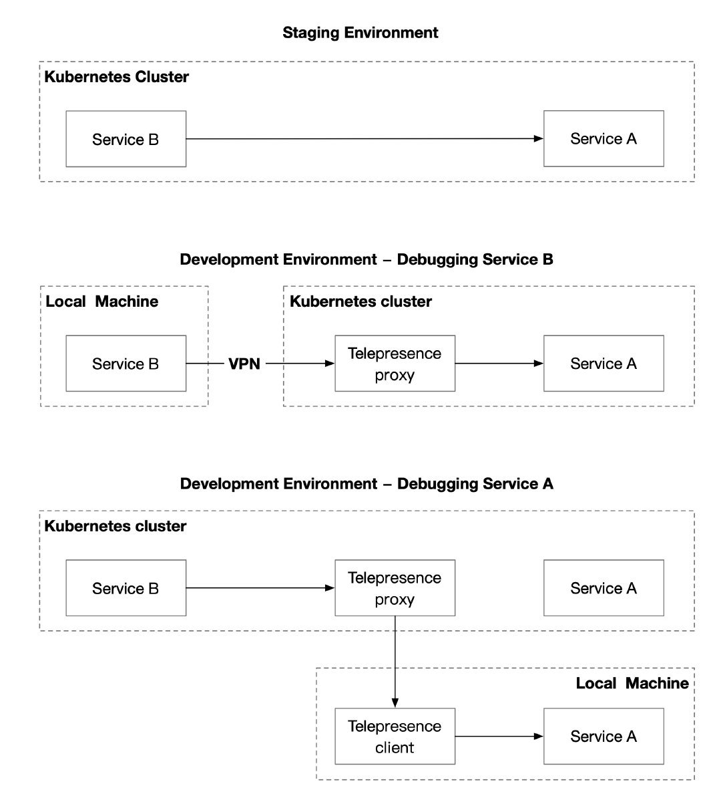
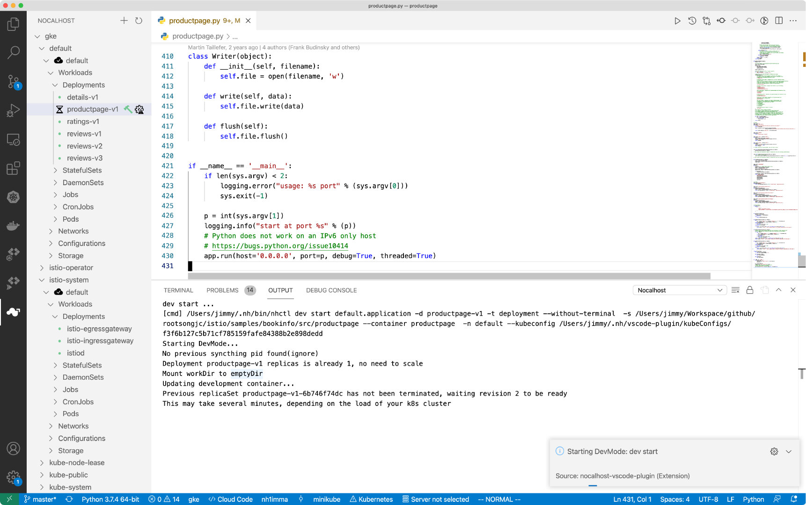
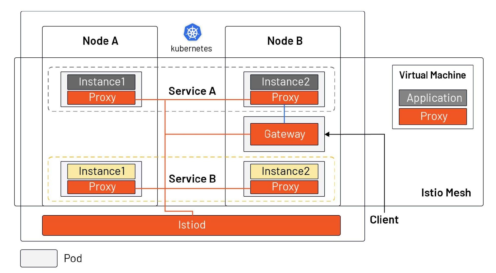

Kubernetes is arguably the best environment for running microservices so far, but the experience of debugging microservices in a Kubernetes environment may not be as user-friendly. This article will show you how to debug microservices in Kubernetes, introduce common tools, and explain how the introduction of Istio impacts debugging microservices.

## Debugging microservices is vastly different from traditional monolithic applications

The debugging of microservices has been a long-standing problem for software developers. This challenge does not exist in traditional monolithic applications because developers can leverage the debugger in IDEs to add breakpoints, modify environment variables, single-step execution, etc. for their applications, all of which provide great help in software debugging. With the popularity of Kubernetes, the debugging of microservices becomes a thorny issue, where the following issues are more complicated than the debugging of traditional monolithic applications.

### Multiple dependencies

A microservice often depends on multiple other microservices, some shared volumes across multiple microservices, and authorizations based on service accounts. When debugging a microservice, how do you deploy other dependent services to quickly build a latest set of staging environments?

### Access from a local machine

When microservices are running on a developer’s local computer, there is usually no direct access to the services in a Kubernetes cluster. How can you debug microservices deployed in a Kubernetes cluster as if they were local services?

### Slow development loop

Usually, it takes a long process to update the code and build it into an image before pushing it to the cluster. How do you speed up the development cycle? Let’s look at the tools that address those challenges.

## Tools

The main solutions for debugging microservices in Kubernetes are:

- Proxy: by building a VPN, deploying a proxy in the Kubernetes cluster, and adding local debug endpoints to make the services in Kubernetes directly accessible to local applications, your architecture will look like [ local service ] <-> [ proxy ] <-> [ app in Kubernetes ].
- Sidecar: Inject a sidecar into the pod of the microservice to be debugged to intercept all traffic to and from the service, so that the service can be tracked and monitored, and the service can also be debugged in this sidecar.
- Service Mesh: To get an overall picture of the application, inject sidecars into all microservices so that you can get a dashboard that monitors global status.

Here are three typical open source projects that implement the above solutions, each of which can help you debug microservices from a different perspective. You can apply them at different stages of software development and they can be said to be complementary to each other.

### Proxy – debugging microservices with Telepresence

[Telepresence](https://www.telepresence.io/) is essentially a local proxy that proxies data volumes, environment variables, and networks in a Kubernetes cluster locally. The following diagram shows the main usage scenarios for Telepresence.

Users need to manually execute the telepresence command locally, which will automatically deploy the agent to Kubernetes. Once the agent has been deployed,

- Local services will have complete access to other services in the Kubernetes cluster, environment variables, Secret, ConfigMap, etc.
- Services in the cluster also have direct access to the locally exposed endpoints.

However, this approach requires users to run multiple commands while debugging locally, and in some network environments it may not be possible to establish a VPN connection to the Kubernetes cluster.

### Sidecar – debugging microservices with Nocalhost

[Nocalhost](https://nocalhost.dev/) is a Kubernetes-based cloud development environment. To use it, you just need to install a plugin in your IDE – VS Code to extend Kubernetes and shorten the development feedback cycle. The development environment can be isolated by creating different namespaces for different users and using ServiceAccount when binding to different user corners. Nocalhost also provides a web console and API for administrators to manage different development environments.

As long as you have a Kubernetes cluster and have admin rights to the cluster, you can refer to the [Nocalhost documentation](https://nocalhost.dev/getting-started/) to quickly start trying it out. To use the Nocalhost plugin in VS Code, you need to configure the Kubernetes cluster in the plugin first.

1. Select the Kubeconfig file you just exported or copy and paste the contents of the file directly into the configuration.
2. Then select the service you need to test and select the corresponding Dev Container. VS Code will automatically open a new code window.

Here is an example of the [bookinfo sample](https://istio.io/latest/docs/examples/bookinfo/) provided by Istio. You can open the cloned code in your local IDE and click the hammer next to the code file to enter development mode. Selecting the corresponding DevContainer and Nocalhost will automatically inject a development container sidecar into the pod and automatically enter the container in the terminal, as shown in the following figure.

In development mode, the code is modified locally without rebuilding the image, and the remote development environment takes effect in real time, which can greatly accelerate the development speed. At the same time, Nocalhost also provides a server for managing the development environment and user rights, as shown in the following figure.

### Service Mesh – debugging microservices with Istio

The above method of using proxy and sidecar can only debug one service at a time. You’ll need a mesh to get the global status of the application, such as the metrics of the service obtained, and debug the performance of the service by understanding the dependency and invocation process of the service through distributed tracing. These observability features need to be implemented by injecting sidecar uniformly for all services. And, when your services are in the process of migrating from VMs to Kubernetes, using Istio can bring VMs and Kubernetes into a single network plane (as shown below), making it easy for developers to debug and do incremental migrations.

Of course, these benefits do not come without a “cost.” With the introduction of Istio, your Kubernetes services will need to adhere to the Istio naming convention and you’ll need to know how to debug microservices using the Istioctl command line and logging.

- Use the *istioctl analyze* command to debug the deployment of microservices in your cluster, and you can use YAML files to examine the deployment of resources in a namespace or across your cluster.
- Use *istioctl proxy-config secret* to ensure that the secret of a pod in a service mesh is loaded correctly and is valid.

## Summary

In the process of microservicing applications and migrating from virtual machines to Kubernetes, developers need to make a lot of changes in their mindset and habits. By building a VPN between local and Kubernetes via proxy, developers can easily debug services in Kubernetes as if they were local services. By injecting a sidecar into the pod, you can achieve real-time debugging and speed up the development process. Finally, the Istio service mesh truly enables global observability, and you can also use tools like [Tetrate Service Bridge](https://www.tetrate.io/tetrate-service-bridge/) to manage heterogeneous platforms, helping you gradually move from monolithic applications to microservices.
