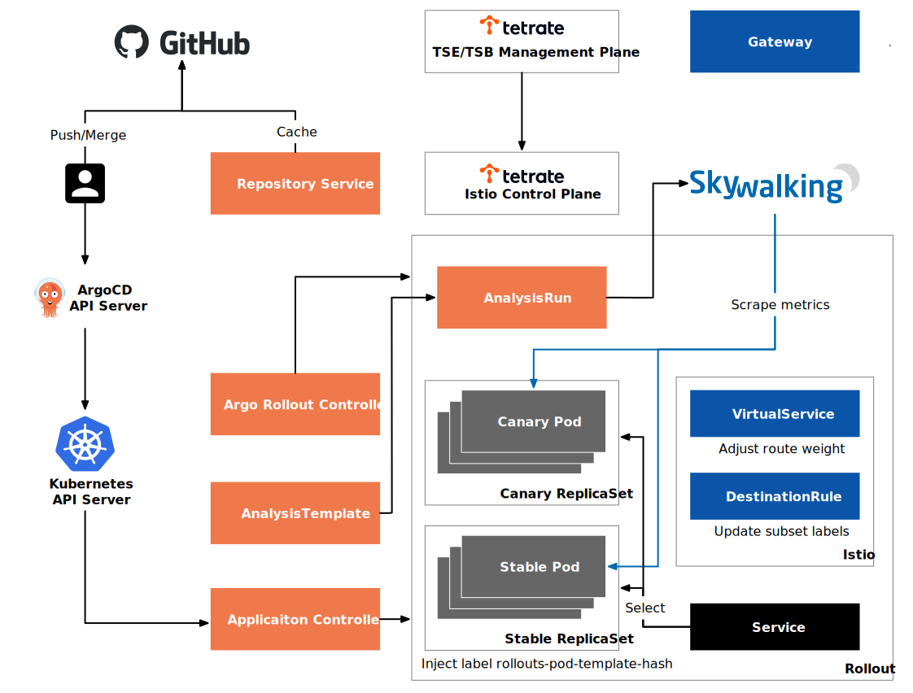
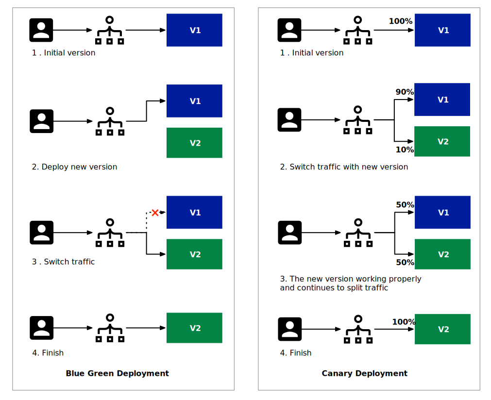
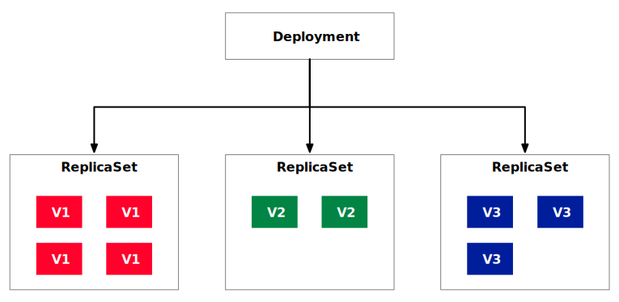
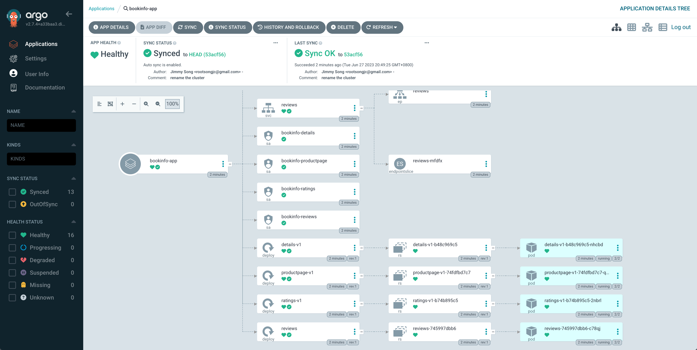
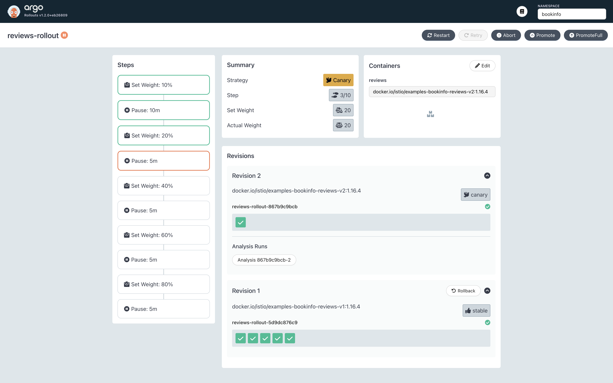
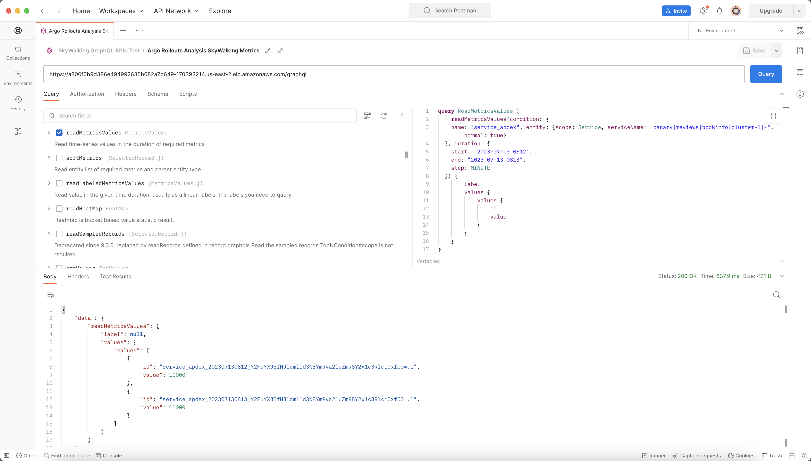

The development of cloud-native applications has led to a shift in development to the left and a higher frequency of application iteration, which has given rise to the need for GitOps. This article will introduce how to use the Argo project, including ArgoCD and Argo Rollouts, to achieve GitOps and canary deployment with Istio. There is also a demonstration in the article that shows how to achieve GitOps based on the Istio environment provided by Tetrate Service Express (also applicable to Tetrate Service Bridge).

The deployment architecture diagram of the demo in this article is shown in Figure 1. If you are already familiar with the deployment strategies and Argo projects introduced in this article, you can skip directly to the demo section.



## Deployment strategy

First of all, I want to briefly introduce the two deployment strategies supported by Argo Rollouts, which can achieve zero-downtime deployment.

The steps of blue-green deployment and canary deployment are shown in Figure 2.



- Blue-green deployment is a strategy that deploys the new version of the application in a separate environment in parallel without affecting the current production environment. In blue-green deployment, the current production environment is called the "blue environment," and the environment where the new version of the application is deployed is called the "green environment." Once the green environment is considered stable and has passed the test, the traffic will gradually switch from the blue environment to the green environment, allowing users to gradually access the new version. If problems occur during the switching process, it can be quickly rolled back to the blue environment to minimize the impact on users. The advantage of blue-green deployment is that it can provide high availability and zero-downtime deployment.
- Canary deployment is a strategy for gradually introducing new versions or features into the production environment. In canary deployment, the new version or feature is first deployed to a small number of users in the production environment, called "canary users." By monitoring the feedback and performance indicators of canary users, the development team can evaluate the stability and reliability of the new version or feature. If there are no problems, more users can be gradually included in the canary deployment until all users use the new version. If a problem is found, it can be quickly rolled back or fixed to avoid negative effects on the entire user group. The advantage of canary deployment is that it can quickly identify problems and make adjustments in a small impact area.

The main difference between blue-green deployment and canary deployment is the deployment method and the scale of the changes. Blue-green deployment deploys the entire application in a new environment and then switches, which is suitable for large-scale changes, such as major upgrades of the entire application. Canary deployment gradually introduces new versions or features, which is suitable for small-scale changes, such as adding or modifying a single feature.

In terms of application scenarios, blue-green deployment is suitable for systems with higher requirements for high availability and zero-downtime deployment. When deploying large-scale changes, blue-green deployment can ensure stability and reliability and can quickly roll back to cope with unexpected situations. Canary deployment is suitable for systems that need to quickly verify new features or versions. By gradually introducing changes, problems can be discovered early and adjustments can be made to minimize the impact on users.

## Release strategy of Kubernetes Deployment

In Kubernetes, the Deployment resource object is one of the main tools for managing the deployment and updating of applications. Deployment provides a declarative way to define the expected state of an application and implements the release strategy through the controller's functionality. The architecture of Deployment is shown in Figure 3, where the colored squares represent pods of different versions.



The release strategy can be configured in the spec field of Deployment. Here are some common release policy options:

1. **Management of ReplicaSet**: Deployment uses ReplicaSet to create and manage replicas of an application. The desired number of replicas can be specified by setting the `spec.replicas` field. During the release process, the Kubernetes controller ensures that the number of replicas of the new version's ReplicaSet gradually increases when created, and the number of replicas of the old version's ReplicaSet gradually decreases when deleted to achieve a smooth switch.
2. **Rolling update policy**: Deployment supports multiple rolling update policies, which can be selected by setting the `spec.strategy.type` field. Common policies include:
    - **RollingUpdate**: The default policy updates replicas gradually at a certain time interval. The number of replicas that are not available at the same time and the number of additional available replicas can be controlled by setting the `spec.strategy.rollingUpdate.maxUnavailable` and `spec.strategy.rollingUpdate.maxSurge` fields.
    - **Recreate**: This policy first deletes all replicas of the old version during the update process and then creates replicas of the new version. This policy will cause the application to be temporarily unavailable during the update.
3. **Version control**: Deployment sets labels for each version's ReplicaSet through the `spec.template.metadata.labels` field so that the controller can track and manage them accurately. This way, multiple versions of ReplicaSet can coexist, and the number of replicas of each version can be accurately controlled.

By using these configuration options, Deployment can achieve different release strategies. Updating the spec field of the Deployment object can trigger the release of a new version. The Kubernetes controller will automatically handle the creation, update, and deletion of replicas according to the specified policy to achieve smooth application updates and deployment strategies.

## Implementing GitOps with ArgoCD

You can use Deployment to manually manage release strategies, but to achieve automation, we also need to use GitOps tools such as ArgoCD.

ArgoCD is a GitOps-based continuous delivery tool used to automate and manage the deployment of Kubernetes applications. It provides some key help to improve the efficiency and reliability of application deployment.

Here are some of the help ArgoCD provides for Kubernetes application deployment:

1. **Declarative configuration**: ArgoCD uses a declarative way to define the expected state of an application and stores the application configuration in a Git repository. By versioning and continuous integration/continuous delivery (CI/CD) processes, it is easy to track and manage application configuration changes.
2. **Continuous deployment**: ArgoCD can monitor configuration changes in the Git repository and automatically deploy the application to the Kubernetes environment. It provides customizable synchronization policies that can automatically trigger application deployment and updates, achieving continuous deployment.
3. **State comparison and automatic repair**: ArgoCD periodically checks the current state of the application and compares it with the expected state. If inconsistencies are found, it will automatically try to repair and restore the application to the desired state to ensure consistency between the expected and actual states.
4. **Multi-environment management**: ArgoCD supports managing multiple Kubernetes environments, such as development, testing, and production environments. It is easy to deploy and synchronize application configurations between different environments, ensuring consistency and controllability.

Compared to Deployment resource objects, ArgoCD provides more advanced features and workflows that complement the capabilities of native Kubernetes resource objects:

**GitOps-based configuration management**: ArgoCD stores application configuration in a Git repository, enabling GitOps-based configuration management. This approach ensures that configuration changes are traceable, auditable, and can be integrated with existing CI/CD pipelines.

**Automated deployment and continuous delivery**: ArgoCD can automatically detect configuration changes in the Git repository and deploy applications to Kubernetes environments, enabling automated deployment and continuous delivery.

**State management and automatic recovery**: ArgoCD continuously monitors the state of applications and compares it to the expected state. If inconsistencies are detected, it automatically recovers and ensures that the application state remains consistent with the expected state.

## Using Istio to achieve fine-grained traffic routing

Although ArgoCD can implement GitOps, it essentially operates on Kubernetes Deployment and controls traffic routing through replica numbers. To achieve fine-grained traffic routing, services meshes like Istio are used.

Istio achieves finer-grained traffic routing and application release through the following methods:

**VirtualService**: Istio uses VirtualService to define traffic routing rules. By configuring VirtualService, traffic can be routed and distributed based on request attributes such as request headers, paths, weights, etc., directing requests to different service instances or versions.

**DestinationRule**: Istio's DestinationRule is used to define service version policies and load balancing settings. By specifying different traffic weights between service instances of different versions, advanced application release policies such as canary release or blue-green deployment can be implemented.

**Traffic control and policies**: Istio provides rich traffic control and policy capabilities such as traffic limiting, fault injection, timeout settings, retry mechanisms, etc. These features help applications achieve higher-level load balancing, fault tolerance, and reliability requirements.

Compared to ArgoCD and Kubernetes Deployment objects, Istio provides the following advantages in application deployment:

**Fine-grained traffic routing control**: Istio provides richer traffic routing capabilities, enabling flexible routing and distribution based on a variety of request attributes, allowing for finer-grained traffic control and management.

**Advanced release policy support**: Istio's DestinationRule can specify traffic weights between different versions of service instances, supporting advanced application release policies such as canary release and blue-green deployment. This makes version management and release of applications more flexible and controllable.

**Powerful traffic control and policy capabilities**: Istio provides rich traffic control and policy capabilities such as traffic limiting, fault injection, timeout settings, retry mechanisms, etc. These features help applications achieve higher-level load balancing, fault tolerance, and reliability requirements.

Combining Istio with Argo Rollouts can fully leverage the advantages of Istio's fine-grained traffic routing. Let's now have a demo together. In our demo, we will use the Kubernetes and Istio environments provided by TSE, implement GitOps using ArgoCD, and implement canary release using Argo Rollouts.

## Demo

The software versions used in our demo are:

- Kubernetes v1.24.14
- Istio v1.15.7
- ArgoCD v2.7.4
- Argo Rollouts v1.5.1
- TSE Preview2

We will use Istio's VirtualService and DestinationRule to implement traffic grouping routing based on Subset, and use ArgoCD Rollouts for progressive release.

### Deploy ArgoCD and Argo Rollouts

I have created a Kubernetes cluster and added it to TSE in advance, and TSE will automatically install Istio control plane for the cluster. We also need to install ArgoCD and Argo Rollouts:

```bash
# Install ArgoCD
kubectl create namespace argocd
kubectl apply -n argocd -f https://raw.githubusercontent.com/argoproj/argo-cd/stable/manifests/install.yaml

# Install ArgoCD CLI on macOS
brew install argocd

# Change the service type of argocd-server to LoadBalancer
kubectl patch svc argocd-server -n argocd -p '{"spec": {"type": "LoadBalancer"}}'

# Get the ArgoCD UI address
ARGOCD_ADDR=$(kubectl get svc argocd-server -n argocd -o jsonpath='{.status.loadBalancer.ingress[0].hostname}')

# Login using ArgoCD CLI, see https://argo-cd.readthedocs.io/en/stable/getting_started/#4-login-using-the-cli to get password
argocd login $ARGOCD_ADDR --skip-test-tls --grpc-web --insecure

# Install Argo Rollouts
kubectl create namespace argo-rollouts
kubectl apply -n argo-rollouts -f https://github.com/argoproj/argo-rollouts/releases/download/latest/install.yaml

# Install rollouts plugin on macOS
curl -LO https://github.com/argoproj/argo-rollouts/releases/download/v1.5.0/kubectl-argo-rollouts-darwin-amd64
chmod +x ./kubectl-argo-rollouts-darwin-amd64
sudo mv ./kubectl-argo-rollouts-darwin-amd64 /usr/local/bin/kubectl-argo-rollouts

```

This feature is not applicable to TSE Bridge Mode, so we will use TSE Direct Mode to achieve progressive release.




Direct Mode and Bridge Mode are two modes in TSE for control plane to issue configuration. They are suitable for flow, security, and gateway group configuration modes. BRIDGED mode is a minimalist mode that allows users to quickly configure the most commonly used features in the service mesh using Tetrate-specific APIs, while DIRECT mode provides greater flexibility for advanced users, allowing them to configure using Istio APIs directly.



Next, deploy Rollouts Dashboard:

```bash
git clone https://github.com/argoproj/argo-rollouts.git
kustomize build manifests/dashboard-install|kubectl apply -n argo-rollouts -f -
kubectl port-forward svc/argo-rollouts-dashboard -n argo-rollouts 3100:3100
```

You can now access the Rollouts Dashboard at [https://localhost:3100/rollouts/](https://localhost:3100/rollouts/).

### Deploy Bookinfo Application

We have prepared the configuration file for the Bookinfo application (saved in the [tse-gitops-demo](https://github.com/tetrateio/tse-gitops-demo/) repository), and you can also fork it to your own account and replace it with your own repository. Run the following command to deploy the Bookinfo application:

```
argocd app create bookinfo-app --repo https://github.com/tetrateio/tse-gitops-demo.git --path application --dest-server https://kubernetes.default.svc --dest-namespace bookinfo --sync-policy automated

```

Note: We set `replicas` to `0` in the [`reviews` Deployment](https://github.com/tetrateio/tse-gitops-demo/blob/main/application/bookinfo.yaml#L151) because we will create Argo Rollouts to manipulate the number of instances of the `reviews` service. If you set it to a non-zero positive integer here, we will not be able to achieve canary deployment.

Now you can open the ArgoCD UI in your browser, as shown in Figure 4.



If you find that the application status is not in sync, you can run the following command or click the SYNC button in the UI.

```bash
argocd app sync bookinfo-app
```

## Implementing Fine-grained Traffic Management with Istio

First, let's use Argo CD to create Istio-related resource objects:

```bash
argocd app create bookinfo-tse-conf --repo https://github.com/tetrateio/tse-gitops-demo.git --path argo/tse --dest-server https://kubernetes.default.svc --dest-namespace bookinfo --sync-policy automated --self-heal

# Check the creation status
argocd app get bookinfo-tse-conf
```

### Converting Deployment to Rollout

Suppose we want to release a new version of the `reviews` service. To achieve zero downtime updates, we will use canary deployment, with the following steps:

1. Reduce the `replicas` of the `reviews` Deployment to 0;
2. Create a Rollout that references the `reviews` Deployment previously deployed in the Bookinfo application;
3. Send traffic to the `reviews` service to achieve automatic canary deployment progress.

You can view the Rollout and AnalysisTemplate configurations used in this demo on [GitHub](https://github.com/tetrateio/tse-gitops-demo/tree/main/argo/rollout). Run the following command to deploy `reivews-rollout`:

```bash
argocd app create reviews-rollout --repo https://github.com/tetrateio/tse-gitops-demo.git --path argo/rollout --dest-server https://kubernetes.default.svc --dest-namespace bookinfo --sync-policy automated
```

Note: We can use the `argocd` command to deploy or use `kubectl apply`. It is recommended to use `argocd` because you can view the deployment status in ArgoCD UI and Argo Rollouts Dashboard at the same time and manage the deployment using the `argocd` command.

View the status of the `reviews` rollouts in the [Argo Rollouts Dashboard](https://localhost:3001/rollouts/bookinfo), and use the following command to send traffic to the `reviews` service for a period of time:

```bash
export GATEWAY_HOSTNAME=$(kubectl -n bookinfo get service tsb-gateway-bookinfo -o jsonpath='{.status.loadBalancer.ingress[0].hostname}')
while 1;do curl -H "Host: bookinfo.tetrate.com" http://$GATEWAY_HOSTNAME/api/v1/products/1/reviews;sleep 3;done
```

You will see responses from pods with different rollouts-pod-template-hash labels in the output, which proves that canary deployment is effective. After about 10 minutes, the Argo Rollouts Dashboard you see will be as shown in Figure 5.



From Figure 5, we can see that canary deployment is progressing smoothly and has reached the third step. This is because the `apdex` (Application Performance Index) indicator of the `reviews` service is normal. You can use [Postman to submit GraphQL queries to SkyWalking](https://tetrate.io/blog/how-to-use-graphql-to-query-observability-data-from-skywalking-with-postman/) to verify this, as shown in Figure 6.



The GraphQL query statement we built is as follows:

```graphql
query ReadMetricsValues {
    readMetricsValues(condition: {
    name: "service_apdex", entity: {scope: Service, serviceName: "canary|reviews|bookinfo|cluster-1|-", normal: true}
  }, duration: {
    start: "2023-07-13 0812",
    end: "2023-07-13 0813",
    step: MINUTE
  }) {
        label
        values {
            values {
                id
                value
            }
        }
    }
}
```

This statement queries the `apdex` indicator of the `canary|reviews|bookinfo|cluster-1|-` service from UTC `2023-07-13 8:12` to `2023 8:13` for two minutes and obtains the following results:

```json
{
    "data": {
        "readMetricsValues": {
            "label": null,
            "values": {
                "values": [
                    {
                        "id": "service_apdex_202307130812_Y2FuYXJ5fHJldmlld3N8Ym9va2luZm98Y2x1c3Rlci0xfC0=.1",
                        "value": 10000
                    },
                    {
                        "id": "service_apdex_202307130813_Y2FuYXJ5fHJldmlld3N8Ym9va2luZm98Y2x1c3Rlci0xfC0=.1",
                        "value": 10000
                    }
                ]
            }
        }
    }
}
```

The value of the `apdex` indicator is greater than 9900 (the threshold configured in the `successCondition` of AnalysisTemplate), so Rollouts will progress smoothly. You can also click Promote manually on the Argo Rollouts Dashboard to promote it, or run the following command:

```bash
kubectl argo rollouts promote reviews-rollout -n bookinf
```

## Cleaning Up

Delete the deployed ArgoCD Apps and Rollouts:

```bash
argocd app delete -y reviews-rollout
argocd app delete -y bookinfo-tse-conf
argocd app delete -y bookinfo-app
```

## Principles of Argo Rollouts

When integrating with Istio, Argo Rollouts supports traffic splitting based on VirtualService and Subset, as shown in Figure 7.


The table below provides a detailed comparison of these two traffic segmentation methods.

| Type | Applicable Scenario | Resource Object | Principle |
| --- | --- | --- | --- |
| Host-level Traffic Split | Applicable for accessing different versions of services based on hostname; | 2 Services, 1 VirtualService, 1 Rollout; | Rollout injects the rollouts-pod-template-hash label into the ReplicaSet and selects pods with these labels by updating the selector in the Service; |
| Subset-level Traffic Split | Applicable for accessing different services based on labels; | 1 Service, 1 VirtualService, 1 DestinationRule, and 1 Rollout; | Rollout injects the rollouts-pod-template-hash label into the ReplicaSet and selects pods with these labels by updating the selector in the DestinationRule; |

Subset-based traffic splitting is used in this demo, and Argo Rollouts continuously:

- modify the VirtualService `spec.http[].route[].weight` to match the current desired canary weight
- modify the DestinationRule `spec.subsets[].labels` to contain the `rollouts-pod-template-hash` label of the canary and stable ReplicaSets

Visit [Argo Rollouts documentation](https://argo-rollouts.readthedocs.io/en/stable/features/traffic-management/istio/) for details on using Istio for traffic management.

## Summary

This article introduces how to use the Argo project and Istio to achieve GitOps and canary deployment. First, we use ArgoCD to achieve GitOps, and then use Argo Rollout and SkyWalking to achieve automated canary release. From the demo, we can see that the Istio deployed by TSE is fully compatible with the open-source version. There are many features of TSE worth exploring, visit the [Tetrate website](https://tetrate.io/tetrate-service-express/) for more information.

---

*This blog was originally published at [tetrate.io](https://tetrate.io/blog/implementing-gitops-and-canary-deployment-with-argo-project-and-istio/).*
