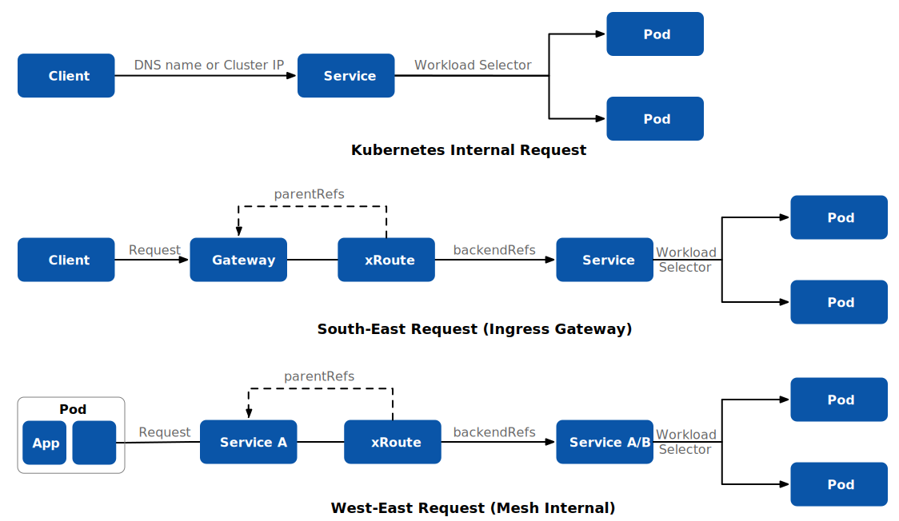
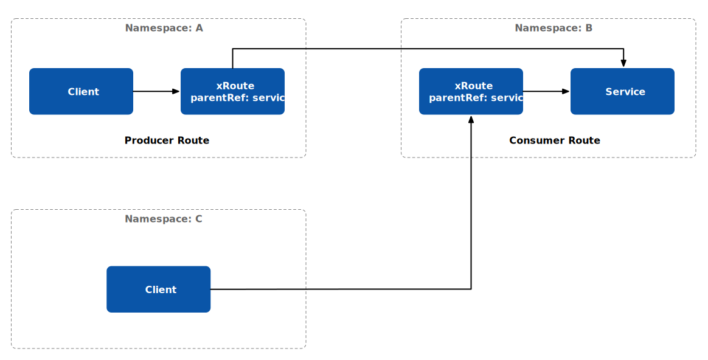

I’m delighted to present Istio’s most recent release—[Istio 1.19](https://istio.io/latest/news/releases/1.19.x/announcing-1.19/). This blog will provide an overview of the updates bundled in this release.

## Gateway API: Revolutionizing Service Mesh

Our[ previous blog](https://tetrate.io/blog/why-the-gateway-api-is-the-unified-future-of-ingress-for-kubernetes-and-service-mesh/) highlighted the Gateway API’s potential to harmonize ingress gateways in Kubernetes and service mesh, opening doors to cross-namespace traffic support. With Istio’s official endorsement, the Gateway API takes center stage. While traditionally applied to north-south traffic (the ingress and egress of the mesh), it now extends its prowess to the realm of east-west traffic, the lifeblood within the mesh.

In Kubernetes, services wear multiple hats, handling tasks from service discovery and DNS to workload selection, routing and load balancing. Yet, control over these functions has been limited, with workload selection being the notable exception. The Gateway API changes the game, putting you in command of service routing. This introduces some overlap with Istio’s VirtualService, as both wield influence over traffic routing. Here’s a glimpse into three scenarios:

1. **Internal Kubernetes Requests:** Without Istio, all internal traffic in Kubernetes takes the service route.
2. **North-South Traffic:** By applying the Gateway API to the Ingress gateway, incoming traffic to Kubernetes follows xRoute (currently supporting HTTPRoute, TCPRoute and gRPCRoute) to services.
3. **East-West Traffic:** Inside Istio, as traffic enters the data plane, xRoute of the Gateway API takes charge. It guides the traffic to either the original or a new destination service.

This dynamic fusion of the Gateway API with Istio not only refines service networking but also solidifies Istio’s significance in the Kubernetes ecosystem.

## Gateway API for Service Mesh: A Deeper Dive

At its current experimental stage (as of v0.8.0), the Gateway API for Service Mesh introduces a fresh approach to configuring service mesh support in Kubernetes. It directly links individual route resources (such as HTTPRoute) with Service resources, streamlining the configuration process.

Here are some key takeaways:

**Experimental Stage:** As of version v0.8.0, the Gateway API for Service Mesh is still experimental. It’s advised not to use it in production environments.

**Service and Route Association:** Unlike using Gateway and GatewayClass resources, individual route resources are linked directly with Service resources when configuring a service mesh.

**Frontend and Backend Aspects of Service:** The Service’s frontend encompasses its name and cluster IP, while the backend consists of its collection of endpoint IPs. This distinction facilitates routing within a mesh without introducing redundant resources.

**Route Attachment to Service:** Routes are attached to a Service to apply configuration to any traffic directed to that Service. The traffic follows the mesh’s default behavior if no Routes are attached.

**Namespace Relationships**:

- *Same Namespace:* A Route in the same Namespace as its Service, known as a producer route, is typically created by the workload creator to define acceptable usage. It affects all requests from any client of the workload across any Namespace.
- *Different Namespaces:* A Route in a different Namespace than its Service, termed a consumer route, refines how a consumer of a given workload makes requests. This Route only influences requests from workloads in the same Namespace as the Route.

**Combining Routes:** Multiple Routes for the same Service in a single Namespace, whether producer or consumer routes, will be merged according to the Gateway API Route merging rules. This means defining distinct consumer routes for multiple consumers in the same Namespace is impossible.

**Request Flow**:

- A client workload initiates a request for a specific Service in a Namespace.
- The mesh data plane intercepts the request and identifies the target Service.
- Based on associated Routes, the request is allowed, rejected, or forwarded to the appropriate workload based on matching rules.

Bear in mind that, in the experimental stage, the Gateway API for Service Mesh may undergo further changes and is not recommended for production use.

But wait, there’s more! Our journey doesn’t end here – the support for ingress traffic using the API is rapidly heading toward General Availability, promising even more dynamic developments!

Let’s delve further into additional enhancements in this release.

## Ambient Mesh Enhancements

The Istio team has been tirelessly refining the ambient mesh, an innovative deployment model that offers an alternative to the traditional sidecar approach. If you haven’t explored ambient yet, now’s the perfect time to dive into the[ introduction blog post](https://istio.io/latest/blog/2022/introducing-ambient-mesh/).

With this update, we’ve amplified support for `ServiceEntry`, `WorkloadEntry`, `PeerAuthentication` and DNS proxying. Alongside, bug fixes and reliability enhancements ensure a seamless experience.

Remember, the ambient mesh is in its alpha phase for this release. The Istio community eagerly awaits your feedback to propel it toward Beta.

## Simplified Virtual Machine and Multicluster Experiences

Simplicity is key, especially when working with Virtual Machines and Multicluster setups. In this release, we’ve made the address field optional in the `WorkloadEntry` resources. This seemingly small adjustment promises to streamline your workflow significantly.

## Elevated Security Configurations

You can now configure `OPTIONAL_MUTUAL` for your Istio ingress gateway’s TLS settings, providing the flexibility of optional client certificate validation. Additionally, you can fine-tune your preferred cipher suites used for non-Istio mTLS traffic via `MeshConfig`.

With these updates, Istio 1.19 empowers you with greater control, flexibility and security in managing your service mesh.

Feel free to explore these enhancements and share your experiences with the Istio community. For more details, refer to the[ official release notes](https://istio.io/latest/news/releases/1.19.x/announcing-1.19/).

Happy meshing!

---

This blog was initially published at [tetrate.io](https://tetrate.io/blog/whats-new-in-istio-1-19-gateway-api-and-beyond/).
