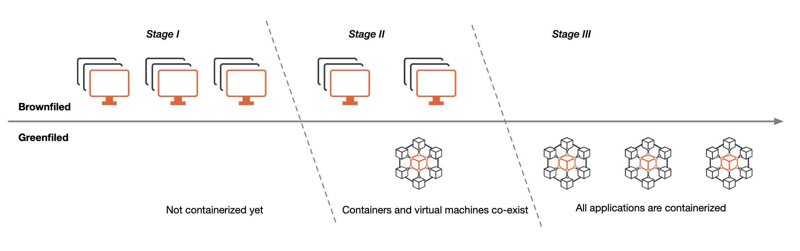
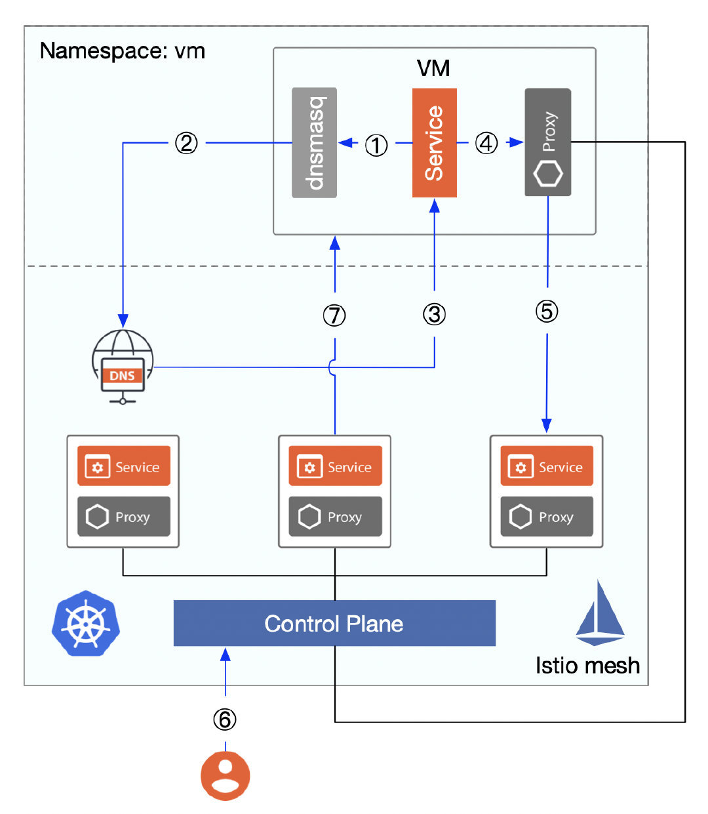

In this article, I’ll give you an overview of [Istio](https://istio.io/)‘s history of virtual machine integration support. In particular, the introduction of the smart DNS proxy and WorkloadGroup in Istio 1.8, which makes virtual machines and containers equivalent at the resource abstraction level.

I will show you a tumultuous odyssey of Istio’s virtual machine integration. Tetrate, the enterprise service mesh company that made pushing Istio to run everywhere part of its founding mission, has used VM features extensively in customer deployments and has been instrumental in pushing VMs to Istio upstream.

## Preface

In my [previous article](https://thenewstack.io/how-to-integrate-virtual-machines-into-istio-service-mesh/), I talked about how Istio 1.7 supported virtual machines. But at that time, late October, virtual machines were still not seamlessly integrated into Istio — there was still a lot of manual work required. Now, Istio 1.8 has added WorkloadGroup and smart DNS proxy, which allows non-Kubernetes workloads like VMs to become first-class citizens in Istio — just like pods.

With or without a sidecar installed for virtual machines, until 1.7 you could not resolve the DNS name of a Kubernetes service unless a kube-external DNS was configured — which is the last piece of virtual machine integration in Istio. This shortcoming has finally been fixed in Istio 1.8.

## Why Is Virtual Machine Support Important?

In the process of migrating our applications to cloud native architectures and continuously containerizing them, we will go through three phases as shown in the figure below.

- Stage 1: All applications are deployed on virtual machines
- Stage 2: Applications are deployed on both virtual machines and containers, are migrating from virtual machines to containers, and are using Kubernetes to manage containers.
- Stage 3: All applications are deployed in containers first, using Kubernetes to manage containers and Istio to manage service-to-service communication.

The above diagram is artificially simplified: in reality, there might be multiple hybrid clouds, multiple regions, multiple clusters, etc. Plus, at stage 3 containers and virtual machines may remain in long-term coexistence, but the trend of containerization remains unchanged.

## Istio’s History of Virtual Machine Support

Istio’s support for virtual machines is a long process, an odyssey of sorts.

### 0.2: Istio Mesh Expansion

As of version 0.2, Istio added virtual machines to the Mesh via [Istio Mesh Expansion](https://istio.io/v0.2/docs/setup/kubernetes/mesh-expansion.html), provided that the following prerequisites were met.

- Virtual machines must have direct access to the application’s pods via IP address, which requires a flat network between the container and the VM via VPC or VPN; and virtual machines do not need access to the Cluster IP, but rather direct access to the service’s endpoints.
- Virtual machines must have access to Istio’s control plane services (Pilot, Mixer, CA, now being integrated as Istiod), which can expose the control plane endpoints to virtual machines by deploying load balancers in the Istio Mesh.
- (optional) the virtual machine has access to the DNS server inside the Mesh (deployed in Kubernetes).

The steps to integrate a virtual machine are as follows.

1. Create an internal load balancer for the Istio control plane service and the DNS service for the Kubernetes cluster.
2. Generate a configuration file for the Istio Service CIDR, Service Account token, security certificate, and IP of the Istio Control Plane Service (the IP exposed through the Internal Load Balancer) and send it to the virtual machine.
3. Setup the Istio component, dnsmaq (for DNS discovery), in the virtual machine; so that the virtual machine can access the services in the mesh using FQDN, to ensure that the virtual machine can correctly resolve the Cluster IP of the services in the mesh.
4. To run the service in a virtual machine, you need to configure the sidecar, add inbound ports to be intercepted, then restart Istio and also run istioctl to register the service.

The following figure shows the detailed flow from integrating a virtual machine to accessing services in the virtual machine in a mesh.

Figure 1

1. The DNS is hijacked by dnsmasq deployed in the virtual machine, which allows it to correctly obtain the Cluster IP of the Istio service (Kubernetes’ built-in DNS).
2. Access to Kubernetes’ built-in DNS service (which is exposed outside the cluster via the Internal Load Balancer and can be accessed directly).
3. Return the Cluster IP resolved by `productpage.bookinfo.svc.cluster.local`, noting that the IP address is not directly accessible, but failure to be DNS resolved will result in a failed VM request for the service.
4. The virtual machine’s call to services in a mesh is hijacked by the sidecar proxy.
5. Since the proxy is connected to the Istio control plane, the endpoints of the service can be queried via xDS, so traffic will be forwarded to one of the endpoints.
6. To access VM services in mesh, you need to manually add VM services to mesh using the istioctl register command, which essentially registers the VM services to the service and endpoint in Kubernetes.
7. Services in the mesh can be accessed using the VM-registered service name (FQDN, e.g. `mysql.vm.svc.cluster.local`).

The above Istio support for virtual machines continued with Istio 1.0, which introduced a new API [ServiceEntry](https://istio.io/latest/docs/reference/config/networking/service-entry/) with Istio 1.1, that allows additional entries to be added to Istio’s internal service registry so that services in the mesh can access/route to these manually specified services. The istioctl register command is no longer needed and will be deprecated in Istio 1.9.

The istioctl experimental add-to-mesh command has been added to Istio 1.5 to add services from a virtual machine to a mesh, and it works just like the istioctl register.

### 1.6 to 1.7: New Resource Abstractions

Istio introduced a new resource type, [WorkloadEntry](https://istio.io/latest/docs/reference/config/networking/workload-entry/), in traffic management from [version 1.6](https://istio.io/latest/news/releases/1.6.x/announcing-1.6/), to abstract virtual machines so that they can be added to the mesh as equivalent loads to the pods in Kubernetes; with traffic management, security management, observability, etc. The mesh configuration process for virtual machines is simplified with WorkloadEntry, which selects multiple workload entries and Kubernetes pods based on the label selector specified in the service entry.

Istio 1.8 adds a resource object for [WorkloadGroup](http://istio.io/latest/docs/reference/config/networking/workload-group/) that provides a specification that can include both virtual machines and Kubernetes workloads, designed to mimic the existing sidecar injection and deployment specification model for Kubernetes workloads to bootstrap Istio agents on the VMs.

Below is a comparison of resource abstraction levels for virtual machines versus workloads in Kubernetes.

| **Item**                           | **Kubernetes** | **Virtual Machine** |
| ---------------------------------- | -------------- | ------------------- |
| **Basic schedule unit**            | Pod            | WorkloadEntry       |
| **Component**                      | Deployment     | WorkloadGroup       |
| **Service register and discovery** | Service        | ServiceEntry        |

From the above diagram, we can see that for virtual machine workloads there is a one-to-one correspondence with the workloads in Kubernetes.

Everything seems perfect at this point. However, exposing the DNS server in the Kubernetes cluster directly is a big [security risk](https://blog.aquasec.com/dns-spoofing-kubernetes-clusters), so we usually manually write the domain name and Cluster IP pair of the service the virtual machine needs to access to the local /etc/hosts — but this is not practical for a distributed cluster with a large number of nodes.

The process of accessing the services inside mesh by configuring the local /etc/hosts of the virtual machine is shown in the following figure.

Figure 2

1. Registration of services in the virtual machine into the mesh.
2. Manually write the domain name and Cluster IP pairs of the service to be accessed to the local /etc/hosts file in the virtual machine.
3. Cluster IP where the virtual machine gets access to the service.
4. The traffic is intercepted by the sidecar proxy and the endpoint address of the service to be accessed is resolved by Envoy.
5. Access to designated endpoints of the service.

In Kubernetes, we generally use the Service object for service registration and discovery; each service has a separate DNS name that allows applications to call each other by using the service name. We can use ServiceEntry to register a service in a virtual machine into Istio’s service registry, but a virtual machine cannot access a DNS server in a Kubernetes cluster to get the Cluster IP if the DNS server is not exposed externally to the mesh, which causes the virtual machine to fail to access the services in the mesh. Wouldn’t the problem be solved if we could add a sidecar to the virtual machine that would transparently intercept DNS requests and get the Cluster IP of all services in the mesh, similar to the role of dnsmasq in Figure 1?

### As of Istio 1.8 — Smart DNS Proxy

With the introduction of smart [DNS proxy](https://cloudnative.to/blog/istio-dns-proxy/) in Istio 1.8, virtual machines can access services within the mesh without the need to configure /etc/hosts, as shown in the following figure.

Figure 3

The Istio agent on the sidecar will come with a cached DNS proxy dynamically programmed by Istiod. DNS queries from the application are transparently intercepted and served by the Istio proxy in the pod or VM, with the response to DNS query requests, enabling seamless access from the virtual machine to the service mesh.

The WorkloadGroup and smart DNS proxy introduced in Istio 1.8 provide powerful support for virtual machine workloads, making legacy applications deployed in virtual machines fully equivalent to pods in Kubernetes.

## Summary

In this odyssey of Istio’s virtual machine support, we can see the gradual realization of unified management of virtual machines and pods — starting with exposing the DNS server in the mesh and setting up dnsmasq in the virtual machine, and ending with using smart DNS proxies and abstracting resources such as `WorkloadEntry`, `WorkloadGroup` and `ServiceEntry`. This article only focuses on the single cluster situation, which is not enough to be used in real production. We also need to deal with security, multicluster, multitenancy, etc.

## Referenced resources

- [Tetrate Service Bridge — Across all compute bridging Kubernetes clusters, VMs, and bare metal](https://www.tetrate.io/tetrate-service-bridge/)
- [Expanding into New Frontiers — Smart DNS Proxying in Istio](https://istio.io/latest/blog/2020/dns-proxy/)
- [Virtual Machine Installation — Istio documentation](https://istio.io/latest/docs/setup/install/virtual-machine/)
- [How to Integrate Virtual Machines into Istio Service Mesh](https://thenewstack.io/how-to-integrate-virtual-machines-into-istio-service-mesh/)
