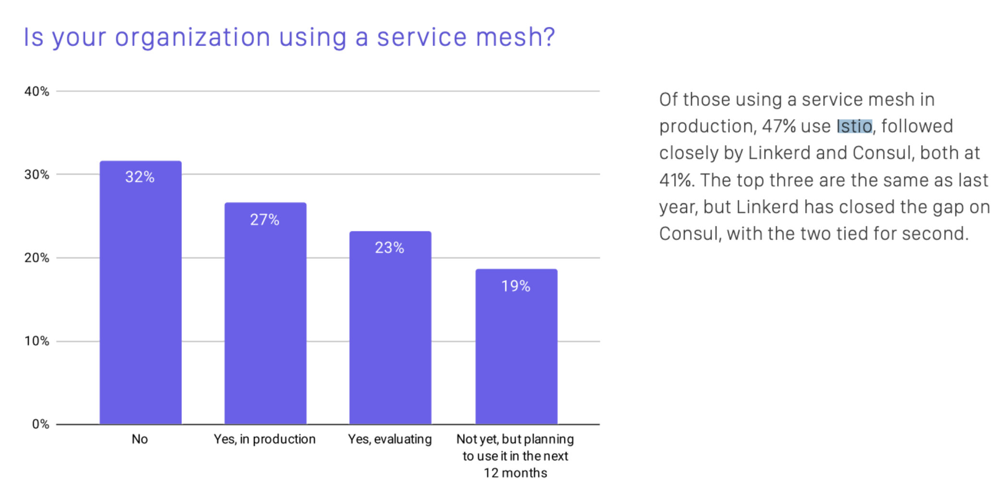

Istio was named by [Tetrate](https://tetrate.io/) founder Varun Talwar and Google lead engineer Louis Ryan in 2017 and was open sourced on May 24, 2017. Today is the fourth anniversary of Istio’s open source arrival. Let’s take a look back at Istio’s four years of development — and look forward to Istio’s future.

### Istio’s open source history

In 2017, the year Kubernetes ended the container orchestration battle, Google took the opportunity to consolidate its dominance in the cloud native space and compensate for Kubernetes’ disadvantage in service-to-service traffic management by open-sourcing Istio. Istio released its 1.10 last week — but here are some of the most important releases in Istio’s history to date. 

| **Date**          | **Version** | **Note**                                                     |
| ----------------- | ----------- | ------------------------------------------------------------ |
| May 24, 2017      | 0.1         | Officially open source; established the architectural foundation of Control Plane, Data Plane and sidecar proxy. |
| October 10, 2017  | 0.2         | Started to support multiple runtime environments, such as virtual machines. |
| June 1, 2018      | 0.8         | API refactoring                                              |
| July 31, 2018     | 1.0         | Production-ready, after which the Istio team underwent a massive reorganization. |
| March 19, 2019    | 1.1         | Enterprise-ready. Support for multiple Kubernetes clusters, with performance optimizations. |
| March 3, 2020     | 1.5         | Back to monolith, with microservice components merged into istiod, making Istio’s architecture cleaner and easier to maintain. Support for WebAssembly extension, making Istio’s ecology much stronger. |
| November 18, 2020 | 1.8         | Officially deprecated Mixer and focused on adding support for virtual machines. |

A year after its inception– and two months before the 1.0 release, version 0.8 was released with a massive refactoring of the API. In late July 2018, when 1.0 was released, Istio reached a production-ready tipping point. Since then, Google has massively reorganized the Istio team and several Istio-based service mesh startups were born, making 2018 the booming year of the service mesh industry.

Istio 1.1 was released in March 2019, almost 9 months after 1.0 was released, which is far beyond the average release cycle of an open-source project. We know that the speed of iteration and evolution is a core competency of basic software. Since then, Istio has started a regular [release cadence](https://istio.io/v1.7/about/release-cadence/) of one version per quarter and has become the [#4 fastest growing project in GitHub’s top 10 in 2019](https://octoverse.github.com/#fastest-growing-oss-projects-by-contributors)!

### The Istio community

In 2020, Istio’s project management began to mature and its governance reached a stage of evolution. We saw the first [election](https://istio.io/latest/blog/2020/steering-election-results/) of a steering committee for the Istio community and the transfer of the trademark to [Open Usage Commons](https://istio.io/latest/blog/2020/open-usage/). The first [IstioCon](https://events.istio.io/istiocon-2021/) was successfully held in February 2021, with thousands of people attending the online conference. There is also a [large Istio community in China](https://www.youtube.com/watch?v=6m-rhyfy8sg&list=PL7wB27eZmdffS-g_xh7X-b0echc_XZMKV&index=8), and face-to-face Istio community meetups will be held there in 2021. Stay tuned for more.

According to the CNCF 2020 Survey, 46% of organizations were either using a service mesh in production or planning to use it in the next 12 months. Istio was the top used mesh among those using a mesh in production.

### The future

After 4 years of development, there is not only a large user base around Istio, but also several Istio vendors, as you can see on the [homepage](https://istio.io/) of the recently revamped Istio website. In the last few releases, Istio has shifted its development focus to improving the Day 2 Operation experience. We also expect to see more Istio adoption path recommendations, case studies, learning materials, training, and certifications (such as the industry’s first [Certified Istio Administrator](https://academy.tetrate.io/courses/certified-istio-administrator) from Tetrate) that will facilitate the adoption of Istio.
