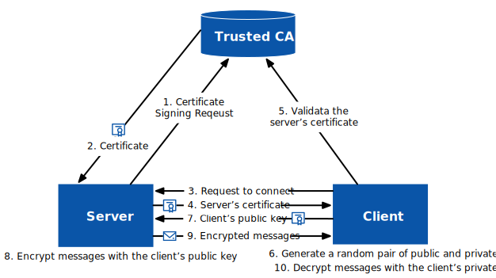
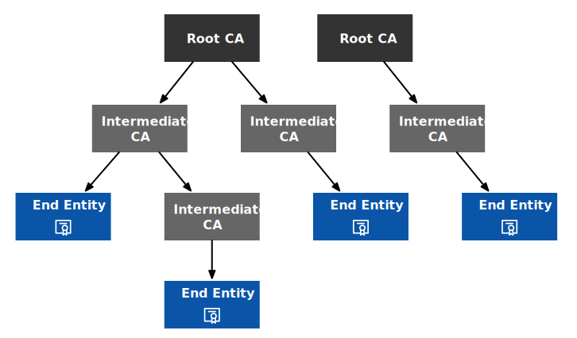
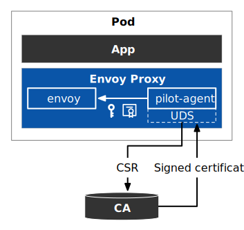

I mentioned in [my last article](/blog/understanding-the-tls-encryption-in-istio/) on understanding mTLS traffic encryption in Istio that the key to traffic encryption is certificate management. We can use the built-in certificate authority (CA) in Istio or a custom CA to manage certificates within the mesh. This blog post will explain how Istio handles certificate management.

## What Is a Certificate?

There are many types of certificates, but in this article, I am explicitly referring to [X.509 V3](https://www.rfc-editor.org/rfc/rfc5280) certificates. X.509 certificates are a standard digital format used to identify entities in computer networks. X.509 is the international standard for public key infrastructure (PKI) and is primarily used for identity authentication and information encryption, such as TLS.

The contents of a certificate are hashed using a hash function and then signed with the issuer’s private key. This way, when a certificate is received, the recipient can use the issuer’s public key to verify the certificate’s validity.

A hash function is a function that maps an input of any length (also called a message) to a fixed-length output, also called a *hash value* or *message digest*. There are many hash functions, such as MD5, SHA-1, etc.

A certificate is like a business card issued by an authoritative agency for the user to prove their identity, and it can also be used to encrypt information to ensure the security and integrity of communication. The following diagram shows the general steps of TLS communication, where the certificate proves the server’s identity and encrypts the communication.

Figure 1 shows an example of an HTTP call to a website, issuing a digital certificate, authenticating, and encrypting the communication.



Here are the detailed steps:

1. The server (website owner) submits a certificate signing request to the CA;
2. The CA verifies the server’s identity and the authenticity of the website and issues a digital certificate to the server, which the server installs so that visitors can verify the website’s security;
3. The user sends a request to the website through a browser (client);
4. The server returns the TLS certificate to the client;
5. The client verifies the certificate’s validity with the CA and establishes the connection if the certificate is valid, or prompts the user to reject the connection if it is invalid;
6. The client generates a pair of random public and private keys;
7. The client sends its public key to the server;
8. The server encrypts the message using the client’s public key;
9. The server sends the encrypted data to the client;
10. The client decrypts the data sent by the server using its private key.

At this point, both parties have established a secure channel and can transmit encrypted data in both directions.

## How to Generate Certificates

You can generate X.509 certificates with the following open-source tools:

- [Easy-RSA](https://github.com/OpenVPN/easy-rsa): A simple command-line tool maintained by the OpenVPN project, EasyRSA can easily generate secure certificates and keys for the OpenVPN network.
- [OpenSSL](https://github.com/openssl/openssl): Originated by an individual in 1995 and now maintained by an independent organization, OpenSSL provides only a command-line tool.
- [CFSSL](https://github.com/cloudflare/cfssl): Developed and maintained by CloudFlare, CFSSL is not just a command-line tool for generating certificates but also can serve as a PKI server.
- [BoringSSL](https://github.com/google/boringssl): A branch of OpenSSL developed and maintained by Google, BoringSSL is used in the Chrome browser and Android operating system.

Since most people are probably familiar with OpenSSL, we will use OpenSSL to create certificates in the following text.

## Certificate Trust Chain

The validation of a certificate requires using a certificate trust chain (Certificate Trust Chain). A certificate trust chain refers to a series of certificates used for identity verification, which form a chain starting from a trusted root certificate issuing agency, connecting downward step by step, until a specific intermediate or terminal certificate is used for verifying a particular certificate. The trustworthiness of a digital certificate increases as the certificate level increases in the certificate trust chain.

In Figure 2, you can see four trust chains.



Certificate trust chains are tree-like structures, where each CA can have one or more child CAs. There are three roles:

- **Root CA:** The top-level CA can issue certificates to intermediate CAs.
- **Intermediate CA:** They can issue end-entity certificates.
- **End entity:** A device or service that holds an end-entity certificate.

Root CAs are the top-level issuing authorities for digital certificates, so the certificates they issue are the most trustworthy. Root certificate authorities are usually operated and regulated by government agencies or other authoritative organizations such as the International Infrastructure Security Organization. Common root CAs include:

- Symantec/VeriSign
- Comodo
- DigiCert
- GlobalSign
- GoDaddy
- Entrust
- GeoTrust
- RapidSSL
- Baltimore CyberTrust Root

Please note that the above list is just a sample. There are many other root CAs.

When you open an HTTPS webpage in a Chrome browser, you can view the certificate information by clicking on the lock icon on the left side of the address bar, which includes the certificate trust chain, such as the certificate trust chain of [https://tetrate.io](https://tetrate.io/) shown in Figure 3.



The certificate trust chain allows the client (such as a web browser) to verify each certificate step by step when verifying the terminal certificate to determine whether it is trustworthy. The principle of digital certificate issuance is that the CA binds the certificate owner’s public key and identity information together. Then the CA uses its proprietary private key to generate a formal digital signature to indicate that the CA issued this certificate. The digital signature on the certificate can be verified using the CA’s public key during certificate verification.

## How to Incorporate Istio into the PKI Certificate Trust Chain

Before using Istio, enterprises usually have their own internal public key infrastructure . How can Istio be incorporated into the PKI certificate trust chain?

Istio has built-in certificate management functions that can be used out of the box. When Istio is started, it will create a self-signed certificate for *istiod* as the root certificate for all workloads in the mesh. The problem with this is that the built-in root certificate cannot achieve mutual trust between meshes if you have multiple meshes. The correct approach is not to use Istio’s self-signed certificate, but to incorporate Istio into your certificate trust chain and integrate Istio into your PKI, creating an intermediate certificate for each PKI mesh. In this way, two meshes have a shared trust root and can achieve mutual trust between meshes.

Integrate the Istio mesh into your internal PKI certificate trust chain by creating an intermediate CA, as shown in Figure 4.


There are many benefits to incorporating Istio into your company’s internal PKI certificate trust chain:

- **Secure communication across grids/clusters**: with a common trust root, clusters can verify each other’s identities and communicate with each other;
- **More granular certificate revocation:** you can revoke the certificate of an individual entity or intermediate CA to revoke the certificate for service or cluster;
- **Easy implementation of certificate rotation:** you can rotate certificates by cluster/mesh rather than rotating the root node certificate, which reduces downtime. It is recommended to use [cert-manager](https://github.com/cert-manager/cert-manager) to achieve automated large-scale CA certificate rotation in production. For more information, see [Automate Istio CA Rotation in Production at Scale](https://tetrate.io/blog/automate-istio-ca-rotation-in-production-at-scale/);

For detailed instructions on incorporating Istio into your company’s internal PKI certificate trust chain, see [this blog post](https://tetrate.io/blog/istio-trust/).

## Steps for Using a Custom CA in Istio

By default, the Istio CA generates a self-signed root certificate and key and uses them to sign workload certificates. To protect the root CA key, you should use a root CA that runs offline on a secure machine and the root CA to issue intermediate certificates to the Istio CA running on each cluster. The Istio CA can then use the administrator-specified certificate and key to sign workload certificates and distribute the administrator-specified root certificate as the trusted root to workloads.

Figure 5 shows the certificate issuance and mounting process in Istio.



1. In Istio, the Envoy proxy injects two processes into the Pod: *envoy* and *pilot-agent*. The *pilot-agent* generates a private key and uses the Secret Discovery Service (SDS) via a Unix Domain Socket (UDS) to request a certificate signing request (CSR) from the Certificate Authority (CA) through the *istiod*, if you have not configured the CA plugin.
2. *istiod*, which has a built-in CA, returns the certificate to the *pilot-agent*.
3. The *pilot-agent* then sends the generated private key and the CA-returned certificate to the Envoy instance to mount.

Istio defaults to using the CA built into *istiod*, but also supports injecting other CAs, see the [Istio documentation](https://istio.io/latest/docs/tasks/security/cert-management/plugin-ca-cert/). Suppose you want to create identities for your services using custom CA certificates and keys. In that case, you will need to:

- Create a CA configuration file and use it to create self-signed CA root certificates and keys.
- Create a private key and signing request configuration files for the service.
- Create a certificate signing request (CSR) for the service.
- Use the root certificate and key, along with the service’s signing request file, to create a certificate for the service.

Next, we will detail the process of creating and mounting a certificate for the Bookinfo *productpage* service using Istio’s built-in CA as an example.

## Process for Istio’s Built-in CA to Issue a Certificate

When Istio starts, it creates a self-signed CA certificate, which it then uses to issue certificates to services within the mesh. Below, we will manually simulate the steps for Istio’s built-in CA to issue a certificate:

**Step 1:** Create a CA private key **ca.key**:

```bash
openssl genrsa -out ca.key
```

**Step 2:** Create a CA configuration file **ca.conf**:

```ini
[ req ]
default_bits = 2048
prompt = no
utf8 = yes
encrypt_key = no
distinguished_name  = req_dn
req_extensions = req_ext
x509_extensions = req_ext

[ req_dn ]
O = Istio
CN = Root CA

[ req_ext ]
subjectKeyIdentifier = hash
basicConstraints = critical, CA:true
keyUsage = critical, digitalSignature, nonRepudiation, keyEncipherment, keyCertSign
```

**Step 3:** Use the CA private key **ca.key** to generate a self-signed certificate **ca.pem**, which contains the CA’s information in the subject:

```bash
openssl req -x509 -new -nodes -key ca.key -days 365 -out ca.pem -config ca.conf
```

**Step 4:** Create the workload’s private key **workload.key**:

```bash
openssl genrsa -out workload.key
```

**Step 5:** Create a certificate signing request configuration file **csr.conf**, which contains the address of the CA and additional information:

```ini
[ req ]
default_bits = 2048
prompt = no
utf8 = yes
encrypt_key = no
distinguished_name  = dn
req_extensions = req_ext
x509_extensions = req_ext

[ req_dn ]
O = Istio
CN = productpage

[ req_ext ]
subjectKeyIdentifier = hash
basicConstraints = critical, CA:true
keyUsage = critical, digitalSignature, nonRepudiation, keyEncipherment, keyCertSign
```

**Step 6:** Create a certificate signing request **workload.csr** based on the workload’s CSR configuration file **csr.conf** and the workload’s private key file **workload.key**:

```bash
openssl req -new -key workload.key -out workload.csr -config csr.conf
```

**Step 7:** Create certificate **workload.pem** based on CA’s private key **ca.key**, CA’s certificate **ca.pem** and workload’s certificate signing request:

```bash
openssl x509 -req -in workload.csr -CA ca.pem -CAkey ca.key \
    -CAcreateserial -out workload.pem -days 365 \
    -extensions req_ext -extfile csr.conf -sha256
```

**Step 8:** View the certificate chain mounted by the Envoy proxy in the workload:

```bash
istioctl proxy-config secret deployment/productpage-v1 -o json | jq -r \
'.dynamicActiveSecrets[0].secret.tlsCertificate.certificateChain.inlineBytes' | base64 --decode > chain.pem
```

The **chain.pem** file holds the certificate chain for the *productpage* service. Because we use the Istio built-in CA as the root CA, only one certificate is stored in this file, which can be viewed by running the following command:

```bash
openssl x509 -noout -text -in chain.pem
```

**Step 9:** View the root certificate mounted by the Envoy proxy:

```bash
istioctl proxy-config secret deployment/productpage-v1 -o json | jq -r \
'.dynamicActiveSecrets[1].secret.validationContext.trustedCa.inlineBytes' | base64 --decode > root.pem
```

**root.pem** is the root certificate, run the following command to view:

```bash
openssl x509 -noout -text -in root.pem
```

After the certificate is mounted to the Envoy proxy, *istiod* will take care of periodically replacing the key certificate and revoking the key certificate as needed.

## Summary

This article introduces you to the function of digital certificates and the trust chain, and how the built-in, out-of-the-box certificate manager operates in Istio. However, the built-in CA in Istio still has certain limitations. In the next blog, I will introduce how to use the SPIRE and cert-manager plugins to achieve fine-grained certificate management and automatic certificate rotation.

---

If you’re new to service mesh and Kubernetes security, we have a bunch of free online courses [available at Tetrate Academy](https://tetr8.io/academy) that will quickly get you up to speed with Istio and Envoy.

If you’re looking for a fast way to get to production with Istio, check out [Tetrate Istio Distribution (TID)](https://tetr8.io/tid). TID is Tetrate’s hardened, fully upstream Istio distribution, with FIPS-verified builds and support available. It’s a great way to get started with Istio knowing you have a trusted distribution to begin with, have an expert team supporting you, and also have the option to get to FIPS compliance quickly if you need to.Once you have Istio up and running, you will probably need simpler ways to manage and secure your services beyond what’s available in Istio, that’s where Tetrate Service Bridge comes in. You can learn more about how Tetrate Service Bridge makes service mesh more secure, manageable, and resilient [here](https://tetr8.io/tsb), or [contact us for a quick demo](https://tetr8.io/contact).

*This blog was originally published at [tetrate.io](https://tetrate.io/blog/how-are-certificates-managed-in-istio/).*
