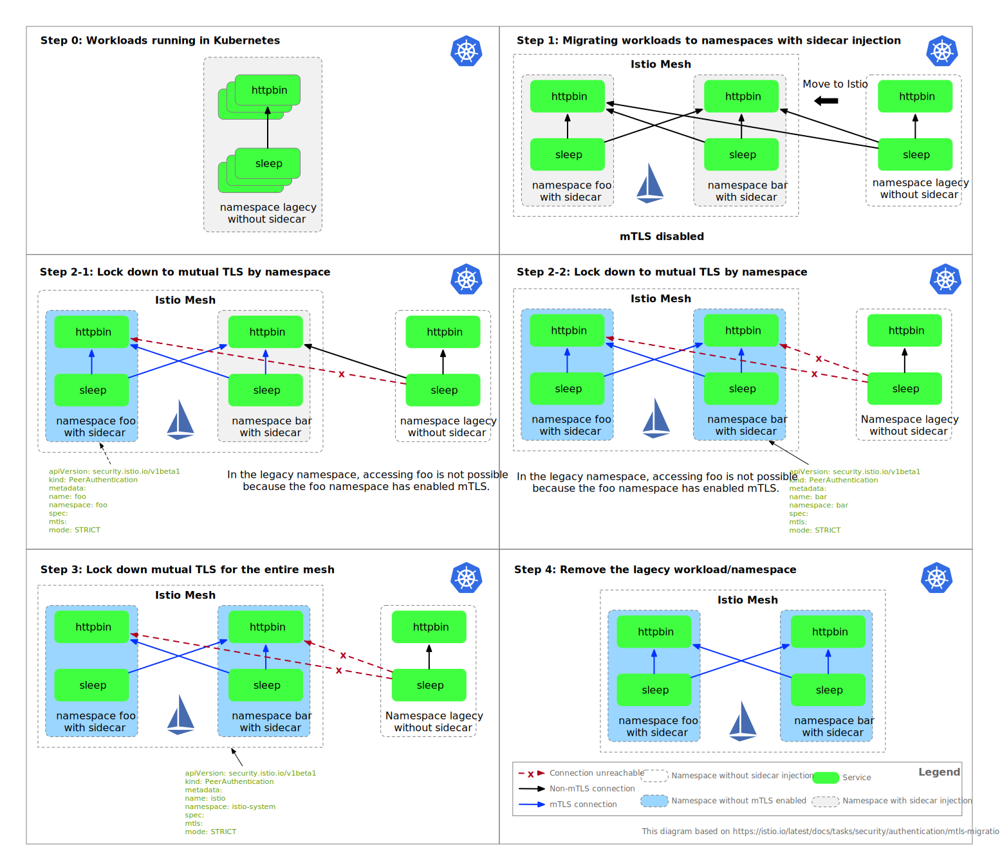
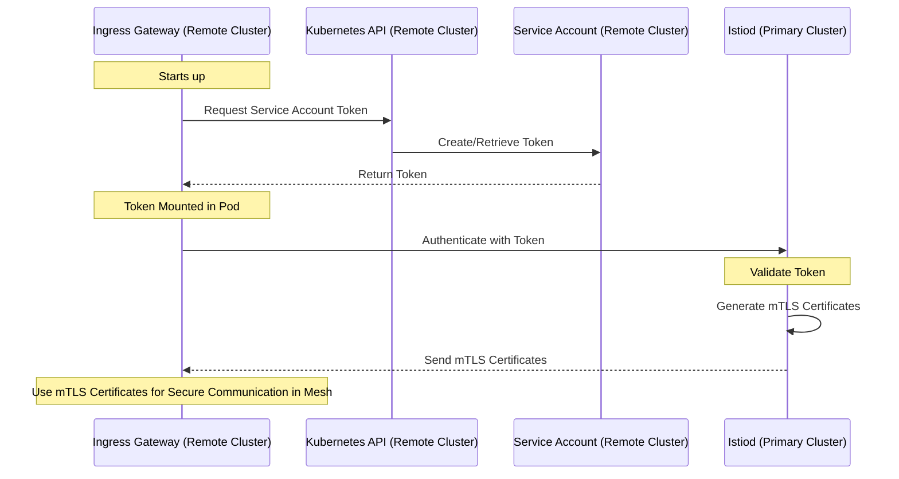

Welcome to this week's edition of the Istio Community Weekly Report! As we approach the year's end, we're excited to share some updates and insights in the Istio community. From monthly community meetings to pro tips on using Istio effectively, this report is packed with valuable information for everyone, whether you're a seasoned Istio user or just getting started.

## Community Updates

### Join the Monthly Istio Community Meetings

Be part of the Istio monthly community meetings to engage and connect with other enthusiasts.

- **When**: Every fourth Thursday of the month, 10 AM US/Pacific. [Check your local time](https://time.is/compare/1000_in_San_Francisco,_California).

### Stay Connected
- **Calendar Updates**: Automatically add meetings to your calendar by joining [this group](https://groups.google.com/forum/#!forum/istio-community-video-meetings).
- **Meeting Details**: Find agendas and notes in our [working document](http://bit.ly/istiocommunitymeet).
- **Recorded Sessions**: Missed a meeting? Catch up on [YouTube](https://www.youtube.com/channel/UC-zVlo1F3mUbExQ96fABWcQ).

### Present at the Meeting

Share your insights! Submit your talk abstract to [istio-steering@googlegroups.com](mailto:istio-steering@googlegroups.com). Presentation guidelines and more details can be found [here](http://bit.ly/istiocommunitymeet) and [here](https://github.com/istio/community/tree/master?tab=readme-ov-file#community-meeting).

## Istio Pro Tips

### Regex in VirtualService Routing
When using regex for header-based routing in **`VirtualService`**, it's crucial to use Envoy's [RE2 regex](https://github.com/google/re2/wiki/Syntax) format. For example:

- Match "Google": **`regex: ".\*Google.\*"`**
- Match "Microsoft": **`regex: ".\*Microsoft.\*"`**

This **`.\*<string>.\*`** pattern is essential for correct matching in Envoy. Remember, PCRE formats aren't compatible with Istio.

- **Key Point**: Use the RE2 regex that is compatible with Envoy for precise routing. Discussion details are available on [GitHub](https://github.com/istio/istio/discussions/48405).

### Zero Downtime Migration to Mutual TLS

The following diagrams illustrate the zero-downtime migration process to mutual TLS and how the remote IngressGateway and Istiod establish mTLS in a primary-remote multi-cluster deployment.

TLS Migration Process:

Sequence Chart of mTLS Establishment:

For more information, visit the [GitHub discussion](https://github.com/istio/istio/discussions/48343).

---

As the festive season approaches, we wish all members of the Istio community a very Merry Christmas! May this season bring joy, peace, and new opportunities for innovation and collaboration. Happy Holidays!