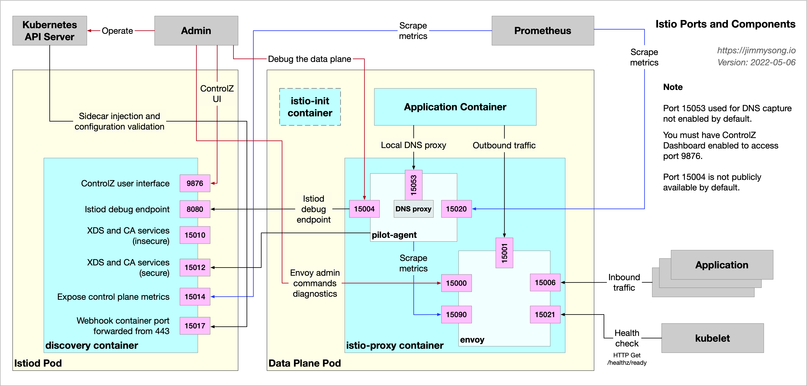
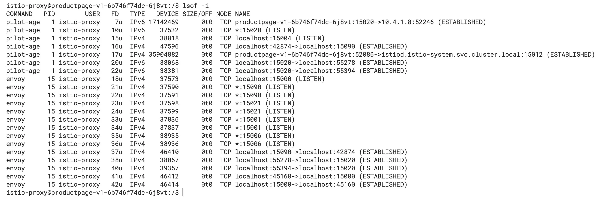
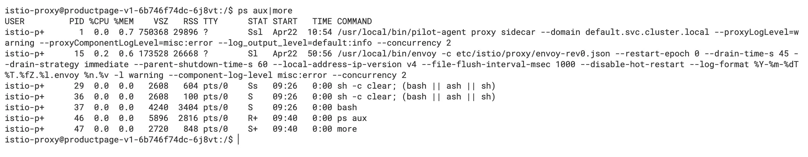
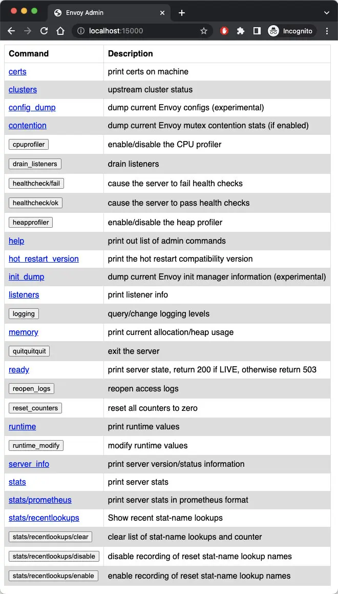

In my last two blogs:

- [Sidecar injection, transparent traffic hijacking , and routing process in Istio explained in detail](/en/blog/sidecar-injection-iptables-and-traffic-routing/)
- [Traffic types and iptables rules in Istio sidecar explained](/en/blog/istio-sidecar-traffic-types/)

I gave you a detailed overview of the traffic in the Istio data plane, but the data plane does not exist in isolation. This article will show you the ports and their usages for each component of both the control plane and data plane in Istio, which will help you understand the relationship between these flows and troubleshoot them.

## Overview

Firstly, I will show you a global schematic. The following figure shows the components of a sidecar in the Istio data plane, and the objects that interact with it.



We can use the `nsenter` command to enter the namespace of the `productpage` Pod of the Bookinfo example and see the information about the ports it is listening on internally.


From the figure, we can see that besides the port 9080 that the `productpage` application listens to, the Sidecar container also listens to a large number of other ports, such as 15000, 15001, 15004, 15006, 15021, 15090, etc. You can learn about the ports used in Istio in the [Istio documentation](https://istio.io/latest/docs/ops/deployment/requirements/).

Let's go back into the `productpage` Pod and use the `lsof -i` command to see the ports it has open, as shown in the following figure.



We can see that there is a TCP connection established between the `pilot-agent` and `istiod`, the port in the listening described above, and the TCP connection established inside the Pod, which corresponds to the figure at the beginning of the article.

The root process of the Sidecar container (`istio-proxy`) is `pilot-agent`, and the startup command is shown below.



As we can see from the figure, the PID of its `pilot-agent` process is 1, and it forked the Envoy process.

Check the ports it opens in Istiod, as shown in the figure below.


We can see the ports that are listened to, the inter-process and remote communication connections.

## Ports usage overview

These ports can play a pivotal role when you are troubleshooting. They are described below according to the component and function in which the port is located.

### Ports in Istiod

The ports in Istiod are relatively few and single-function.

- 9876: ControlZ user interface, exposing information about Istiod's processes
- 8080: Istiod debugging port, through which the configuration and status information of the grid can be queried
- 15010: Exposes the xDS API and issues plain text certificates
- 15012: Same functionality as port 15010, but uses TLS communication
- 15014: Exposes control plane metrics to Prometheus
- 15017: Sidecar injection and configuration validation port

## Ports in sidecar

From the above, we see that there are numerous ports in the sidecar.

- 15000: Envoy admin interface, which you can use to query and modify the configuration of Envoy Proxy. Please refer to[ Envoy documentation](https://www.envoyproxy.io/docs/envoy/latest/operations/admin) for details.
- 15001: Used to handle outbound traffic.
- 15004: Debug port (explained further below).
- 15006: Used to handle inbound traffic.
- 15020: Summarizes statistics, perform health checks on Envoy and DNS agents, and debugs `pilot-agent` processes, as explained in detail below.
- 15021: Used for sidecar health checks to determine if the injected Pod is ready to receive traffic. We set up the readiness probe on the `/healthz/ready` path on this port, and Istio hands off the sidecar readiness checks to kubelet.
- 15053: Local DNS proxy for scenarios where the cluster's internal domain names are not resolved by Kubernetes DNS.
- 15090: Envoy Prometheus query port, through which the `pilot-agent` will scratch metrics.

The above ports can be divided into the following categories.

- Responsible for inter-process communication, such as 15001, 15006, 15053
- Health check and information statistics, e.g. 150021, 15090
- Debugging: 15000, 15004

Let's look at the key ports in detail.

## 15000

15000 is Envoy's Admin interface, which allows us to modify Envoy and get a view and query metrics and configurations.

The Admin interface consists of a REST API with multiple endpoints and a simple user interface. You can enable the Envoy Admin interface view in the `productpage` Pod using the following command:

```bash
kubectl -n default port-forward deploy/productpage-v1 15000
```

Visit `http://localhost:15000` in your browser and you will see the Envoy Admin interface as shown below.



## 15004

With the `pilot-agent` proxy `istiod` debug endpoint on port 8080, you can access localhost's port 15004 in the data plane Pod to query the grid information, which has the same effect as port 8080 below.

## 8080

You can also forward `istiod` port 8080 locally by running the following command:

```bash
kubectl -n istio-system port-forward deploy/istiod 8080
```

Visit `http://localhost:8080/debug` in your browser and you will see the debug endpoint as shown in the figure below.


Of course, this is only one way to get the mesh information and debug the mesh, you can also use `istioctl` command or Kiali to debug it, which will be more efficient and intuitive.

## 15020

Port 15020 has three main usages.

1. Aggregating metrics: You can query port 15090 for Envoy's metrics, or you can configure it to query the application's metrics, aggregating Envoy, application, and its own metrics for Prometheus to collect. The corresponding debug endpoint is `/stats/prometheus`. 
2. Performing health checks on Envoy and DNS agent: the corresponding debug endpoints are `/healthz/ready` and `/app-health`.
3. Debugging `pilot-agent` processes: the corresponding debug endpoints are `/quitquitquit`, `debug/ndsz` and `/debug/pprof`.

The following figure shows the debugging information you see when you open `http://localhost:15020/debug/pprof` in your browser.


The information in the figure shows the stack information of the `pilot-agent`.

## Summary

By understanding the component ports in Istio, you should have a better understanding of the relationship between the components in Istio and their internal traffic. Being familiar with the functions of these ports will help in troubleshooting the mesh.
