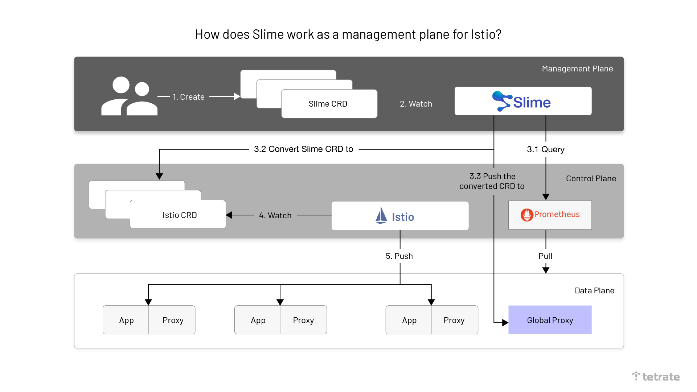
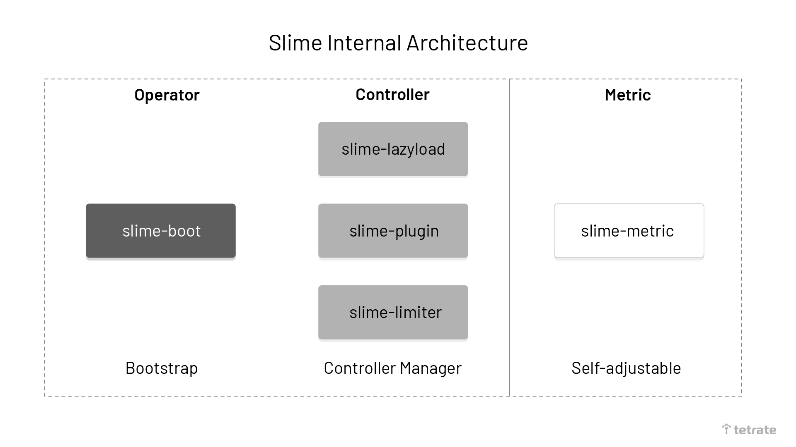
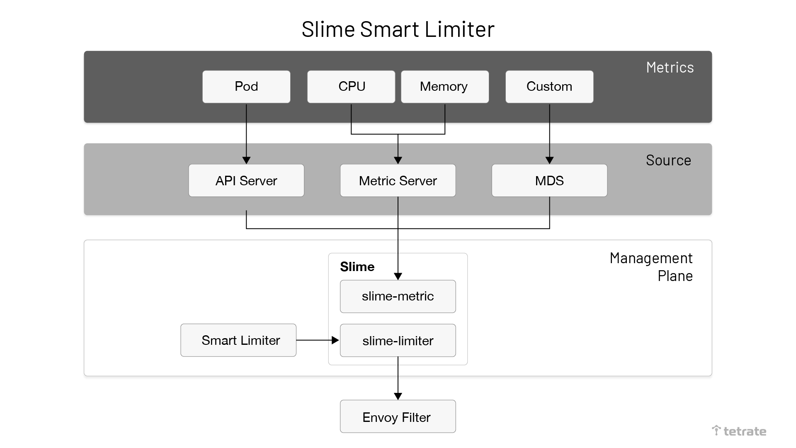
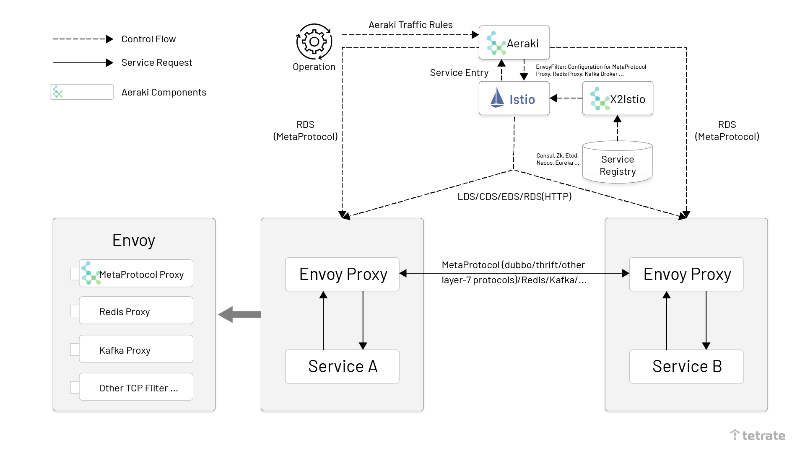
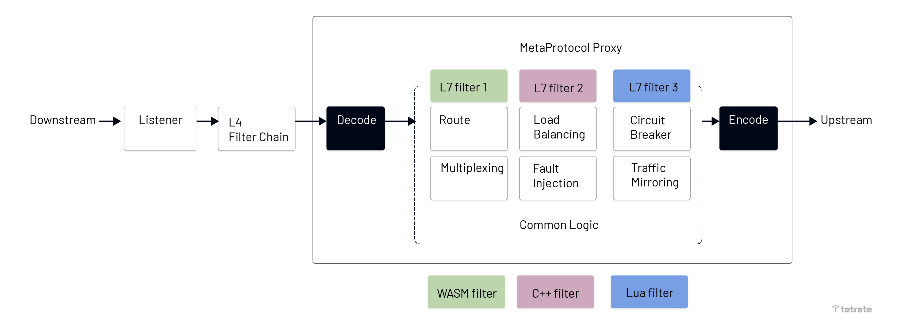

It’s been more than [four years](https://www.tetrate.io/blog/happy-istio-4th-anniversary-retrospect-and-outlook/) since Istio launched in May 2017, and while the project has had a strong following on GitHub and 10+ releases, its growing open-source ecosystem is still in its infancy. 

Recently added support for [WebAssembly extensions](https://www.tetrate.io/blog/istio-wasm-extensions-and-ecosystem/) has made the most popular open source service mesh more extensible than ever. This table lists the open-source projects in the Istio ecosystem as of November 11, 2021, sorted by open-source date. These projects enhance the Istio service mesh with gateways, extensions, utilities, and more. In this article, I’ll highlight the two new projects in the category of extensions.

| **Project**                                                  | **Value**                                                    | **Relationship with Istio**                                  | **Category** | **Launch Date** | **Dominant company** | **Number of stars** |
| ------------------------------------------------------------ | ------------------------------------------------------------ | ------------------------------------------------------------ | ------------ | --------------- | -------------------- | ------------------- |
| [Envoy](https://github.com/envoyproxy/envoy)                 | Cloud native high-performance edge/middle-service proxy      | The default data plane                                       | proxy        | September 2016  | Lyft                 | 18700               |
| [Istio](https://github.com/istio/istio/)                     | Connection, secure, control, and observation services.       | Control plane                                                | service mesh | May 2017        | Google               | 29100               |
| [Emissary Gateway](https://github.com/emissary-ingress/emissary) | Kubernetes native API gateway for microservices, built on Envoy | Connectable to Istio                                         | gateway      | February 2018   | Ambassador           | 3600                |
| [APISIX](https://github.com/apache/apisix)                   | Cloud native API gateways                                    | It can run as a data plane for Istio or as a gateway on its own | gateway      | June 2019       | API7                 | 8100                |
| [MOSN](https://github.com/mosn/mosn)                         | Cloud native edge gateways & agents                          | Available as Istio data plane                                | proxy        | December 2019   | Ant                  | 3500                |
| [Slime](https://github.com/slime-io/slime)                   | Intelligent service mesh manager based on Istio              | Adding a management plane to Istio                           | extensions   | January 2021    | NetEase              | 236                 |
| [GetMesh](https://github.com/tetratelabs/getmesh)            | Istio integration and command-line management tools          | Utility for Istio multi-version management                   | tools        | February 2021   | Tetrate              | 95                  |
| [Aeraki](https://github.com/aeraki-framework/aeraki)         | Manage any of Istio’s seven layers of load                   | Extended multi-protocol support                              | extensions   | March 2021      | Tencent              | 330                 |
| [Layotto](https://github.com/mosn/layotto/)                  | Cloud native application runtime                             | Using as a data plane for Istio                              | runtime      | June 2021       | Ant                  | 393                 |
| [Hango Gateway](https://github.com/hango-io/hango-gateway)   | API gateways built on Envoy and Istio                        | Integrates with Istio                                        | gateway      | August 2021     | NetEase              | 253                 |

### **Slime: an intelligent service mesh manager for Istio**

[Slime](https://github.com/slime-io/slime) is an Istio-based, intelligent mesh manager open-sourced by NetEase’s microservices team. Based on the Kubernetes Operator implementation, Slime can be used as a CRD manager that seamlessly interfaces with Istio without needing any customization or definition of dynamic service governance policies. This achieves automatic and convenient use of Istio and Envoy’s advanced features.

Slime addresses the following issues:

- Implementing higher-level extensions in Istio. For example, extending the HTTP plugin; adaptive traffic limiting based on the resource usage of the service.
- Poor performance arising from Istio sending all the configurations within the mesh to each sidecar proxy.

Slime solves these problems by building an Istio management plane. Its main purpose are

- to build a pluggable controller to facilitate the extension of new functions.
- to obtain data by listening to the data plane to intelligently generate the configuration for Istio.
- to build a higher-level CRD for the user to configure, which Slime converts into an Istio configuration.

The following diagram shows the flow chart of Istio as an Istio management plane.



The specific steps for Slime to manage Istio are as follows.

1. Slime operator completes the initialization of Slime components in Kubernetes based on the administrator’s configuration.
2. Developers create configurations that conform to the Slime CRD specification and apply them to Kubernetes clusters.
3. Slime queries the monitoring data of the relevant service stored in Prometheus and converts the Slime CRD into an Istio CRD, in conjunction with the configuration of the adaptive part of the Slime CRD while pushing it to the Global Proxy.
4. Istio listens for the creation of Istio CRDs.
5. Istio pushes the configuration information of the Sidecar Proxy to the corresponding Sidecar Proxy in the data plane.

The diagram below shows the internal architecture of Slime.



We can divide Slime internally into three main components.

- **slime-boot**: operator for deploying Slime modules on Kubernetes.
- **slime-controller**: the core component of Slime that listens to the Slime CRD and converts it to an Istio CRD.
- **slime-metric**: the component used to obtain service metrics information. slime-controller dynamically adjusts service governance rules based on the information it receives.

The following diagram shows the architecture of Slime Adaptive Traffic Limiting.


Slime dynamically configures traffic limits by interfacing with the Prometheus metric server to obtain real-time monitoring.

Slime’s adaptive traffic limitation process has two parts: one that converts SmartLimiter to[ EnvoyFilter](https://istio.io/latest/docs/reference/config/networking/envoy-filter/) and the other that monitors the data. Slime also provides an external monitoring data interface (Metric Discovery Server) that allows you to sync custom monitoring metrics to the traffic limiting component via MDS.

The CRD SmartLimiter created by Slime is used to configure adaptive traffic limiting. Its configuration is close to natural semantics, e.g., if you want to trigger an access limit for Service A with a limit of 30QPS when the CPU exceeds 80%, the corresponding SmartLimiter is defined as follows.

```yaml
apiVersion: microservice.netease.com/v1alpha1
kind: SmartLimiter
metadata:
  name: a
  namespace: default
spec:
  descriptors:
  -  action:
       fill_interval:
         seconds: 1
         quota: "30/{pod}" # 30 is the quota for this service. If there are three pods, the limit is 10 per pod.
       condition: "{cpu}>0.8" # Auto-fill the template based on the value of the monitor {cpu}
```

### **Aeraki: A Non-Invasive Istio Extension Toolset**

[Aeraki](https://github.com/aeraki-framework/aeraki) is a service mesh project open sourced by Tencent Cloud in March 2021. Aeraki provides an end-to-end cloud-native service mesh protocol extension solution that provides Istio with powerful third-party protocol extension capabilities in a non-intrusive way, supporting traffic management for Dubbo, Thrift, Redis, and private protocols in Istio. Aeraki’s architecture is shown in the following diagram.



Aeraki architecture, source [Istio blog](https://istio.io/latest/blog/2021/aeraki/).

As seen in the Aeraki architecture diagram, the Aeraki protocol extension solution consists of two components.

- **Aeraki**: Aeraki runs as an Istio enhancement component on the control plane, providing user-friendly traffic rule configurations to operations via CRDs. Aeraki translates these traffic rule configurations into Envoy configurations distributed via Istio to sidecar proxies on the data plane. Aeraki also acts as an RDS server providing dynamic routing to the MetaProtocol Proxy on the data plane. The RDS provided by Aeraki differs from Envoy’s RDS in that Envoy RDS primarily offers dynamic routing for the HTTP protocol, while Aeraki RDS is designed to provide dynamic routing capabilities for all L7 protocols developed on the MetaProtocol framework.
- **MetaProtocol Proxy**: A generic L7 protocol proxy based on Envoy implementation. MetaProtocol Proxy is an extension of Envoy. It unifies the basic capabilities of service discovery, load balancing, RDS dynamic routing, traffic mirroring, fault injection, local/global traffic limiting, etc. for L7 protocols, which greatly reduces the difficulty of developing third-party protocols on Envoy and allows you to quickly create a third-party protocol plug-in based on MetaProtocol by only implementing the codec interface.

Before the introduction of MetaProtocol Proxy, if you wanted to use Envoy to implement an L7 protocol to implement routing, traffic limiting, telemetry, etc., you needed to write a complete TCP filter, which would have required a lot of work. For most L7 protocols, the required traffic management capabilities are similar, so there is no need to duplicate this work in each L7 filter implementation. The Aeraki project uses a MetaProtocol Proxy to implement these unified capabilities, as shown in the following figure.



MetaProtocol proxy, source [Istio blog](https://istio.io/latest/blog/2021/aeraki/).

Based on MetaProtocol Proxy, we only need to implement the codec interface part of the code to write a new L7 protocol Envoy Filter. In addition, without adding a single line of code, Aeraki can provide configuration distribution and RDS dynamic routing configuration for this L7 protocol at the control plane.

### **Make Istio work for all environments and workloads**

We have seen that NetEase and Tencent are scaling Istio mainly by building Operator. However, this scaling is not enough for multi-cluster management. We know that much of our current infrastructure is transitioning to cloud native or containerized, which means containers, virtual machines, and other environments co-exist. How do we unify traffic management of these different environments? It is possible to do so using Istio.

You have to again build a management plane on top of Istio and add an abstraction layer to add CRDs that apply to cluster management, such as cluster traffic configuration, policy configuration, etc. Additionally, you have to deploy a Gateway in each cluster that connects uniformly to an edge proxy that interconnects all the groups. 

To learn more about Tetrate Service Bridge (TSB), which provides this layer of infrastructure, you can go [here](https://www.tetrate.io/tetrate-service-bridge/). TSB is built on the open source Istio with enhancements, it follows the concept of the above two open source projects, and also builds a management plane to support heterogeneous environments.

As we can see, the Istio-based projects and the open source environment are booming and companies like Tetrate are doing useful jobs of productizing and making Istio available to all workloads.

