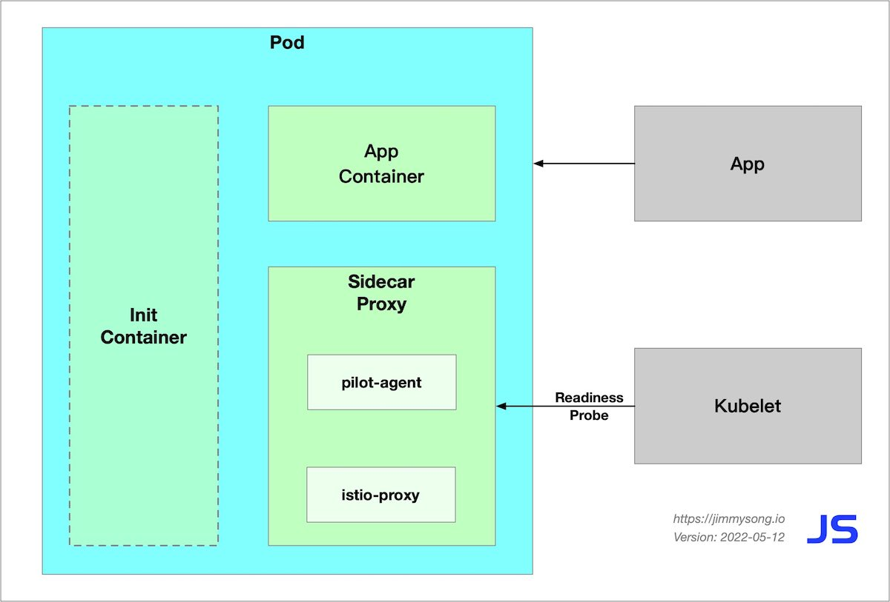

This article will explain:

- The sidecar auto-injection process in Istio
- The init container startup process in Istio
- The startup process of a Pod with Sidecar auto-injection enabled

The following figure shows the components of a Pod in the Istio data plane after it has been started.



## Sidecar injection in Istio

The following two sidecar injection methods are available in Istio.

- Manual injection using `istioctl`.
- Kubernetes-based [mutating webhook admission controller](https://kubernetes.io/docs/reference/access-authn-authz/admission-controllers/) automatic sidecar injection method.

Whether injected manually or automatically, SIDECAR's injection process follows the following steps.

1. Kubernetes needs to know the Istio cluster to which the sidecar to be injected is connected and its configuration.
2. Kubernetes needs to know the configuration of the sidecar container itself to be injected, such as the image address, boot parameters, etc.
3. Kubernetes injects the above configuration into the side of the application container by the sidecar injection template and the configuration parameters of the above configuration-filled sidecar.

The sidecar can be injected manually using the following command.

```bash
istioctl kube-inject -f ${YAML_FILE} | kuebectl apply -f -
```

This command is injected using Istio's built-in sidecar configuration, see the [Istio official website](https://istio.io) for details on how to use Istio below.

When the injection is complete you will see that Istio has injected initContainer and sidecar proxy-related configurations into the original pod template.

### Init container

The Init container is a dedicated container that runs before the application container is launched and is used to contain some utilities or installation scripts that do not exist in the application image.

Multiple Init containers can be specified in a Pod, and if more than one is specified, the Init containers will run sequentially. The next Init container can only be run if the previous Init container must run successfully. Kubernetes only initializes the Pod and runs the application container when all the Init containers have been run.

The Init container uses Linux Namespace, so it has a different view of the file system than the application container. As a result, they can have access to Secret in a way that application containers cannot.

During Pod startup, the Init container starts sequentially after the network and data volumes are initialized. Each container must be successfully exited before the next container can be started. If exiting due to an error will result in a container startup failure, it will retry according to the policy specified in the Pod's restartPolicy. However, if the Pod's restartPolicy is set to Always, the restartPolicy is used when the Init container failed.

The Pod will not become Ready until all Init containers are successful. The ports of the Init containers will not be aggregated in the Service. The Pod that is being initialized is in the Pending state but should set the Initializing state to true. The Init container will automatically terminate once it is run.

## Sidecar injection example analysis

For a detailed YAML configuration for the bookinfo applications, see `bookinfo.yaml` for the official Istio YAML of productpage in the bookinfo sample.

The following will be explained in the following terms.

- Injection of Sidecar containers
- Creation of iptables rules
- The detailed process of routing

```yaml
apiVersion: apps/v1
kind: Deployment
metadata:
  name: productpage-v1
  labels:
    app: productpage
    version: v1
spec:
  replicas: 1
  selector:
    matchLabels:
      app: productpage
      version: v1
  template:
    metadata:
      labels:
        app: productpage
        version: v1
    spec:
      serviceAccountName: bookinfo-productpage
      containers:
      - name: productpage
        image: docker.io/istio/examples-bookinfo-productpage-v1:1.15.0
        imagePullPolicy: IfNotPresent
        ports:
        - containerPort: 9080
        volumeMounts:
        - name: tmp
          mountPath: /tmp
      volumes:
      - name: tmp
        emptyDir: {}
```

Let's see the `productpage` container’s [Dockerfile](https://github.com/istio/istio/blob/master/samples/bookinfo/src/productpage/Dockerfile).

```docker
FROM python:3.7.4-slim

COPY requirements.txt ./
RUN pip install --no-cache-dir -r requirements.txt

COPY test-requirements.txt ./
RUN pip install --no-cache-dir -r test-requirements.txt

COPY productpage.py /opt/microservices/
COPY tests/unit/* /opt/microservices/
COPY templates /opt/microservices/templates
COPY static /opt/microservices/static
COPY requirements.txt /opt/microservices/

ARG flood_factor
ENV FLOOD_FACTOR ${flood_factor:-0}

EXPOSE 9080
WORKDIR /opt/microservices
RUN python -m unittest discover

USER 1

CMD ["python", "productpage.py", "9080"]
```

We see that `ENTRYPOINT` is not configured in Dockerfile, so `CMD`’s configuration `python productpage.py 9080` will be the default `ENTRYPOINT`, keep that in mind and look at the configuration after the sidecar injection.

```bash
$ istioctl kube-inject -f samples/bookinfo/platform/kube/bookinfo.yaml
```

We intercept only a portion of the YAML configuration that is part of the Deployment configuration associated with productpage.

```yaml
      containers:
      - image: docker.io/istio/examples-bookinfo-productpage-v1:1.15.0 # application image
        name: productpage
        ports:
        - containerPort: 9080
      - args:
        - proxy
        - sidecar
        - --domain
        - $(POD_NAMESPACE).svc.cluster.local
        - --configPath
        - /etc/istio/proxy
        - --binaryPath
        - /usr/local/bin/envoy
        - --serviceCluster
        - productpage.$(POD_NAMESPACE)
        - --drainDuration
        - 45s
        - --parentShutdownDuration
        - 1m0s
        - --discoveryAddress
        - istiod.istio-system.svc:15012
        - --zipkinAddress
        - zipkin.istio-system:9411
        - --proxyLogLevel=warning
        - --proxyComponentLogLevel=misc:error
        - --connectTimeout
        - 10s
        - --proxyAdminPort
        - "15000"
        - --concurrency
        - "2"
        - --controlPlaneAuthPolicy
        - NONE
        - --dnsRefreshRate
        - 300s
        - --statusPort
        - "15020"
        - --trust-domain=cluster.local
        - --controlPlaneBootstrap=false
        image: docker.io/istio/proxyv2:1.5.1 # sidecar proxy
        name: istio-proxy
        ports:
        - containerPort: 15090
          name: http-envoy-prom
          protocol: TCP
      initContainers:
      - command:
        - istio-iptables
        - -p
        - "15001"
        - -z
        - "15006"
        - -u
        - "1337"
        - -m
        - REDIRECT
        - -i
        - '*'
        - -x
        - ""
        - -b
        - '*'
        - -d
        - 15090,15020
        image: docker.io/istio/proxyv2:1.5.1 # init container
        name: istio-init
```

Istio's configuration for application Pod injection mainly includes:

- Init container `istio-init`: for setting iptables port forwarding in the pod
- Sidecar container `istio-proxy`: running a sidecar proxy, such as Envoy or MOSN

The two containers will be parsed separately.

## Init container analysis

The Init container that Istio injects into the pod is named `istio-init`, and we see in the YAML file above after Istio's injection is complete that the init command for this container is.

```bash
istio-iptables -p 15001 -z 15006 -u 1337 -m REDIRECT -i '*' -x "" -b '*' -d 15090,15020
```

Let's check the container's Dockerfile again to see how `ENTRYPOINT` determines what commands are executed at startup.

```docker
# ommit
# The pilot-agent will bootstrap Envoy.
ENTRYPOINT ["/usr/local/bin/pilot-agent"]
```

We see that the entrypoint of the `istio-init` container is the `/usr/local/bin/istio-iptables` command line, and the location of the code for this command-line tool is in the `tools/istio-iptables` directory of the Istio source code repository.

### Init container initiation

The Init container's entrypoint is the `istio-iptables` command line, which is used as follows.

```bash
Usage:
  istio-iptables [flags]

Flags:
  -n, --dry-run                                     Do not call any external dependencies like iptables
  -p, --envoy-port string                           Specify the envoy port to which redirect all TCP traffic (default $ENVOY_PORT = 15001)
  -h, --help                                        help for istio-iptables
  -z, --inbound-capture-port string                 Port to which all inbound TCP traffic to the pod/VM should be redirected to (default $INBOUND_CAPTURE_PORT = 15006)
      --iptables-probe-port string                  set listen port for failure detection (default "15002")
  -m, --istio-inbound-interception-mode string      The mode used to redirect inbound connections to Envoy, either "REDIRECT" or "TPROXY"
  -b, --istio-inbound-ports string                  Comma separated list of inbound ports for which traffic is to be redirected to Envoy (optional). The wildcard character "*" can be used to configure redirection for all ports. An empty list will disable
  -t, --istio-inbound-tproxy-mark string
  -r, --istio-inbound-tproxy-route-table string
  -d, --istio-local-exclude-ports string            Comma separated list of inbound ports to be excluded from redirection to Envoy (optional). Only applies  when all inbound traffic (i.e. "*") is being redirected (default to $ISTIO_LOCAL_EXCLUDE_PORTS)
  -o, --istio-local-outbound-ports-exclude string   Comma separated list of outbound ports to be excluded from redirection to Envoy
  -i, --istio-service-cidr string                   Comma separated list of IP ranges in CIDR form to redirect to envoy (optional). The wildcard character "*" can be used to redirect all outbound traffic. An empty list will disable all outbound
  -x, --istio-service-exclude-cidr string           Comma separated list of IP ranges in CIDR form to be excluded from redirection. Only applies when all  outbound traffic (i.e. "*") is being redirected (default to $ISTIO_SERVICE_EXCLUDE_CIDR)
  -k, --kube-virt-interfaces string                 Comma separated list of virtual interfaces whose inbound traffic (from VM) will be treated as outbound
      --probe-timeout duration                      failure detection timeout (default 5s)
  -g, --proxy-gid string                            Specify the GID of the user for which the redirection is not applied. (same default value as -u param)
  -u, --proxy-uid string                            Specify the UID of the user for which the redirection is not applied. Typically, this is the UID of the proxy container
  -f, --restore-format                              Print iptables rules in iptables-restore interpretable format (default true)
      --run-validation                              Validate iptables
      --skip-rule-apply                             Skip iptables apply
```

The above incoming parameters are reassembled into iptables rules. For more information on how to use this command, visit `tools/istio-iptables/pkg/cmd/root.go`.

The significance of the container's existence is that it allows the sidecar agent to intercept all inbound and outbound traffic to the pod, redirect all inbound traffic to port 15006 (sidecar) except port 15090 (used by Prometheus) and port 15092 (Ingress Gateway), and then intercept outbound traffic from the application container which is processed by sidecar (listening through port 15001) and then outbound. See the [official Istio documentation](https://istio.io/docs/ops/deployment/requirements/) for port usage in Istio.

**Command analysis**

Here is the purpose of this start-up command.

- Forward all traffic from the application container to port 15006 of the sidecar.
- Run with the `istio-proxy` user identity, with a UID of 1337, the userspace where the sidecar is located, which is the default user used by the `istio-proxy` container, see the runAsUser field of the YAML configuration.
- Use the default REDIRECT mode to redirect traffic.
- Redirect all outbound traffic to the sidecar proxy (via port 15001).

Because the Init container is automatically terminated after initialization, since we cannot log into the container to view the iptables information, the Init container initialization results are retained in the application container and sidecar container.

## Pod Startup Sequence

The startup process of a Pod with Sidecar auto-injection enabled is as follows.

1. The Init container starts first, injecting iptables rules into the Pod for transparent traffic interception. 
2. Subsequently, Kubernetes starts the containers in the order in which they are declared in the Pod Spec, but this is non-blocking and there is no guarantee that the first container will be started before the next one is started. `istio-proxy` container starts, `pilot-agent` will be the PID 1 process, which is the first process in the Linux user space and is responsible for pulling up other processes and handling zombie processes. The `pilot-agent` generates the Envoy bootstrap configuration and fork the envoy process; the application container is started almost simultaneously with the `istio-proxy` container, and the readiness probe comes in handy to prevent the container inside the Pod from receiving outside traffic before it is ready to start. Kubernetes will perform a readiness check on port 15021 of the `istio-proxy` container, and the `kubelet` will not route traffic to the Pod until the `isito-proxy` has finished booting.
3. After the Pod is started, the `pilot-agent` becomes a daemon that monitors the rest of the system and provides Envoy with Bootstrap configuration, certificates, health checks, configuration hot reloading, identity support, and process lifecycle management, among other things.

## Pod container startup order problem

In the process of Pod startup there is a container startup order problem. Suppose the following situation, the application container starts first and requests other services, when the `istio-proxy` container has not finished starting, then the request will fail, and if your application is not robust enough, it may even cause the application container to crash and the Pod to restart. The solution for this situation is to

- Modify the application to add timeout retries.
- Increase the start delay of the process in the application container, for example by increasing the sleep time.
- Add a [postStart](https://kubernetes.io/docs/tasks/configure-pod-container/attach-handler-lifecycle-event/) configuration to the application container to detect if the application process has finished starting, and Kubernetes will only mark the Pod's state as `Running` if the detection is successful.

## Summary

This article walks you through the process of starting Pods in the Istio data plane, and the issues that arise because of the order in which Pod contenters are started.
