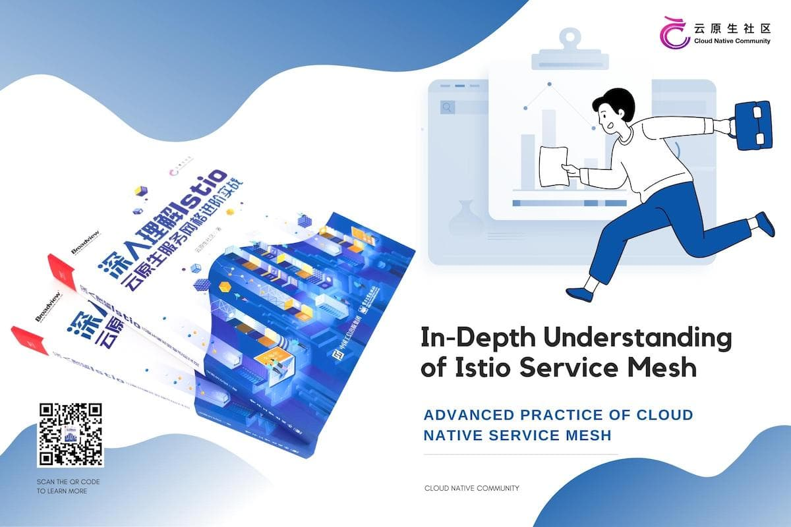

It's been more than 5 years since Google, IBM, and Lyft unveiled the Istio open source project in May 2017. The Istio project has developed from a seed to a tall tree in these years. Many domestic books on the Istio service mesh were launched in the two years following the release of Istio 1.0 in 2018. My country is at the forefront of the world in the field of Istio book publishing.

## Service mesh: one of the core technologies of cloud native

Today, Istio is nearly synonymous with service mesh in China. The development of service mesh, as one of the core cloud-native technologies described by CNCF (Cloud Native Computing Foundation), has gone through the following stages.

- 2017-2018: Exploratory Phase
- 2019-2020: Early Adopter Phase
- 2021 to present: Implementation on a large scale and ecological development stage

Cloud native technology enables enterprises to design and deploy elastically scalable applications in new dynamic settings such as public, private, and hybrid clouds, according to the CNCF. Containers, service meshes, microservices, immutable infrastructure, and declarative APIs are examples of cloud native technology.

Service mesh has been included to the CNCF definition of cloud native, indicating that it is one of the representative technologies of cloud native. Google is donating Istio to CNCF today, and we have reason to expect that as a CNCF project, Istio's community will be more open, and its future development will be more smooth.

## Service mesh and cloud native applications

Cloud-native development is gaining traction. Despite the frequent emergence of new technologies and products, service mesh has maintained its place as "cloud-native network infrastructure" as part of the overall cloud-native technology stack throughout the past year. The cloud-native technology stack model is depicted in the diagram below, with representative technologies for each layer to define the standard. Service mesh and other cloud-native technologies complement each other as a new era of middleware emerges. Dapr (Distributed Application Runtime) defines the cloud-native middleware capability model, OAM defines the cloud-native application model, and so on, whereas service mesh Lattice defines a cloud-native seven-layer network model.



## Why you need a service mesh

Using a service mesh isn't tantamount to abandoning Kubernetes; it just makes sense. The goal of Kubernetes is to manage application lifecycles through declarative configuration, whereas the goal of service mesh is to provide traffic control, security management, and observability amongst apps. How do you set up load balancing and flow management for calls between services after a robust microservice platform has been developed with Kubernetes?

Many open source tools, including Istio, Linkerd, MOSN, and others, support Envoy's xDS protocol. The specification of xDS is Envoy's most significant contribution to service mesh or cloud native. Many various usage cases, such as API gateways, sidecar proxies in service meshes, and edge proxies, are derived from Envoy, which is simply a network proxy, a modern version of the proxy configured through the API.

In a nutshell, the move from Kubernetes to Istio was made for the following reasons.

- Application life cycle management, specifically application deployment and management, is at the heart of Kubernetes (scaling, automatic recovery, and release).
- Kubernetes is a microservices deployment and management platform that is scalable and extremely elastic.
- Transparent proxy is the cornerstone of service mesh, which intercepts communication between microservices via sidecar proxy and then regulates microservice behavior via control plane settings. The deployment mode of service meshes has introduced new issues today. For service meshes, sidecar is no longer required, and an agentless service mesh based on gRPC is also being tested.
- xDS is a protocol standard for configuring service meshes, and a gRPC-based xDS is currently being developed.
- Kubernetes traffic management is decoupled with the service mesh. The kube-proxy component is not required to support traffic within the service mesh. The traffic between services is controlled by an abstraction close to the microservice application layer to achieve security and observability features.
- In Kubernetes, service mesh is an upper-level abstraction of service, and Serverless is the next stage, which is why Google released Knative based on Kubernetes and Istio following Istio.

## Open source in the name of the community

The ServiceMesher community was founded in May 2018 with the help of Ant Financial. Following that, a tornado of service meshes erupted in China, and the community-led translation of Istio's official documentation reached a fever pitch.

I became aware of a dearth of Chinese resources for systematically teaching Istio over time, so in September 2018, I began to plan and create an Istio book, launching the Istio Handbook open source e-book project on GitHub. I met many friends who are also interested in Istio and service mesh technology in the online and offline events of the community a few months later, with the promotion of service mesh technology and the expansion of the ServiceMesher community. We unanimously agreed to collaborate on an open source Istio e-book, which will compile the community's important writings and experience into a logical text and make it available to the majority of developers.

Hundreds of people volunteered and began co-authoring the book in March 2019 under the auspices of the Community Stewardship Council. In May 2020, we created a cloud-native community that incorporated the original ServiceMesher community in order to further promote cloud-native technology and expand the technical knowledge supplied by the community. The scope of community operations has also widened, moving away from service mesh to more extensive cloud-native tools.

The editorial board for this book, which includes me, Ma Ruofei, Wang Baiping, Wang Wei, Luo Guangming, Zhao Huabing, Zhong Hua, and Guo Xudong, was founded in October 2020. We performed further version updates, improvements, and optimizations to this book under the supervision and assistance of the publishing business. This book, "In-depth Understanding of Isito: Advanced Practice of Cloud Native Service Mesh," finally met you after many iterations.



## About this book

After version 1.5, Istio underwent considerable architectural modifications, and various new or better features were added, including the addition of a smart DNS proxy, additional resource objects, increased support for virtual machines, and more.

This book is based on the new edition of Istio, and it aims to provide readers with the most up-to-date and comprehensive content possible by following the newest trends in the Istio community. Furthermore, several of the book's authors are front-line development or operation and maintenance engineers with extensive Istio expertise, offering detailed and useful reference cases for the book.

This book is currently available on the [JD.com](https://item.jd.com/13200745.html). Please read "In-depth Understanding of Isito: Advanced Practice of Cloud Native Service Mesh" if you want to learn more about Istio!



