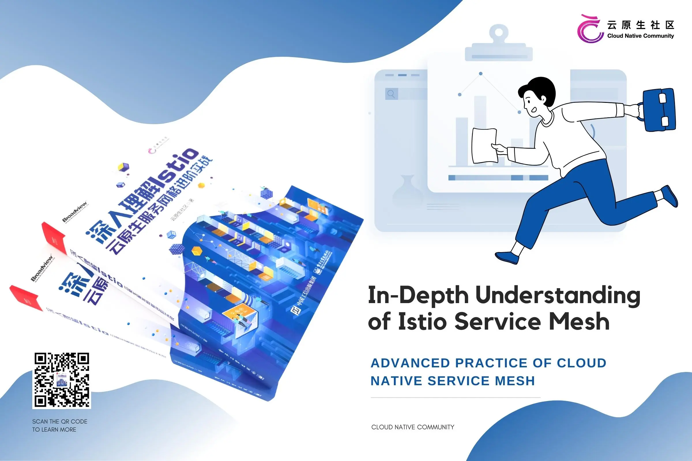

In May 2017, Google, IBM and Lyft jointly [announced ](https://istio.io/latest/news/releases/0.x/announcing-0.1/) the [Istio](https://istio.io) open source, and it has been more than 5 years before I know it. In these years, the Istio project has grown from a seed to a towering tree. Especially in the next two years after the release of Istio 1.0 in 2018, many domestic books on the Istio service mesh were launched. In the field of Istio book publishing, my country is at the forefront of the world.

## Service mesh: one of the core technologies of cloud native

Today in China, Istio can almost be used as a synonym for service mesh. As one of the key [cloud-native technologies defined by CNCF (Cloud Native Computing Foundation)](https://github.com/cncf/toc/blob/main/DEFINITION.md) , the development of service mesh has gone through the following stages.

- Exploratory Phase: 2017-2018
- Early Adopter Phase: 2019-2020
- Large-scale implementation and ecological development stage: 2021 to present

In 2018, CNCF defined cloud native as: cloud native technology enables organizations to build and run elastically scalable applications in new dynamic environments such as public, private and hybrid clouds. Representative technologies of cloud native include containers, service meshes, microservices, immutable infrastructure, and declarative APIs.

It can be seen that CNCF has added service mesh to the definition of cloud native, that is, service mesh is one of the representative technologies of cloud native. Today, Google is donating Istio to CNCF, and we have reason to believe that after becoming a CNCF project, Istio's community will be open, and its future development will be smoother.

## Service mesh and cloud native applications

The development of cloud-native is in the ascendant. Although new technologies and products are constantly emerging, as part of the entire cloud-native technology stack, service mesh has continuously consolidated its position as "cloud-native network infrastructure" in the past year. The figure below shows the cloud-native technology stack model, where each layer has some representative technologies to define the standard. As a new era of middleware, service mesh and other cloud-native technologies complement each other. For example, Dapr (Distributed Application Runtime) defines the capability model of cloud-native middleware, OAM defines the cloud-native application model, etc., while service mesh Lattice defines a cloud-native seven-layer network model.



## Why you need a service mesh

Using a service mesh doesn't mean breaking with Kubernetes, it just comes naturally. The essence of Kubernetes is to manage the lifecycle of applications through declarative configuration, while the essence of service mesh is to provide traffic control and security management between applications, as well as observability. If a stable microservice platform has been built using Kubernetes, how to set up load balancing and flow control for calls between services?

The xDS protocol created by Envoy is supported by many open source software, such as Istio, Linkerd, MOSN, etc. Envoy's biggest contribution to service mesh or cloud native is the definition of xDS. Envoy is essentially a network proxy, a modern version of the proxy configured through the API, and many different usage scenarios are derived from it, such as API gateways, sidecar proxies in service meshes, and edge proxies.

Technology development from Kubernetes to Istio, in a nutshell, for the following reasons.

- The essence of Kubernetes is application life cycle management, specifically, application deployment and management (scaling, automatic recovery, and release).
- Kubernetes provides a scalable, highly elastic deployment and management platform for microservices.
- The foundation of service mesh is transparent proxy, which first intercepts traffic between microservices through sidecar proxy, and then manages the behavior of microservices through control plane configuration. Today, the deployment mode of service meshes has also ushered in new challenges. Sidecar is no longer necessary for service meshes, and an agentless service mesh based on gRPC is also being tested.
- xDS defines a protocol standard for service mesh configuration, and a gRPC-based xDS is currently under development.
- The service mesh decouples traffic management from Kubernetes. The traffic inside the service mesh does not need the support of the kube-proxy component. Through the abstraction close to the microservice application layer, the traffic between services is managed to achieve security and observability functions.
- Service mesh is an upper-level abstraction of service in Kubernetes, and its next step is Serverless, which is why Google launched Knative based on Kubernetes and Istio after Istio.

## Open source in the name of the community

In May 2018, with the support of Ant Financial, the ServiceMesher community was established. Subsequently, a whirlwind of service meshs blew up in China, and the translation work of Istio's official documents led by the community also entered a white-hot stage.

Over time, I felt the lack of Chinese materials for systematically introducing Istio, so in September 2018, I began to conceive and write a book about Istio, and launched the Istio Handbook open source e-book project on GitHub. A few months later, with the promotion of service mesh technology and the expansion of the ServiceMesher community, I met many friends who are also keen on Istio and service mesh technology in the online and offline activities of the community. We unanimously decided to write an open source e-book of Istio together, which will integrate the valuable articles and experience accumulated by the community into systematic text and share it with the majority of developers.

In March 2019, under the umbrella of the Community Stewardship Council, dozens of members volunteered and began co-authoring the book. In May 2020, in order to better promote cloud-native technology and enrich the technical content shared by the community, we established a cloud-native community and included the original ServiceMesher community. The content of community operations has also expanded from service mesh technology to More comprehensive cloud-native technologies.

In October 2020, the main content contributors to this book formed the editorial board, including me, Ma Ruofei, Wang Baiping, Wang Wei, Luo Guangming, Zhao Huabing, Zhong Hua and Guo Xudong. With the guidance and help of the publishing house, we have carried out subsequent version upgrades, improvements and optimizations to this book. After repeated iterations, this book "In-depth Understanding of Isito: Advanced Practice of Cloud Native Service mesh" finally met with you.



## About this book

Istio has undergone major architectural changes after version 1.5, and several features have been introduced or improved, such as the introduction of a smart DNS proxy, new resource objects, improved support for virtual machines, and more.

This book is written on the basis of the new version of Istio, and strives to provide readers with the latest and most comprehensive content on the basis of continuously tracking the latest trends in the Istio community. In addition, many authors of this book are front-line development or operation and maintenance engineers with rich Istio practical experience, providing detailed and valuable reference cases for this book.

At present, this book has been launched on the Jingdong platform. If you want to know more about Istio, please read this book "In-depth Understanding of Isito: Advanced Practice of Cloud Native Service Mesh"!



