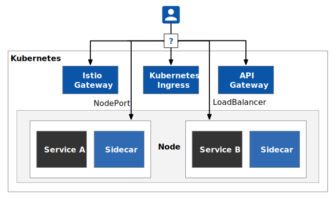

API gateways have been around for a long time as the entry point for clients to access the back-end, mainly to manage “north-south” traffic, In recent years, service mesh architectures have become popular, mainly for managing internal systems,(i.e. “east-west” traffic), while a service mesh like Istio also has built-in gateways that bring traffic inside and outside the system under unified control. This often creates confusion for first-time users of Istio. What is the relationship between the service mesh and the API gateway? How does Istio’s gateway work? What are the ways to expose the services in the Istio mesh? This article gives you the answer.

## Key Insights

- The service mesh was originally created to solve the problem of managing internal traffic for distributed systems, but API gateways existed long before it.
- While the Gateway is built into Istio, you can still use a custom Ingress Controller to proxy external traffic.
- API gateways and service mesh are converging.

## How do I expose services in the Istio mesh?

The following diagram shows four approaches to expose services in the Istio mesh using Istio Gateway, Kubernetes Ingress, API Gateway, and NodePort/LB.



The Istio mesh is shaded, and the traffic in the mesh is internal (east-west) traffic, while the traffic from clients accessing services within the Kubernetes cluster is external (north-south) traffic. 

| **Approach**          | **Controller**     | **Features**                                                 |
| --------------------- | ------------------ | ------------------------------------------------------------ |
| NodePort/LoadBalancer | Kubernetes         | Load balancing                                               |
| Kubernetes Ingress    | Ingress controller | Load balancing, TLS, virtual host, traffic routing           |
| Istio Gateway         | Istio              | Load balancing, TLS, virtual host, advanced traffic routing, other advanced Istio features |
| API Gateway           | API Gateway        | Load balancing, TLS, virtual host, advanced traffic routing, API lifecycle management, billing, rate limiting, policy enforcement, data aggregation |

Since NodePort/LoadBalancer is a basic way to expose services built into Kubernetes, this article will not discuss that option. Each of the other three approaches will be described below.

## Using Kubernetes Ingress to expose traffic

We all know that clients of a Kubernetes cluster cannot directly access the IP address of a pod because the pod is in a network plane built into Kubernetes. We can expose services inside Kubernetes outside the cluster using NodePort or Load Balancer Kubernetes service type. To support virtual hosting, hiding and saving IP addresses, you can use Ingress resources to expose services in Kubernetes.


Ingress is a Kubernetes resource that controls the behavior of an ingress controller that does the traffic touring, which is the equivalent of a load-balanced directional proxy server such as Nginx, Apache, etc., which also includes rule definitions, i.e., routing information for URLs, which is provided by the [Ingress controller](https://kubernetes.io/docs/concepts/services-networking/ingress/#ingress-controllers).

```yaml
apiVersion: networking.k8s.io/v1beta1
kind: Ingress
metadata:
  annotations:
    kubernetes.io/ingress.class: istio
  name: ingress
spec:
  rules:
  - host: httpbin.example.com
    http:
      paths:
      - path: /status/*
        backend:
          serviceName: httpbin
          servicePort: 8000
```

The *kubernetes.io/ingress.class: istio* annotation in the example above indicates that the Ingress uses the Istio Ingress Controller which in fact uses Envoy proxy. 

## Using Istio Gateway to expose services

Istio is a popular service mesh implementation that has evolved from Kubernetes that implements some features that Kubernetes doesn’t. (See [What is Istio and why does Kubernetes need Istio?](https://www.tetrate.io/blog/what-is-istio-and-why-does-kubernetes-need-it/)) It makes traffic management transparent to the application, moving this functionality from the application to the platform layer and becoming a cloud-native infrastructure.

Istio used Kubernetes Ingress as the traffic portal in versions prior to Istio 0.8, where Envoy was used as the Ingress Controller. From Istio 0.8 and later, Istio created the Gateway object. Gateway and VirtualService are used to represent the configuration model of Istio Ingress, and the default implementation of Istio Ingress uses the same Envoy proxy. In this way, the Istio control plane controls both the ingress gateway and the internal sidecar proxy with a consistent configuration model. These configurations include routing rules, policy enforcement, telemetry, and other service control functions.

The Istio Gateway resources function similarly to the Kubernetes Ingress in that it is responsible for north-south traffic to and from the cluster. The Istio Gateway acts as a load balancer to carry connections to and from the edge of the service mesh. The specification describes a set of open ports and the protocols used by those ports, as well as the SNI configuration for load balancing, etc.

The Istio Gateway resource itself can only be configured for L4 through L6, such as exposed ports, TLS settings, etc.; however, the Gateway can be bound to a VirtualService, where routing rules can be configured on L7, such as versioned traffic routing, fault injection, HTTP redirects, HTTP rewrites, and all other routing rules supported within the mesh.

Below is an example of a Gateway binding to a VirtualService. The pod with the “istio: ingressgateway” label will act as the Ingress controller and route HTTP traffic to port 80 of the httpbin.example.com virtual host. The biggest difference between this and using Kubernetes Ingress is that it requires us to manually bind the VirtualService to the Gateway and specify the pod where the Gateway is located. This configuration is equivalent to opening up an entry point to Kubernetes for external access.

```yaml
apiVersion: networking.istio.io/v1alpha3
kind: Gateway
metadata:
  name: httpbin-gateway
spec:
  selector:
    istio: ingressgateway
  servers:
  - port:
      number: 80
      name: http
      protocol: HTTP
    hosts:
    - "httpbin.example.com"
```

The VirtualService below is bound to the gateway above via *gateways* to accept traffic from that gateway.

```yaml
apiVersion: networking.istio.io/v1alpha3
kind: VirtualService
metadata:
  name: httpbin
spec:
  hosts:
  - "httpbin.example.com"
  gateways:
  - httpbin-gateway
  http:
  - match:
    - uri:
        prefix: /status
    route:
    - destination:
        port:
          number: 8000
        host: httpbin
```

## Using an API Gateway

API gateways are API management tools that sit between the client and the back-end service and are widely used in microservices as a way to separate the client interface from the back-end implementation. When a client makes a request, the API gateway breaks it down into multiple requests, then routes them to the correct location, generates a response, and keeps track of everything. 

The API Gateway is a special type of service in the microservices architecture that serves as the entry point for all microservices and is responsible for performing routing requests, protocol conversions, aggregating data, authentication, rate limiting, circuit breaking, and more. Most enterprise APIs are deployed through API Gateways, which typically handle common tasks across API service systems, such as TLS termination, authentication and authorization, rate limiting, and statistical information.

There can be one or more API Gateways in the mesh. The responsibilities of the API Gateway are

- Request routing and version control
- Facilitating the transition of monolithic applications to microservices
- Permission authentication
- Data aggregation: monitoring and billing
- Protocol conversion
- Messaging and caching
- Security and alerting

Many of the above basic functions such as routing and permission authentication can also be achieved through Istio Gateway, but some mature API gateways may be more advantageous in terms of feature richness and scalability.

- The introduction of API Gateway requires consideration of the deployment, operation and maintenance, load balancing, and other scenarios of API Gateway itself, which increases the complexity of back-end services.
- An API Gateway carries a large number of interface adaptations, which makes it difficult to maintain.
- For some scenarios, the addition of a hop may lead to a reduction in performance.

Currently, some API Gateway imitations are building their own service mesh by deploying them in the sidecar.

## Summary

In the Istio mesh, you can use a variety of Kubernetes Ingress Controllers to act as entry gateways, but of course, you can also use Istio’s built-in Istio Gateway directly, for policy control, traffic management, and usage monitoring. The advantage of this is that the gateway can be managed directly through Istio’s control plane, without the need for additional tools. But for functions such as API statement cycle management, complex billing, protocol conversion, and authentication, a traditional API gateway may be a better fit for you. So, you can choose according to your needs, or you can use a combination.

Some traditional reverse proxies are also moving towards Service Mesh, such as Nginx with Nginx Service Mesh and Traefik with Traefik Mesh, and some API gateway products are also moving towards Service Mesh, such as Kong with Kuma, and in the future, we will see more convergence of API gateways, reverse proxies, and service meshes.
