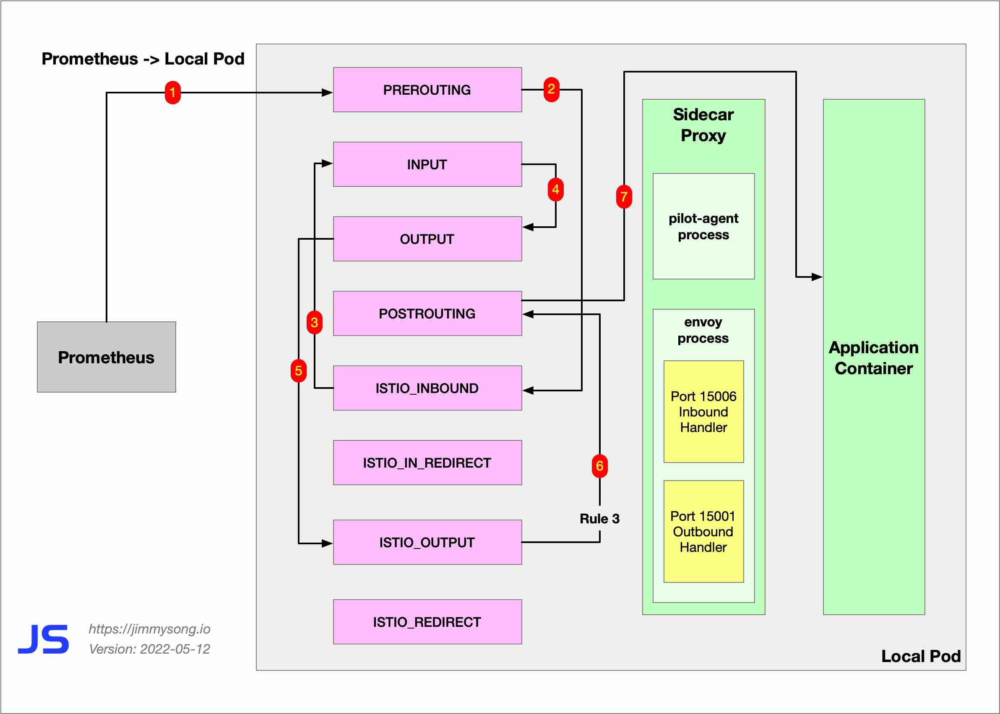
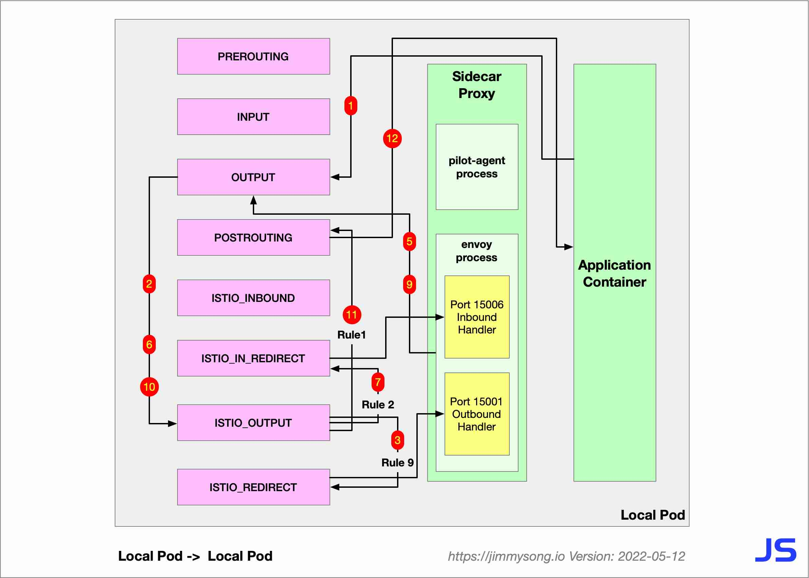
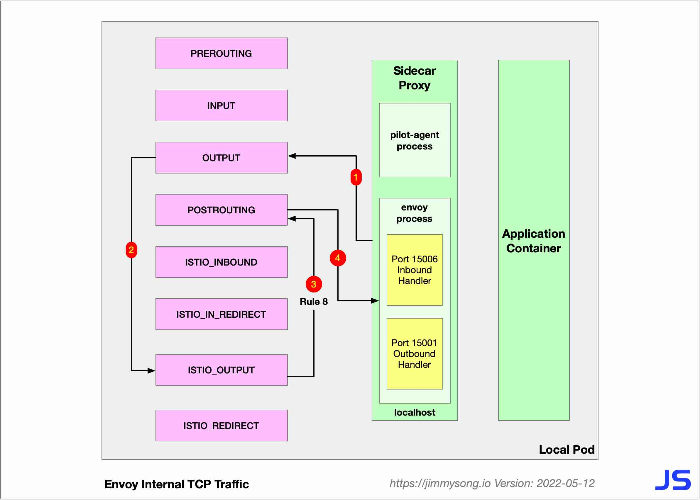
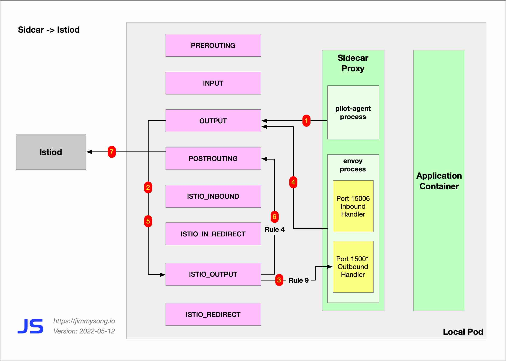

As we know that Istio uses iptables for traffic hijacking, where the iptables rule chains has one called ISTIO_OUTPUT, which contains the following rules.

| **Rule** | **target**        | **in** | **out** | **source** | **destination**                 |
| -------- | ----------------- | ------ | ------- | ---------- | ------------------------------- |
| 1        | RETURN            | any    | lo      | 127.0.0.6  | anywhere                        |
| 2        | ISTIO_IN_REDIRECT | any    | lo      | anywhere   | !localhost owner UID match 1337 |
| 3        | RETURN            | any    | lo      | anywhere   | anywhere !owner UID match 1337  |
| 4        | RETURN            | any    | any     | anywhere   | anywhere owner UID match 1337   |
| 5        | ISTIO_IN_REDIRECT | any    | lo      | anywhere   | !localhost owner GID match 1337 |
| 6        | RETURN            | any    | lo      | anywhere   | anywhere !owner GID match 1337  |
| 7        | RETURN            | any    | any     | anywhere   | anywhere owner GID match 1337   |
| 8        | RETURN            | any    | any     | anywhere   | localhost                       |
| 9        | ISTIO_REDIRECT    | any    | any     | anywhere   | anywhere                        |

The sidecar applies these rules to deal with different types of traffic. This article will show you the six types of traffic and their iptables rules in Istio sidecar.

## iptables Traffic Routing in Sidecar

The following list summarizes the six types of traffic in Sidecar.

 1. Remote service accessing local service: Remote Pod -> Local Pod
 2. Local service accessing remote service: Local Pod -> Remote Pod
 3. Prometheus crawling metrics of local service: Prometheus -> Local Pod
 4. Traffic between Local Pod service: Local Pod -> Local Pod
 5. Inter-process TCP traffic within Envoy
 6. Sidecar to Istiod traffic

The following will explain the iptables routing rules within Sidecar for each scenario, which specifies which rule in ISTIO_OUTPUT is used for routing.

### Type 1: Remote Pod -> Local Pod
The following are the iptables rules for remote services, applications or clients accessing the local pod IP of the data plane.

Remote Pod -> `RREROUTING` -> `ISTIO_INBOUND` -> `ISTIO_IN_REDIRECT` -> Envoy 15006 (Inbound) -> `OUTPUT` -> **`ISTIO_OUTPUT` RULE 1** -> ` POSTROUTING` -> Local Pod

We see that the traffic only passes through the Envoy 15006 Inbound port once. The following diagram shows this scenario of the iptables rules.

### Type 2: Local Pod -> Remote Pod

The following are the iptables rules that the local pod IP goes through to access the remote service.

Local Pod-> `OUTPUT` -> **`ISTIO_OUTPUT` RULE 9** -> `ISTIO_REDIRECT` -> Envoy 15001 (Outbound) -> `OUTPUT` -> **`ISTIO_OUTPUT` RULE 4** -> `POSTROUTING` -> Remote Pod

We see that the traffic only goes through the Envoy 15001 Outbound port. 

The traffic in both scenarios above passes through Envoy only once because only one scenario occurs in that Pod, sending or receiving requests.

### Type 3: Prometheus -> Local Pod

Prometheus traffic that grabs data plane metrics does not have to go through the Envoy proxy.

These traffic pass through the following iptables rules.

Prometheus-> `RREROUTING` -> `ISTIO_INBOUND` (traffic destined for ports 15002, 15090 will go to `INPUT`) -> `INPUT` -> `OUTPUT` -> **`ISTIO_OUTPUT` RULE 3** -> `POSTROUTING` -> Local Pod

### Type 4: Local Pod -> Local Pod

A Pod may simultaneously have two or more services. If the Local Pod accesses a service on the current Pod, the traffic will go through Envoy 15001 and Envoy 15006 ports to reach the service port of the Local Pod.

The iptables rules for this traffic are as follows.

Local Pod-> `OUTPUT` -> **`ISTIO_OUTPUT` RULE 9** -> `ISTIO_REDIRECT` -> Envoy 15001（Outbound）-> `OUTPUT` -> **`ISTIO_OUTPUT` RULE 2** -> `ISTIO_IN_REDIRECT` -> Envoy 15006（Inbound）-> `OUTPUT` -> **`ISTIO_OUTPUT` RULE 1** -> `POSTROUTING` -> Local Pod

### Type 5: Inter-process TCP traffic within Envoy

Envoy internal processes with UID and GID 1337 will communicate with each other using lo NICs and localhost domains.

The iptables rules that these flows pass through are as follows.

Envoy process (Localhost) -> `OUTPUT` -> **`ISTIO_OUTPUT` RULE 8** -> `POSTROUTING` -> Envoy process (Localhost)

### Type 6: Sidecar to Istiod traffic

Sidecar needs access to Istiod to synchronize its configuration so that Envoy will have traffic sent to Istiod.

The iptables rules that this traffic passes through are as follows.

`pilot-agent` process -> `OUTPUT` -> **`Istio_OUTPUT` RULE 9** -> Envoy 15001 (Outbound Handler) -> OUTPUT -> **`ISTIO_OUTPUT` RULE 4** -> `POSTROUTING`  -> Istiod

## Summary

All the sidecar proxies that Istio injects into the Pod or installed in the virtual machine form the data plane of the service mesh, which is also the main workload location of Istio. In my next blog, I will take you through the ports of each component in Envoy and their functions, so that we can have a more comprehensive understanding of the traffic in Istio.
