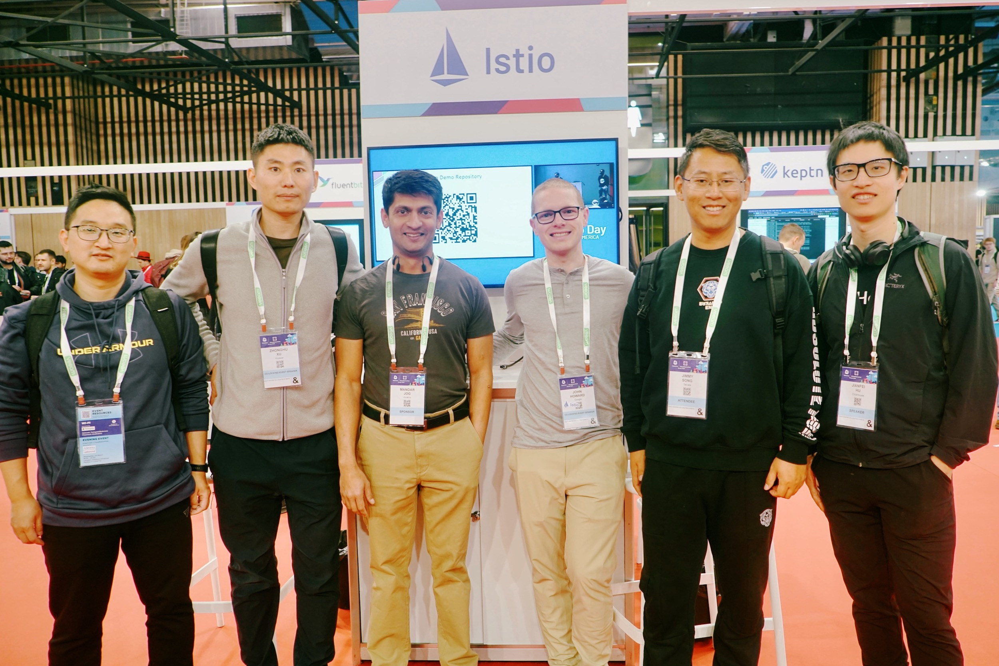

Last week, I attended [KubeCon EU 2024](https://events.linuxfoundation.org/kubecon-cloudnativecon-europe/) in Paris, marking my first participation in KubeCon outside of China. The conference was unprecedentedly grand, reportedly attracting 12,000 attendees. In this article, I'll share some observations from KubeCon, focusing mainly on the areas of service mesh and cloud-native infrastructure that caught my attention.

## Istio, Cilium, and Service Mesh

[Istio](https://istio.io) and Service Mesh were hot topics, showcasing the latest developments and applications of these technologies within the cloud-native ecosystem. The conference covered various areas, including infrastructure optimization, data locality, distributed tracing, and multi-cluster deployment, reflecting the widespread attention and continuous innovation in Service Mesh technology.

### Data Locality and Global Request Routing

Arthur Busser and Baudouin Herlicq from Pigment shared how Kubernetes and Istio can fulfill data locality requirements. They introduced methods using Istio for request routing based on custom headers, crucial for meeting data residency requirements such as GDPR and CCPA.

### Distributed Tracing and Enhanced Observability

Chris Detsicas from ThousandEyes (part of Cisco) discussed configuring Istio with OpenTelemetry for effective distributed tracing, providing valuable visibility into microservices ecosystems for problem diagnosis and performance optimization.

### Multi-cluster Deployment and Traffic Management

Haiwen Zhang and Yongxi Zhang from China Mobile introduced a new approach to simplify Istio multi-cluster deployment. This method utilizes a globally unique Istio control plane, achieving global service discovery through the main cluster's Apiserver, automatically connecting the container networks of multiple clusters, and providing direct network connectivity for Pods. They highlighted the [Kosmos project](https://github.com/kosmos-io/kosmos), offering a new solution to simplify service mesh deployment and management in multi-cluster environments.

Ameer Abbas and John Howard from Google discussed building 99.99% reliability services with infrastructure reliability at 99.9%. They proposed a series of application architecture prototypes (Archetypes) to design and implement highly reliable multi-cluster applications.

- **Prototype 1: Active-Passive Zones** - Deploy all services in two zones of a single region, using read-only replicas of SQL databases, with fault tolerance within the zone achieved through L4 load balancers.
- **Prototype 2: Multi-Zonal** - Deploy all services in three zones of a single region, using highly available SQL databases, with fault tolerance within the zone achieved through global or zonal load balancers.
- **Prototype 3: Active-Passive Region** - Deploy all services in three zones of two regions, using SQL databases replicated across regions, with fault tolerance between regions achieved through DNS and load balancers.
- **Prototype 4: Isolated Regions** - Deploy all services in three zones of two regions, using global databases like Spanner or CockroachDB, with fault tolerance between regions achieved through zonal load balancers and DNS.
- **Prototype 5: Global** - Deploy all services in three zones of two or more regions, using global databases like Spanner or CockroachDB, with fault tolerance achieved globally through global load balancers.

### Security and Zero Trust Architecture

Several sessions emphasized the importance of securing Istio in production environments. Discussions led by Microsoft's Niranjan Shankar focused on steps and strategies to reinforce Istio's security using network policies, third-party Kubernetes tools, and cloud-provided security services to build zero trust and defense-in-depth architectures.

### Infrastructure Compatibility and Future of Ambient Mesh

Benjamin Leggett and Yuval Kohavi introduced an innovative approach to enable Istio's Ambient mode to support any Kubernetes CNI, detailed in the [Istio blog](https://istio.io/latest/zh/blog/2024/inpod-traffic-redirection-ambient/). This advancement addresses the limited CNI support in Ambient mesh, allowing applications to be included in Ambient mode without restarting Pods, thus simplifying operations and reducing infrastructure costs.

The Istio community announced that Ambient mode will become beta in the upcoming Istio 1.22 release, as described in the [CNCF blog](https://www.cncf.io/blog/2024/03/19/istio-announces-the-beta-release-of-ambient-mode/). Multiple presentations and discussions focused on the future of Istio Ambient Mesh, especially its potential to simplify workload operations and reduce infrastructure costs. The introduction of Istio Ambient Mesh signals a new direction for service mesh technology, offering a data plane architecture without sidecars, providing higher performance and lower resource consumption.

### Innovation in Sidecar-less Service Mesh

Discussions at KubeCon EU 2024 evaluated and compared the pros and cons of using sidecar-based and sidecar-less (such as Istio's Ambient Mesh) service mesh models. Christian Posta's in-depth analysis of design decisions and trade-offs between Cilium and Istio in implementing sidecar-less service mesh highlighted the potential of this model in improving performance, reducing resource consumption, and simplifying operational tasks. By analyzing the transition from Istio to Cilium at The New York Times, it further demonstrated the effectiveness of the sidecar-less model in handling complex, multi-region service meshes, while also pointing out challenges and implementation considerations in this transition. These discussions foreshadowed the potential evolution of service mesh technology towards more flexible and efficient architectures, where the sidecar-less approach may become a key strategy for optimizing the performance and resource utilization of cloud-native applications.

### Intersection of Cilium and Service Mesh

[Cilium](https://cilium.io) was widely discussed at KubeCon EU 2024. As a technology based on eBPF, Cilium is not only seen as an efficient Container Network Interface (CNI) but also demonstrates strong potential in the service mesh domain. Through presentations by Isovalent and other organizations, Cilium was showcased as an advanced solution for connecting, observing, and securing service mesh. In particular, Cilium's sidecar-less service mesh implementation was considered a future direction, leveraging eBPF technology to achieve secure communication and fine-grained traffic management among microservices without adding the burden of traditional sidecar proxies. Additionally, Cilium's extensibility beyond service mesh, such as in multi-cloud networking and load balancing, highlights its position as a core component of the cloud-native ecosystem. These discussions and case studies of Cilium demonstrate its significant role in driving innovation in service mesh and cloud-native technologies.

## Cloud Native Trends

Several major trends are currently shaping the cloud-native landscape:

1. **Enhanced Sustainability and Environmental Awareness**: For example, Deutsche Bahn is incorporating developers into its infrastructure greening process, highlighting a growing consideration of environmental factors in the design and operation of cloud-native solutions. This reflects a trend where companies are increasingly looking at reducing their environmental impact while pursuing technological advancements, achieving sustainable technology ecosystems through green computing and energy efficiency optimizations.

2. **Integration of Artificial Intelligence with Cloud-Native Technologies**: Artificial intelligence (AI) is emerging as the next major challenge for Kubernetes and the cloud-native ecosystem. Discussions by Nvidia on AI strategies, CNCF's efforts to standardize AI in cloud-native futures, and various updates on tools and platforms integrating AI and machine learning (ML) underscore this trend. This trend indicates that seamlessly integrating AI and ML into cloud-native architectures can not only accelerate application development and deployment but also provide more intelligent and automated operational capabilities. CNCF has also announced the establishment of an AI Working Group and released an [AI Whitepaper](https://www.cncf.io/reports/cloud-native-artificial-intelligence-whitepaper/).

3. **Rise of WebAssembly (Wasm)**: Support for the latest Wasm standards by Cosmonic, along with Fermyon's donation of its open-source Wasm platform, [SpinKube](https://www.spinkube.dev/), to CNCF, demonstrates the growing importance of WebAssembly in cloud-native application development. Wasm provides an efficient and secure way to run client and server-side code outside the browser, which is crucial for building cross-platform, high-performance cloud-native applications.

4. **Enhanced Cloud-Native Observability**: For instance, New Relic's addition of native Kubernetes support to its observability platform highlights the increasing demand for monitoring, logging, and performance analysis of cloud-native applications. As the complexity of cloud-native architectures increases, enterprises need more robust tools to maintain system transparency and health, thereby optimizing performance and reliability.

5. **Strengthening Collaboration and Open Source Spirit in the Cloud Native Community**: Initiatives such as CNCF's establishment of the [End User Technical Advisory Board](https://www.cncf.io/people/end-user-technical-advisory-board/), and collaboration between Red Hat and Docker to develop the Testcontainers Cloud framework, reflect the cloud-native community's commitment to fostering a culture of collaboration and sharing. This open collaboration not only accelerates the development and adoption of new technologies but also provides a solid foundation for the healthy growth of the cloud-native ecosystem.

These trends collectively depict a diverse, continuously innovative, and increasingly mature cloud-native technology landscape, where sustainability, AI/ML integration, WebAssembly, enhanced observability, and community collaboration are key drivers of progress in this field.

## Conclusion

Insights from KubeCon EU 2024 have revealed several significant advancements and future directions in the cloud-native technology domain. From ongoing innovations in service meshes to the growing emphasis of the cloud-native ecosystem on environmental sustainability, and the deep integration of artificial intelligence and machine learning technologies, as well as the increasing importance of WebAssembly in application development, these trends collectively constitute the forefront of current cloud-native technology.

Of particular note are the latest developments in Istio and Cilium in the realm of service meshes, showcasing the potential of the Sidecar-less architecture and the role of eBPF technology in enhancing performance, security, and observability. These advancements not only provide developers with more efficient and flexible tools but also present new perspectives for the design and operation of cloud-native applications.

Simultaneously, the continued development of the cloud-native community and its commitment to the open-source spirit provide a solid foundation for technological innovation and knowledge sharing. Through the strengthening of observability, promotion of environmental sustainability, and advancement of technological standardization, the cloud-native ecosystem demonstrates its profound development potential and vast application prospects.

As an observer and participant, I keenly feel that the rapid development of cloud-native technology presents unprecedented opportunities and challenges for us. In the future, with continuous technological evolution and collective community efforts, we have reason to believe that cloud-native technology will play a greater role in driving digital transformation and creating a more intelligent and sustainable technological world. Let us eagerly anticipate and actively engage in this exciting technological journey.