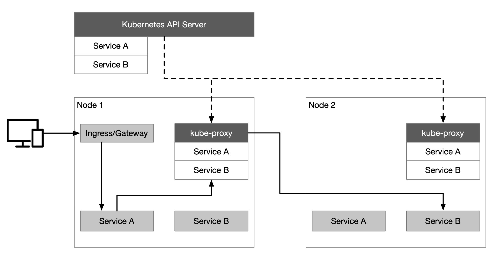
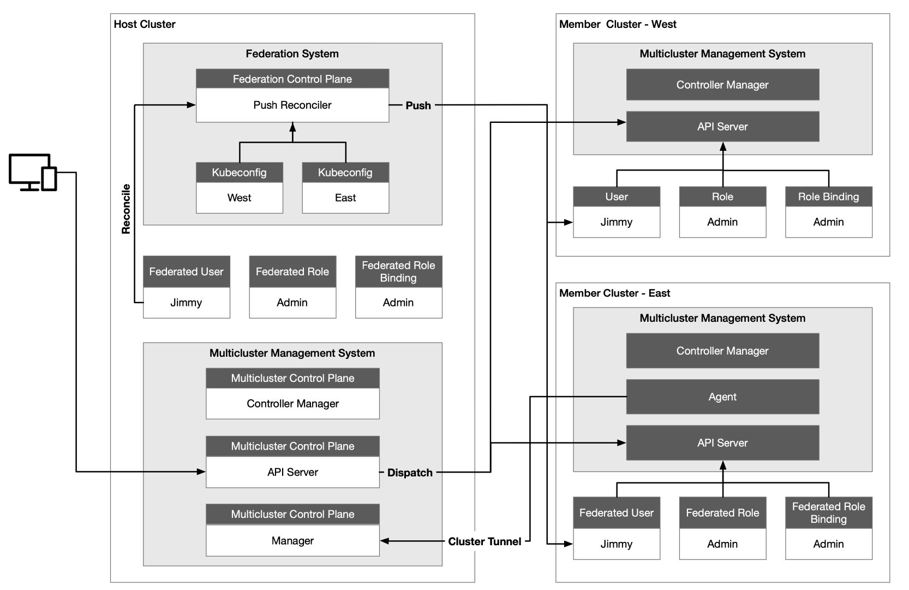
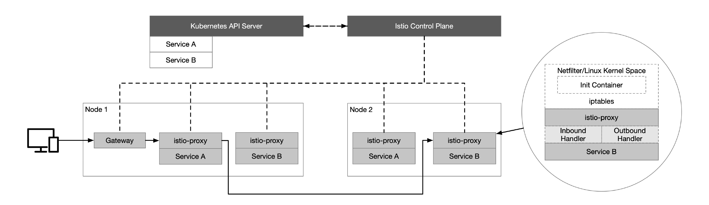
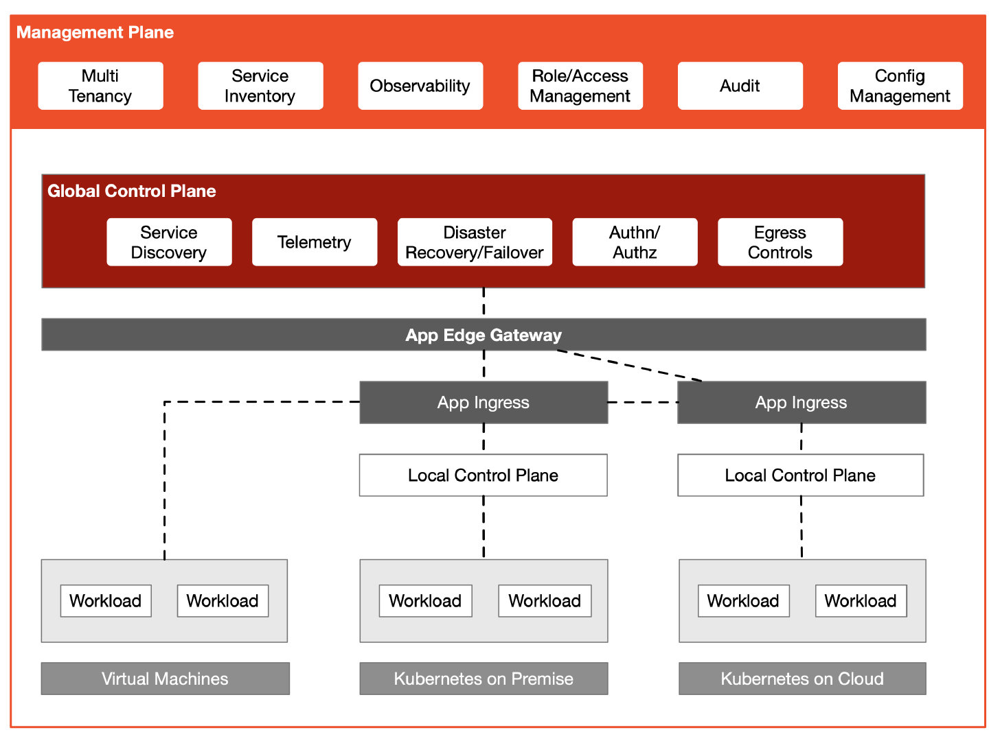

Do you have multiple Kubernetes clusters and a service mesh? Do your virtual machines and services in a Kubernetes cluster need to interact? This article will take you through the process and considerations of building a hybrid cloud using Kubernetes and an Istio Service Mesh. Together, Kubernetes and Istio can be used to bring hybrid workloads into a mesh and achieve interoperability for multicluster. But another layer of infrastructure — a management plane — is helpful for managing multicluster or multimesh deployments.

## Kubernetes

Using Kubernetes enables rapid deployment of a distributed environment that enables cloud interoperability and unifies the control plane on the cloud. It also provides resource objects, such as Service, Ingress and [Gateway](https://kubernetes.io/blog/2021/04/22/evolving-kubernetes-networking-with-the-gateway-api/), to handle application traffic. The Kubernetes API Server communicates with the kube-proxy component on each node in the cluster, creates iptables rules for the node, and forwards requests to other pods.

Assuming that a client now wants to access a service in Kubernetes, the request is first sent to the Ingress/Gateway, then forwarded to the backend service (Service A in the diagram below) based on the routing configuration in the Ingress/Gateway. Then Service A polls an instance of Service B for the traffic requested by Service B. Lastly, the traffic requested by Service A for Service B is polled forward to Service B’s instance.

## Kubernetes Multicluster

The most common usage scenarios for multicluster management include:

- service traffic load balancing
- isolating development and production environments
- decoupling data processing and data storage
- cross-cloud backup and disaster recovery
- flexible allocation of compute resources
- low-latency access to services across regions
- avoiding vendor lock-in

There are often multiple Kubernetes clusters within an enterprise; and the [KubeFed](https://github.com/kubernetes-sigs/kubefed) implementation of Kubernetes cluster federation developed by [Multicluster SIG](https://github.com/kubernetes/community/blob/master/sig-multicluster/README.md) enables multicluster management capabilities, which allows all Kubernetes clusters to be managed through the same interface.

There are several general issues that need to be addressed when using cluster federation:

- Configuring which clusters need to be federated
- API resources need to be propagated across the clusters
- Configuring how API resources are distributed to different clusters
- Registering DNS records in clusters to enable service discovery across clusters

The following is a multicluster architecture for [KubeSphere](https://kubesphere.io/) — one of the most commonly used Kubernetes multicluster management architectures — where the Host Cluster serves as the control plane with two member clusters, West and East.

The Host Cluster needs to be able to access the API Server of the Member Cluster, but the network connectivity between Member Clusters is not required. The Host Cluster is independent of the Member Cluster it manages and the Member Cluster is not aware of the existence of the Host Cluster. The advantage of this is that when the control plane fails, the Member Cluster will not be affected and the deployed load can still operate normally without being affected.

The Host Cluster also assumes the role of API portal, and the Host Cluster forwards the resource requests to the Member Cluster — which is convenient for aggregation and also facilitates unified authority authentication. We see that there is a Federation Control Plane in the Host Cluster, where the Push Reconciler propagates the identity, role, and role binding from the Federation Cluster to all Member Clusters.

## Istio Service Mesh

Consider using the Istio service mesh when we have multilingual, multiversion microservices running in Kubernetes and need finer-grained canary publishing and unified security policy management for inter-service observability. Istio enables intelligent application-aware load balancing from the application layer to other Service Mesh-enabled services in the cluster, by transparently intercepting all traffic to and from the application using IPTables, and bypassing the primary kube-proxy load balancing. The Istio control plane communicates with the Kubernetes API Server to obtain information about all registered services in the cluster.

The following diagram illustrates the basics of Istio, where all nodes belong to the same Kubernetes cluster.

You may end up with at least a few Kubernetes clusters, each hosting microservices. Multiple [deployment models](https://istio.io/latest/docs/setup/install/multicluster/) exist for Istio’s multicluster deployments — depending on network isolation, primary and backup — which can be specified by declaration when deploying using Istio Operator. Communication between these microservices in a cluster can be enhanced by a service mesh. Within the cluster, Istio provides common communication patterns to improve resiliency, security and observability.

All of the above is about application load management on Kubernetes, but for legacy applications on virtual machines: how can they be managed in the same plane? Istio supports applications on virtual machines, so why do we need a management plane?

## Management Plane

To manage gateways, traffic and security groupings, and apply them to different clusters and namespaces, you’ll need to add another layer of abstraction on top of Istio: a management plane. The diagram below shows the multitenant model of Tetrate Service Bridge (TSB). TSB uses Next Generation Access Control (NGAC) — a fine-grained authorization framework — to manage user access and also facilitate the construction of a zero-trust network.

Istio provides workload identification, protected by strong mTLS encryption. This zero-trust model is better than trusting workloads based on topology information, such as source IP. A common control plane for multicluster management is built on top of Istio. Then a management plane is added to manage multiple clusters — providing multitenancy, management configuration, observability, and more.

The diagram below shows the architecture of Tetrate Service Bridge.

## Summary

Interoperability of heterogeneous clusters is achieved with Kubernetes. Istio brings containerized and virtual machine loads into a single control plane, to unify traffic, security and observability within the clusters. However, as the number of clusters, network environments and user permissions become more complex, there is a need to build another management plane above Istio’s control plane (for example, [Tetrate Service Bridge](https://www.tetrate.io/tetrate-service-bridge/)) for hybrid cloud management.
