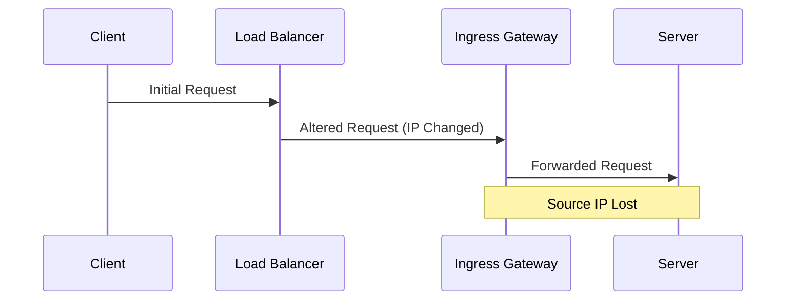
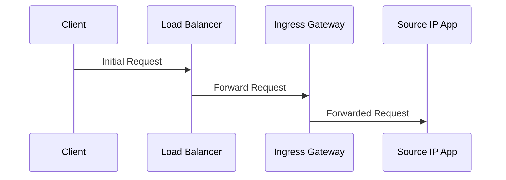
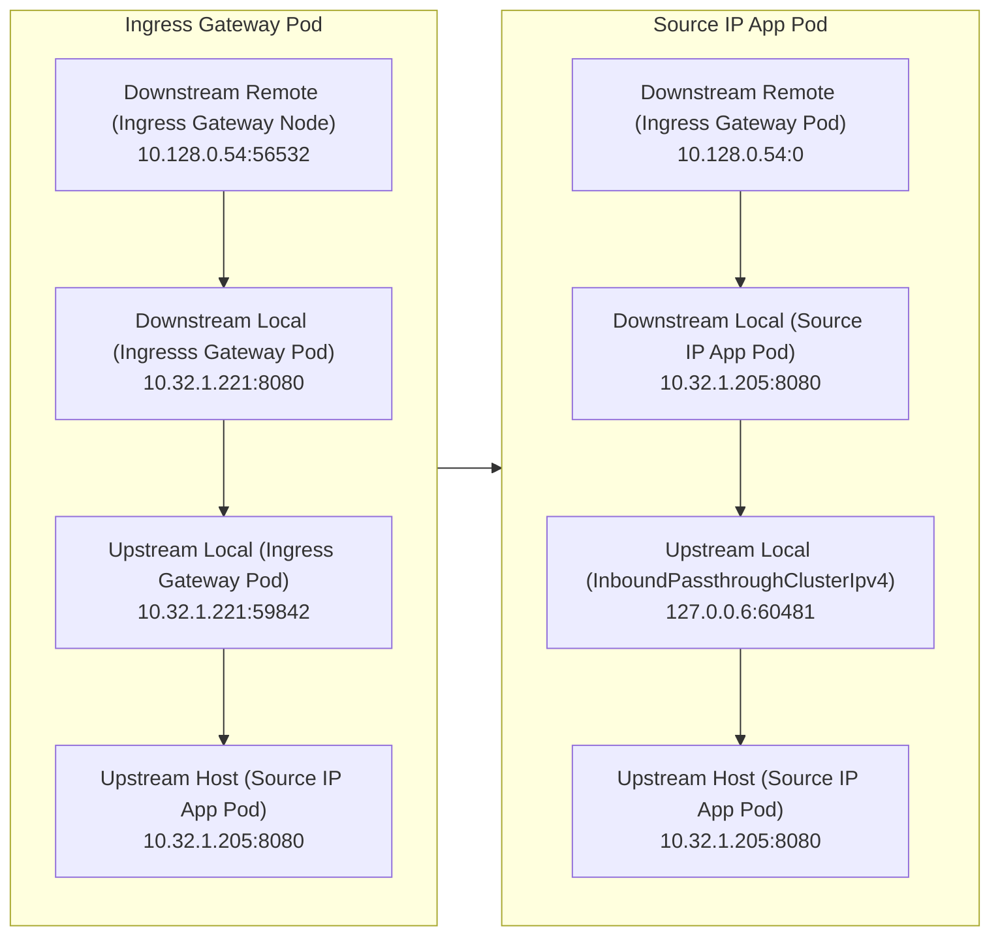
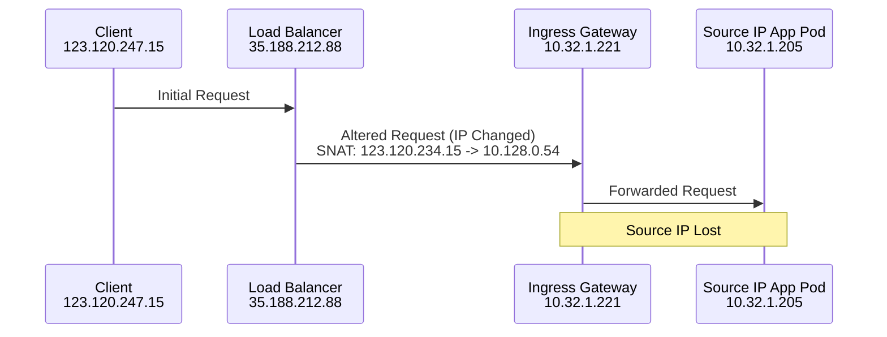
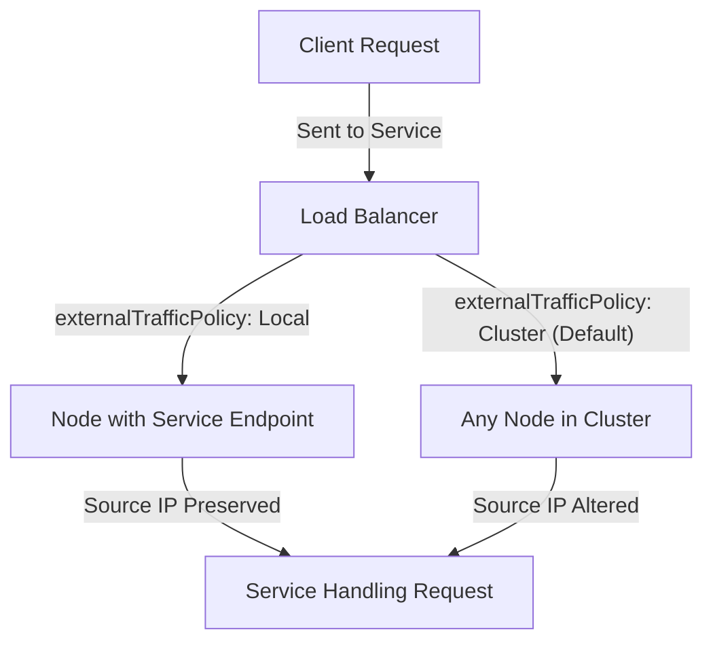
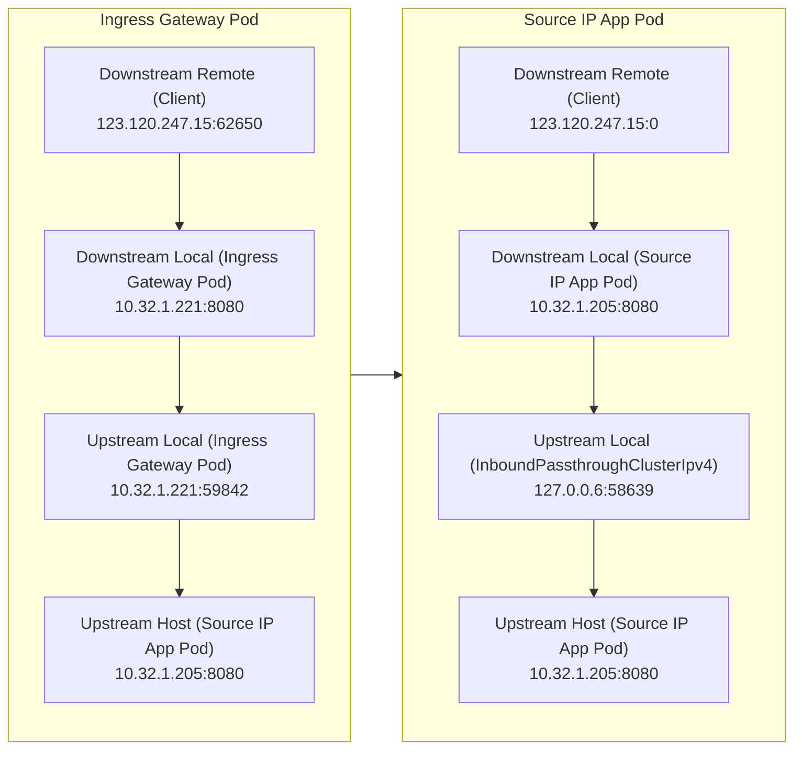
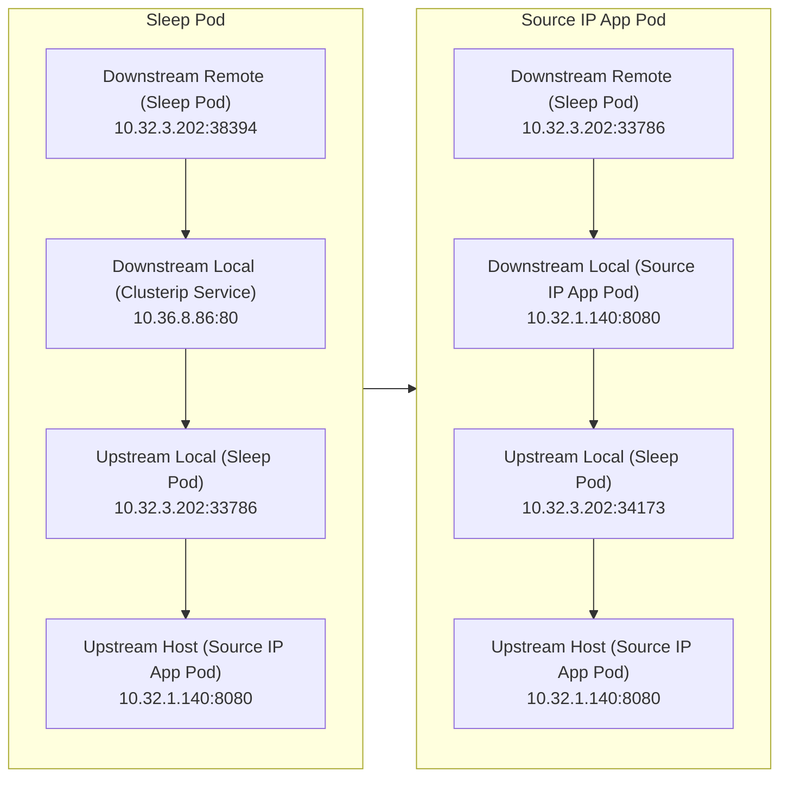
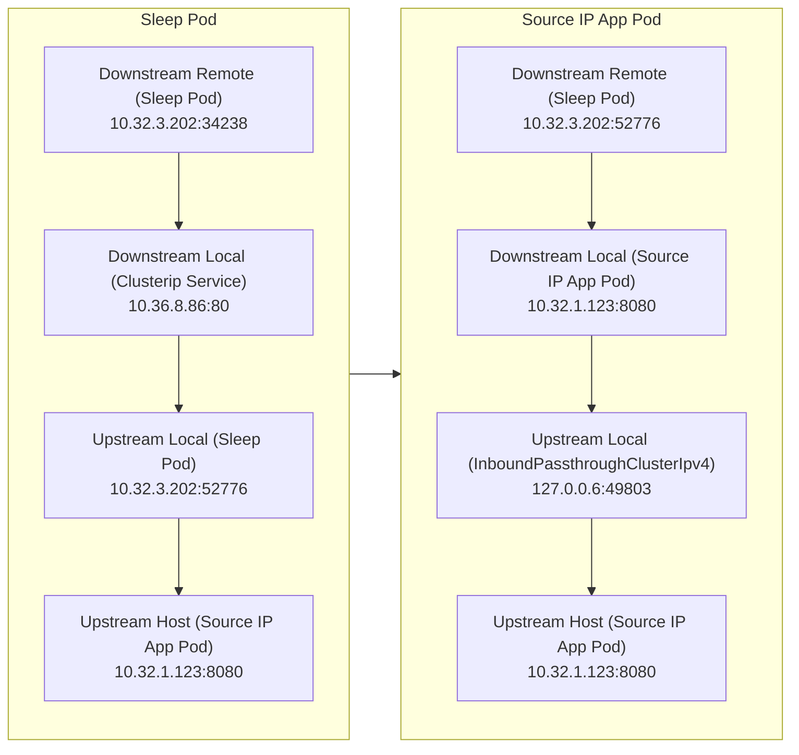
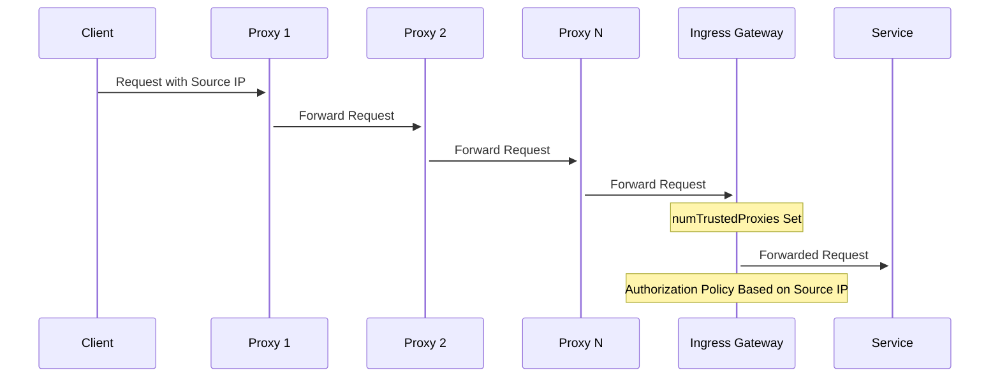

This blog post analyzes the challenges of server-side obtaining the client source IP in the Istio service mesh and provides solutions. The following topics will be covered:

- Reasons for the loss of source IP during packet transmission.
- How to identify the client source IP.
- Strategies for passing source IP in north-south and east-west requests.
- Handling methods for HTTP and TCP protocols.

## The Importance of Preserving Source IP

The main reasons for preserving the client source IP include:

- **Access Control Policies**: Performing authentication or security policies based on source IP.
- **Load Balancing**: Implementing request routing based on the client IP.
- **Data Analysis**: Access logs and monitoring metrics containing the actual source address, aiding developers in analysis.

## Meaning of Preserving Source IP

Preserving the source IP refers to avoiding the situation where the actual client source IP is replaced as the request goes out from the client, and passes through a load balancer or reverse proxy.

Here is an example process of source IP address lost:



The above diagram represents the most common scenario. This article considers the following cases:

1. North-South Traffic: Clients accessing servers through a load balancer (gateway)
   1. Single-tier gateway
   2. Multi-tier gateways
2. East-West Traffic: Service-to-service communication within the mesh
3. Protocols: HTTP and TCP

## How to Confirm Client Source IP?

In the Istio service mesh, Envoy proxies typically add the client IP to the "X-Forwarded-For" header of HTTP requests. Here are the steps to confirm the client IP:

1. **Check the X-Forwarded-For Header**: It contains the IP addresses of various proxies along the request path.
2. **Select the Last IP**: Usually, the last IP is the client IP closest to the server.
3. **Verify the IP's Trustworthiness**: Check the trustworthiness of the proxy servers.
4. **Use X-Envoy-External-Address**: Envoy can set this header, which includes the real client IP.

For more details, refer to the Envoy documentation on the [`x-forwarded-for` header](https://www.envoyproxy.io/docs/envoy/latest/configuration/http/http_conn_man/headers#config-http-conn-man-headers-x-forwarded-for). For TCP/IP connections, you can parse the client IP from the protocol field.

## Testing Environment

**GKE**

- Client Version: v1.28.4
- Kustomize Version: v5.0.4-0.20230601165947-6ce0bf390ce3
- Server Version: v1.27.7-gke.1121000

**Istio**

- Client version: 1.20.1
- Control plane version: 1.20.1
- Data plane version: 1.20.1 (12 proxies)

**CNI**

We use Cilium CNI but have not enabled the kube-proxy-less mode.

- cilium-cli: v0.15.18 compiled with go1.21.5 on darwin/amd64
- cilium image (default): v1.14.4
- cilium image (stable): unknown
- cilium image (running): 1.14.5

**Node**

| Node Name                              | Internal IP | Remarks                   |
| --------------------------------------| ----------- | --------------------------|
| gke-cluster1-default-pool-5e4152ba-t5h3 | 10.128.0.53 |                          |
| gke-cluster1-default-pool-5e4152ba-ubc9 | 10.128.0.52 |                          |
| gke-cluster1-default-pool-5e4152ba-yzbg | 10.128.0.54 | Ingress Gateway Pod Node  |

Public IP of the local client computer used for testing: `123.120.247.15`

## Deploying Test Example

The following diagram illustrates the testing approach:



First, deploy Istio according to the [Istio documentation](https://istio.io/latest/docs/setup/install/), and then enable sidecar auto-injection for the default namespace:

```bash
kubectl label namespace default istio-injection=enabled
```

Deploy the `source-ip-app` application in Istio:

```bash
kubectl create deployment source-ip-app --image=registry.k8s.io/echoserver:1.4
kubectl expose deployment source-ip-app --name=clusterip --port=80 --target-port=8080
```

Create an Ingress Gateway:

```bash
cat > config.yaml <<EOF
apiVersion: networking.istio.io/v1beta1
kind: Gateway
metadata:
  name: clusterip-gateway
spec:
  selector:
    istio: ingressgateway # Choose the appropriate selector for your environment
  servers:
    - port:
        number: 80
        name: http
        protocol: HTTP
      hosts:
        - "clusterip.jimmysong.io" # Replace with the desired hostname
---
apiVersion: networking.istio.io/v1beta1
kind: VirtualService
metadata:
  name: clusterip-virtualservice
spec:
  hosts:
    - "clusterip.jimmysong.io" # Replace with the same hostname as in the Gateway
  gateways:
    - clusterip-gateway # Use the name of the Gateway here
  http:
    - route:
        - destination:
            host: clusterip.default.svc.cluster.local # Replace with the actual hostname of your Service
            port:
              number: 80 # Port of the Service
EOF
kubectl apply -f config.yaml
```

View the Envoy logs in the Ingress Gateway:

```bash
kubectl logs -f deployment/istio-ingressgateway -n istio-system
```

View the Envoy logs in the Sleep Pod:

```bash
kubectl logs -f deployment/sleep -n default -c istio-proxy
```

View the Envoy logs in the Source IP App:

```bash
kubectl logs -f deployment/source-ip-app -n default -c istio-proxy
```

Get the public IP of the gateway:

```bash
export GATEWAY_IP=$(kubectl -n istio-system get service istio-ingressgateway -o jsonpath='{.status.loadBalancer.ingress[0].ip}')
```

Test locally using curl:

```bash
curl -H "Host: clusterip.jimmysong.io" $GATEWAY_IP
```

### Resource IP

After deploying the test application, you need to obtain the IP addresses of the following resources, which will be used in the upcoming experiments.

**Pod**

Here are the initial Pod IPs, but please note that as patches are applied to the Deployment, Pods may be recreated, and their names and IP addresses may change.

| Pod Name                              | Pod IP      |
| ------------------------------------- | ----------- |
| source-ip-app-6d9f5d97d7-fznrq        | 10.32.1.205 |
| sleep-9454cc476-2dskx                 | 10.32.3.202 |
| istio-ingressgateway-6c96bdcd74-zh46d | 10.32.1.221 |

**Service**

| Service Name         | Cluster IP  | External IP   |
| -------------------- | ----------- | ------------- |
| clusterip            | 10.36.8.86  | -             |
| sleep                | 10.36.14.12 | -             |
| istio-ingressgateway | 10.36.4.127 | 35.188.212.88 |

## North-South Traffic

Let's first consider the scenario where the client is outside the Kubernetes cluster and accesses internal services through a load balancer.

### Test 1: Cluster Traffic Policy, iptables Traffic Hijacking

This is the default situation after deploying the test application using the steps above, and it represents the commonly encountered scenario where the source IP address is said to be lost.

curl test:

```bash
curl -H "Host: clusterip.jimmysong.io" $GATEWAY_IP
```




CLIENT VALUES:
client_address=127.0.0.6
command=GET
real path=/
query=nil
request_version=1.1
request_uri=http://clusterip.jimmysong.io:8080/

SERVER VALUES:
server_version=nginx: 1.10.0 - lua: 10001

HEADERS RECEIVED:
accept=*/*
host=clusterip.jimmysong.io
user-agent=curl/8.4.0
x-b3-parentspanid=03c124c5f910001a
x-b3-sampled=1
x-b3-spanid=103dc912ec14f3b4
x-b3-traceid=140ffa034822077f03c124c5f910001a
x-envoy-attempt-count=1
x-envoy-internal=true
x-forwarded-client-cert=By=spiffe://cluster.local/ns/default/sa/default;Hash=79253e34e1c28d389e9bfb1a62ffe8944b2c3c369b46bf4a9faf055b55dedb7f;Subject="";URI=spiffe://cluster.local/ns/istio-system/sa/istio-ingressgateway-service-account
x-forwarded-for=10.128.0.54
x-forwarded-proto=http
x-request-id=b3c05e22-594e-98da-ab23-da711a8f53ec
BODY:
-no body in request-




You only need to focus on the `client_address` and `x-forwarded-for` results. Other information in the curl test results will be omitted in the following curl test results.



Meaning of fields in the results:

- `client_address`: The client IP address obtained through TCP/IP protocol resolution, referred to as the remote address in Envoy.
- `x-forwarded-for`: `x-forwarded-for` (XFF) is a standard proxy header used to indicate the IP addresses that the request has passed through from the client to the server. A compliant proxy will add the IP address of the most recent client to the XFF list before proxying the request. See [Envoy documentation](https://www.envoyproxy.io/docs/envoy/latest/configuration/http/http_conn_man/headers#x-forwarded-for) for details.



From the test results, we can see that the source IP address becomes the IP address of the Ingress Gateway Pod's node (`10.128.0.54`).

The following diagram shows the packet flow paths between the two Pods.



For this scenario, preserving the source IP is straightforward and is also a standard option provided by Kubernetes.

### How is the Source IP Lost?

The following diagram shows how the source IP of the client is lost during the request process.



Because the load balancer sends packets to any node in the Kubernetes cluster, SNAT is performed during this process, resulting in the loss of the client's source IP when it reaches the Server Pod.

### How to Preserve the Client Source IP

You can control the load balancer to preserve the source IP by setting the `externalTrafficPolicy` field in the service to `Cluster`.

**externalTrafficPolicy**

`externalTrafficPolicy` is a standard [Service option](https://kubernetes.io/docs/tasks/access-application-cluster/create-external-load-balancer/#preserving-the-client-source-ip) that defines whether incoming traffic to Kubernetes nodes is load-balanced and how it's load-balanced. `Cluster` is the default policy, but `Local` is typically used to preserve the source IP of incoming traffic to cluster nodes. `Local` effectively disables load balancing on the cluster nodes so that traffic received by local Pods sees the source IP address.



In other words, setting `externalTrafficPolicy` to `Local` allows packets to bypass kube-proxy on the nodes and reach the target Pod directly. However, most people do not set `externalTrafficPolicy` when creating a Service in Kubernetes, so the default `Cluster` policy is used.

Since using the Local external traffic policy in Service can preserve the client's source IP address, why isn't it the default in Kubernetes?

The default setting of Kubernetes Service's `externalTrafficPolicy` to `Cluster` instead of `Local` is primarily based on the following considerations:

1. **Load Balancing**: Ensures even distribution of traffic across all nodes, preventing overload on a single node.
2. **High Availability**: Allows traffic to be received by any node in the cluster, enhancing service availability.
3. **Simplified Configuration**: The `Cluster` mode reduces the complexity of network configurations.
4. **Performance Optimization**: Avoids potential performance issues caused by preserving the client's source IP.
5. **Universality**: Compatible with a variety of network environments and cluster configurations, suitable for a broader range of scenarios.

### Test 2: Local Traffic Policy, iptables Traffic Hijacking

Set the Ingress Gateway Service to use the Local external traffic policy:

```bash
kubectl patch svc istio-ingressgateway -p '{"spec":{"externalTrafficPolicy":"Local"}}' -n istio-system
```

Curl test:

```bash
curl -H "Host: clusterip.jimmysong.io" $GATEWAY_IP
```




CLIENT VALUES:
client_address=127.0.0.6
command=GET
real path=/
query=nil
request_version=1.1
request_uri=http://clusterip.jimmysong.io:8080/

SERVER VALUES:
server_version=nginx: 1.10.0 - lua: 10001

HEADERS RECEIVED:
accept=*/*
host=clusterip.jimmysong.io
user-agent=curl/8.4.0
x-b3-parentspanid=060c393adb561603
x-b3-sampled=1
x-b3-spanid=8df3e10078cc826b
x-b3-traceid=cf26040ae9536702060c393adb561603
x-envoy-attempt-count=1
x-envoy-external-address=123.120.247.15
x-forwarded-client-cert=By=spiffe://cluster.local/ns/default/sa/default;Hash=79253e34e1c28d389e9bfb1a62ffe8944b2c3c369b46bf4a9faf055b55dedb7f;Subject="";URI=spiffe://cluster.local/ns/istio-system/sa/istio-ingressgateway-service-account
x-forwarded-for=123.120.247.15
x-forwarded-proto=http
x-request-id=35bc2123-0971-9a9c-84c1-2aeee233a268
BODY:
-no body in request-



From the Envoy logs, we can see the current packet path:



The client's source IP is correctly identified as `123.120.247.15`.

## East-West Traffic

In the default Istio configuration, for east-west traffic as well, the server cannot obtain the correct client source IP.

### Test 3: Local Traffic Policy, tproxy Traffic Hijacking

Change the traffic interception method from iptables to [tproxy](https://jimmysong.io/blog/what-is-tproxy/) for the Source IP App:

```bash
kubectl patch deployment -n default source-ip-app -p '{"spec":{"template":{"metadata":{"annotations":{"sidecar.istio.io/interceptionMode":"TPROXY"}}}}}'
```

Note: At this point, the Pod for Source IP App will be recreated, and the new Pod's name is `source-ip-app-686d564647-r7nlq`, with an IP address of 10.32.1.140.

Curl test:

```bash
kubectl exec -it deployment/sleep -it -- curl clusterip
```



CLIENT VALUES:
client_address=10.32.3.202
command=GET
real path=/
query=nil
request_version=1.1
request_uri=http://clusterip:8080/

SERVER VALUES:
server_version=nginx: 1.10.0 - lua: 10001

HEADERS RECEIVED:
accept=*/*
host=clusterip
user-agent=curl/8.5.0
x-b3-parentspanid=3c07f3b87cc547dd
x-b3-sampled=1
x-b3-spanid=97844ebdde748bfc
x-b3-traceid=90f57b0fb260dfbf3c07f3b87cc547dd
x-envoy-attempt-count=1
x-forwarded-client-cert=By=spiffe://cluster.local/ns/default/sa/default;Hash=25af59fcf9fbe745eb75a318c47d55059d75914632d2536a43a80d342eaed27c;Subject="";URI=spiffe://cluster.local/ns/default/sa/sleep
x-forwarded-proto=http
x-request-id=e9b27bde-3cf6-9d8b-8f23-1cb0fa35d405
BODY:
-no body in request-



The diagram below illustrates the packet path:



The client's IP is correctly identified as `10.32.3.202`.

### Test 4: Local Traffic Policy, iptables Traffic Hijacking

Restore the traffic interception method in the Source IP App to redirect:

```bash
kubectl patch deployment -n default source-ip-app -p '{"spec":{"template":{"metadata":{"annotations":{"sidecar.istio.io/interceptionMode":"REDIRECT"}}}}}'
```

Note: At this point, the Pod for the Source IP App will be recreated, and the new Pod's name is `source-ip-app-6d9f5d97d7-bgpk6`, with an IP address of 10.32.1.123.

Curl test:

```bash
kubectl exec -it deployment/sleep -it -- curl clusterip
```



CLIENT VALUES:
client_address=127.0.0.6
command=GET
real path=/
query=nil
request_version=1.1
request_uri=http://clusterip:8080/

SERVER VALUES:
server_version=nginx: 1.10.0 - lua: 10001

HEADERS RECEIVED:
accept=*/*
host=clusterip
user-agent=curl/8.5.0
x-b3-parentspanid=6123380e58ca0ce7
x-b3-sampled=1
x-b3-spanid=633848c0065ec91e
x-b3-traceid=dbcda8b3673e70a46123380e58ca0ce7
x-envoy-attempt-count=1
x-forwarded-client-cert=By=spiffe://cluster.local/ns/default/sa/default;Hash=25af59fcf9fbe745eb75a318c47d55059d75914632d2536a43a80d342eaed27c;Subject="";URI=spiffe://cluster.local/ns/default/sa/sleep
x-forwarded-proto=http
x-request-id=b05e07e1-08ba-9449-90a9-a4a98277a8c0
BODY:
-no body in request-



The diagram below illustrates the packet path:



The client's source IP is identified as `127.0.0.6`.

## Summary for Single-Layer Proxy Scenario

In a single-tier proxy scenario, you only need to set the `externalTrafficPolicy` of the Ingress Gateway's Service to `Local` to preserve the client's source IP. Modifying the traffic interception mode of the target service to `TPROXY` will preserve the source IP in east-west requests.

## Multi-Layer Proxy

If traffic has already passed through multiple tiers of proxies before entering the Istio Mesh, each time traffic passes through a proxy, the proxy parses the HTTP traffic and appends its own IP address to the `x-forwarded-for` header. You can use the `numTrustedProxies` configuration to specify the number of trusted proxy hops, referring to the [Envoy documentation](https://www.envoyproxy.io/docs/envoy/latest/configuration/http/http_conn_man/headers#x-forwarded-for) for how to determine the `X-Forwarded-For` header and trusted client addresses.

In practice, it can be challenging to determine how many tiers of proxy traffic have passed through before reaching the Istio Mesh, but you can use the `x-forwarded-for` header to understand the forwarding path of the traffic.

Execute the following command to enable trusted proxy configuration for the Ingress Gateway:

```bash
kubectl patch deployment istio-ingressgateway -n istio-system -p '{"spec":{"template":{"metadata":{"annotations":{"proxy.istio.io/config":"{\"gatewayTopology\":{\"numTrustedProxies\": 2,\"forwardClientCertDetails\":\"SANITIZE_SET\"}}"}}}}}'
```

When the Istio Gateway receives a request, it sets the `X-Envoy-External-Address` header to the second-to-last address in your `X-Forwarded-For` header in the curl command (`numTrustedProxies: 2`). According to Istio's documentation, the Gateway appends its own IP to the `X-Forwarded-For` header before forwarding it to the service sidecar. However, in practice, only the client source IP and the External Gateway Pod IP are present in the header.

You can undo this patch by executing the following command:

```bash
kubectl patch deployment istio-ingressgateway -n istio-system -p '{"spec":{"template":{"metadata":{"annotations":{"proxy.istio.io/config":"{}"}}}}}'
```

## TCP Traffic

The method mentioned above for obtaining the client source IP using headers applies only to L7 networks. For L4 network TCP traffic, you can use the Proxy Protocol.

The Proxy Protocol is a network protocol that adds a header at the beginning of a TCP connection to pass along some metadata, such as the client's real IP address and port number, during the connection establishment. This is particularly useful for applications deployed behind load balancers (LB) because load balancers often change the original IP address of the client to the LB's address, making it difficult for the server to know the real client's IP. Many proxy software supports the Proxy Protocol, including [Envoy](https://www.envoyproxy.io/docs/envoy/latest/configuration/listeners/listener_filters/proxy_protocol), HAProxy, NGINX, and others.

You can use the following command to patch the Ingress Gateway to support the Proxy Protocol:

```bash
kubectl patch deployment istio-ingressgateway -n istio-system -p '{"spec":{"template":{"metadata":{"annotations":{"proxy.istio.io/config":"{\\"gatewayTopology\\":{\\"proxyProtocol\\":{}}}"}}}}}'
```

Note: Not all load balancers created by `LoadBalancer` type Services in Kubernetes in public clouds support this configuration. For example, GKE does not support it. To enable Proxy Protocol on AWS NLB, refer to [this blog post](https://istio.io/latest/blog/2020/show-source-ip/).

It's worth noting that Envoy does not recommend using the Proxy Protocol because it:

- Only supports the TCP protocol.
- Requires upstream hosts to support it.
- May impact performance.

For Envoy's support of the Proxy Protocol, refer to [this documentation](https://www.envoyproxy.io/docs/envoy/latest/intro/arch_overview/other_features/ip_transparency#proxy-protocol).

## Use Case Examples

In Istio, you can configure access control policies based on source IP using the Ingress Gateway. This is achieved by setting the authorization policy for the Ingress Gateway to restrict access based on source IP addresses.

The following diagram shows the flow of traffic:



### Scenario Assumptions
Let's assume a request passes through three proxies with IP addresses `1.1.1.1`, `2.2.2.2`, and `3.3.3.3`. In the Ingress Gateway, `numTrustedProxies` is set to 2, so Istio trusts the source IP as `2.2.2.2` (i.e., `x-envoy-external-address`).

```bash
curl -H "Host: clusterip.jimmysong.io" -H 'X-Forwarded-For: 1.1.1.1,2.2.2.2,3.3.3.3' $GATEWAY_IP
```

### Blocking Specific Source IP
If you need to block requests from `2.2.2.2`, you can use the following authorization policy:

```yaml
apiVersion: security.istio.io/v1
kind: AuthorizationPolicy
metadata:
  name: ingress-policy
  namespace: istio-system
spec:
  selector:
    matchLabels:
      app: istio-ingressgateway
  action: DENY
  rules:
    - from:
        - source:
            remoteIpBlocks:
            - "2.2.2.2/24"
```

### Using the Ultimate Client IP
If you want to identify the client IP directly connected to the Istio Mesh (i.e., the last IP in `x-forwarded-for`, e.g., `123.120.234.15`), you need to configure it using `ipBlocks`:

```yaml
apiVersion: security.istio.io/v1
kind: AuthorizationPolicy
metadata:
  name: ingress-policy
  namespace: istio-system
spec:
  selector:
    matchLabels:
      app: istio-ingressgateway
  action: DENY
  rules:
    - from:
        - source:
            ipBlocks:
            - "123.120.234.15/24"
```

This approach, by configuring authorization policies for Istio's Ingress Gateway, allows for effective access control based on source IP. It enables administrators to set rules flexibly based on different requirements, such as blocking specific IPs or trusting the ultimate client IP, enhancing the security and flexibility of the services.

## Summary

- Preserving the source IP is crucial for implementing access control, load balancing, and data analysis.
- Envoy proxies use the `X-Forwarded-For` header to handle the client source IP in HTTP requests.
- By setting `externalTrafficPolicy` and choosing the appropriate traffic interception method (`REDIRECT` or `TPROXY`), you can correctly obtain the client source IP in North-South and East-West traffic.
- When dealing with traffic that passes through multiple tiers of proxies, configuring `numTrustedProxies` is crucial.
- For TCP traffic, the Proxy Protocol is an effective solution.

## References

- [x-forwarded-for - envoyproxy.io](https://www.envoyproxy.io/docs/envoy/latest/configuration/http/http_conn_man/headers#x-forwarded-for)
- [Proxy protocol on AWS NLB and Istio ingress gateway - istio.io](https://istio.io/latest/blog/2020/show-source-ip/)
- [Configuring Gateway Network Topology - istio.io](https://istio.io/latest/docs/ops/configuration/traffic-management/network-topologies/)
- [IP Transparency - envoyproxy.io](https://www.envoyproxy.io/docs/envoy/latest/intro/arch_overview/other_features/ip_transparency)
- [Using Source IP - kubernetes.io](https://kubernetes.io/docs/tutorials/services/source-ip/)
- [Proxy Protocol - github.com](https://github.com/haproxy/haproxy/blob/master/doc/proxy-protocol.txt)
