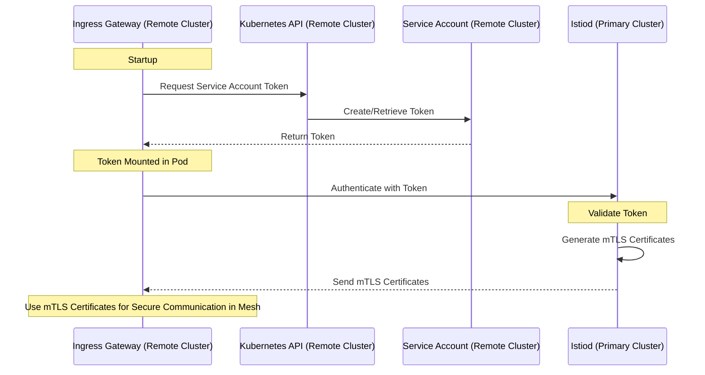

## Introduction

I often answer questions on [Istio's GitHub Discussions](https://github.com/istio/istio/discussions), and recently, I came across a [discussion](https://github.com/istio/istio/discussions/48343) about Istio's primary-remote deployment, specifically regarding how the remote cluster's gateway initially authenticates to an external Istiod instance. This issue touches upon the core security mechanisms of service meshes in multi-cluster configurations, which I think merits more in-depth sharing in the community.

In the official Istio documentation on [Installing Primary-Remote on different networks](https://istio.io/latest/docs/setup/install/multicluster/primary-remote_multi-network/), one of the steps is to [attach cluster2 as a remote cluster of cluster1](https://istio.io/latest/docs/setup/install/multicluster/primary-remote_multi-network/#attach-cluster2-as-a-remote-cluster-of-cluster1). This process creates a Secret containing a kubeconfig configuration, which includes the certificates and tokens required to access the remote cluster (cluster2).

```yaml
# This file is autogenerated, do not edit.
apiVersion: v1
kind: Secret
metadata:
  annotations:
    networking.istio.io/cluster: cluster2
  creationTimestamp: null
  labels:
    istio/multiCluster: "true"
  name: istio-remote-secret-cluster2
  namespace: istio-system
stringData:
  cluster2: |
    apiVersion: v1
    clusters:
    - cluster:
        certificate-authority-data: {CERTIFICATE}
        server: {CLUSTER2-APISERVER-ADDRESS}
      name: cluster2
    contexts:
    - context:
        cluster: cluster2
        user: cluster2
      name: cluster2
    current-context: cluster2
    kind: Config
    preferences: {}
    users:
    - name: cluster2
      user:
        token: {TOKEN}
```

The key role of this Secret is to enable Istio in the primary cluster (cluster1) to access the API server of the remote cluster, thereby obtaining service information. Additionally, in the remote cluster (cluster2), the Istiod service points to the primary cluster's Istiod service's LoadBalancer IP (ports 15012 and 15017), allowing cluster2 to communicate with the primary cluster's Istiod.

## Visualizing Authentication

Since both clusters share a CA (provided by the primary cluster) and the remote cluster can access its own API server, the Istiod in the primary cluster can validate requests from the remote cluster (cluster2). The following sequence diagram clearly shows this process:



This process is a key component of Istio's multi-cluster configuration, ensuring secure cross-cluster communication within the service mesh. As seen in this discussion, both the remote gateway and the services depend on the primary cluster's CA for initial mTLS authentication, providing a solid foundation for secure communication across the entire service mesh.

## Conclusion

In this blog, we explored how the gateway in a remote cluster initially authenticates to an external Istiod in Istio's primary-remote deployment. We explained how to create a Secret containing a kubeconfig to allow Istio in the primary cluster to access the remote cluster's API and how shared CA and service account tokens ensure the security of mTLS authentication. This process secures cross-cluster communication within the service mesh, providing key insights for understanding and implementing Istio's multi-cluster configuration.

---

*This blog was initially published at [tetrate.io](https://tetrate.io/blog/istio-multi-cluster-authentication-mtls/).*