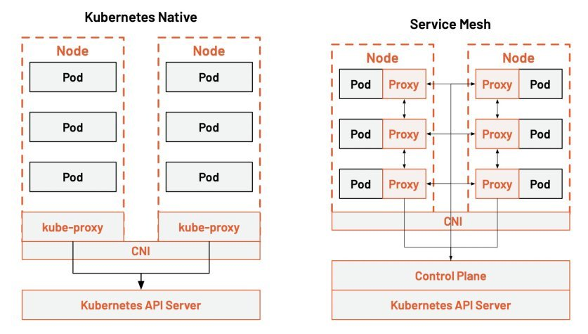
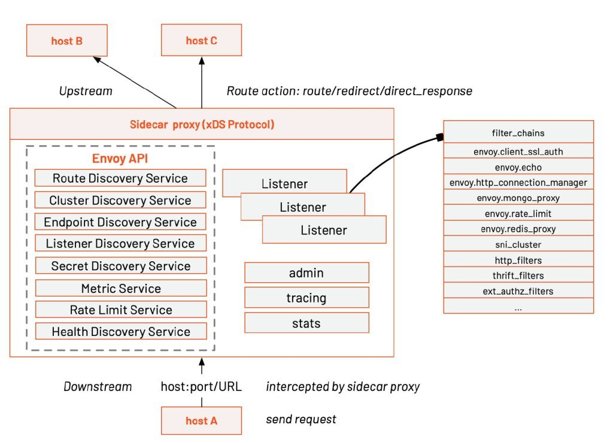
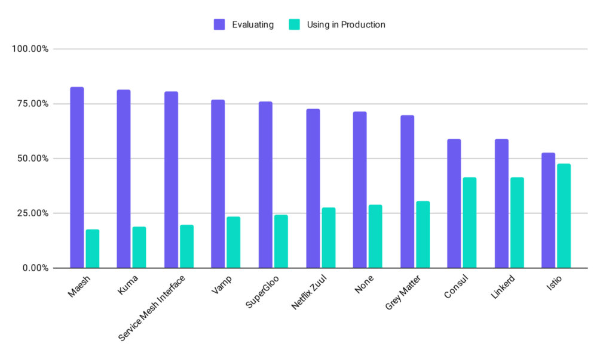

If you don’t know what Istio is, you can read my previous articles below:

- [What Is Istio and Why Does Kubernetes Need it?](https://www.tetrate.io/blog/what-is-istio-and-why-does-kubernetes-need-it/)
- [Why do you need Istio when you already have Kubernetes?](https://www.tetrate.io/blog/why-do-you-need-istio-when-you-already-have-kubernetes/)

This article will explore the relationship between service mesh and cloud native.

### Service mesh – the product of the container orchestration war

If you’ve been following the cloud-native space since its early days, you’ll remember the container orchestration wars of 2015 to 2017. Kubernetes won the container wars in 2017, the idea of microservices had taken hold, and the trend toward containerization was unstoppable. Kubernetes architecture matured and slowly became boring, and service mesh technologies, represented by Linkerd and Istio, entered the CNCF-defined cloud-native critical technologies on the horizon.

Kubernetes was designed with the concept of cloud-native in mind. A critical idea in cloud-native is the architectural design of microservices. When a single application is split into microservices, how can microservices be managed to ensure the SLA of the service as the number of services increases? The service mesh was born to solve this problem at the architectural level, free programmers’ creativity, and avoid tedious service discovery, monitoring, distributed tracing, and other matters.

The service mesh takes the standard functionality of microservices down to the infrastructure layer, allowing developers to focus more on business logic and thus speed up service delivery, which is consistent with the whole idea of cloud-native. You no longer need to integrate bulky SDKs in your application, develop and maintain SDKs for different languages, and just use the service mesh for Day 2 operations after the application is deployed.

The service mesh is regarded as the next generation of microservices. In the diagram, we can see that many of the concerns of microservices overlap with the functionality of Kubernetes. Kubernetes focuses on the application lifecycle, managing resources and deployments with little control over services. The service mesh fills this gap. The service mesh can connect, control, observe and protect microservices.

### **Kubernetes vs. xDS vs. Istio**

This diagram shows the layered architecture of Kubernetes and Istio.

The diagram indicates that the kube-proxy settings are global and cannot be controlled at a granular level for each service. All Kubernetes can do is topology-aware routing, routing traffic closer to the Pod, and setting network policies in and out of the Pod.

In contrast, the service mesh takes traffic control out of the service layer in Kubernetes through sidecar proxies, injects proxies into each Pod, and manipulates these distributed proxies through a control plane. It allows for more excellent resiliency.

Kube-proxy implements traffic load balancing between multiple pod instances of a Kubernetes service. But how do you finely control the traffic between these services — such as dividing the traffic by percentage to different application versions (which are all part of the same service, but on other deployments), or doing canary releases and blue-green releases?

The Kubernetes community gives a way to do canary releases using Deployment, assigning different pods to deployed services by modifying the pod’s label.

Currently, the most popular open-source implementation of service mesh in the world is Istio. From the [CNCF Survey Report 2020](https://www.cncf.io/wp-content/uploads/2020/11/CNCF_Survey_Report_2020.pdf), we know that Istio is the most used service mesh in production today. Many companies have built their service mesh based on Istio, such as Ant, Airbnb, eBay, NetEase, Tencent, etc.

Figure from [CNCF Survey Report 2020](https://www.cncf.io/wp-content/uploads/2020/11/CNCF_Survey_Report_2020.pdf)

Istio is developed based on Envoy, which has been used by default as its distributed proxy since the first day it was open-sourced. Envoy pioneered the creation of the xDS protocol for distributed gateway configuration, greatly simplifying the configuration of large-scale distributed networks. Ant Group open source MOSN also supported xDS In 2019. Envoy was also one of the first projects to graduate from CNCF, tested by large-scale production applications.

### Service mesh – the cloud-native networking infrastructure

With the above comparison between Kubernetes and service mesh in mind, we can see the place of service mesh in the cloud-native application architecture. That is, building a cloud-native network infrastructure specifically provides:

- Traffic management: controlling the flow of traffic and API calls between services, making calls more reliable, and enhancing network robustness in different environments.
- Observability: understanding the dependencies between services and the nature and flow of traffic between them provides the ability to identify problems quickly.
- Policy enforcement: controlling access policies between services by configuring the mesh rather than by changing the code.
- Service Identification and Security: providing service identifiability and security protection in the mesh.
