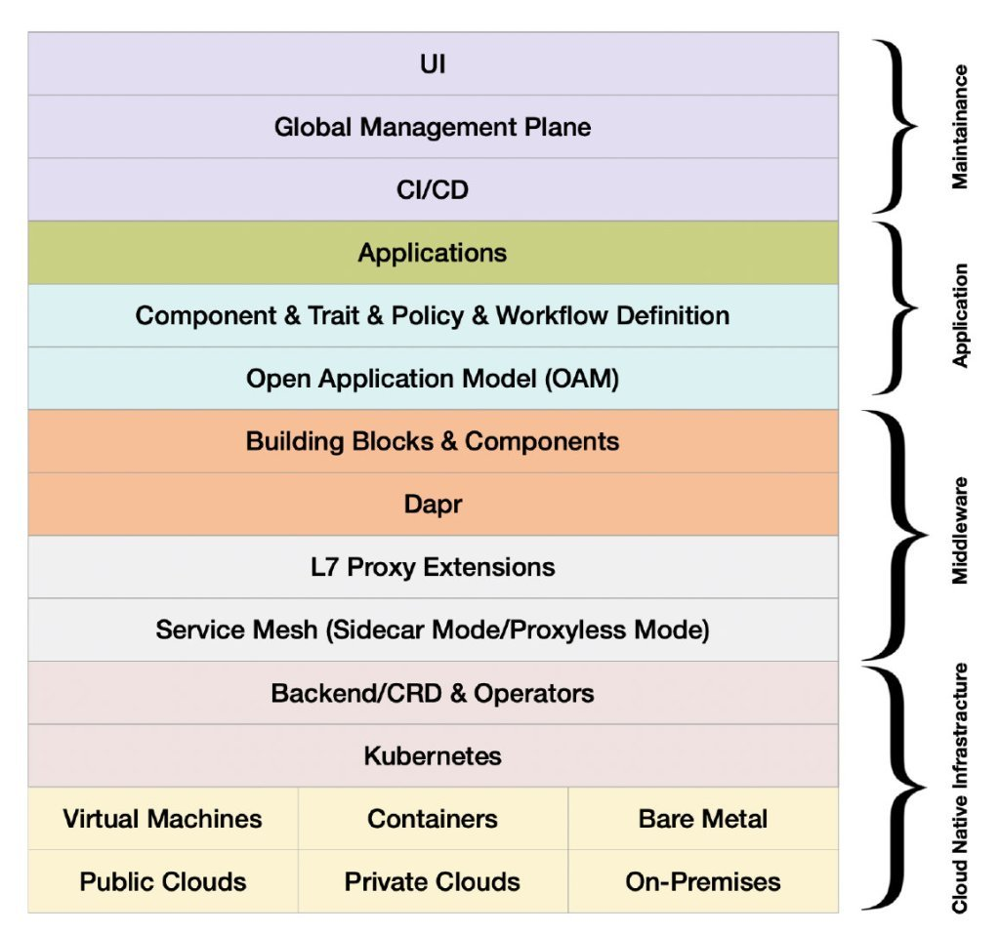
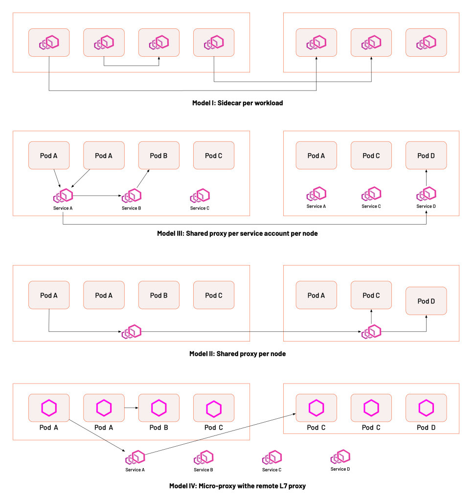

As the service mesh architecture concept gains traction and the scenarios for its applications emerge, there is no shortage of discussions about it in the community. I have worked on service mesh with the community for 4 years now, and will summarize the development of service mesh in 2021 from this perspective. Since Istio is the most popular service mesh, this article will focus on the technical and ecological aspects of Istio.

## Service mesh: a critical tech for Cloud Native Infrastructure 

As one of the vital technologies [defined by CNCF](https://github.com/cncf/toc/blob/main/DEFINITION.md) for cloud native, Istio has been around for five years now. Their development has gone through the following periods.

- Exploration phase: 2017-2018
- Early adopter phase: 2019-2020
- Large-scale landing and ecological development phase: 2021-present

Service mesh has crossed the “chasm”(refer [Crossing the Chasm](https://thinkinsights.net/strategy/crossing-the-chasm/) theory) and is in between the “early majority” and “late majority” phases of adoption. Based on feedback from the audience of [Istio Weekly,](https://github.com/tetratelabs/istio-weekly/) users are no longer blindly following new technologies for experimentation and are starting to consider whether they need them in their organization dialectically.

While new technologies and products continue to emerge, the service mesh, as part of the cloud native technology stack, has continued to solidify its position as the “cloud native network infrastructure” over the past year. The diagram below illustrates the cloud native technology stack model, where each layer has several representative technologies that define the standard. As new-age middleware, the service mesh mirrors other cloud native technologies, such as [Dapr](https://dapr.io/) (Distributed Application Runtime), which represents the capability model for cloud native middleware, [OAM](https://oam.dev/), which defines the cloud native application model, and the service mesh, which defines the L7 network model.

A layered view of the cloud native application platform technology stack

## Optimizing the mesh for large scale production applications with different deployment models

Over the past year, the community focused on the following areas.

- Performance optimization: performance issues of service mesh in large-scale application scenarios.
- Protocol and extensions: enabling service mesh to support arbitrary L7 network protocols.
- Deployment models: Proxyless vs. Node model vs. Sidecar model.
- eBPF: putting some of the service mesh’s capabilities to the kernel layer.

### Performance optimization

Istio was designed to serve service to service traffic by “proto-protocol forwarding”. The goal is making the service mesh as “transparent” as possible to applications. Thus using IPtables to hijack the traffic, according to the community-provided test results Istio 1.2 adds only 3 ms to the baseline latency for a mesh with 1000 RPS on 16 connections. However, because of issues inherent in the IPtables conntrack module, Istio’s performance issues begin to emerge as the mesh size increases. To optimize the performance of the Istio sidecar for resource usage and network latency, the community gave the following solutions.

- Sidecar configuration: By configuring service dependencies manually or by adding an Operator to the control plane, the number of service configurations sent to Sidecar can be reduced, thus reducing the resource footprint of the data plane; for more automatic and intelligent configuration of Sidecar, the open source projects [Slime](https://github.com/slime-io/slime) and [Aeraki](https://github.com/aeraki-framework/aeraki) both offer their innovative configuration loading solutions.
- The introduction of eBPF: eBPF can be a viable solution to optimize the performance of the service mesh. Some Cilium-based startups even radically propose to use eBPF to replace the Sidecar proxy completely. Still, the Envoy proxy/xDS protocol has become the proxy for the service mesh implementation and supports the Layer 7 protocol very well. We can use eBPF to improve network performance, but complex protocol negotiation, parsing, and user scaling remain challenging to implement on the user side.

### Protocol and extensions

Extensibility of Istio has always been a significant problem, and there are two aspects to Istio’s extensibility.

- Protocol level: allowing Istio to support all L7 protocols
- Ecological: allowing Istio to run more extensions

Istio uses Envoy as its data plane. Extending Istio is essentially an extension of Envoy’s functionality. Istio’s official solution is to use WebAssembly, and in Istio 1.12, the [Wasm plugin configuration API](https://www.tetrate.io/blog/istio-wasm-extensions-and-ecosystem/) was introduced to extend the Istio ecosystem. Istio’s extension mechanism uses the [Proxy-Wasm Application Binary Interface (ABI)](https://github.com/proxy-wasm/spec) specification to provide a set of proxy-independent streaming APIs and utilities that can be implemented in any language with an appropriate SDK. Today, Proxy-Wasm’s SDKs are AssemblyScript (similar to TypeScript), C++, Rust, Zig, and Go (using the TinyGo WebAssembly System Interface).

There are still relatively few WebAssembly extensions available, and many enterprises choose to customize their CRD and build a service mesh management plane based on Istio. In addition, making Istio support heterogeneous environments for all workloads, such as virtual machines and containers, is also in strong demand for end-users. It allows them to migrate applications from traditional loads to service mesh easily. Finally, there is the hybrid cloud traffic management with multiple clusters and mesh, which is a more advanced requirement.

### Deployment models

When the service mesh concept first emerged, there was a debate between the Per-node and Sidecar models, represented by Linkerd and Istio. eBPF later proposed a kernel to sink the service mesh, which led to more service mesh deployment models, as shown in the figure below.

These four deployment methods have their own advantages and disadvantages, the specific choice of which depends on the actual situation.

### Development of the Istio ecosystem and the projects that support Istio

2021 was also an exciting year for the Istio community, with a series of events and tutorials.

- February, the first Istio distribution, [Tetrate Istio Distro (TID)](https://istio.tetratelabs.io/).
- February, the first [IstioCon](https://events.istio.io/istiocon-2021/) was held online, with over 2,000 participants.
- March, the first free online [Istio Fundamentals Course](https://academy.tetrate.io/courses/istio-fundamentals) is released.
- May, the first [Certification Istio Administrator exam](https://academy.tetrate.io/courses/certified-istio-administrator) be released.
- May, ServiceMeshCon Europe was held online.
- July, [Istio Meetup China](https://istio.io/latest/zh/blog/2021/istiomeetups-china/) was held in Beijing with more than 100 attendees.
- October, ServiceMeshCon North America was held in Los Angeles.

There are also numerous open source projects related to Istio Service Mesh, as shown in the table below.

| **Project**                                                  | **Value**                                                    | **Relationship with Istio**                                  | **Category** | **Launch Date** | **Dominant company** | **Number of stars** |
| ------------------------------------------------------------ | ------------------------------------------------------------ | ------------------------------------------------------------ | ------------ | --------------- | -------------------- | ------------------- |
| [Envoy](https://github.com/envoyproxy/envoy)                 | Cloud native high-performance edge/middle-service proxy      | The default data plane                                       | proxy        | September 2016  | Lyft                 | 18700               |
| [Istio](https://github.com/istio/istio/)                     | Connection, secure, control, and observation services.       | Control plane                                                | service mesh | May 2017        | Google               | 29100               |
| [Emissary Gateway](https://github.com/emissary-ingress/emissary) | Kubernetes native API gateway for microservices, built on Envoy | Connectable to Istio                                         | gateway      | February 2018   | Ambassador           | 3600                |
| [APISIX](https://github.com/apache/apisix)                   | Cloud native API gateways                                    | It can run as a data plane for Istio or as a gateway on its own | gateway      | June 2019       | API7                 | 8100                |
| [MOSN](https://github.com/mosn/mosn)                         | Cloud native edge gateways & agents                          | Available as Istio data plane                                | proxy        | December 2019   | Ant                  | 3500                |
| [Slime](https://github.com/slime-io/slime)                   | Intelligent service mesh manager based on Istio              | Adding a management plane to Istio                           | extensions   | January 2021    | NetEase              | 236                 |
| [GetMesh](https://github.com/tetratelabs/getmesh)            | Istio integration and command-line management tools          | Utility for Istio multi-version management                   | tools        | February 2021   | Tetrate              | 95                  |
| [Aeraki](https://github.com/aeraki-framework/aeraki)         | Manage any of Istio’s seven layers of load                   | Extended multi-protocol support                              | extensions   | March 2021      | Tencent              | 330                 |
| [Layotto](https://github.com/mosn/layotto/)                  | Cloud native application runtime                             | Using as a data plane for Istio                              | runtime      | June 2021       | Ant                  | 393                 |
| [Hango Gateway](https://github.com/hango-io/hango-gateway)   | API gateways built on Envoy and Istio                        | Integrates with Istio                                        | gateway      | August 2021     | NetEase              | 253                 |

Note: Data is as of January 6, 2022

## Summary

Looking back, we can see that, unlike previous years where users were experimenting, users in 2021 looked for more practical uses for service mesh before implementing them. Their position as the infrastructure of cloud native networks is further strengthened, and more importantly, the service mesh ecosystem is emerging. Looking ahead, in 2022, two technologies to watch are eBPF and WebAssembly(Wasm). We believe that more good examples of service mesh practices will emerge, taking the ecology and standardization a step further.
