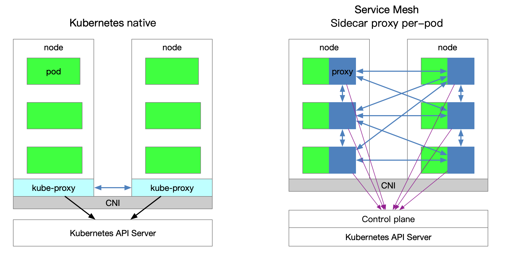
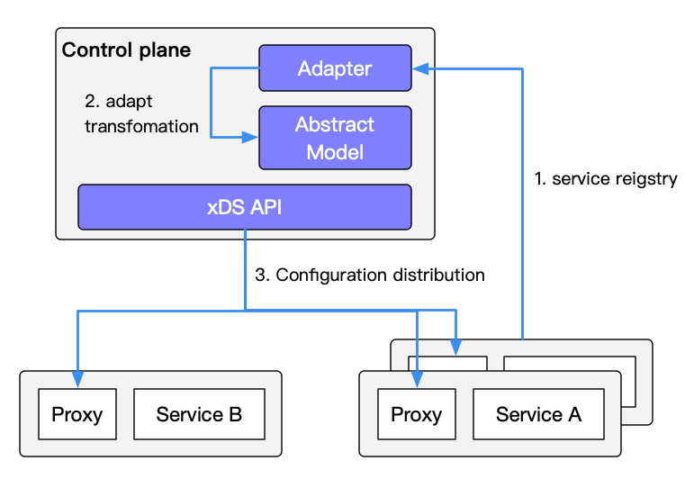
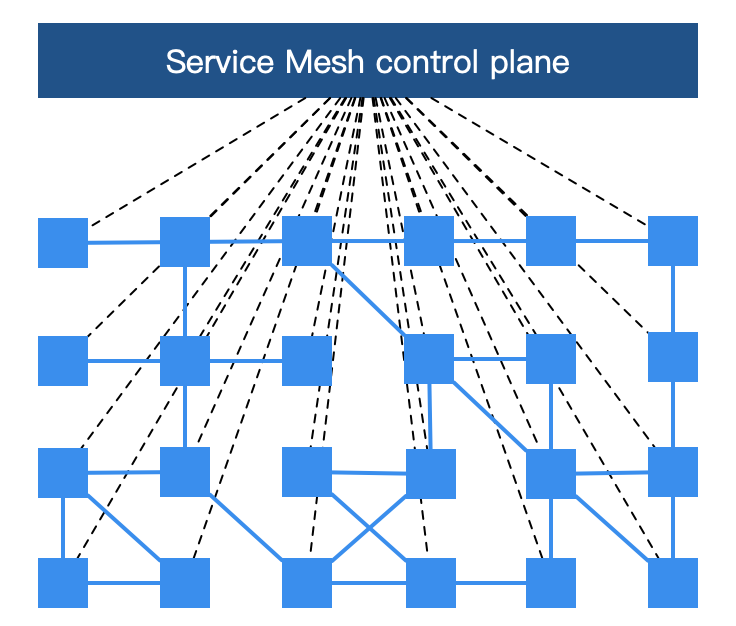
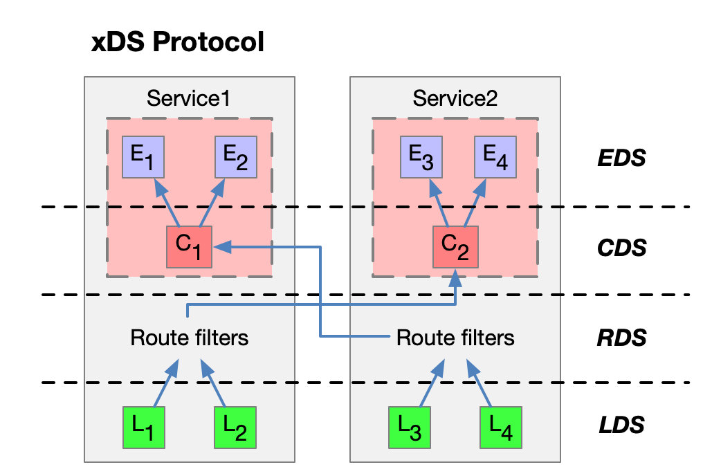
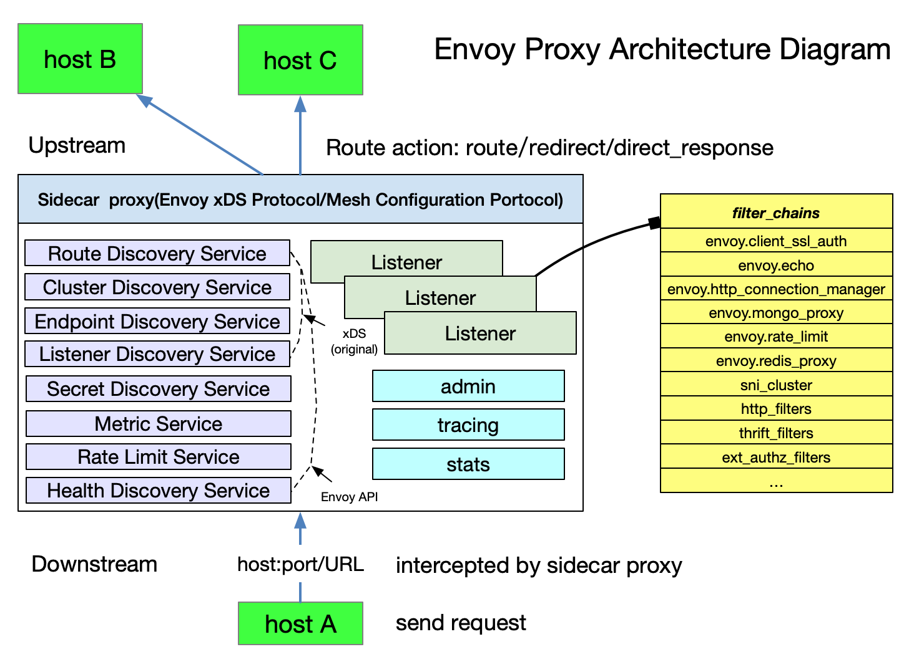
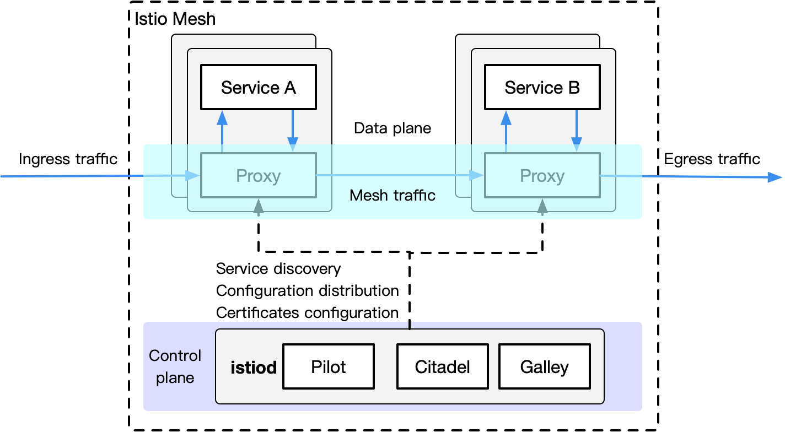

This article is a rework of previously written content and is included in the [Istio Handbook](https://www.servicemesher.com/istio-handbook) of the ServiceMesher community . Other chapters are still being compiled.

People who have just heard of Service Mesh and tried [Istio](https://istio.io/) may have the following questions:

1. Why does Istio bind Kubernetes?
1. What roles do Kubernetes and Service Mesh play in cloud native?
1. What aspects of Kubernetes has Istio extended? What problems have been solved?
1. What is the relationship between Kubernetes, xDS protocols ([Envoy](https://github.com/envoyproxy/envoy) , [MOSN,](https://github.com/mosn/mosn) etc) and Istio?
1. Should I use Service Mesh?

In this section, we will try to guide you through the internal connections between Kubernetes, the xDS protocol, and Istio Service Mesh. In addition, this section will also introduce the load balancing methods in Kubernetes, the significance of the xDS protocol for Service Mesh, and why Istio is needed in time for Kubernetes.

Using Service Mesh is not to say that it will break with Kubernetes, but that it will happen naturally. The essence of Kubernetes is to perform application lifecycle management through declarative configuration, while the essence of Service Mesh is to provide traffic and security management and observability between applications. If you have built a stable microservice platform using Kubernetes, how do you set up load balancing and flow control for calls between services?

The xDS protocol created by Envoy is supported by many open source software, such as [Istio](https://github.com/istio/istio) , [Linkerd](https://linkerd.io/) , [MOSN,](https://github.com/mosn/mosn) etc. Envoy's biggest contribution to Service Mesh or cloud native is the definition of xDS. Envoy is essentially a proxy. It is a modern version of proxy that can be configured through APIs. Based on it, many different usage scenarios are derived, such as API Gateway, Service Mesh. Sidecar proxy and Edge proxy in.

**This section contains the following**

- Explain the role of kube-proxy.
- Kubernetes' limitations in microservice management.
- Describe the features of Istio Service Mesh.
- Describe what xDS includes.
- Compare some concepts in Kubernetes, Envoy and Istio Service Mesh.

## Key takeaways

If you want to know everything in advance, here are some of the key points from this article:

- The essence of Kubernetes is application lifecycle management, specifically deployment and management (scaling, scaling, automatic recovery, release).
- Kubernetes provides a scalable and highly resilient deployment and management platform for microservices.
- The foundation of Service Mesh is a transparent proxy. After the traffic between microservices is intercepted through sidecar proxy, the behavior of microservices is managed through the control plane configuration.
- Service Mesh decoupled from Kubernetes traffic management, the internal flow without the need of Service Mesh `kube-proxy `supporting components, micro-services closer to abstract the application layer by, for traffic between management services, security and observability.
- xDS defines the protocol standards for Service Mesh configuration.
- Service Mesh is a higher-level abstraction of services in Kubernetes. Its next step is serverless.

## Kubernetes vs Service Mesh

The following figure shows the service access relationship between Kubernetes and Service Mesh (one sidecar per pod mode).

**Traffic forwarding**

Each node of the cluster Kubernetes a deployed `kube-proxy` assembly Kubernetes API Server may communicate with the cluster acquired [service](https://jimmysong.io/kubernetes-handbook/concepts/service.html) information, and then set iptables rules, sends a request for a service directly to the corresponding Endpoint (belonging to the same group service pod).

**Service discovery**

Istio Service Mesh can use the service in Kubernetes for service registration. It can also connect to other service discovery systems through the platform adapter of the control plane, and then generate the configuration of the data plane (using CRD statements, stored in etcd), a **transparent proxy** for the data plane. (Transparent proxy) is deployed in the sidecar container in each application service pod. These proxy need to request the control plane to synchronize the proxy configuration. The reason why is a transparent proxy, because there is no application container fully aware agent, the process kube-proxy components like the need to block traffic, but `kube-proxy`that blocks traffic to Kubernetes node and sidecar proxy that blocks out of the Pod For more information, see [Understanding Route Forwarding by the Envoy Sidecar Proxy in Istio Service Mesh](/en/blog/envoy-sidecar-routing-of-istio-service-mesh-deep-dive/) .

**Disadvantages of Service Mesh**

Because each node on Kubernetes many runs Pod, the original `kube-proxy`routing forwarding placed in each pod, the distribution will lead to a lot of configuration, synchronization, and eventual consistency problems. In order to perform fine-grained traffic management, a series of new abstractions will be added, which will further increase the user's learning costs. However, with the popularization of technology, this situation will gradually ease.

**Advantages of Service Mesh**

`kube-proxy` The settings are globally effective, and fine-grained control of each service cannot be performed. Service Mesh uses sidecar proxy to extract the control of traffic in Kubernetes from the service layer, which can be further expanded.

## kube-proxy component

In Kubernetes cluster, each Node to run a `kube-proxy ` process. `kube-proxy` Responsible for the `Service` realization of a VIP (virtual IP) form. In Kubernetes v1.0, the proxy is implemented entirely in userspace. Kubernetes v1.1 adds the [iptables proxy mode](https://jimmysong.io/kubernetes-handbook/concepts/service.html#iptables-代理模式) , but it is not the default operating mode. As of Kubernetes v1.2, the iptables proxy is used by default. In Kubernetes v1.8.0-beta.0, the [ipvs proxy mode was added](https://jimmysong.io/kubernetes-handbook/concepts/service.html#ipvs-代理模式) . More about kube-proxy component description please refer [kubernetes Description: service and kube-proxy principle](https://cizixs.com/2017/03/30/kubernetes-introduction-service-and-kube-proxy/) and [use IPVS achieve Kubernetes inlet flow load balancing](https://jishu.io/kubernetes/ipvs-loadbalancer-for-kubernetes/) .

### kube-proxy flaws

[The disadvantages of kube-proxy](https://cizixs.com/2017/03/30/kubernetes-introduction-service-and-kube-proxy/) :

> First, if forwarded pod can not provide normal service, it does not automatically try another pod, of course, this can [`liveness probes`](https://jimmysong.io/kubernetes-handbook/guide/configure-liveness-readiness-probes.html) be solved. Each pod has a health check mechanism. When there is a problem with the health of the pod, kube-proxy will delete the corresponding forwarding rule. In addition, `nodePort`types of services cannot add TLS or more sophisticated message routing mechanisms.

Kube-proxy implements load balancing of traffic among multiple pod instances of the Kubernetes service, but how to fine-grained control the traffic between these services, such as dividing the traffic into different application versions by percentage (these applications belong to the same service , But on a different deployment), do canary release and blue-green release? Kubernetes community gives the [method using the Deployment do canary release](https://kubernetes.io/docs/concepts/cluster-administration/manage-deployment/#canary-deployments) , essentially by modifying the pod of the method [label](https://jimmysong.io/kubernetes-handbook/concepts/label.html) different pod to be classified into the Deployment of Service.

## Kubernetes Ingress vs. Istio Gateway

Speaking above `kube-proxy`the flow inside the only route Kubernetes clusters, and we know that Pod Kubernetes cluster located [CNI](https://jimmysong.io/kubernetes-handbook/concepts/cni.html) outside the network created, external cluster is unable to communicate directly with, so Kubernetes created in the [ingress](https://jimmysong.io/kubernetes-handbook/concepts/ingress.html) of this resource object, which is located by the Kubernetes [edge nodes](https://jimmysong.io/kubernetes-handbook/practice/edge-node-configuration.html) (such nodes can be many or a group) are driven by the Ingress controller, which is responsible for managing **north-south traffic** . Ingress must be [connected to](https://traefik.io/) various ingress controllers, such as [nginx ingress controller](https://github.com/kubernetes/ingress-nginx) and [traefik](https://traefik.io/) . Ingress is only applicable to HTTP traffic, and its usage is also very simple. It can only route traffic by matching limited fields such as service, port, and HTTP path, which makes it unable to route TCP traffic such as MySQL, Redis, and various private RPCs. To directly route north-south traffic, you can only use Service's LoadBalancer or NodePort. The former requires cloud vendor support, while the latter requires additional port management. Some Ingress controllers support exposing TCP and UDP services, but they can only be exposed using Services. Ingress itself does not support it, such as the [nginx ingress controller](https://kubernetes.github.io/ingress-nginx/user-guide/exposing-tcp-udp-services/) . The exposed port of the service is configured by creating a ConfigMap.

Istio Gateway is similar to Kubernetes Ingress in that it is responsible for north-south traffic to the cluster. `Gateway`The load balancer described by Istio is used to carry connections in and out of the edge of the mesh. The specification describes a series of open ports and the protocols used by these ports, SNI configuration for load balancing, and so on. Gateway is a [CRD extension](https://jimmysong.io/kubernetes-handbook/concepts/crd.html) . It also [reuses](https://istio.io/docs/reference/config/networking/gateway/) the capability of sidecar proxy. For detailed configuration, please refer to [Istio official website](https://istio.io/docs/reference/config/networking/gateway/) .

## xDS protocol

You may have seen the following picture when you understand Service Mesh. Each block represents an instance of a service, such as a Pod in Kubernetes (which contains a sidecar proxy). The xDS protocol controls all traffic in Istio Service Mesh. The specific behavior is to link the squares in the figure below.

The xDS protocol was proposed by [Envoy](https://envoyproxy.io/) . The original xDS protocols in the Envoy v2 API refer to CDS (Cluster Discovery Service), EDS (Endpoint Discovery Service), LDS (Listener Discovery Service), and RDS (Route Discovery Service). Later, in the v3 version, Scoped Route Discovery Service (SRDS), Virtual Host Discovery Service (VHDS), Secret Discovery Service (SDS), and Runtime Discovery Service (RTDS) were developed. See the [xDS REST and gRPC protocol for](https://www.envoyproxy.io/docs/envoy/latest/api-docs/xds_protocol) details .

Let's take a look at the xDS protocol with a service with two instances each.

The arrow in the figure above is not the path or route after the traffic enters the proxy, nor is it the actual sequence. It is an imagined xDS interface processing sequence. In fact, there are cross references between xDS.

Agents that support the xDS protocol dynamically discover resources by querying files or managing servers. In summary, the corresponding discovery service and its corresponding API are called  xDS. Envoy by **subscription (subscription)** to get the resources the way, there are three ways to subscribe:

- **File subscription** : Monitor files in the specified path, the easiest way to find dynamic resource is to save it in a file and path configuration in [ConfigSource](https://www.envoyproxy.io/docs/envoy/latest/api-v2/api/v2/core/config_source.proto#core-configsource) the `path`parameter.
- **gRPC streaming subscription** : Each xDS API can be individually configured [`ApiConfigSource`](https://www.envoyproxy.io/docs/envoy/latest/api-v2/api/v2/core/config_source.proto#core-apiconfigsource)to point to the cluster address of the corresponding upstream management server.
- **Polling REST-JSON polling subscription** : A single xDS API can perform synchronous (long) polling of REST endpoints.

For details of the above xDS subscription methods, please refer to the [xDS protocol analysis](https://jimmysong.io/istio-handbook/concepts/envoy-xds-protocol.html) . Istio uses gRPC streaming subscriptions to configure sidecar proxy for all data planes.

The article introduces the overall architecture of the Istio pilot, the generation of proxy configuration, the function of the pilot-discovery module, and the CDS, EDS, and ADS in the xDS protocol. For details on ADS, please refer to the [official Envoy documentation](https://www.envoyproxy.io/docs/envoy/latest/api-v2/service/discovery/v2/ads.proto) .

### xDS protocol highlights

Finally, summarize the main points about the xDS protocol:

- CDS, EDS, LDS, and RDS are the most basic xDS protocols, and they can be updated independently.
- All Discovery Services can connect to different Management Servers, which means that there can be multiple servers managing xDS.
- Envoy has made a series of extensions based on the original xDS protocol, adding SDS (Key Discovery Service), ADS (Aggregated Discovery Service), HDS (Health Discovery Service), MS (Metric Service), RLS (Rate Limiting Service) Wait for the API.
- To ensure data consistency, if used directly xDS original API, it needs to ensure that such sequential update: CDS -> EDS -> LDS -> RDS, which is to follow the electronic engineering **before-break** (Make-Before-Break) The principle is to establish a new connection before disconnecting the original connection. The application in routing is to prevent the situation where the upstream cluster cannot be found and the traffic is dropped when a new routing rule is set, similar to the circuit Open circuit.
- CDS sets which services are in the service mesh.
- EDS sets which instances (Endpoints) belong to these services (Cluster).
- LDS sets the listening port on the instance to configure routing.
- The routing relationship between RDS final services should ensure that RDS is updated last.

## Envoy

Envoy is the default sidecar in Istio Service Mesh. Based on Enovy, Istio has extended its control plane in accordance with Envoy's xDS protocol. Before talking about the Envoy xDS protocol, we need to be familiar with the basic terms of Envoy. The following lists the basic terms and data structure analysis in Envoy. For a detailed introduction to [Envoy](http://www.servicemesher.com/envoy/) , please refer to the [official Envoy document](http://www.servicemesher.com/envoy/) . As for how Envoy works as a forwarding proxy in Service Mesh (not limited to Istio), please refer to NetEase Cloud Liu Chao this [in-depth interpretation of the technical details behind the Service Mesh](https://www.cnblogs.com/163yun/p/8962278.html) and [understanding Istio Service Mesh Envoy agent in Sidecar injection and traffic hijacking](https://jimmysong.io/blog/envoy-sidecar-injection-in-istio-service-mesh-deep-dive/) , in which the article refers to some of the points, the details will not be repeated.

### Basic terminology

Here are the basic terms in Enovy you should know:

- **Downstream** : The downstream host connects to Envoy, sends a request and receives a response, that is, the host sending the request.
- **Upstream** : The upstream host receives the connection and request from Envoy and returns a response, that is, the host that accepted the request.
- **Listener** : The listener is a named network address (for example, port, unix domain socket, etc.), and downstream clients can connect to these listeners. Envoy exposes one or more listeners to connect to downstream hosts.
- **Cluster** : A cluster is a group of logically identical upstream hosts connected to Envoy. Envoy [discovers](http://www.servicemesher.com/envoy/intro/arch_overview/service_discovery.html#arch-overview-service-discovery) members of the cluster through [service discovery](http://www.servicemesher.com/envoy/intro/arch_overview/service_discovery.html#arch-overview-service-discovery) . You can choose to determine the health status of cluster members through [active health checks](http://www.servicemesher.com/envoy/intro/arch_overview/health_checking.html#arch-overview-health-checking) . Envoy uses [load balancing policies](http://www.servicemesher.com/envoy/intro/arch_overview/load_balancing.html#arch-overview-load-balancing) to decide which member of the cluster to route requests to.

Envoy can set multiple Listeners, and each Listener can also set a filter chain, and the filters are extensible, which can make it easier for us to manipulate traffic behavior, such as setting encryption, private RPC, and so on.

The xDS protocol was proposed by Envoy and is now the default sidecar proxy in Istio. However, as long as the xDS protocol is implemented, it can theoretically be used as a sidecar proxy in Istio, such as the open source proxy [MOSN](https://github.com/mosn/mosn) by [Ant Group](https://www.antfin.com) .

## Istio Service Mesh

Istio is a very feature-rich Service Mesh, which includes the following functions:

- Traffic Management: This is the most basic feature of Istio.
- Policy control: Implemented through Mixer components and various adapters to implement access control systems, telemetry capture, quota management, and billing.
- Observability: Achieved through Mixer.
- Security certification: Citadel components do key and certificate management.

### Traffic Management in Istio

Istio defined as the [CRD](https://jimmysong.io/kubernetes-handbook/concepts/custom-resource.html) to help users perform traffic management:

- **Gateway** : [Gateway](https://istio.io/docs/reference/config/networking/gateway/) describes a load balancer running at the edge of the network for receiving incoming or outgoing HTTP / TCP connections.
- **VirtualService** : [VirtualService](https://istio.io/docs/reference/config/networking/virtual-service/) actually connects Kubernetes services to Istio Gateway. It can also do more, such as defining a set of traffic routing rules to apply when a host is addressed.
- **DestinationRule** : [`DestinationRule`](https://istio.io/zh/docs/reference/config/networking/destination-rule/)The defined policy determines the access policy of the traffic after routing processing. Simply put, it defines how the traffic is routed. These policies can define load balancing configurations, connection pool sizes, and external detection (used to identify and evict unhealthy hosts in a load balancing pool) configuration.
- **EnvoyFilter** : The [`EnvoyFilter`](https://istio.io/docs/reference/config/networking/envoy-filter/)object describes filters for proxy services that can customize the proxy configuration generated by Istio Pilot. This configuration is rarely used by beginning users.
- **ServiceEntry** : By default, services in Istio Service Mesh cannot discover services outside Mesh. It [`ServiceEntry`](https://istio.io/docs/reference/config/networking/service-entry/)can add additional entries to the service registry inside Istio, so that services automatically discovered in the mesh can access and route to these manual Joined services.

## Kubernetes vs xDS vs Istio

After the reading of the above Kubernetes `kube-proxy`after abstraction component, and XDS Istio in traffic management, we will take you far as the traffic management aspect of comparison components corresponding to the three / protocol (note, not completely three equivalents).

| Governors  | xDS      | Istio Service Mesh |
| ---------- | -------- | ------------------ |
| Endpoint   | Endpoint | -                  |
| Service    | Route    | VirtualService     |
| kube-proxy | Route    | DestinationRule    |
| kube-proxy | Listener | EnvoyFilter        |
| Ingress    | Listener | Gateway            |
| Service    | Cluster  | ServiceEntry       |

## Conclusion

If you say that the objects managed by Kubernetes are Pods, then the objects managed by Service Mesh are Service. Therefore, it is a natural thing to apply Service Mesh after using Kubernetes to manage microservices. If you do n’t want to manage even the Service, use [serverless](https://github.com/knative/) platforms like knative, but that's what comes next.

The function of Envoy/MOSN is not just for traffic forwarding. The above concepts are just the tip of the iceberg in Istio's new layer of abstraction over Kubernetes. This will be the beginning of the book.

## Reference

- [In-depth interpretation of the technical details behind Service Mesh-cnblogs.com](https://www.cnblogs.com/163yun/p/8962278.html)
- [Understanding Envoy Proxy Sidecar Injection and Traffic Hijacking in Istio Service Mesh - jimmysong.io](https://jimmysong.io/blog/envoy-sidecar-injection-in-istio-service-mesh-deep-dive/)
- [Introduction to kubernetes: service and kube-proxy principles - cizixs.com](https://cizixs.com/2017/03/30/kubernetes-introduction-service-and-kube-proxy/)
- [Kubernetes Ingress Traffic Load Balancing Using IPVS - jishu.io](https://jishu.io/kubernetes/ipvs-loadbalancer-for-kubernetes/)
- [xDS REST and gRPC protocol - envoyproxy.io](https://www.envoyproxy.io/docs/envoy/latest/api-docs/xds_protocol)
