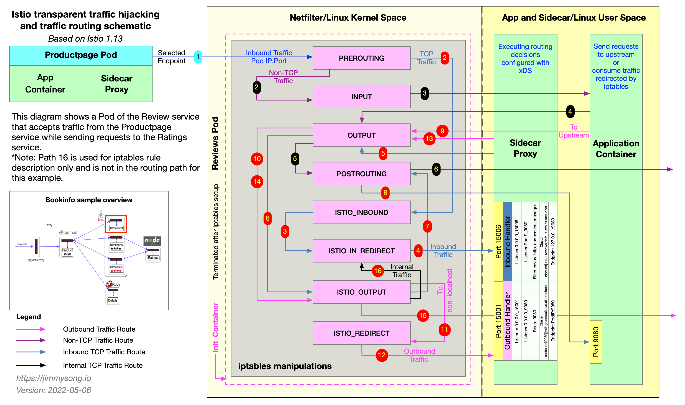
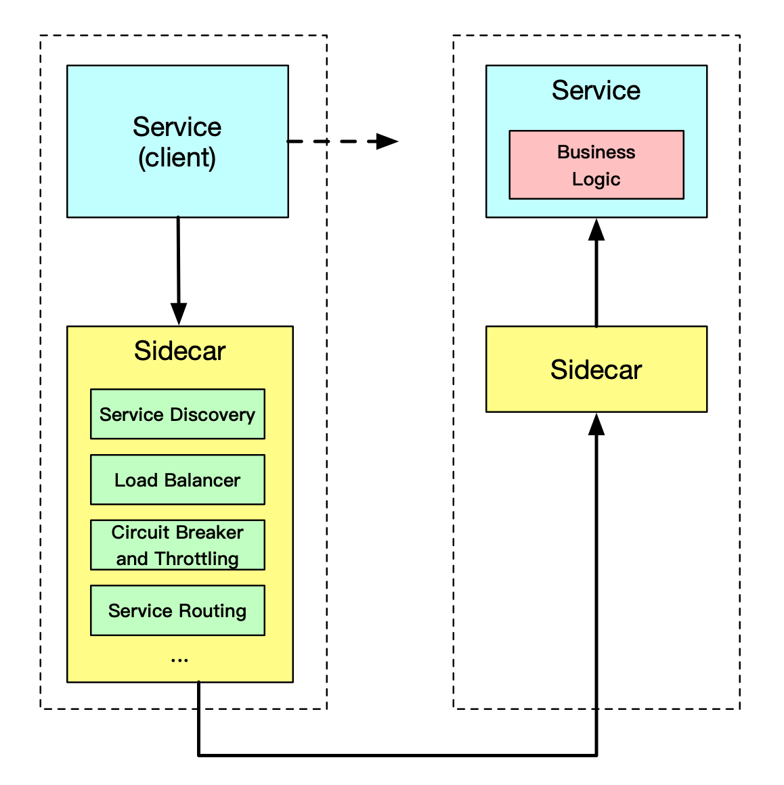
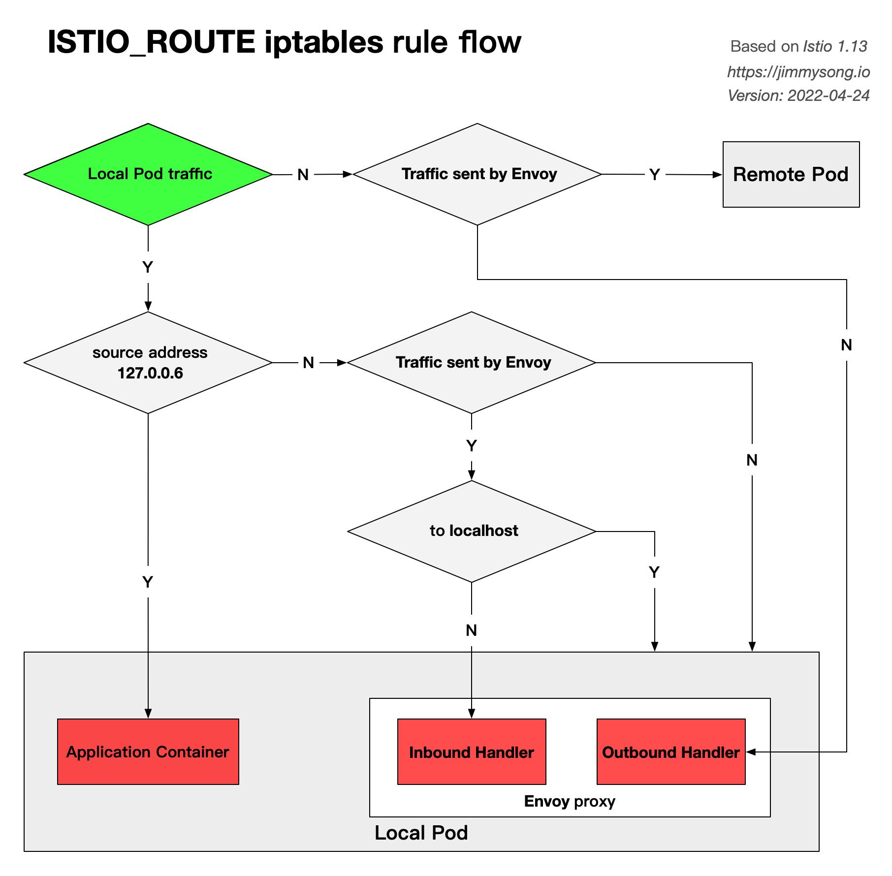
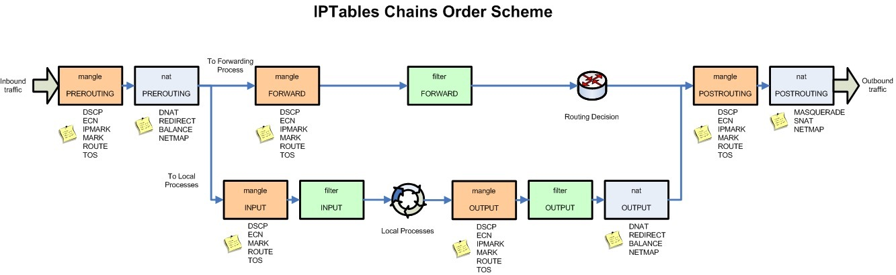
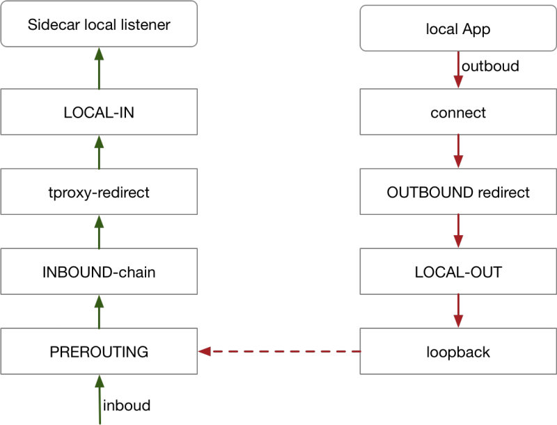

Updated on May 6, 2022

Based on Istio version 1.13, this article will present the following.

- What is the sidecar pattern and what advantages does it have?
- How are the sidecar injections done in Istio?
- How does the sidecar proxy do transparent traffic hijacking?
- How is the traffic routed to upstream?

The figure below shows how the `productpage` service requests access to `http://reviews.default.svc.cluster.local:9080/` and how the sidecar proxy inside the reviews service does traffic blocking and routing forwarding when traffic goes inside the `reviews` service.



At the beginning of the first step, the sidecar in the `productpage` pod has selected a pod of the reviews service to be requested via EDS, knows its IP address, and sends a TCP connection request.

There are three versions of the reviews service, each with an instance, and the sidecar work steps in the three versions are similar, as illustrated below only by the sidecar traffic forwarding step in one of the Pods.

There's a Chinese version of this blog: [阅读中文版](/blog/sidecar-injection-iptables-and-traffic-routing)

## Sidecar pattern

Dividing the functionality of an application into separate processes running in the same minimal scheduling unit (e.g. Pod in Kubernetes) can be considered sidecar mode. As shown in the figure below, the sidecar pattern allows you to add more features next to your application without additional third-party component configuration or modifications to the application code.



The Sidecar application is loosely coupled to the main application. It can shield the differences between different programming languages and unify the functions of microservices such as observability, monitoring, logging, configuration, circuit breaker, etc.

### Advantages of using the Sidecar pattern

When deploying a service mesh using the sidecar model, there is no need to run an agent on the node, but multiple copies of the same sidecar will run in the cluster. In the sidecar deployment model, a companion container (such as Envoy or MOSN) is deployed next to each application's container, which is called a sidecar container. The sidecar takes overall traffic in and out of the application container. In Kubernetes' Pod, a sidecar container is injected next to the original application container, and the two containers share storage, networking, and other resources.

Due to its unique deployment architecture, the sidecar model offers the following advantages.

- Abstracting functions unrelated to application business logic into a common infrastructure reduces the complexity of microservice code.
- Reduce code duplication in microservices architectures because it is no longer necessary to write the same third-party component profiles and code.
- The sidecar can be independently upgraded to reduce the coupling of application code to the underlying platform.

## Sidecar injection in Istio

The following two sidecar injection methods are available in Istio.

- Manual injection using `istioctl`.
- Kubernetes-based [mutating webhook admission controller](https://kubernetes.io/docs/reference/access-authn-authz/admission-controllers/) automatic sidecar injection method.

Whether injected manually or automatically, SIDECAR's injection process follows the following steps.

1. Kubernetes needs to know the Istio cluster to which the sidecar to be injected is connected and its configuration.
2. Kubernetes needs to know the configuration of the sidecar container itself to be injected, such as the image address, boot parameters, etc.
3. Kubernetes injects the above configuration into the side of the application container by the sidecar injection template and the configuration parameters of the above configuration-filled sidecar.

The sidecar can be injected manually using the following command.

```bash
istioctl kube-inject -f ${YAML_FILE} | kuebectl apply -f -
```

This command is injected using Istio's built-in sidecar configuration, see the [Istio official website](https://istio.io) for details on how to use Istio below.

When the injection is complete you will see that Istio has injected initContainer and sidecar proxy-related configurations into the original pod template.

### Init container

The Init container is a dedicated container that runs before the application container is launched and is used to contain some utilities or installation scripts that do not exist in the application image.

Multiple Init containers can be specified in a Pod, and if more than one is specified, the Init containers will run sequentially. The next Init container can only be run if the previous Init container must run successfully. Kubernetes only initializes the Pod and runs the application container when all the Init containers have been run.

The Init container uses Linux Namespace, so it has a different view of the file system than the application container. As a result, they can have access to Secret in a way that application containers cannot.

During Pod startup, the Init container starts sequentially after the network and data volumes are initialized. Each container must be successfully exited before the next container can be started. If exiting due to an error will result in a container startup failure, it will retry according to the policy specified in the Pod's restartPolicy. However, if the Pod's restartPolicy is set to Always, the restartPolicy is used when the Init container failed.

The Pod will not become Ready until all Init containers are successful. The ports of the Init containers will not be aggregated in the Service. The Pod that is being initialized is in the Pending state but should set the Initializing state to true. The Init container will automatically terminate once it is run.

## Sidecar injection example analysis

For a detailed YAML configuration for the bookinfo applications, see `bookinfo.yaml` for the official Istio YAML of productpage in the bookinfo sample.

The following will be explained in the following terms.

- Injection of Sidecar containers
- Creation of iptables rules
- The detailed process of routing

```yaml
apiVersion: apps/v1
kind: Deployment
metadata:
  name: productpage-v1
  labels:
    app: productpage
    version: v1
spec:
  replicas: 1
  selector:
    matchLabels:
      app: productpage
      version: v1
  template:
    metadata:
      labels:
        app: productpage
        version: v1
    spec:
      serviceAccountName: bookinfo-productpage
      containers:
      - name: productpage
        image: docker.io/istio/examples-bookinfo-productpage-v1:1.15.0
        imagePullPolicy: IfNotPresent
        ports:
        - containerPort: 9080
        volumeMounts:
        - name: tmp
          mountPath: /tmp
      volumes:
      - name: tmp
        emptyDir: {}
```

Let's see the `productpage` container’s [Dockerfile](https://github.com/istio/istio/blob/master/samples/bookinfo/src/productpage/Dockerfile).

```docker
FROM python:3.7.4-slim

COPY requirements.txt ./
RUN pip install --no-cache-dir -r requirements.txt

COPY test-requirements.txt ./
RUN pip install --no-cache-dir -r test-requirements.txt

COPY productpage.py /opt/microservices/
COPY tests/unit/* /opt/microservices/
COPY templates /opt/microservices/templates
COPY static /opt/microservices/static
COPY requirements.txt /opt/microservices/

ARG flood_factor
ENV FLOOD_FACTOR ${flood_factor:-0}

EXPOSE 9080
WORKDIR /opt/microservices
RUN python -m unittest discover

USER 1

CMD ["python", "productpage.py", "9080"]
```

We see that `ENTRYPOINT` is not configured in Dockerfile, so `CMD`’s configuration `python productpage.py 9080` will be the default `ENTRYPOINT`, keep that in mind and look at the configuration after the sidecar injection.

```bash
$ istioctl kube-inject -f samples/bookinfo/platform/kube/bookinfo.yaml
```

We intercept only a portion of the YAML configuration that is part of the Deployment configuration associated with productpage.

```yaml
      containers:
      - image: docker.io/istio/examples-bookinfo-productpage-v1:1.15.0 # application image
        name: productpage
        ports:
        - containerPort: 9080
      - args:
        - proxy
        - sidecar
        - --domain
        - $(POD_NAMESPACE).svc.cluster.local
        - --configPath
        - /etc/istio/proxy
        - --binaryPath
        - /usr/local/bin/envoy
        - --serviceCluster
        - productpage.$(POD_NAMESPACE)
        - --drainDuration
        - 45s
        - --parentShutdownDuration
        - 1m0s
        - --discoveryAddress
        - istiod.istio-system.svc:15012
        - --zipkinAddress
        - zipkin.istio-system:9411
        - --proxyLogLevel=warning
        - --proxyComponentLogLevel=misc:error
        - --connectTimeout
        - 10s
        - --proxyAdminPort
        - "15000"
        - --concurrency
        - "2"
        - --controlPlaneAuthPolicy
        - NONE
        - --dnsRefreshRate
        - 300s
        - --statusPort
        - "15020"
        - --trust-domain=cluster.local
        - --controlPlaneBootstrap=false
        image: docker.io/istio/proxyv2:1.5.1 # sidecar proxy
        name: istio-proxy
        ports:
        - containerPort: 15090
          name: http-envoy-prom
          protocol: TCP
      initContainers:
      - command:
        - istio-iptables
        - -p
        - "15001"
        - -z
        - "15006"
        - -u
        - "1337"
        - -m
        - REDIRECT
        - -i
        - '*'
        - -x
        - ""
        - -b
        - '*'
        - -d
        - 15090,15020
        image: docker.io/istio/proxyv2:1.5.1 # init container
        name: istio-init
```

Istio's configuration for application Pod injection mainly includes:

- Init container `istio-init`: for setting iptables port forwarding in the pod
- Sidecar container `istio-proxy`: running a sidecar proxy, such as Envoy or MOSN

The two containers will be parsed separately.

## Init container analysis

The Init container that Istio injects into the pod is named `istio-init`, and we see in the YAML file above after Istio's injection is complete that the init command for this container is.

```bash
istio-iptables -p 15001 -z 15006 -u 1337 -m REDIRECT -i '*' -x "" -b '*' -d 15090,15020
```

Let's check the container's Dockerfile again to see how `ENTRYPOINT` determines what commands are executed at startup.

```docker
# ommit
# The pilot-agent will bootstrap Envoy.
ENTRYPOINT ["/usr/local/bin/pilot-agent"]
```

We see that the entrypoint of the `istio-init` container is the `/usr/local/bin/istio-iptables` command line, and the location of the code for this command-line tool is in the `tools/istio-iptables` directory of the Istio source code repository.

### Init container initiation

The Init container's entrypoint is the `istio-iptables` command line, which is used as follows.

```bash
Usage:
  istio-iptables [flags]

Flags:
  -n, --dry-run                                     Do not call any external dependencies like iptables
  -p, --envoy-port string                           Specify the envoy port to which redirect all TCP traffic (default $ENVOY_PORT = 15001)
  -h, --help                                        help for istio-iptables
  -z, --inbound-capture-port string                 Port to which all inbound TCP traffic to the pod/VM should be redirected to (default $INBOUND_CAPTURE_PORT = 15006)
      --iptables-probe-port string                  set listen port for failure detection (default "15002")
  -m, --istio-inbound-interception-mode string      The mode used to redirect inbound connections to Envoy, either "REDIRECT" or "TPROXY"
  -b, --istio-inbound-ports string                  Comma separated list of inbound ports for which traffic is to be redirected to Envoy (optional). The wildcard character "*" can be used to configure redirection for all ports. An empty list will disable
  -t, --istio-inbound-tproxy-mark string
  -r, --istio-inbound-tproxy-route-table string
  -d, --istio-local-exclude-ports string            Comma separated list of inbound ports to be excluded from redirection to Envoy (optional). Only applies  when all inbound traffic (i.e. "*") is being redirected (default to $ISTIO_LOCAL_EXCLUDE_PORTS)
  -o, --istio-local-outbound-ports-exclude string   Comma separated list of outbound ports to be excluded from redirection to Envoy
  -i, --istio-service-cidr string                   Comma separated list of IP ranges in CIDR form to redirect to envoy (optional). The wildcard character "*" can be used to redirect all outbound traffic. An empty list will disable all outbound
  -x, --istio-service-exclude-cidr string           Comma separated list of IP ranges in CIDR form to be excluded from redirection. Only applies when all  outbound traffic (i.e. "*") is being redirected (default to $ISTIO_SERVICE_EXCLUDE_CIDR)
  -k, --kube-virt-interfaces string                 Comma separated list of virtual interfaces whose inbound traffic (from VM) will be treated as outbound
      --probe-timeout duration                      failure detection timeout (default 5s)
  -g, --proxy-gid string                            Specify the GID of the user for which the redirection is not applied. (same default value as -u param)
  -u, --proxy-uid string                            Specify the UID of the user for which the redirection is not applied. Typically, this is the UID of the proxy container
  -f, --restore-format                              Print iptables rules in iptables-restore interpretable format (default true)
      --run-validation                              Validate iptables
      --skip-rule-apply                             Skip iptables apply
```

The above incoming parameters are reassembled into iptables rules. For more information on how to use this command, visit `tools/istio-iptables/pkg/cmd/root.go`.

The significance of the container's existence is that it allows the sidecar agent to intercept all inbound and outbound traffic to the pod, redirect all inbound traffic to port 15006 (sidecar) except port 15090 (used by Prometheus) and port 15092 (Ingress Gateway), and then intercept outbound traffic from the application container which is processed by sidecar (listening through port 15001) and then outbound. See the [official Istio documentation](https://istio.io/docs/ops/deployment/requirements/) for port usage in Istio.

**Command analysis**

Here is the purpose of this start-up command.

- Forward all traffic from the application container to port 15006 of the sidecar.
- Run with the `istio-proxy` user identity, with a UID of 1337, the userspace where the sidecar is located, which is the default user used by the `istio-proxy` container, see the runAsUser field of the YAML configuration.
- Use the default REDIRECT mode to redirect traffic.
- Redirect all outbound traffic to the sidecar proxy (via port 15001).

Because the Init container is automatically terminated after initialization, since we cannot log into the container to view the iptables information, the Init container initialization results are retained in the application container and sidecar container.

## iptables manipulation analysis

In order to view the iptables configuration, we need to `nsente`r the sidecar container using the root user to view it, because `kubectl` cannot use privileged mode to remotely manipulate the docker container, so we need to log on to the host where the `productpage` pod is located.

If you use Kubernetes deployed by minikube, you can log directly into the minikube's virtual machine and switch to root. View the iptables configuration that lists all the rules for the NAT (Network Address Translation) table because the mode for redirecting inbound traffic to the sidecar is `REDIRECT` in the parameters passed to the `istio-iptables` when the Init container is selected for the startup, so there will only be NAT table specifications in the iptables and mangle table configurations if TPROXY is selected. See the iptables command for detailed usage.

We only look at the iptables rules related to `productpage` below.

```bash
# login to minikube, change user to root
$ minikube ssh
$ sudo -i

# See the processes in the productpage pod's istio-proxy container
$ docker top `docker ps|grep "istio-proxy_productpage"|cut -d " " -f1`
UID                 PID                 PPID                C                   STIME               TTY                 TIME                CMD
1337                10576               10517               0                   08:09               ?                   00:00:07            /usr/local/bin/pilot-agent proxy sidecar --domain default.svc.cluster.local --configPath /etc/istio/proxy --binaryPath /usr/local/bin/envoy --serviceCluster productpage.default --drainDuration 45s --parentShutdownDuration 1m0s --discoveryAddress istiod.istio-system.svc:15012 --zipkinAddress zipkin.istio-system:9411 --proxyLogLevel=warning --proxyComponentLogLevel=misc:error --connectTimeout 10s --proxyAdminPort 15000 --concurrency 2 --controlPlaneAuthPolicy NONE --dnsRefreshRate 300s --statusPort 15020 --trust-domain=cluster.local --controlPlaneBootstrap=false
1337                10660               10576               0                   08:09               ?                   00:00:33            /usr/local/bin/envoy -c /etc/istio/proxy/envoy-rev0.json --restart-epoch 0 --drain-time-s 45 --parent-shutdown-time-s 60 --service-cluster productpage.default --service-node sidecar~172.17.0.16~productpage-v1-7f44c4d57c-ksf9b.default~default.svc.cluster.local --max-obj-name-len 189 --local-address-ip-version v4 --log-format [Envoy (Epoch 0)] [%Y-%m-%d %T.%e][%t][%l][%n] %v -l warning --component-log-level misc:error --concurrency 2

# Enter the nsenter into the namespace of the sidecar container (any of the above is ok)
$ nsenter -n --target 10660
```

View the process's iptables rule chain under its namespace.

```bash
# View the details of the rule configuration in the NAT table.
$ iptables -t nat -L -v
# PREROUTING chain: Used for Destination Address Translation (DNAT) to jump all incoming TCP traffic to the ISTIO_INBOUND chain.
Chain PREROUTING (policy ACCEPT 2701 packets, 162K bytes)
 pkts bytes target     prot opt in     out     source               destination
 2701  162K ISTIO_INBOUND  tcp  --  any    any     anywhere             anywhere

# INPUT chain: Processes incoming packets and non-TCP traffic will continue on the OUTPUT chain.
Chain INPUT (policy ACCEPT 2701 packets, 162K bytes)
 pkts bytes target     prot opt in     out     source               destination

# OUTPUT chain: jumps all outbound packets to the ISTIO_OUTPUT chain.
Chain OUTPUT (policy ACCEPT 79 packets, 6761 bytes)
 pkts bytes target     prot opt in     out     source               destination
   15   900 ISTIO_OUTPUT  tcp  --  any    any     anywhere             anywhere

# POSTROUTING CHAIN: All packets must first enter the POSTROUTING chain when they leave the network card, and the kernel determines whether they need to be forwarded out according to the packet destination.
Chain POSTROUTING (policy ACCEPT 79 packets, 6761 bytes)
 pkts bytes target     prot opt in     out     source               destination

# ISTIO_INBOUND CHAIN: Redirects all inbound traffic to the ISTIO_IN_REDIRECT chain, except for traffic destined for ports 15090 (used by Prometheus) and 15020 (used by Ingress gateway for Pilot health checks), and traffic sent to these two ports will return to the call point of the iptables rule chain, the successor POSTROUTING to the PREROUTING chain.
Chain ISTIO_INBOUND (1 references)
 pkts bytes target     prot opt in     out     source               destination
    0     0 RETURN     tcp  --  any    any     anywhere             anywhere             tcp dpt:ssh
    2   120 RETURN     tcp  --  any    any     anywhere             anywhere             tcp dpt:15090
 2699  162K RETURN     tcp  --  any    any     anywhere             anywhere             tcp dpt:15020
    0     0 ISTIO_IN_REDIRECT  tcp  --  any    any     anywhere             anywhere

# ISTIO_IN_REDIRECT chain: jumps all inbound traffic to the local 15006 port, thus successfully blocking traffic to the sidecar.
Chain ISTIO_IN_REDIRECT (3 references)
 pkts bytes target     prot opt in     out     source               destination
    0     0 REDIRECT   tcp  --  any    any     anywhere             anywhere             redir ports 15006

# ISTIO_OUTPUT chain: see the details bellow
Chain ISTIO_OUTPUT (1 references)
 pkts bytes target     prot opt in     out     source               destination
    0     0 RETURN     all  --  any    lo      127.0.0.6            anywhere
    0     0 ISTIO_IN_REDIRECT  all  --  any    lo      anywhere            !localhost            owner UID match 1337
    0     0 RETURN     all  --  any    lo      anywhere             anywhere             ! owner UID match 1337
   15   900 RETURN     all  --  any    any     anywhere             anywhere             owner UID match 1337
    0     0 ISTIO_IN_REDIRECT  all  --  any    lo      anywhere            !localhost            owner GID match 1337
    0     0 RETURN     all  --  any    lo      anywhere             anywhere             ! owner GID match 1337
    0     0 RETURN     all  --  any    any     anywhere             anywhere             owner GID match 1337
    0     0 RETURN     all  --  any    any     anywhere             localhost
    0     0 ISTIO_REDIRECT  all  --  any    any     anywhere             anywhere

# ISTIO_REDIRECT chain: redirects all traffic to Sidecar (i.e. local) port 15001.
Chain ISTIO_REDIRECT (1 references)
 pkts bytes target     prot opt in     out     source               destination
    0     0 REDIRECT   tcp  --  any    any     anywhere             anywhere             redir ports 15001
```

The focus here is on the 9 rules in the `ISTIO_OUTPUT` chain. For ease of reading, I will show some of the above rules in the form of a table as follows.

| **Rule** | **target**        | **in** | **out** | **source** | **destination**                 |
| -------- | ----------------- | ------ | ------- | ---------- | ------------------------------- |
| 1        | RETURN            | any    | lo      | 127.0.0.6  | anywhere                        |
| 2        | ISTIO_IN_REDIRECT | any    | lo      | anywhere   | !localhost owner UID match 1337 |
| 3        | RETURN            | any    | lo      | anywhere   | anywhere !owner UID match 1337  |
| 4        | RETURN            | any    | any     | anywhere   | anywhere owner UID match 1337   |
| 5        | ISTIO_IN_REDIRECT | any    | lo      | anywhere   | !localhost owner GID match 1337 |
| 6        | RETURN            | any    | lo      | anywhere   | anywhere !owner GID match 1337  |
| 7        | RETURN            | any    | any     | anywhere   | anywhere owner GID match 1337   |
| 8        | RETURN            | any    | any     | anywhere   | localhost                       |
| 9        | ISTIO_REDIRECT    | any    | any     | anywhere   | anywhere                        |

The following diagram shows the detailed flow of the `ISTIO_ROUTE` rule.



I will explain the purpose of each rule, corresponding to the steps and details in the illustration at the beginning of the article, in the order in which they appear. Where rules 5, 6, and 7 are extensions of the application of rules 2, 3, and 4 respectively (from UID to GID), which serve similar purposes and will be explained together. Note that the rules therein are executed in order, meaning that the rule with the next highest order will be used as the default. When the outbound NIC (out) is lo (local loopback address, loopback interface), it means that the destination of the traffic is the local Pod, and traffic sent from the Pod to the outside, will not go through this interface. Only rules 4, 7, 8, and 9 apply to all outbound traffic from the review Pod.

**Rule 1**

- Purpose: To pass through traffic sent by the Envoy proxy to the local application container, so that it bypasses the Envoy proxy and goes directly to the application container.
- Corresponds to steps 6 through 7 in the illustration.
- Details: This rule causes all requests from 127.0.0.6 (this IP address will be explained below) to jump out of the chain, return to the point of invocation of iptables (i.e. OUTPUT) and continue with the rest of the routing rules, i.e. the `POSTROUTING` rule, which sends traffic to an arbitrary destination, such as the application container within the local Pod. Without this rule, traffic from the Envoy proxy within the Pod to the Pod container will execute the next rule, rule 2, and the traffic will enter the Inbound Handler again, creating a dead loop. Putting this rule in the first place can avoid the problem of traffic dead-ending in the Inbound Handler.

**Rule 2, 5**

- Purpose: Handle inbound traffic (traffic inside the Pod) from the Envoy proxy, but not requests to the localhost, and forward it to the Envoy proxy's Inbound Handler via a subsequent rule. This rule applies to scenarios where the Pod invokes its own IP address, i.e., traffic between services within the Pod.
- Details: If the destination of the traffic is not localhost and the packet is sent by 1337 UID (i.e. istio-proxy user, Envoy proxy), the traffic will be forwarded to Envoy's Inbound Handler through `ISTIO_IN_REDIRECT` eventually.

**Rule 3, 6**

- Purpose: To pass through the internal traffic of the application container within the Pod. This rule applies to traffic within the container. For example, access to Pod IP or localhost within a Pod.
- Corresponds to steps 6 through 7 in the illustration.
- Details: If the traffic is not sent by an Envoy user, then jump out of the chain and return to `OUTPUT` to call `POSTROUTING` and go straight to the destination.

**Rule 4, 7**

- Purpose: To pass through outbound requests sent by Envoy proxy.
- Corresponds to steps 14 through 15 in the illustration.
- Details: If the request was made by the Envoy proxy, return `OUTPUT` to continue invoking the `POSTROUTING` rule and eventually access the destination directly.

**Rule 8**

- Purpose: Passes requests from within the Pod to the localhost.
- Details: If the destination of the request is localhost, return `OUTPUT` and call `POSTROUTING` to access localhost directly.

**Rule 9**

- Purpose: All other traffic will be forwarded to `ISTIO_REDIRECT` after finally reaching the Outbound Handler of Envoy proxy.
- Corresponds to steps 10 through 11 in the illustration.

The above rule avoids dead loops in the iptables rules for Envoy proxy to application routing, and guarantees that traffic can be routed correctly to the Envoy proxy, and that real outbound requests can be made.

**About RETURN target**

You may notice that there are many `RETURN` targets in the above rules, which means that when this rule is specified, it jumps out of the rule chain, returns to the call point of iptables (in our case `OUTPUT`) and continues to execute the rest of the routing rules, in our case the `POSTROUTING` rule, which sends traffic to any destination address, you can think of This is intuitively understood as pass-through.

**About the 127.0.0.6 IP address**

The IP 127.0.0.6 is the default `InboundPassthroughClusterIpv4` in Istio and is specified in the code of Istio. This is the IP address to which traffic is bound after entering the Envoy proxy, and serves to allow Outbound traffic to be re-sent to the application container in the Pod, i.e. Passthought, bypassing the Outbound Handler. this traffic is access to the Pod itself, and not real outbound traffic. See Istio [Issue-29603](https://github.com/istio/istio/issues/29603) for more information on why this IP was chosen as the traffic passthrough.

### Understand iptables

iptables is a management tool for netfilter, the firewall software in the Linux kernel. netfilter is located in the user space and is part of netfilter. netfilter is located in the kernel space and has not only network address conversion, but also packet content modification and packet filtering firewall functions.

Before learning about iptables for Init container initialization, let's go over iptables and rule configuration.

The following figure shows the iptables call chain.


### iptables

The iptables version used in the Init container is v1.6.0 and contains 5 tables.

1. RAW is used to configure packets. Packets in RAW are not tracked by the system.
2. The filter is the default table used to house all firewall-related operations.
3. NAT is used for network address translation (e.g., port forwarding).
4. Mangle is used for modifications to specific packets (refer to corrupted packets).
5. Security is used to force access to control network rules.

Note: In this example, only the NAT table is used.

The chain types in the different tables are as follows.

| Rule name   | raw  | filter | nat  | mangle | security |
| ----------- | ---- | ------ | ---- | ------ | -------- |
| PREROUTING  | ✓    |        | ✓    | ✓      |          |
| INPUT       |      | ✓      | ✓    | ✓      | ✓        |
| OUTPUT      |      | ✓      | ✓    | ✓      | ✓        |
| POSTROUTING |      |        | ✓    | ✓      |          |
| FORWARD     | ✓    | ✓      |      | ✓      | ✓        |

### Understand iptables rules

View the default iptables rules in the `istio-proxy` container, the default view is the rules in the filter table.

```bash
$ iptables -L -v
Chain INPUT (policy ACCEPT 350K packets, 63M bytes)
 pkts bytes target     prot opt in     out     source               destination

Chain FORWARD (policy ACCEPT 0 packets, 0 bytes)
 pkts bytes target     prot opt in     out     source               destination

Chain OUTPUT (policy ACCEPT 18M packets, 1916M bytes)
 pkts bytes target     prot opt in     out     source               destination
```

We see three default chains, INPUT, FORWARD, and OUTPUT, with the first line of output in each chain indicating the chain name (INPUT/FORWARD/OUTPUT in this case), followed by the default policy (ACCEPT).

The following is a proposed structure diagram of iptables, where traffic passes through the INPUT chain and then enters the upper protocol stack, such as:



Multiple rules can be added to each chain and the rules are executed in order from front to back. Let's look at the table header definition of the rule.

- **PKTS**: Number of matched messages processed
- **bytes**: cumulative packet size processed (bytes)
- **Target**: If the message matches the rule, the specified target is executed.
- **PROT**: Protocols such as TDP, UDP, ICMP, and ALL.
- **opt**: Rarely used, this column is used to display IP options.
- **IN**: Inbound network interface.
- **OUT**: Outbound network interface.
- **source**: the source IP address or subnet of the traffic, the latter being anywhere.
- **destination**: the destination IP address or subnet of the traffic, or anywhere.

There is also a column without a header, shown at the end, which represents the options of the rule, and is used as an extended match condition for the rule to complement the configuration in the previous columns. prot, opt, in, out, source and destination and the column without a header shown after destination together form the match rule. TARGET is executed when traffic matches these rules.

**Types supported by TARGET**

Target types include ACCEPT, REJECT, DROP, LOG, SNAT, MASQUERADE, DNAT, REDIRECT, RETURN or jump to other rules, etc. You can determine where the telegram is going by executing only one rule in a chain that matches in order, except for the RETURN type, which is similar to the return statement in programming languages, which returns to its call point and continues to execute the next rule.

From the output, you can see that the Init container does not create any rules in the default link of iptables, but instead creates a new link.

## The traffic routing process explained

Traffic routing is divided into two processes, Inbound and Outbound, which will be analyzed in detail for the reader below based on the example above and the configuration of the sidecar.

### Understand Inbound Handler

The role of the Inbound handler is to pass traffic from the downstream blocked by iptables to the localhost and establish a connection to the application container within the Pod. Assuming the name of one of the Pods is `reviews-v1-545db77b95-jkgv2`, run `istioctl proxy-config listener reviews-v1-545db77b95-jkgv2 --port 15006` to see which Listener is in that Pod.

```ini
ADDRESS PORT  MATCH                                                                                           DESTINATION
0.0.0.0 15006 Addr: *:15006                                                                                   Non-HTTP/Non-TCP
0.0.0.0 15006 Trans: tls; App: istio-http/1.0,istio-http/1.1,istio-h2; Addr: 0.0.0.0/0                        InboundPassthroughClusterIpv4
0.0.0.0 15006 Trans: raw_buffer; App: http/1.1,h2c; Addr: 0.0.0.0/0                                           InboundPassthroughClusterIpv4
0.0.0.0 15006 Trans: tls; App: TCP TLS; Addr: 0.0.0.0/0                                                       InboundPassthroughClusterIpv4
0.0.0.0 15006 Trans: raw_buffer; Addr: 0.0.0.0/0                                                              InboundPassthroughClusterIpv4
0.0.0.0 15006 Trans: tls; Addr: 0.0.0.0/0                                                                     InboundPassthroughClusterIpv4
0.0.0.0 15006 Trans: tls; App: istio,istio-peer-exchange,istio-http/1.0,istio-http/1.1,istio-h2; Addr: *:9080 Cluster: inbound|9080||
0.0.0.0 15006 Trans: raw_buffer; Addr: *:9080                                                                 Cluster: inbound|9080||
```

The following lists the meanings of the fields in the above output.

- ADDRESS: downstream address
- PORT: The port the Envoy listener is listening on
- MATCH: The transport protocol used by the request or the matching downstream address
- DESTINATION: Route destination

The Iptables in the reviews Pod hijack inbound traffic to port 15006, and from the above output we can see that Envoy's Inbound Handler is listening on port 15006, and requests to port 9080 destined for any IP will be routed to the `inbound|9080||` Cluster.

As you can see in the last two rows of the Pod's Listener list, the Listener for `0.0.0.0:15006/TCP` (whose actual name is `virtualInbound`) listens for all Inbound traffic, which contains matching rules, and traffic to port 9080 from any IP will be routed. If you want to see the detailed configuration of this Listener in Json format, you can execute the `istioctl proxy-config listeners reviews-v1-545db77b95-jkgv2 --port 15006 -o json` command. You will get an output similar to the following.

```json
[
    /*omit*/
    {
        "name": "virtualInbound",
        "address": {
            "socketAddress": {
                "address": "0.0.0.0",
                "portValue": 15006
            }
        },
        "filterChains": [
            /*omit*/
            {
                "filterChainMatch": {
                    "destinationPort": 9080,
                    "transportProtocol": "tls",
                    "applicationProtocols": [
                        "istio",
                        "istio-peer-exchange",
                        "istio-http/1.0",
                        "istio-http/1.1",
                        "istio-h2"
                    ]
                },
                "filters": [
                    /*omit*/
                    {
                        "name": "envoy.filters.network.http_connection_manager",
                        "typedConfig": {
                            "@type": "type.googleapis.com/envoy.extensions.filters.network.http_connection_manager.v3.HttpConnectionManager",
                            "statPrefix": "inbound_0.0.0.0_9080",
                            "routeConfig": {
                                "name": "inbound|9080||",
                                "virtualHosts": [
                                    {
                                        "name": "inbound|http|9080",
                                        "domains": [
                                            "*"
                                        ],
                                        "routes": [
                                            {
                                                "name": "default",
                                                "match": {
                                                    "prefix": "/"
                                                },
                                                "route": {
                                                    "cluster": "inbound|9080||",
                                                    "timeout": "0s",
                                                    "maxStreamDuration": {
                                                        "maxStreamDuration": "0s",
                                                        "grpcTimeoutHeaderMax": "0s"
                                                    }
                                                },
                                                "decorator": {
                                                    "operation": "reviews.default.svc.cluster.local:9080/*"
                                                }
                                            }
                                        ]
                                    }
                                ],
                                "validateClusters": false
                            },
                            /*omit*/
                        }
                    }
                ],
            /*omit*/
        ],
        "listenerFilters": [
        /*omit*/
        ],
        "listenerFiltersTimeout": "0s",
        "continueOnListenerFiltersTimeout": true,
        "trafficDirection": "INBOUND"
    }
]
```

Since the Inbound Handler traffic routes traffic from any address to this Pod port 9080 to the `inbound|9080||` Cluster, let's run `istioctl pc cluster reviews-v1-545db77b95-jkgv2 --port 9080 --direction inbound -o json` to see the Cluster configuration and you will get something like the following output.

```json
[
    {
        "name": "inbound|9080||",
        "type": "ORIGINAL_DST",
        "connectTimeout": "10s",
        "lbPolicy": "CLUSTER_PROVIDED",
        "circuitBreakers": {
            "thresholds": [
                {
                    "maxConnections": 4294967295,
                    "maxPendingRequests": 4294967295,
                    "maxRequests": 4294967295,
                    "maxRetries": 4294967295,
                    "trackRemaining": true
                }
            ]
        },
        "cleanupInterval": "60s",
        "upstreamBindConfig": {
            "sourceAddress": {
                "address": "127.0.0.6",
                "portValue": 0
            }
        },
        "metadata": {
            "filterMetadata": {
                "istio": {
                    "services": [
                        {
                            "host": "reviews.default.svc.cluster.local",
                            "name": "reviews",
                            "namespace": "default"
                        }
                    ]
                }
            }
        }
    }
]
```

We see that the `TYPE` is `ORIGINAL_DST`, which sends the traffic to the original destination address (Pod IP), because the original destination address is the current Pod, you should also notice that the value of `upstreamBindConfig.sourceAddress.address` is rewritten to 127.0.0.6, and for Pod This echoes the first rule in the iptables `ISTIO_OUTPUT` the chain above, according to which traffic will be passed through to the application container inside the Pod.

### Understand Outbound Handler

Because reviews send an HTTP request to the ratings service at `http://ratings.default.svc.cluster.local:9080/`, the role of the Outbound handler is to intercept traffic from the local application to which iptables has intercepted, and determine how to route it to the upstream via the sidecar.

Requests from application containers are Outbound traffic, hijacked by iptables and transferred to the Outbound handler for processing, which then passes through the virtualOutbound Listener, the `0.0.0.0_9080` Listener, and then finds the upstream cluster via Route 9080, which in turn finds the Endpoint via EDS to perform the routing action.

**Route `ratings.default.svc.cluster.local:9080`**

`reviews` requests the `ratings` service and runs `istioctl proxy-config routes reviews-v1-545db77b95-jkgv2 --name 9080 -o json`. View the route configuration because the  sidecar matches VirtualHost based on domains in the HTTP header, so only `ratings.default.svc.cluster.local:9080` is listed below for this VirtualHost.

```json
[{
  {
      "name": "ratings.default.svc.cluster.local:9080",
      "domains": [
          "ratings.default.svc.cluster.local",
          "ratings.default.svc.cluster.local:9080",
          "ratings",
          "ratings:9080",
          "ratings.default.svc.cluster",
          "ratings.default.svc.cluster:9080",
          "ratings.default.svc",
          "ratings.default.svc:9080",
          "ratings.default",
          "ratings.default:9080",
          "10.98.49.62",
          "10.98.49.62:9080"
      ],
      "routes": [
          {
              "name": "default",
              "match": {
                  "prefix": "/"
              },
              "route": {
                  "cluster": "outbound|9080||ratings.default.svc.cluster.local",
                  "timeout": "0s",
                  "retryPolicy": {
                      "retryOn": "connect-failure,refused-stream,unavailable,cancelled,resource-exhausted,retriable-status-codes",
                      "numRetries": 2,
                      "retryHostPredicate": [
                          {
                              "name": "envoy.retry_host_predicates.previous_hosts"
                          }
                      ],
                      "hostSelectionRetryMaxAttempts": "5",
                      "retriableStatusCodes": [
                          503
                      ]
                  },
                  "maxGrpcTimeout": "0s"
              },
              "decorator": {
                  "operation": "ratings.default.svc.cluster.local:9080/*"
              }
          }
      ]
  },
..]
```

From this VirtualHost configuration, you can see routing traffic to the cluster `outbound|9080||ratings.default.svc.cluster.local`.

**Endpoint `outbound|9080||ratings.default.svc.cluster.local`**

Running `istioctl proxy-config endpoint reviews-v1-545db77b95-jkgv2 --port 9080 -o json --cluster "outbound|9080||ratings.default.svc.cluster.local"` to view the Endpoint configuration, the results are as follows.

```json
{
  "clusterName": "outbound|9080||ratings.default.svc.cluster.local",
  "endpoints": [
    {
      "locality": {

      },
      "lbEndpoints": [
        {
          "endpoint": {
            "address": {
              "socketAddress": {
                "address": "172.33.100.2",
                "portValue": 9080
              }
            }
          },
          "metadata": {
            "filterMetadata": {
              "istio": {
                  "uid": "kubernetes://ratings-v1-8558d4458d-ns6lk.default"
                }
            }
          }
        }
      ]
    }
  ]
}
```

We see that the endpoint address is `10.4.1.12`. In fact, the Endpoint can be one or more, and the sidecar will select the appropriate Endpoint to route based on certain rules. At this point the review Pod has found the Endpoint for its upstream service rating.

## Summary

This article uses the bookinfo example provided by Istio to guide readers through the implementation details behind the sidecar injection, iptables transparent traffic hijacking, and traffic routing in the sidecar. The sidecar mode and traffic transparent hijacking are the features and basic functions of Istio service mesh, understanding the process behind this function and the implementation details will help you understand the principle of service mesh and the content in the later chapters of the [Istio Handbook](https://jimmysong.io/istio-handbook), so I hope readers can try it from scratch in their own environment to deepen their understanding.

Using iptables for traffic hijacking is just one of the ways to do traffic hijacking in the data plane of a service mesh, and there are many more traffic hijacking scenarios, quoted below from the description of the traffic hijacking section given in the MOSN official network of the cloud-native network proxy.

### Problems with using iptables for traffic hijacking

Currently, Istio uses iptables for transparent hijacking and there are three main problems.

1. The need to use the conntrack module for connection tracking, in the case of a large number of connections, will cause a large consumption and may cause the track table to be full, in order to avoid this problem, the industry has a practice of closing conntrack.
2. iptables is a common module with global effect and cannot explicitly prohibit associated changes, which is less controllable.
3. iptables redirect traffic is essentially exchanging data via a loopback. The outbound traffic will traverse the protocol stack twice and lose forwarding performance in a large concurrency scenario.

Several of the above problems are not present in all scenarios, let's say some scenarios where the number of connections is not large and the NAT table is not used, iptables is a simple solution that meets the requirements. In order to adapt to a wider range of scenarios, transparent hijacking needs to address all three of these issues.

### Transparent hijacking optimization

In order to optimize the performance of transparent traffic hijacking in Istio, the following solutions have been proposed by the industry.

**Traffic Hijacking with eBPF using the Merbridge Open Source Project**

[Merbridge](https://github.com/merbridge/merbridge) is a plug-in that leverages eBPF to accelerate the Istio service mesh, which was open sourced by DaoCloud in early 2022. Using Merbridge can optimize network performance in the data plane to some extent.

Merbridge leverages the sockops and `redir` capabilities of eBPF to transfer packets directly from inbound sockets to outbound sockets. eBPF provides the `bpf_msg_redirect_hash` function to forward application packets directly.

**Handling inbound traffic with tproxy**

tproxy can be used for redirection of inbound traffic without changing the destination IP/port in the packet, without performing connection tracking, and without the problem of conntrack modules creating a large number of connections. Restricted to the kernel version, tproxy's application to outbound is flawed. Istio currently supports handling inbound traffic via tproxy.

**Use hook connect to handle outbound traffic**

In order to adapt to more application scenarios, the outbound direction is implemented by hook connect, which is implemented as follows.



Whichever transparent hijacking scheme is used, the problem of obtaining the real destination IP/port needs to be solved, using the iptables scheme through getsockopt, `tproxy` can read the destination address directly, by modifying the call interface, hook connect scheme reads in a similar way to tproxy.

After the transparent hijacking, the  `sockmap` can shorten the packet traversal path and improve forwarding performance in the outbound direction, provided that the kernel version meets the requirements (4.16 and above).

## References

- [Debugging Envoy and Istiod - istio.io](https://istio.io/docs/ops/diagnostic-tools/proxy-cmd/)
- [Demystifying Istio's Sidecar Injection Model - istio.io](https://istio.io/blog/2019/data-plane-setup/)
- [The traffic hijacking solution when MOSN is used as a sidecar - mosn.io](https://mosn.io/en/docs/concept/traffic-hijack/)