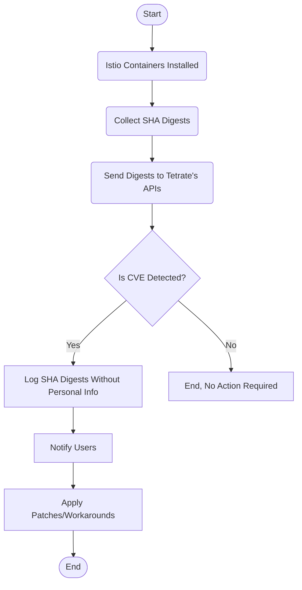

This article will introduce Tetrate’s newly launched tool – [Tetrate Vulnerability Scanner (TVS)](https://docs.tetrate.io/istio-subscription/tools/tvs/), a CVE scanner customized for Istio and Envoy. Before diving into the specific features of TVS, let’s briefly review the concept of CVE and its core role in software security.

## Overview of CVE

CVE (Common Vulnerabilities and Exposures) is a public vulnerability database maintained by MITRE Corporation. It provides a standardized way to reference vulnerabilities in open-source software. Each CVE record has an identifier, description, and at least one public reference. CVE does not provide severity ratings for vulnerabilities. CVEs are not only an important resource for cybersecurity professionals but also a tool for developers and organizations to receive critical security updates. CVE Numbering Authorities (CNAs) are an integral part of the CVE program, assigning unique IDs to new CVEs. These IDs help find information related to vulnerabilities, including severity ratings (maintained by NIST’s NVD), affected software systems, and steps for remediation and damage control. For example, the well-known Log4j vulnerability in 2021 ([CVE-2021-44228](https://www.cve.org/CVERecord?id=CVE-2021-44228)) had a severity rating of 10 due to its wide impact.

### Practical Scenarios for CVEs

Integrating CVE scanning into CI/CD pipelines is a common practice aimed at automatically identifying and preventing code with known vulnerabilities from entering the main branch. This approach helps ensure that applications do not rely on third-party packages or libraries with security vulnerabilities, enhancing application security. For example, GitHub’s [Dependabot](https://docs.github.com/en/code-security/supply-chain-security/understanding-your-software-supply-chain/about-supply-chain-security#what-is-dependabot) can automatically detect CVEs in project dependencies and suggest fixes, making it an effective tool for maintaining project security. You may receive CVE notifications like [jQuery Cross-Site Scripting vulnerability](https://github.com/advisories/GHSA-257q-pv89-v3xv) whenever there is a vulnerability in your PR or commit. Then, you can choose to tolerate the vulnerability or apply a patch.

## What is TVS?

Istio often releases CVE notices on its official website, such as [ISTIO-SECURITY-2024-001](https://istio.io/latest/news/security/istio-security-2024-001/). Previously, you had to track these notices manually, but now you can automate CVE scanning tasks with TVS, significantly reducing the workload of security teams.

The following figure shows the result of TVS.

Currently, TVS only provides a command-line tool, and it will be integrated as a service into TIS in the future.

The following diagram illustrates the workflow of TVS.

1. Begins after Istio installation.
2. Collects SHA digests of installed Istio containers.
3. Sends digests to Tetrate’s API.
4. API detects CVE presence.
   - If CVE is detected, logs SHA digests without personal information and notifies users.
   - If no CVE is detected, no action is required.
5. Upon receiving notification, users apply patches or mitigations.
6. Process ends.

TVS is available for free download and use by everyone. However, registration is required before performing CVE scans, as outlined in the [TIS documentation](https://docs.tetrate.io/istio-subscription/tools/tvs/).

## Supply Chain Security Recommendations

A [report](https://www.slim.ai/blog/container-report-2023) indicates that even the latest versions of the most popular containers have hundreds of CVEs.

Here are some recommendations for ensuring security:

- Start vulnerability scanning and remediation early, rather than waiting until the end.
- Integrate vulnerability scanning tools into CI/CD.
- Regularly update Istio and Envoy to the latest versions.
- Use Istio’s officially released [distroless images](https://istio.io/latest/docs/ops/configuration/security/harden-docker-images/) or [TID](https://docs.tetrate.io/istio-distro/) to reduce the attack surface and minimize vulnerabilities.
- Follow the [best practices for the software supply chain](https://github.com/cncf/tag-security/blob/main/supply-chain-security/supply-chain-security-paper/sscsp) introduced by CNCF.
- Follow [Istio security best practices](https://istio.io/latest/docs/ops/best-practices/security/).

## Unique Value of TVS

TVS provides a convenient CVE scanning operation through its command-line tool and is planned to be integrated into Kubernetes and Tetrate Istio Subscription (TIS) in the future to further simplify CVE management processes for Istio and Envoy. TIS provides CVE patches and backward compatibility support for up to 14 months from the Istio release, helping users get security updates on time while keeping the system stable.

TVS is freely available for all users to download and use, with simple registration required before performing CVE scans. Additionally, you can register on the [Istio and Envoy alerts and patches page](https://tetrate.io/register-for-istio-and-envoy-security-bulletins/) to receive CVE notifications and patches as soon as they are available. For more information, refer to the [TIS documentation](https://docs.tetrate.io/istio-subscription/tools/tvs/).

By adopting TVS, an automated CVE scanning tool, enterprises can more effectively identify and address security vulnerabilities in Istio and Envoy, enhance infrastructure security, and reduce the burden on security teams, thereby promoting efficient security management processes.

---

*This blog was initially published at [tetrate.io](https://tetrate.io/blog/tvs-istio-and-envoy-cve-scanning-solution/) .*
