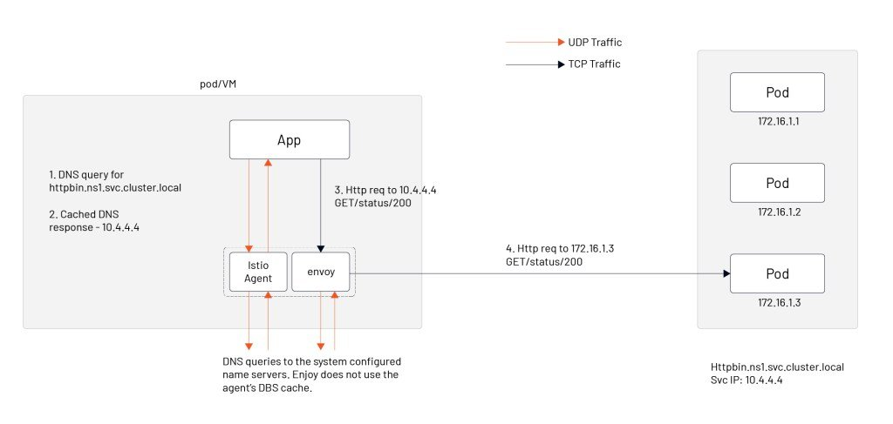

You can use Istio to do [multi-cluster management](https://www.tetrate.io/blog/multicluster-management-with-kubernetes-and-istio/), [API Gateway](https://www.tetrate.io/blog/istio-servicemesh-api-gateway/), and manage applications on Kubernetes or [virtual machines](https://www.tetrate.io/blog/istio-18-a-virtual-machine-integration-odyssey/). In my [last blog](https://www.tetrate.io/blog/why-is-service-mesh-a-necessary-part-of-cloud-native/), I talked about how service mesh is an integral part of cloud native applications. However, building infrastructure can be a big deal. There is no shortage of debate in the community about the practicability of service mesh and Istio– here’s a list of common questions and concerns, and how to address them.

- Is anyone using Istio in production?
- What is the impact on application performance due to the many resources consumed by injecting sidecar into the pod?
- Istio supports a limited number of protocols; is it scalable?
- Will Istio be manageable? – Or is it too complex, old services too costly to migrate, and the learning curve too steep?

I will answer each of these questions below.

### Istio is architecturally stable, production-ready, and ecologically emerging

[Istio 1.12](https://www.tetrate.io/blog/istio-wasm-extensions-and-ecosystem/) was just released in November – and has evolved significantly since the explosion of service mesh in 2018 (the year Istio co-founders established Tetrate). Istio has a large community of providers and [users](https://istio.io/latest/about/case-studies/). The Istio SIG of Cloud Native Community has held eight [Istio Big Talk (Istio 大咖说)](https://cloudnative.to/sig-istio/big-talk/overview.html), with Baidu, Tencent, NetEase, Xiaohongshu(小红书), and Xiaodian Technology(小电科技) sharing their Istio practices. According to [CNCF Survey Report 2020](https://www.cncf.io/wp-content/uploads/2020/11/CNCF_Survey_Report_2020.pdf), about 50% of the companies surveyed are using a service mesh in production or planning to in the next year, and about half (47%) of organizations using a service mesh in production are using Istio.

Many companies have developed extensions or plugins for Istio, such as Ant, NetEase, eBay, and Airbnb. Istio’s architecture has been stable since the 1.5 release, and the release cycle is fixed quarterly, with the current project’s main task being Day-2 Operations. 

The Istio community has also hosted various events, with the first IstioCon in March 2021, the Istio Meetup China in Beijing in July, and the Service Mesh Summit 2022 in Shanghai in January 2022.

So we can say that the Istio architecture is stable and production-ready, and the ecosystem is budding.

### The impact of service mesh on application performance

A service mesh uses iptables to do traffic hijacking by default to be transparent to applications. When the number of services is large, there are a lot of iptables rules that affect network performance. You can use techniques like [eBPF](https://cloudnative.to/blog/how-ebpf-streamlines-the-service-mesh/) to provide application performance, but the method requires a high version of the operating system kernel, which few enterprises can achieve.

In the early days, Istio distributed the routing information of all services in the mesh to all proxy sidecars, which caused [sidecar](https://istio.io/latest/docs/reference/config/networking/sidecar/)s to take up a lot of resources. [Aeraki](https://github.com/aeraki-framework/aeraki) and [Slime](https://github.com/slime-io/slime) can achieve configuration lazy loading. We will introduce these two open-source projects in the Istio open-source ecosystem.

Finally, there is a problem related to Sidecar proxy operation and maintenance: upgrading all Envoy proxies while ensuring constant traffic. A solution is using the [SidecarSet](https://xie.infoq.cn/article/23ae6d3f0d0260b4797a708a0) resource in the open-source project [OpenKruise](https://github.com/openkruise/kruise).

The resource consumption and network latency associated with the introduction of Sidecar are also within reasonable limits, as you can see from the [service mesh benchmark performance tests](https://istio.io/latest/blog/2019/performance-best-practices/).

### Extending the Istio service mesh

The next question is about extending the Istio service mesh. The current solution given by the Istio community is to use [WebAssembly](https://www.tetrate.io/blog/istio-wasm-extensions-and-ecosystem/), an extension that is still relatively little used in production by now and has performance concerns. Most of the answers I’ve observed are CRDs that build a service mesh management plane based on Istio.

Also, making Istio support heterogeneous environments for all workloads, such as virtual machines and containers, is in strong demand for end-users. It allows them to migrate applications from traditional loads to cloud native easily. Finally, hybrid cloud traffic management for multiple clusters and meshes is a more advanced requirement.

### Steep learning curve

Many people complain that Istio has too little learning material. Istio has been open source for four years, and there are a lot of learning resources now:

- [Istio Documentation](https://istio.io/)
- [IstioCon 2021](https://events.istio.io/istiocon-2021/)
- [Istio Big Talk/Istio Weekly](https://github.com/tetratelabs/istio-weekly)
- [Istio Fundamentals Course](https://academy.tetrate.io/courses/istio-fundamentals)
- [Certified Istio Administrator](https://academy.tetrate.io/courses/certified-istio-administrator)

Yes, Istio is complex, but it’s been getting more and more manageable with every release. In my next blog, I will introduce you to two open source projects that extend Istio and give you some insight into what’s going on in the Istio community.
