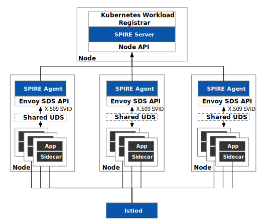
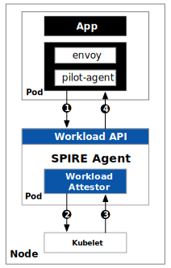
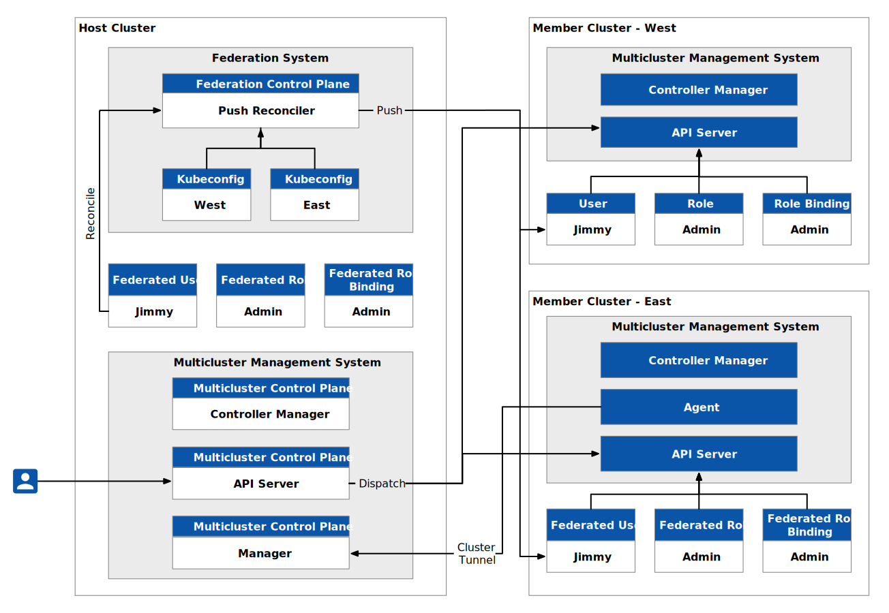
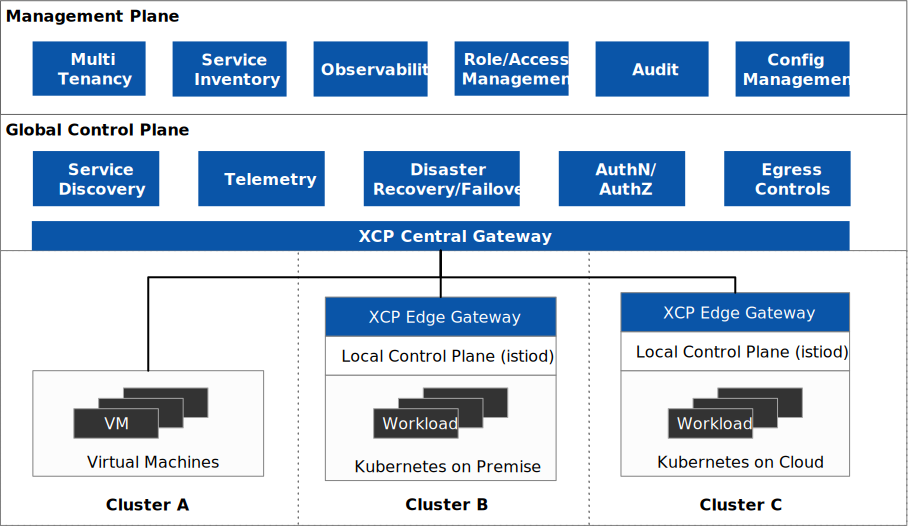

In September 2022, Istio [became a CNCF incubation project](https://www.cncf.io/blog/2022/09/28/istio-sails-into-the-cloud-native-computing-foundation/) and launched the new [Ambient Mesh](https://www.tetrate-old.local/blog/ambient-mesh-what-you-need-to-know-about-this-experimental-new-deployment-model-for-istio/). With CNCF’s strong community and marketing resources, and Ambient Mesh further lowering the barrier to trying Istio, the five year old open source project has been revitalized.

If you don’t know about service mesh and Istio, or are curious about the future of Istio, this eBook—[The Current State and Future of the Istio Service Mesh](https://www.tetrate-old.local/get-insights-into-history-and-future-of-istio-content/) will give you the answers. The following is an excerpt from the book. In my view, the future of Istio lies in being the infrastructure for zero-trust network and hybrid cloud.

# Zero Trust

Zero trust is an important topic, including when I spoke at IstioCon 2022. Istio is becoming an important part of zero trust, the most important element of which is identity-oriented control rather than network-oriented control.

### What Is Zero Trust?

Zero trust is a security philosophy, not a best practice that all security teams follow in the same way. The concept of zero trust was proposed to bring a more secure network to the cloud-native world. Zero trust is a theoretical state where all consumers within a network not only have no authority but also have no awareness of the surrounding network. The main challenges of zero trust are the increasingly granular authorization and the need for a time limit for user authorization.

### Authentication

Istio 1.14 adds support for the SPIFFE Runtime Environment (SPIRE). SPIRE, a CNCF incubation project, is an implementation of the Secure Production Identity Framework for Everyone (SPIFFE), also a CNCF Incubation Project. In Kubernetes, we use ServiceAccount to provide identity information for workloads in Pods, and its core is based on Token (using Secret resource storage) to represent workload identity. A token is a resource in a Kubernetes cluster. How to unify the identities of multiple clusters and workloads running in non-Kubernetes environments (such as virtual machines)? That’s what SPIFFE is trying to solve.

The purpose of SPIFFE is to establish an open and unified workload identity standard based on the concept of zero trust, which helps to establish a fully identifiable data center network with zero trust. The core of SPIFFE is to define a short-lived encrypted identity document—SPIFFE Verifiable Identity Document (SVID)—through a simple API, which is used as an identity document (based on an X.509 certificate or JWT token) for workload authentication. SPIRE can automatically rotate SVID certificates and keys according to administrator-defined policies, dynamically provide workload identities, and Istio can dynamically consume these workload identities through SPIRE.

The Kubernetes-based SPIRE architecture diagram is shown below.

Istio originally used the Citadel service in Istiod to be responsible for certificate management in the service mesh, and issued the certificate to the data plane through the xDS (to be precise, SDS API) protocol. With SPIRE, the work of certificate management is handed over to SPIRE Server. SPIRE also supports the Envoy SDS API. After we enable SPIRE in Istio, the traffic entering the workload pod will be authenticated once after being transparently intercepted into the sidecar. The purpose of authentication is to compare the identity of the workload with the environment information it runs on (node, Pod’s ServiceAccount and Namespace, etc.) to prevent identity forgery. Please refer to[ How to Integrate SPIRE in Istio](https://istio.io/latest/docs/ops/integrations/spire/) to learn how to use SPIRE for authentication in Istio.

We can deploy SPIRE in Kubernetes using the Kubernetes Workload Registrar, which automatically registers the workload in Kubernetes for us and generates an SVID. The registration machine is a Server-Agent architecture, which deploys a SPIRE Agent on each node, and the Agent communicates with the workload through a shared UNIX Domain Socket. The following diagram shows the process of using SPIRE for authentication in Istio.

The steps to using SPIRE for workload authentication in Istio are as follows:

- To obtain the SIVD, the SPIRE Agent is referred to as a pilot-agent via shared UDS.
- The SPIRE Agent asks Kubernetes (to be precise, the kubelet on the node) for load information.
- The kubelet returns the information queried from the API server to the workload validator.
- The validator compares the result returned by the kubelet with the identity information shared by the sidecar. If it is the same, it returns the correct SVID cache to the workload. If it is different, the authentication fails.

 Please refer to the SPIRE documentation for the detailed process of registering and authenticating workloads.

### NGAC

When each workload has an accurate identity, how can the permissions of these identities be restricted? Role-based access control (RBAC) is used by default in Kubernetes for access control. As the name suggests, this access control is based on roles. Although it is relatively simple to use, there is a role explosion problem for large-scale clusters—that is, there are too many roles, and the types are not static, making it difficult to track and audit role permission models. In addition, the access rights of roles in RBAC are fixed, and there is no provision for short-term use rights; nor does it take into account attributes such as location, time, or equipment. Enterprises using RBAC have difficulty meeting complex access control requirements to comply with the regulatory requirements that other organizations demand.

NGAC, or Next Generation Access Control, takes the approach of modeling access decision data as a graph. NGAC enables a systematic, policy-consistent approach to access control, granting or denying user management capabilities with a high level of granularity. NGAC was developed by the U.S. National Institute of Standards and Technology (NIST) and is currently used for rights management in [Tetrate Service Bridge (TSB).](https://tetrate.io/tetrate-service-bridge) For more information, read our article on [why you should choose NGAC over ABAC and RBAC](https://thenewstack.io/why-you-should-choose-ngac-as-your-access-control-model).

### Hybrid cloud

In practical applications, we may deploy multiple Kubernetes clusters in various environments for reasons such as load balancing; isolation of development and production environments; decoupling of data processing and data storage; cross-cloud backup and disaster recovery; and avoiding vendor lock-in. The Kubernetes community provides a “cluster federation” function that can help us create a multi-cluster architecture, such as the common Kubernetes multi-cluster architecture shown in the figure below, in which the host cluster serves as the control plane and has two member clusters, namely West and East.

Cluster federation requires that the networks between the host cluster and member clusters can communicate with each other, but it does not require network connectivity between member clusters. The host cluster serves as the API entry, and all resource requests from the outside world to the host cluster will be forwarded to the member clusters.

The control plane of the cluster federation is deployed in the host cluster, and the “Push Reconciler” in it will propagate the identities, roles, and role bindings in the federation to all member clusters. Cluster federation simply “connects” multiple clusters together, replicating workloads among multiple clusters, and the traffic between member clusters cannot be scheduled, nor can true multi-tenancy be achieved.

Cluster federation is not enough to realize hybrid clouds. In order to realize hybrid clouds in the true sense, it is necessary to achieve interconnection between clusters and realize multi-tenancy at the same time. Tetrate Service Bridge provides a general control plane for multi-cluster management on top of Istio and then adds a management plane to manage multiple clusters, providing functions such as multi-tenancy, management configuration, and observability. Below is a diagram of the multi-tenancy and API of the Istio management plane.

In order to manage the hybrid cloud, TSB uses a management plane based on Istio, creates tenant and workspace resources, and applies the gateway group, traffic group, and security group to the workloads in the corresponding cluster through selectors.

Tetrate provides an enterprise-level service mesh management plane that works across clusters, across clouds, and with on-premises deployments, including VMs and bare metal servers. At Tetrate, we are committed to building an application-aware network suitable for any environment and any workload and providing a zero-trust hybrid cloud platform. And we contribute to building needed infrastructure in open source wherever possible; only management-plane-specific functionality is reserved for the commercial software offering.

The figure shown below is the architecture diagram of Tetrate’s flagship product, Tetrate Service Bridge.

For the detailed architecture of TSB, please refer to the [TSB documentation](https://docs.tetrate.io/service-bridge).

Get the eBook

The above is just a summary of what we see for the future of Istio. To learn more about the historical motivation for the emergence of the service mesh, the evolution of Istio, and the Istio open source ecosystem, please [download the eBook](https://www.tetrate-old.local/get-insights-into-history-and-future-of-istio-content/). This book provides detailed information on:

- The rise of service mesh technology is due to the popularity of Kubernetes, microservices, DevOps, and cloud native architectures.
- The emergence of Kubernetes and programmable proxies, which laid a solid foundation for Istio.
- How eBPF can accelerate transparent traffic hijacking in Istio, but cannot replace the sidecar in the service mesh.
- How the future of Istio lies in building a zero trust network based on the hybrid cloud.

In addition, there are also numerous illustrations in the book that will help you understand. With the entry of Istio into CNCF and the introduction of the latest Ambient Mesh, we can expect that Istio will be even easier to adopt, and continue to grow in features, capabilities, and community.

---

*This blog was originally published at [tetrate.io](https://tetrate.io/blog/the-future-of-istio-the-path-to-zero-trust-security/).*
