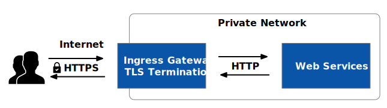
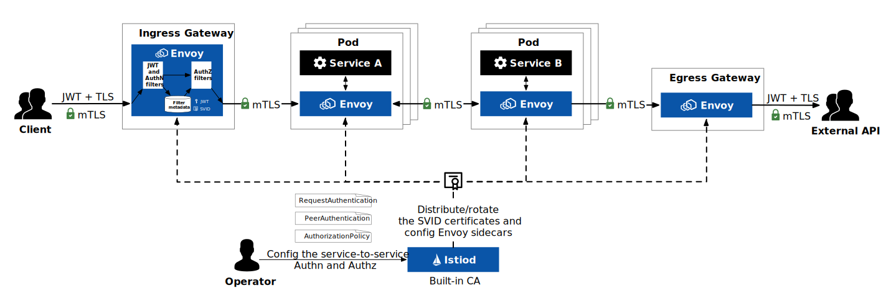

The Istio service mesh offers cloud native deployments a standard way to implement automatic [mutual transport layer security (mTLS)](https://en.wikipedia.org/wiki/Mutual_authentication#mTLS). This reduces the attack surface of network communication by using strong identities to establish encrypted channels between workloads within the mesh that are both confidential and tamper-resistant. mTLS is a key component for building zero-trust application networks. To understand mTLS traffic encryption in Istio, this article will cover the following:

- An overview of TLS, mTLS, and TLS termination
- An introduction to howTLS encryption works in Istio
- How to use Istio to implement mTLS in Kubernetes
- A discussion of when you do and don’t need mTLS

## What Is TLS and mTLS?

TLS, the successor to Secure Sockets Layer (SSL), is a widely adopted security protocol used to create authenticated and encrypted connections between networked computers. For this reason, people often use the terms TLS and SSL interchangeably. In this article, we will refer to them collectively as TLS. TLS 1.0 was released in 1999, and the latest version is 1.3 (released in August 2018); versions 1.0 and 1.1 are deprecated.

The HTTPS we see when browsing the web uses TLS, as shown in Figure 1, which is built on top of TCP as the session layer in the OSI model. To ensure compatibility, TLS usually uses port 443, but you can use any port you want.


TLS encryption is required when a client needs to confirm the identity of the server in order to guard against man-in-the-middle attacks and ensure communication security. Figure 2 shows how TLS-encrypted communication proceeds.


1. The server applies for and obtains a certificate (X.509 certificate) from a trusted [certificate authority](https://en.wikipedia.org/wiki/Certificate_authority) (CA).
2. A request from the client to the server containing information such as the TLS version and password combination supported by the client.
3. The server responds to the client request and attaches a digital certificate.
4. The client verifies the status, validity, and digital signature of the certificate and confirms the identity of the server.
5. Encrypted communication commences between the client and the server using a shared private key.

The above is only an outline description of the TLS communication flow. If you’re interested in the details, please see [this in-depth discussion of the complete TLS handshake process.](https://www.cloudflare.com/learning/ssl/what-happens-in-a-tls-handshake/)

From the above process, you will find that the certificate is the critical element representing the server’s identity. The server must use a certificate issued by an authoritatively certified CA in order to provide public services over the Internet. In contrast, you can manage certificates using your own public key infrastructure (PKI) for services inside of a private environment.

Mutual TLS, also referred to as mTLS, is the use of a two-way encrypted channel between a server and a client that necessitates certificate exchange and identity authentication between the parties.

## What Is TLS Termination?

TLS termination is the process of decrypting TLS-encrypted traffic before it is forwarded to a web server. Offloading TLS traffic to an ingress gateway or specialized device improves web application performance while securing encrypted traffic. TLS termination is typically implemented at cluster ingress. All communication between the ingress and servers in the cluster will be conducted directly over HTTP in plaintext, enhancing service performance.



By default, Istio enables mTLS for mesh-based services and ends TLS at the ingress gateway. Furthermore, you can pass through traffic to back-end services for processing.

```yaml
apiVersion: networking.istio.io/v1beta1
kind: Gateway
metadata:
  name: sample-gateway
spec:
  servers:
  - port:
      number: 443
      name: https
      protocol: HTTPS
    tls:
      mode: PASSTHROUGH
```

See [Gateway TLS Configuration](https://istio.io/latest/docs/ops/configuration/traffic-management/tls-configuration/#gateways) for details.

## How to Implement Automatic mTLS in Istio

Figure 4 depicts the security architecture of Istio. This figure clearly shows that at the entry point, JSON Web Token (JWT) + TLS authentication and encryption are used, and that mTLS is enabled between all services within the Istio mesh.



Istio includes a built-in CA, and [Secret Discovery Service (SDS)](https://www.envoyproxy.io/docs/envoy/latest/configuration/security/secret)—one of the discovery services in Envoy [xDS](https://www.envoyproxy.io/docs/envoy/latest/api-docs/xds_protocol)—enables the issuance and rotation of SVID certificates. The mTLS flow in the Istio mesh is as follows:

1. The sidecar of every service requests a certificate from Istiod on behalf of the workload at startup, and Istiod issues the [SVID](https://spiffe.io/docs/latest/spiffe-about/spiffe-concepts/#spiffe-verifiable-identity-document-svid) certificate (the process is more complex, and I will explain it in a future blog).
2. The sidecar of every workload intercepts all client requests within the pod.
3. The client sidecar starts an mTLS handshake with the server sidecar. During the handshake, the [JWT](https://www.envoyproxy.io/docs/envoy/latest/intro/arch_overview/security/jwt_authn_filter) and [authentication filter](https://www.envoyproxy.io/docs/envoy/latest/intro/arch_overview/security/ext_authz_filter) in the client sidecar will authenticate the identity of the request, and store the identity in the filter metadata after the authentication. Then the request will go through the authorization filter to determine if the request is allowed.
4. If the request is authenticated and authorized, the client and the server start to establish a connection for communication.

In Istio, authentication and authorization between services can be configured using one of three resource objects:

- **[RequestAuthentication](https://istio.io/latest/docs/reference/config/security/request_authentication/):** To specify the service’s only currently supported request-level authentication method, JWT.
- **[PeerAuthentication](https://istio.io/latest/docs/reference/config/security/peer_authentication/):** To enable mTLS or plaintext requests, set the transport authentication mode.
- **[AuthorizationPolicy](https://istio.io/latest/docs/reference/config/security/authorization-policy/):** To specify who can do what when traffic between services is authorized? For instance, subject A either permits (ALLOW) or forbids (DENY) traffic from subject B.

## How to Enable Automatic mTLS in Istio

In PeerAuthentication, you can specify the mTLS mode that will be used for the target workload. Peer authentication is supported in the following modes:

- PERMISSIVE: The workload’s default setting that allows it to accept either mTLS or plain text traffic.
- STRICT: The workload accepts only mTLS traffic.
- DISABLE: Disable mTLS. From a security perspective, mTLS should not be disabled unless you have your own security solution.
- UNSET: Inherited from the parent, with the following priority: service specific > namespace scope > mesh scope setting.

Istio’s peer authentication uses *PERMISSIVE* mode by default, automatically sending *mTLS* traffic to these workloads and clear text traffic to workloads without a sidecar. After including Kubernetes services in the Istio mesh, we can use *PERMISSIVE* mode first to prevent services from failing *mTLS*. We can use one of two ways to enable strict mTLS mode for certain services:

- Use PeerAuthentication to define how traffic is transferred between sidecars.
- Use DestinationRule to define the TLS settings in the traffic routing policy.

The reviews service’s mTLS configuration in the default namespace can be seen in the example below.

### Use PeerAuthentication to Set mTLS for Workloads

For instance, the following configuration can be used to specify that a workload under a namespace has strict mTLS enabled.

```yaml
apiVersion: security.istio.io/v1beta1
kind: PeerAuthentication
metadata:
  name: foo-peer-policy
  namespace: default
spec:
  selector:
    matchLabels:
      app: reviews
  mtls:
    mode: STRICT
```

According to the [Istio documentation](https://istio.io/latest/docs/tasks/security/authentication/mtls-migration/), you can also enable strict mTLS for all services in the mesh by configuring strict mTLS for the namespace istio-system where Istio is installed.

### Use DestinationRule to Set up mTLS for Workloads

Traffic routing policies, such as load balancing, anomaly detection, TLS settings, etc., are set using DestinationRule. In the TLS settings, there are various modes. As shown below, use ISTIO_MUTUAL mode to enable Istio’s workload-based automatic TLS.

```yaml
apiVersion: networking.istio.io/v1beta1
kind: DestinationRule
metadata:
  name: reviews
  namespace: default
spec:
  host: reviews
  trafficPolicy:
    tls:
      mode: ISTIO_MUTUAL
```

## When Should You Use mTLS?

The short answer is that you should use mTLS for network communication between application components that you have some control over—like between microservices in a cluster.

One-way TLS is typically used by Internet clients to connect to Web services, which means that only the server needs to show identification and is unconcerned with the identity of the client. One-way TLS allows you to use passwords, tokens, two-factor authentication, and other methods when you need to confirm the identity of the client. However, when using a service mesh, mTLS operates outside the application and doesn’t require many changes to the application logic, whereas such an authentication method requires internal application support.

As you can see from the example above, mTLS implementation calls for certificate exchange between services. As the number of services rises, managing numerous certificates becomes a laborious task. You can implement automatic mTLS and fix the certificate management issue with the aid of a service mesh.

## When Shouldn’t You Use mTLS?

Although mTLS is the preferred protocol for securing inter-service communication in cloud-native applications, implementing mTLS necessitates a more complex, symmetric encryption and decryption process than one-way TLS. In some cases where there is high traffic volume or CPU utilization must be optimized, terminatingTLS at the traffic entry point and turning on mTLS internally for specific services only can help minimize request response times and decrease compute resource consumption for some traffic with lower security levels.

Additionally, it is necessary to [disable probe rewriting for pods](https://istio.io/latest/docs/ops/configuration/mesh/app-health-check/#disable-the-http-probe-rewrite-for-a-pod) when using services that cannot obtain certificates, such as health checks performed via HTTP on Kubelet and the inability to access the service’s health check endpoint via TLS.

Finally, when mesh services access some external services, mTLS is also not necessary.

## Summary

mTLS is a crucial component of creating a zero-trust application network, which makes it possible to encrypt traffic within the mesh. Istio makes it simple to enable automatic mTLS for Kubernetes services, doing away with the need to manage certificates. At the same time, we can selectively enable mTLS for a subset of the mesh’s services, enabling us to move services from Kubernetes to the mesh. In a subsequent blog, we’ll go into more detail about Istio’s certificate management system. Stay tuned.

---

If you’re new to service mesh and Kubernetes security, we have a bunch of free online courses [available at Tetrate Academy](https://tetr8.io/academy) that will quickly get you up to speed with Istio and Envoy.

If you’re looking for a fast way to get to production with Istio, check out [Tetrate Istio Distribution (TID)](https://tetr8.io/tid). TID is Tetrate’s hardened, fully upstream Istio distribution, with FIPS-verified builds and support available. It’s a great way to get started with Istio knowing you have a trusted distribution to begin with, have an expert team supporting you, and also have the option to get to FIPS compliance quickly if you need to.Once you have Istio up and running, you will probably need simpler ways to manage and secure your services beyond what’s available in Istio, that’s where Tetrate Service Bridge comes in. You can learn more about how Tetrate Service Bridge makes service mesh more secure, manageable, and resilient [here](https://tetr8.io/tsb), or [contact us for a quick demo](https://tetr8.io/contact).

*This blog was originally published at [tetrate.io](https://tetrate.io/blog/how-istios-mtls-traffic-encryption-works-as-part-of-a-zero-trust-security-posture/).*
