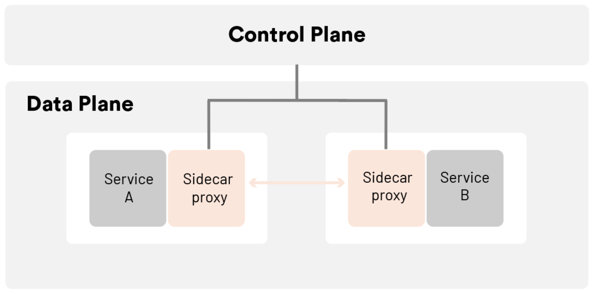

A service mesh is a relatively simple concept, consisting of a bunch of network proxies paired with each service in an application, plus a set of task management processes. The proxies are called the data plane and the management processes are called the control plane in the Service Mesh. The data plane intercepts calls between different services and “processes” them; the control plane is the brain of the mesh that coordinates the behavior of proxies and provides APIs for operations and maintenance personnel to manipulate and observe the entire network.

The diagram below shows the architecture of a service mesh.

Further, the service mesh is a dedicated infrastructure layer designed to enable reliable, fast, and secure inter-service invocation in microservices architectures. It is not a mesh of “services” but rather a mesh of “proxies” that services can plug into, thus abstracting the network from the application code. In a typical service mesh, these proxies are injected into each service deployment as a sidecar (and also may be deployed at the edge of the mesh). Instead of invoking services directly over the network, services invoke their local sidecar proxy, which in turn manages requests on behalf of the service, pushing the complexities of inter-service communications into a networking layer that can resolve them at scale. The set of interconnected sidecar proxies implements a so-called data plane, while on the other hand the service mesh control plane is used to configure proxies. The infrastructure introduced by a service mesh provides an opportunity, too, to collect metrics about the traffic that is flowing through the application.

## The architecture of a service mesh

The infrastructure layer of a service mesh is divided into two main parts: the control plane and the data plane.

**Characteristics of the control plane**

- Do not parse packets directly.
- Communicates with proxies in the control plane to issue policies and configurations.
- Visualizes network behavior.
- Typically provides APIs or command-line tools for configuration versioning and management for continuous integration and deployment.

**Characteristics of the data plane**

- Is usually designed with the goal of statelessness (though in practice some data needs to be cached to improve traffic forwarding performance).
- Directly handles inbound and outbound packets, forwarding, routing, health checking, load balancing, authentication, authentication, generating monitoring data, etc.
- Is transparent to the application, i.e., can be deployed senselessly.

## Changes brought by the service mesh

**Decoupling of microservice governance from business logic**

A service mesh takes most of the capabilities in the SDK out of the application, disassembles them into separate processes, and deploys them in a sidecar model. By separating service communication and related control functions from the business process and synching them to the infrastructure layer, a service mesh **mostly** decouples them from the business logic, allowing application developers to focus more on the business itself.

Note that the word “mostly” is mentioned here and that the SDK often needs to retain protocol coding and decoding logic, or even a lightweight SDK to implement fine-grained governance and monitoring policies in some scenarios. For example, to implement method-level call distributed tracing, the service mesh requires the business application to implement trace ID passing, and this part of the implementation logic can also be implemented through a lightweight SDK. Therefore, the service mesh is not zero-intrusive from a code level.

**Unified governance of heterogeneous environments**

With the development of new technologies and staff turnover, there are often applications and services in different languages and frameworks in the same company, and in order to control these services uniformly, the previous practice was to develop a complete set of SDKs for each language and framework, which is very costly to maintain. With a service mesh, multilingual support is much easier by synching the main service governance capabilities to the infrastructure. By providing a very lightweight SDK, and in many cases, not even a separate SDK, it is easy to achieve unified traffic control and monitoring requirements for multiple languages and protocols.

## Features of service mesh

Service mesh also has three major technical advantages over traditional microservice frameworks.

**Observability**

Because the service mesh is a dedicated infrastructure layer through which all inter-service communication passes, it is uniquely positioned in the technology stack to provide uniform telemetry at the service invocation level. This means that all services are monitored as “black boxes.” The service mesh captures route data such as source, destination, protocol, URL, status codes, latency, duration, etc. This is essentially the same data that web server logs can provide, but the service mesh captures this data for all services, not just the web layer of individual services. It is important to note that collecting data is only part of the solution to the observability problem in microservice applications. Storing and analyzing this data needs to be complemented by mechanisms for additional capabilities, which then act as alerts or automatic instance scaling, for example.

**Traffic control**

With a service mesh, services can be provided with various control capabilities such as intelligent routing (blue-green deployment, canary release, A/B test), timeout retries, circuit breaking, fault injection, traffic mirroring, etc. These are often features that are not available in traditional microservices frameworks but are critical to the system. For example, the service mesh carries the communication traffic between microservices, so it is possible to test the robustness of the whole application by simulating the failure of some microservices through rules for fault injection in the grid. Since the service mesh is designed to efficiently connect source request calls to their optimal destination service instances, these traffic control features are “destination-oriented.” This is a key feature of the service mesh’s traffic control capabilities.

**Security**

To some extent, monolithic applications are protected by their single address space. However, once a monolithic application is broken down into multiple microservices, the network becomes a significant attack surface. More services mean more network traffic, which means more opportunities for hackers to attack the information flow. And service mesh provides the capabilities and infrastructure to protect network calls. The security-related benefits of service mesh are in three core areas: authentication of services, encryption of inter-service communications, and enforcement of security-related policies.

Service mesh has brought about tremendous change and has strong technical advantages, and has been called the second generation of “microservice architecture.” However, there is no silver bullet in software development. Traditional microservices architecture has many pain points, and service mesh is no exception. It has its limitations.

**Increased complexity**

Service mesh introduces sidecar proxies and other components into an already complex, distributed environment, which can greatly increase the overall chain and operational O&M complexity. Ops needs to be more specialized. Adding a service mesh such as Istio to a container orchestrator such as Kubernetes often requires Ops to become an expert in both technologies in order to fully utilize the capabilities of both and to troubleshoot the problems encountered in the environment.

**Latency**

At the link level, a service mesh is an invasive, complex technology that can add significant latency to system calls. This latency is on the millisecond level, but it can also be intolerable in special business scenarios.

**Platform adaptation**

The intrusive nature of service mesh forces developers and operators to adapt to highly autonomous platforms and adhere to the platform’s rules.

## The relationship between service mesh and Kubernetes

Kubernetes is essentially application lifecycle management, specifically the deployment and management (scaling, auto-recovery, publishing) of containerized applications. Service mesh decouples traffic management from Kubernetes, eliminating the need for a kube-proxy component for internal traffic, and manages inter-service and ingress traffic, security, and observability through an abstraction closer to the microservice application layer. The xDS used by Istio and Envoy is one of the protocol standards for service mesh configuration. 

Organizations that use Kubernetes often turn to a service mesh to address the networking issues that arise with containerization — but notably, a service mesh can work with a legacy or a modern workload, and can be put in place prior to containerization for a faster, safer path to modernization.

## Summary

Readers should look dialectically at the advantages and disadvantages of a service mesh compared with traditional microservices architecture. A service mesh can be a critical part of the evolutionary path of application architecture, from the earliest monolith to distributed, to microservices, containerization, container orchestration, to hybrid workloads and multi-cloud. 

Looking ahead, Kubernetes is exploding, and it has become the container orchestration of choice for enterprise greenfield applications. If Kubernetes has completely won the market and the size and complexity of Kubernetes-based applications continue to grow, there will be a tipping point, and service mesh will be necessary to effectively manage these applications. As service mesh technology continues to evolve and the architecture and functionality of its implementation products, such as Istio, continue to be optimized, service mesh will completely replace traditional microservice architectures as the architecture of choice for microservices and transformation to the cloud for enterprises.

This article was co-authored by Guangming Luo, a member of the ServiceMesher community and the CNC steering community.