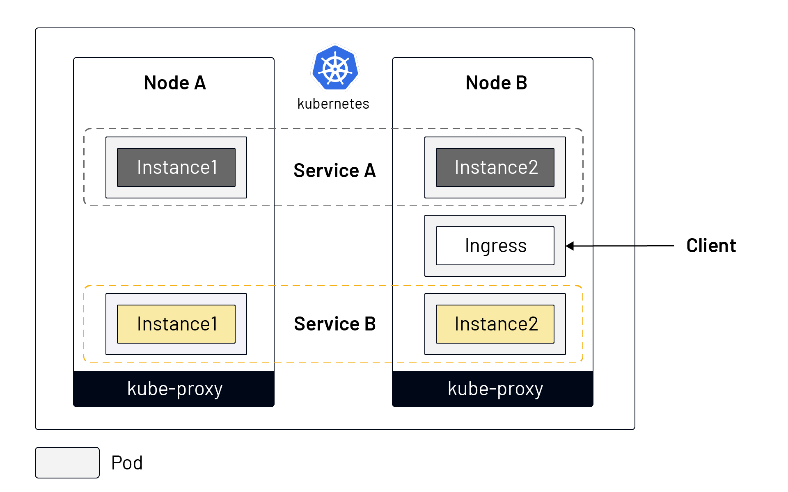
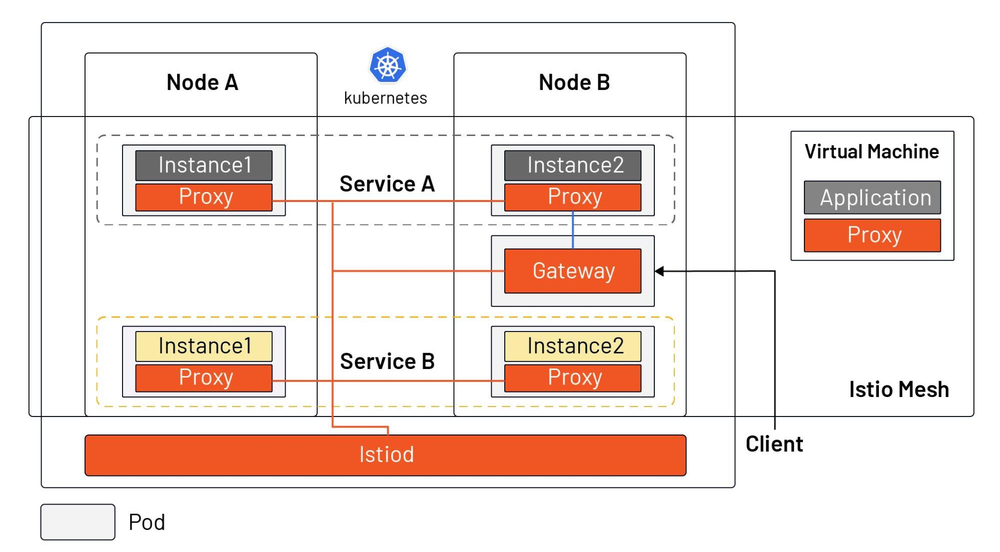

 Istio, [the most popular service mesh implementation](https://www.cncf.io/blog/2020/03/04/2019-cncf-survey-results-are-here-deployments-are-growing-in-size-and-speed-as-cloud-native-adoption-becomes-mainstream/), was developed on top of Kubernetes and has a different niche in the cloud native application ecosystem than Kubernetes. Rather than introduce you directly to what Istio has to offer, this article will explain how Istio came about and what it is in relation to Kubernetes.

## Why Is There an Istio?

To explain what Istio is, it’s also important to understand the context in which Istio came into being — i.e., why is there an Istio?

Microservices are a technical solution to an organizational problem. And Kubernetes/Istio are a technical solution to deal with the issues created by moving to microservices. As a deliverable for microservices, containers solve the problem of environmental consistency and allow for more granularity in limiting application resources. They are widely used as a vehicle for microservices.

Google open-sourced Kubernetes in 2014, which grew exponentially over the next few years. It became a container scheduling tool to solve the deployment and scheduling problems of distributed applications — allowing you to treat many computers as though they were one computer. Because the resources of a single machine are limited and Internet applications may have traffic floods at different times (due to rapid expansion of user scale or different user attributes), the elasticity of computing resources needs to be high. A single machine obviously can’t meet the needs of a large-scale application; and conversely, it would be a huge waste for a very small-scale application to occupy the whole host.

In short, Kubernetes defines the final state of the service and enables the system to reach and stay in that state automatically. So how do you manage the traffic on the service after the application has been deployed? Below we will look at how service management is done in Kubernetes and how it has changed in Istio.

## How Do You Do Service Management in Kubernetes?

The following diagram shows the service model in Kubernetes:

From the above figure we can see that:

- Different instances of the same service may be scheduled to different nodes.
- Kubernetes combines multiple instances of a service through Service objects to unify external services.
- Kubernetes installs a kube-proxy component in each node to forward traffic, which has simple load balancing capabilities.
- Traffic from outside the Kubernetes cluster can enter the cluster via Ingress (Kubernetes has several other ways of exposing services; such as NodePort, LoadBalancer, etc.).

Kubernetes is used as a tool for intensive resource management. However, after allocating resources to the application, Kubernetes doesn’t fully solve the problems of how to ensure the robustness and redundancy of the application, how to achieve finer-grained traffic division (not based on the number of instances of the service), how to guarantee the security of the service, or how to manage multiple clusters, etc.

## The Basics of Istio

The following diagram shows the service model in Istio, which supports both workloads and virtual machines in Kubernetes.

From the diagram we can see that:

- Istiod acts as the control plane, distributing the configuration to all sidecar proxies and gateways. (Note: for simplification, the connections between Istiod and sidecar are not drawn in the diagram.)
- Istio enables intelligent application-aware load balancing from the application layer to other mesh enabled services in the cluster, and bypasses the rudimentary kube-proxy load balancing.
- Application administrators can manipulate the behavior of traffic in the Istio mesh through a declarative API, in the same way they manage workloads in Kubernetes. It can take effects within seconds and they can do this without needing to redeploy.
- Ingress is replaced by Gateway resources, a special kind of proxy that is also a reused Sidecar proxy.
- A sidecar proxy can be installed in a virtual machine to bring the virtual machine into the Istio mesh.

In fact, before Istio one could use SpringCloud, Netflix OSS, and other tools to programmatically manage the traffic in an application, by integrating the SDK in the application. Istio makes traffic management transparent to the application, moving this functionality out of the application and into the platform layer as a cloud native infrastructure.

Istio complements Kubernetes, by enhancing its traffic management, observability and security for cloud native applications. The service mesh open source project — launched in 2017 by Google, IBM and Lyft — has come a long way in three years. A description of Istio’s core features can be found in the [Istio documentation](https://istio.io/latest/docs/concepts/what-is-istio/#core-features).

## Summary

- Service Mesh is the cloud native equivalent of TCP/IP, addressing application network communication, security and visibility issues.
- Istio is currently the most popular service mesh implementation, relying on Kubernetes but also scalable to virtual machine loads.
- Istio’s core consists of a control plane and a data plane, with Envoy as the default data-plane agent.
- Istio acts as the network layer of the cloud native infrastructure and is transparent to applications.