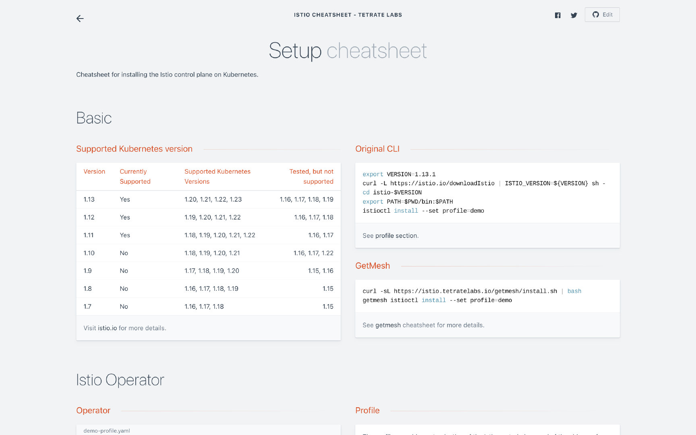
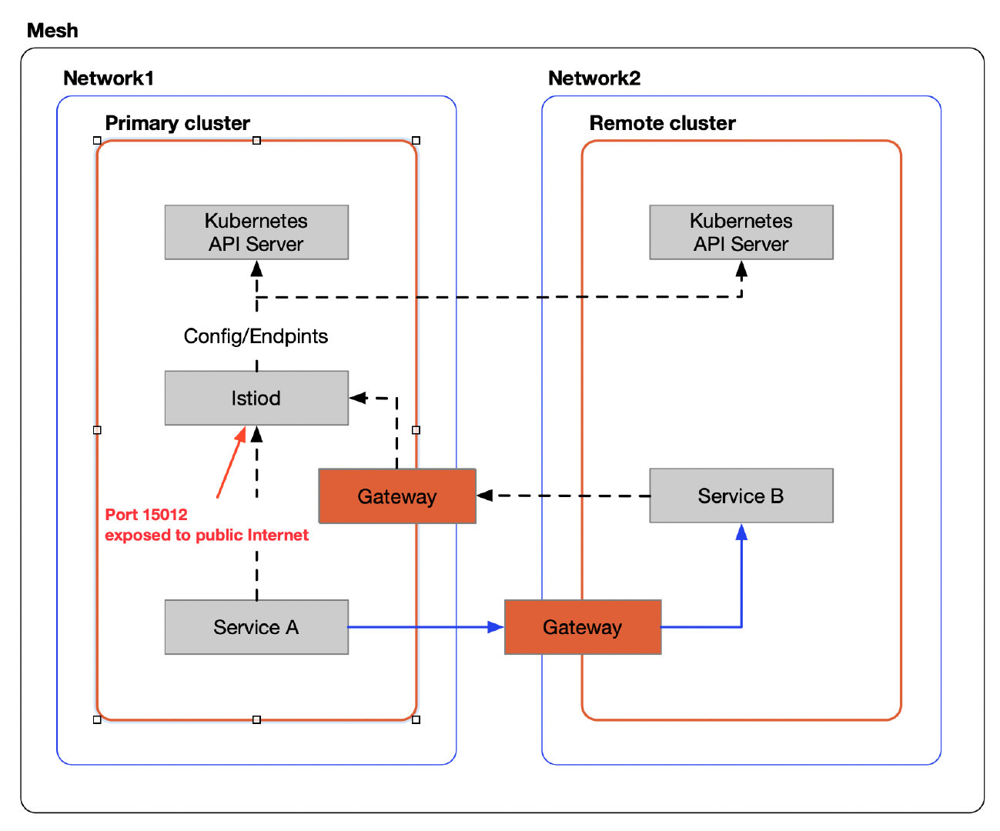
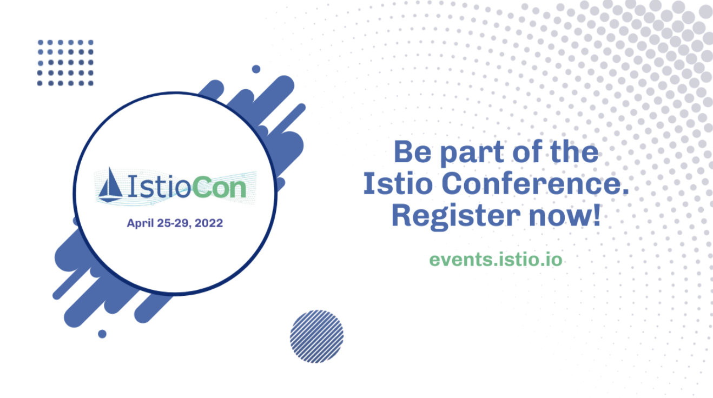

Istio 1.13 is the first release of 2022, and, not surprisingly, the Istio team will continue to release new versions every quarter. Overall, the new features in this release include:

- Support for newer versions of Kubernetes
- New API – ProxyConfig, for configuring sidecar proxies
- Improved Telemetry API
- Support for hostname-based load balancers with multiple network gateways

### Support for Kubernetes Versions

I often see people asking in the community which Istio supports Kubernetes versions. Istio’s website has a clear list of supported Kubernetes versions. You can see [here](https://istio.io/latest/docs/releases/supported-releases/#support-status-of-istio-releases) that Istio 1.13 supports Kubernetes versions 1.20, 1.21, 1.22, and 1.23, and has been tested but not officially supported in Kubernetes 1.16, 1.17, 1.18, 1.19.

When configuring Istio, there are a lot of checklists. I noted them all in the [Istio cheatsheet](https://github.com/tetratelabs/istio-cheatsheet). There are a lot of cheat sheets about configuring Istio, using resources, dealing with everyday problems, etc., in this project, which will be online soon, so stay tuned.

The following screenshot is from the Istio cheatsheet website, it shows the basic cheat sheet for setting up Istio.



### Introducing the new ProxyConfig API

Before Istio version 1.13, if you wanted to customize the configuration of the sidecar proxy, there were two ways to do it.

**MeshConfig**

Use MeshConfig and use IstioOperator to modify it at the Mesh level. For example, use the following configuration to alter the default discovery port for istiod.

```yaml
apVersion: install.istio.io/v1alpha1
kind: IstioOperator
spec:
  meshConfig:
	  defaultConfig:
      discoveryAddress: istiod:15012
```

**Annotation in the Pods**

You can also use annotation at the Pod level to customize the configuration. For example, you can add the following annotations to Pod to modify the default port for `istiod` of the workload:

```yaml
anannotations:
  proxy.istio.io/config: |
    discoveryAddress: istiod:15012
```

When you configure sidecar in either of these ways, the fields set in annotations will completely override the default fields in MeshConfig. Please refer to the [Istio documentation](https://istio.io/latest/docs/reference/config/istio.mesh.v1alpha1/#ProxyConfig) for all configuration items of ProxyConfig.

**The new API – ProxyConfig**

But in 1.13, a new top-level custom resource, ProxyConfig, has been added, allowing you to customize the configuration of your sidecar proxy in one place by specifying a namespace and using a selector to select the scope of the workload, just like any other CRD. Istio currently has limited support for this API, so please refer to the [Istio documentation](https://istio.io/latest/docs/reference/config/networking/proxy-config/) for more information on the ProxyConfig API.

However, no matter which way you customize the configuration of the sidecar proxy, it does not take effect dynamically and requires a workload restart to take effect. For example, for the above configuration, because you changed the default port of istiod, all the workloads in the mesh need to be restarted before connecting to the control plane.

### Telemetry API

[MeshConfig](https://istio.io/latest/docs/reference/config/istio.mesh.v1alpha1/#MeshConfig-ExtensionProvider) customized extensions and configurations in the Istio mesh. The three pillars of observability– Metrics, Telemetry, and Logging– can each be docked to different providers. The [Telemetry API](https://istio.io/latest/docs/tasks/observability/telemetry/) gives you a one-stop place for flexible configuration of them. Like the ProxyConfig API, the Telemetry API follows the configuration hierarchy of Workload Selector > Local Namespace > Root Configuration Namespace. The API was introduced in Istio 1.11 and has been further refined in that release to add support for OpenTelemetry logs, filtered access logs, and custom tracing service names. See [Telemetry Configuration](https://istio.io/latest/docs/reference/config/telemetry/) for details.

### Automatic resolution of multi-network gateway hostnames

In September 2021, a member of the Istio community [reported an issue](https://szabo.jp/2021/09/22/multicluster-istio-on-eks/) with the EKS load balancer failing to resolve when running multi-cluster Istio in AWS EKS. Workloads that cross cluster boundaries need to be communicated indirectly through a dedicated east-west gateway for a multi-cluster, multi-network mesh. You can follow the instructions on [Istio’s website](https://istio.io/latest/docs/setup/install/multicluster/multi-primary_multi-network/) to configure a multi-network, primary-remote cluster, and Istio will automatically resolve the IP address of the load balancer based on the hostname.

### Istio 1.13.1 fixing the critical security vulnerabilities

Istio 1.13.1 was released to fix a known [critical vulnerability](https://cve.mitre.org/cgi-bin/cvekey.cgi?keyword=CVE-2022-23635) that could lead to an unauthenticated control plane denial of service attack.

The figure below shows a multi-cluster primary-remote mesh where istiod exposes port 15012 to the public Internet via a gateway so that a pod on another network can connect to it.



When installing a multi-network, primary-remote mode Istio mesh, for a remote Kubernetes cluster to access the control plane, an east-west Gateway needs to be installed in the Primary cluster, exposing port 15012 of the control plane istiod to the Internet. An attacker could send specially crafted messages to that port, causing the control plane to crash. If you set up a firewall to allow traffic from only some IPs to access this port, you will be able to reduce the impact of the problem. It is recommended that you upgrade to Istio 1.13.1 immediately to resolve the issue completely.

### IstioCon 2022



Finally, as a committee member for the last and current IstioCon, I call on everyone to register for [IstioCon 2022](https://events.istio.io/istiocon-2022/), which will be held online on April 25! It will be an industry-focused event, a platform to connect contributors and users to discuss the uses of Istio in different architectural setups, its limitations, and where to take the project next. The main focus on end-user companies, as we look forward to sharing a diversity of case studies showing how to use Istio in production.
