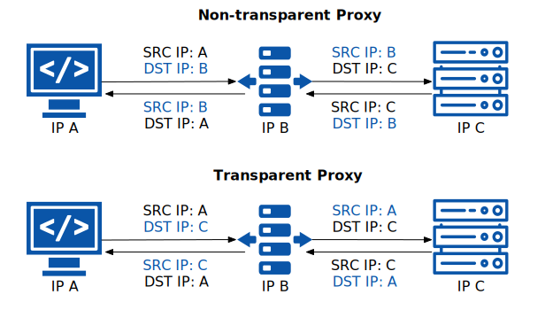

Istio’s new “ambient mode” is [an experimental, “sidecar-less” deployment model for Istio](https://tetrate.io/blog/ambient-mesh-what-you-need-to-know-about-this-experimental-new-deployment-model-for-istio/). Instead of a sidecar proxy in front of every workload, ambient mode uses [*tproxy*](https://www.kernel.org/doc/Documentation/networking/tproxy.txt) and [HTTP Based Overlay Network Environment (HBONE)](https://pkg.go.dev/github.com/costinm/hbone) as key technologies for transparent traffic intercepting and routing that we covered in our recent article on [transparent traffic intercepting and routing in the L4 network of Istio Ambient Mesh](https://tetrate.io/blog/transparent-traffic-intercepting-and-routing-in-the-l4-network-of-istio-ambient-mesh/). In this article, we’ll take a closer look at *tproxy* and how it’s used.

## What Is a Proxy For?

Proxies have a wide range of uses on the Internet, such as:

- **Request caching:** to speed up network response, acting similarly to a CDN.
- **Traffic filtering**: used for network supervision, blocking or allowing access to specific hosts and websites.
- **Traffic forwarding:** used for load balancing or as a network relay.
- **Traffic management:** fine-grained management of traffic to and from the proxy, such as publishing to different backends by percentage, timeout and retry settings, circuit breaking, etc.
- **Security auditing:** logging and limiting client requests for billing or auditing purposes.

## Proxy Types

There are a number of ways to classify proxies based on how they’re used. You can see two categories based on the location of the proxy in Figure 1:

- **Forward proxies** ([like shadowsocks](https://shadowsocks.org/)) run on the client side and send requests to the server on behalf of the client.
- **Reverse proxies** (often in the form of a web server) accept Internet or external requests on behalf of the server and route them to the corresponding backends.

Proxies may be located on the same node as the client or server or on a different node. We can classify them as **transparent** or **non-transparent** based on whether the client or server can see them. Figure 2 (below) shows the process of a client (A) sending a request to a server (C) through a proxy (B).

- To use a **non-transparent proxy,** the client needs to explicitly change the destination address to that of the proxy server and use the proxy protocol to connect to the proxy server.
- To use a **transparent proxy,** the client and the server do not know the proxy is there, which means the client does not need to modify the destination address, and does not need to use the proxy protocol to connect to the proxy server; all the destination address conversion is done in the transparent proxy.

## Using the *tproxy* Transparent Proxy

*tproxy* is a Linux kernel module (since Linux 2.2) that implements transparent proxies. To use *tproxy*, you must first use *iptables* to intercept the required packets at the required NIC, then listen for and forward the packet on that NIC.

Follow these steps to use *tproxy* to implement a transparent proxy:

1. First, you need to implement traffic interception: create a rule in the mangle table of the PREROUTING chain of iptables to intercept traffic and send it to tproxy for processing, for example, `iptables -t mangle -A PREROUTING -p tcp -dport 9080 -j TPROXY --on-port 15001 --on-ip 127.0.0.1 --tproxy-mark 0x1/0x1`, marking all TCP packets destined for port 9080 with a mark 1. You can specify the source IP address or [IP set](https://ipset.netfilter.org/) to further narrow the marking, with *tproxy* listening on port 15001.
2. Create a routing rule that looks up all packets with mark 1 in a specific routing table: for example, `add ip rule add fwmark 1 lookup 100`, so that all packets with `fwmark 1` look up to the routing table 100.
3. Mapping packets to specific local addresses: for example, `ip rule add local 0.0.0.0/0 dev lo table 100`, which declares all IPv4 addresses as local in the routing table 100, but of course, this is just an example. In practice, you will need to forward packets with specific IPs to the local *lo* loopback NIC.

The traffic has been intercepted on *tproxy’s* listening port 15001 (enter from Linux kernel space into user space). You can write a web application to process the packets or use *tproxy*-enabled software such as [Squid](http://www.squid-cache.org/) or [Envoy](https://www.envoyproxy.io/) to process the packets.

## Pros and Cons of Transparent Proxies

Transparent proxies have the following advantages:

- Higher bandwidth and reduced transmission latency, thereby improving the quality of service.
- No need for users to configure networks and hosts.
- Control access to network services.

Transparent proxies have the following disadvantages:

- Incorrectly configured, the transparent proxy may prevent connection to the Internet, leaving users unable to troubleshoot and fix errors.
- Security cannot be guaranteed, as intercepted user traffic may be tampered with by transparent proxies.
- The risk that transparent proxies may cache user information, leading to privacy leaks.

## Summary

As a vital type of proxy, transparent proxies are used in a wide range of applications, whether in proxy software such as *shadowsocks*, Xray, or in the Istio service mesh. Understanding how they work helps us use proxies correctly, and whether or not you use a transparent proxy depends on how much you trust and know about it.

---

*This blog was originally published at [tetrate.io](https://tetrate.io/blog/what-is-tproxy-and-how-does-it-work/).*
