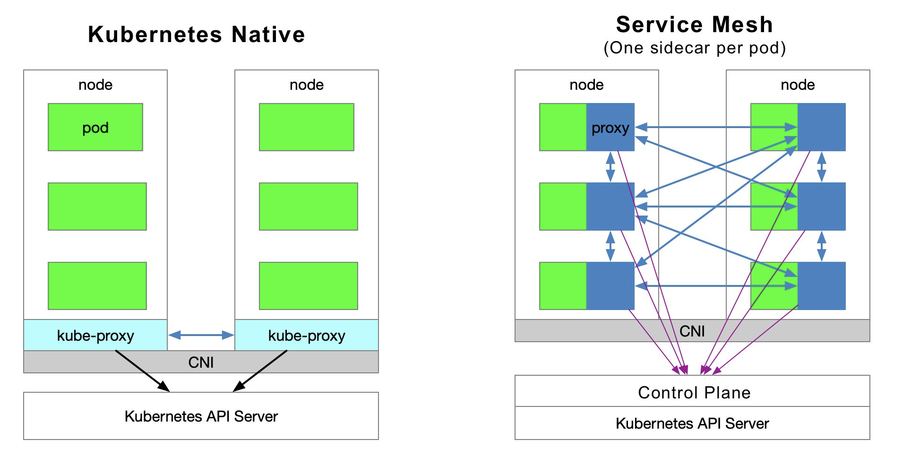
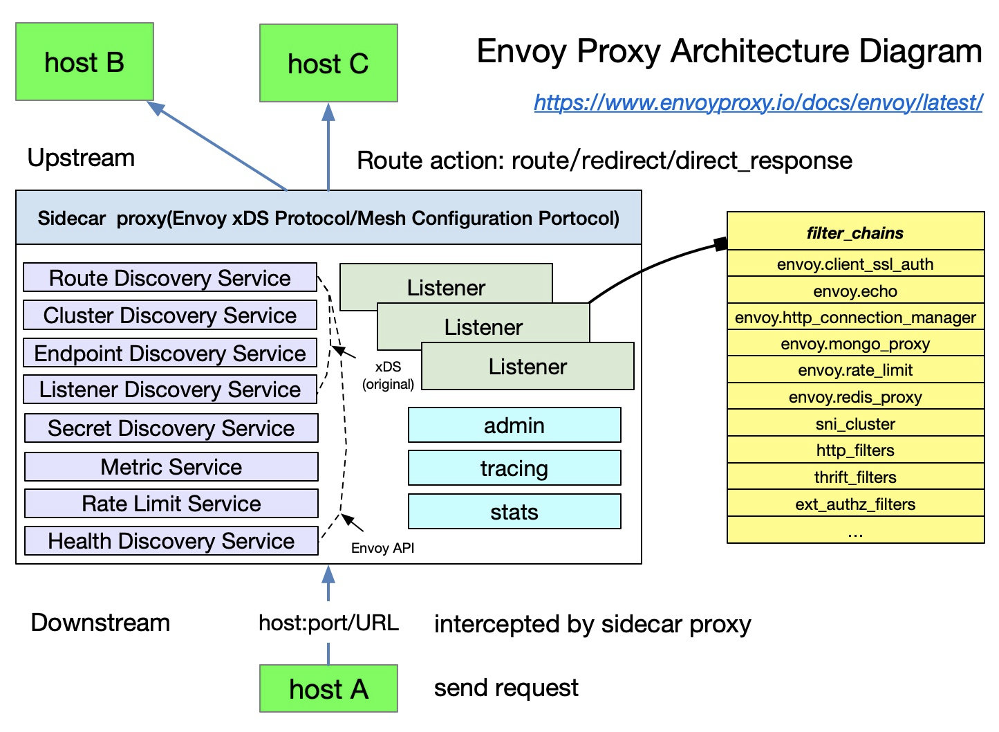
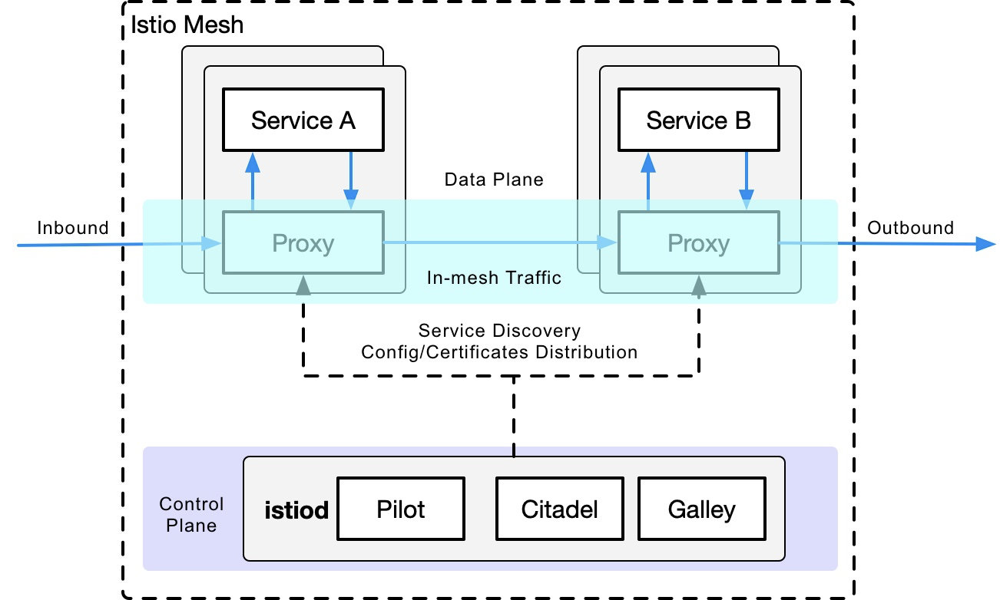

If you’ve heard of service mesh and tried [Istio](https://istio.io/), you may have the following questions:

1. Why is Istio running on Kubernetes?
2. What is the role of Kubernetes and a service mesh in the cloud native application architecture, respectively?
3. What aspects of Kubernetes does Istio extend? What problems does it solve?
4. What is the relationship between Kubernetes, Envoy, and Istio?

This article will take you through the inner workings of Kubernetes and Istio. In addition, I will introduce the load balancing approach in Kubernetes, and explain why you need Istio when you have Kubernetes.

Kubernetes is essentially about application lifecycle management through declarative configuration, while a service mesh is essentially about providing inter-application traffic, security management and observability. If you have already built a stable application platform using Kubernetes, how do you set up load balancing and traffic control for calls between services? This is where a service mesh comes into the picture.

Envoy introduces the xDS protocol, which is supported by various open source software, such as [Istio](https://istio.io/), [MOSN](https://github.com/mosn/mosn), etc. Envoy contributes xDS to a service mesh or cloud native infrastructure. Envoy is essentially a modern version of a proxy that can be configured through APIs, based on which many different usage scenarios are derived — such as API Gateway, sidecar proxy in service mesh, and edge proxy.

This article contains the following:

- A description of the role of kube-proxy.
- The limitations of Kubernetes for microservice management.
- An introduction to the capabilities of Istio service mesh.
- A comparison of some of the concepts in Kubernetes, Envoy, and the Istio service mesh.

## Kubernetes vs Service Mesh

The following diagram shows the service access relationship in Kubernetes and service mesh (one sidecar per pod model).

### Traffic Forwarding

Each node in a Kubernetes cluster deploys a kube-proxy component that communicates with the Kubernetes API Server, gets information about the services in the cluster, and then sets iptables rules to send requests for service directly to the corresponding Endpoint (a pod belonging to the same group of services).

### Service Discovery

Istio can follow the service registration in Kubernetes and can also interface with other service discovery systems via platform adapters in the control plane; and then generate data plane configurations (using CRD, which are stored in etcd) with transparent proxies for the data plane. The transparent proxy of the data plane is deployed as a sidecar container in the pod of each application service, and all these proxies need to request the control plane to synchronize the proxy configuration. The proxy is “transparent” because the application container is completely unaware of the presence of the proxy. The kube-proxy component in the process needs to intercept traffic as well, except that the kube-proxy intercepts traffic to and from the Kubernetes node — while the sidecar proxy intercepts traffic to and from the pod.

### Disadvantages of a Service Mesh

Since Kubernetes has many pods running on each node, putting the original kube-proxy route forwarding function in each pod will increase the response latency — due to more hops when the sidecar intercepts the traffic — and consume more resources. In order to manage traffic in a fine-grained manner, a series of new abstractions will be added. This will further increase the learning cost for users, but as the technology becomes more popular this situation will be slowly alleviated.

### Advantages of a Service Mesh

The kube-proxy settings are global and cannot be controlled at a granular level for each service, while service mesh takes the traffic control out of the service layer in Kubernetes by means of sidecar proxy — allowing for more elasticity.

### Shortcomings of Kube-Proxy

First, it does not automatically try another pod if the forwarded pod is not serving properly. Each pod has a health check mechanism and when a pod has health problems, kubelet will restart the pod and kube-proxy will remove the corresponding forwarding rules. Also, nodePort-type services cannot add TLS or more complex message routing mechanisms.

Kube-proxy implements load balancing of traffic across multiple pod instances of a Kubernetes service, but how do you do fine-grained control of traffic between these services — such as dividing traffic by percentage to different application versions (which are all part of the same service but on different deployments), or doing canary releases (grayscale releases) and blue-green releases?

The Kubernetes community gives a way to [do canary releases using Deployment](https://kubernetes.io/docs/concepts/cluster-administration/manage-deployment/#canary-deployments), which is essentially a way to assign different pods to a deployment’s service by modifying the pod’s label.

## Kubernetes Ingress vs. Istio Gateway

As mentioned above, kube-proxy can only route traffic within a Kubernetes cluster. The pods of a Kubernetes cluster are located in a network created by CNI. An ingress — a resource object created in Kubernetes — is created for communication outside the cluster. It’s driven by an ingress controller located on Kubernetes edge nodes responsible for managing north-south traffic. Ingress must be docked to various Ingress Controllers, such as the [nginx ingress controller](https://github.com/kubernetes/ingress-nginx) and [traefik](https://traefik.io/). Ingress is only applicable to HTTP traffic and is simple to use. It can only route traffic by matching a limited number of fields — such as service, port, HTTP path, etc. This makes it impossible to route TCP traffic such as MySQL, Redis, and various RPCs. This is why you see people writing nginx config language in ingress resource annotations.The only way to directly route north-south traffic is to use the service’s LoadBalancer or NodePort, the former requiring cloud vendor support and the latter requiring additional port management.

Istio Gateway functions similarly to Kubernetes Ingress, in that it is responsible for north-south traffic to and from the cluster. Istio Gateway describes a load balancer for carrying connections to and from the edge of the mesh. The specification describes a set of open ports and the protocols used by those ports, the SNI configuration for load balancing, etc. Gateway is a CRD extension that also reuses the capabilities of the sidecar proxy; see the [Istio website](https://istio.io/latest/docs/reference/config/networking/gateway/) for detailed configuration.

## Envoy

Envoy is the default sidecar proxy in Istio. Istio extends its control plane based on Enovy’s xDS protocol. We need to familiarize ourselves with Envoy’s basic terminology before talking about Envoy’s xDS protocol. The following is a list of basic terms and their data structures in Envoy; please refer to the [Envoy documentation](https://envoyproxy.io/) for more details.

### Basic Terminology

The following are the basic terms in Enovy that you should know.

- **Downstream**: The downstream host connects to Envoy, sends the request, and receives the response; i.e., the host that sent the request.
- **Upstream**: The upstream host receives connections and requests from Envoy and returns responses; i.e., the host that receives the requests.
- **Listener**: Listener is a named network address (for example, port, UNIX domain socket, etc.); downstream clients can connect to these listeners. Envoy exposes one or more listeners to the downstream hosts to connect.
- **Cluster**: A cluster is a group of logically identical upstream hosts to which Envoy connects. Envoy discovers the members of a cluster through service discovery. Optionally, the health status of cluster members can be determined through proactive health checks. Envoy decides which member of the cluster to route requests through a load balancing policy.

Multiple listeners can be set in Envoy, each listener can set a filter chain (filter chain table), and the filter is scalable so that we can more easily manipulate the behavior of traffic — such as setting encryption, private RPC, etc.

The xDS protocol was proposed by Envoy and is the default sidecar proxy in Istio, but as long as the xDS protocol is implemented, it can theoretically be used as a sidecar proxy in Istio — such as the [MOSN](https://github.com/mosn/mosn) open source by Ant Group.

Istio is a very feature-rich service mesh that includes the following capabilities.

- Traffic Management: This is the most basic feature of Istio.
- Policy Control: Enables access control systems, telemetry capture, quota management, billing, etc.
- Observability: Implemented in the sidecar proxy.
- Security Authentication: The Citadel component does key and certificate management.

## Traffic Management in Istio

The following CRDs are defined in Istio to help users with traffic management.

- Gateway: Gateway describes a load balancer that runs at the edge of the network and is used to receive incoming or outgoing HTTP/TCP connections.
- VirtualService: VirtualService actually connects the Kubernetes service to the Istio Gateway. It can also perform additional operations, such as defining a set of traffic routing rules to be applied when a host is addressed.
- DestinationRule: The policy defined by the DestinationRule determines the access policy for the traffic after it has been routed. Simply put, it defines how traffic is routed. Among others, these policies can be defined as load balancing configurations, connection pool sizes, and external detection (for identifying and expelling unhealthy hosts in the load balancing pool) configurations.
- EnvoyFilter: The EnvoyFilter object describes filters for proxy services that can customize the proxy configuration generated by Istio Pilot. This configuration is generally rarely used by primary users.
- ServiceEntry: By default, services in the Istio service mesh are unable to discover services outside of the Mesh. ServiceEntry enables additional entries to be added to the service registry inside Istio, thus allowing automatically discovered services in the mesh to access and route to these manually added services.

## Kubernetes vs. xDS vs. Istio

Having reviewed the abstraction of traffic management in Kubernetes’ kube-proxy component, xDS, and Istio, let’s look now at a comparison of the three components/protocols in terms of traffic management only (note that the three are not exactly equivalent).

| **Kubernetes** | **xDS**  | **Istio service mesh** |
| -------------- | -------- | ---------------------- |
| Endpoint       | Endpoint | WorkloadEntry          |
| Service        | Route    | VirtualService         |
| kube-proxy     | Route    | DestinationRule        |
| kube-proxy     | Listener | EnvoyFilter            |
| Ingress        | Listener | Gateway                |
| Service        | Cluster  | ServiceEntry           |

## Takeaways

- The essence of Kubernetes is application lifecycle management, specifically deployment and management (scaling up and down, auto-recovery, release).
- Kubernetes provides a scalable and highly resilient deployment and management platform for microservices.
- A service mesh is based on transparent proxies that intercept traffic between services through sidecar proxies, and then manage the behavior of them through control plane configuration.
- A service mesh decouples traffic management from Kubernetes, eliminating the need for a kube-proxy component to support traffic within service mesh; and managing inter-service traffic, security and observability by providing an abstraction closer to the microservice application layer.
- xDS is one of the protocol standards for service mesh configuration.
- A service mesh is a higher-level abstraction of service in Kubernetes.

## Summary

If the object managed by Kubernetes is a pod, then the object managed in service mesh is a service, so it’s just a matter of using Kubernetes to manage microservices and then applying service mesh. If you don’t even want to manage a service, then use a serverless platform like [Knative](https://knative.dev/) — but that’s an afterthought.
