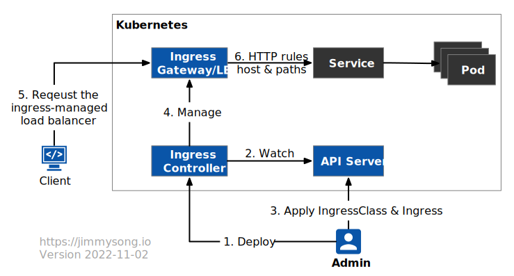
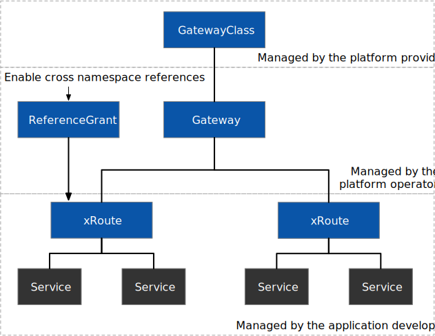

In this blog, you will learn about the Kubernetes Ingress Gateway, the Gateway API, and the emerging Gateway API trend, which enables the convergence of Kubernetes and service mesh.

## Takeaways

- Ingress, the original gateway for Kubernetes, has a resource model that is too simple to fit into today’s programmable networks.
- The [Gateway API](https://gateway-api.sigs.k8s.io/), the latest addition to the Kubernetes portal gateway, separates concerns through role delineation and provides cross-namespace support to make it more adaptable to multi-cloud environments. Most API gateways already support it.
- The Gateway API provides a new reference model for the convergence of ingress gateways (north-south) and service mesh (east-west, cross-cluster routing), where there is a partial functional overlap.

## History of the Kubernetes ingress gateway

When Kubernetes was launched in June 2014, only NodePort and LoadBalancer-type Service objects were available to expose services within the cluster to the outside world. Later, [Ingress ](https://kubernetes.io/docs/concepts/services-networking/ingress/)was introduced to offer more control over incoming traffic.. To preserve its portability and lightweight design, the Ingress API matured more slowly than other Kubernetes APIs; it was not upgraded to GA until Kubernetes 1.19.

Ingress’ primary objective is to expose HTTP applications using a straightforward declarative syntax. When creating an Ingress or setting a default *IngressClass* in Kubernetes, you can deploy several Ingress Controllers and define the controller the gateway uses via *IngressClass*. Kubernetes currently supports only AWS, GCE, and Nginx Ingress controllers by default; many [third-party ingress controllers](https://kubernetes.io/docs/concepts/services-networking/ingress-controllers/) are also supported.

The following diagram illustrates the workflow of Kubernetes Ingress.



The detailed process is as follows:

- Kubernetes cluster administrators deploy an Ingress Controller in Kubernetes.
- The Ingress Controller continuously monitors changes to *IngressClass* and Ingress objects in the Kubernetes API Server.
- Administrators apply *IngressClass* and Ingress to deploy the gateway.
- Ingress Controller creates the corresponding ingress gateway and configures the routing rules according to the administrator’s configuration.
- If in the cloud, the client accesses the load balancer for that ingress gateway.
- The gateway will route the traffic to the corresponding back-end service based on the host and path in the HTTP request.

Istio supports both the Ingress and Gateway APIs. Below is an example configuration using the Istio Ingress Gateway, which will be created later using the Gateway API:

```yaml
apiVersion: networking.k8s.io/v1
kind: IngressClass
metadata:
  name: istio
spec:
  controller: istio.io/ingress-controller
---
apiVersion: networking.k8s.io/v1
kind: Ingress
metadata:
  name: ingress
spec:
  ingressClassName: istio
  rules:
  - host: httpbin.example.com
    http:
      paths:
      - path: /
        pathType: Prefix
        backend:
          service:
            name: httpbin
            port: 8000
```

Note: You must specify the *IngressClass* in the *ingressClassName* field in the Ingress spec. Otherwise, the ingress gateway will not be created.

## Limitations of Kubernetes Ingress

Although IngressClass decouples the ingress gateway from the back-end implementation, it still has significant limitations.

- Ingress is too simple for most real-world use and it only supports HTTP protocol routing.
- It only supports host and path matching, and there is no standard configuration for advanced routing features, which can only be achieved through annotation, such as URL redirection using Nginx Ingress Controller, which requires configuration of *nginx.ingress.kubernetes.io/rewrite-target* annotation, which is no longer adaptable to the needs of a programmable proxy.
- The situation where services in different namespaces must be bound to the same gateway often arises in practical situations where the ingress gateway cannot be shared across multiple namespaces.
- No delineation of responsibilities for creating and managing ingress gateways, resulting in developers having to not only configure gateway routes but also create and manage gateways themselves.

## Kubernetes Gateway API

The Gateway API is a collection of API resources: *GatewayClass*, *Gateway*, *HTTPRoute*, *TCPRoute*, *ReferenceGrant*, etc. The Gateway API exposes a more generic proxy API that can be used for more protocols than HTTP and models more infrastructure components, providing better deployment and management options for cluster operations.

In addition, the Gateway API achieves configuration decoupling by separating resource objects that people can manage in different roles. The following diagram shows the roles and objects in the Gateway API.



The following is an example of using the Gateway API in Istio.

```yaml
apiVersion: gateway.networking.k8s.io/v1alpha2
kind: Gateway
metadata:
  name: gateway
  namespace: istio-ingress
spec:
  gatewayClassName: istio
  listeners:
  - name: default
    hostname: "*.example.com"
    port: 80
    protocol: HTTP
    allowedRoutes:
      namespaces:
        from: All
---
apiVersion: gateway.networking.k8s.io/v1alpha2
kind: HTTPRoute
metadata:
  name: http
  namespace: default
spec:
  parentRefs:
  - name: gateway
    namespace: istio-ingress
  hostnames: ["httpbin.example.com"]
  rules:
  - matches:
    - path:
        type: PathPrefix
        value: /
    backendRefs:
    - name: httpbin
      port: 8000
```

Similar to Ingress, Gateway uses *gatewayClassName* to declare the controller it uses, which needs to be created by the platform administrator and allows client requests for the **.example.com* domain. Application developers can create routing rules in the namespace where their service resides, in this case, default, and bind to the Gateway via parentRefs, but only if the Gateway explicitly allows them to do so (via the rules set in the *allowRoutes* field).

When you apply the above configuration, Istio will automatically create a load-balancing gateway for you. The following diagram shows the workflow of the Gateway API.


The detailed process is as follows:

- The infrastructure provider provides *GatewayClass* and Gateway Controller.
- Platform operator deploy Gateway (multiple deployments possible, or using different *GatewayClasses*).
- Gateway Controller continuously monitors changes to the *GatewayClass* and *Gateway* objects in the Kubernetes API Server.
- Gateway controller will create the corresponding gateway based on cluster operations and maintenance configuration.
- Application developers apply *xRoutes* and bind them to the service.
- If in the cloud, the client accesses the load balancer for that ingress gateway.
- The gateway will route to the corresponding back-end service based on the matching criteria in the traffic request.

From the above steps, we can see that the Gateway API has a clear division of roles compared to Ingress and that routing rules can be decoupled from the gateway configuration, significantly increasing management flexibility.

The following diagram shows the route flow after it is accessed at the gateway and processed.


From this figure, we can see that the route is bound to the gateway. The route is generally deployed in the same namespace as its backend services. Suppose the route is in a different namespace, and you need to explicitly give the route cross-namespace reference rights in `ReferenceGrant`, for example. In that case, the following HTTPRoute foo in the foo namespace can refer to the bar namespace bar service in the bar namespace.

```yaml
kind: HTTPRoute
metadata:
  name: foo
  namespace: foo
spec:
  rules:
  - matches:
    - path: /bar
    forwardTo:
      backend:
      - name: bar
        namespace: bar
---
kind: ReferenceGrant
metadata:
  name: bar
  namespace: bar
spec:
  from:
  - group: networking.gateway.k8s.io
    kind: HTTPRoute
    namespace: foo
  to:
  - group: ""
    kind: Service
```

Currently, the Gateway API only supports HTTPRoute, and the TCPRoute, UDPRoute, TLSRoute and GRCPRoute are still in the experimental stage. The Gateway API is already supported by a large number of gateway and service mesh projects, and please [check the support status in the official Gateway documentation.](https://gateway-api.sigs.k8s.io/implementations/)

## Ingress Gateway and Service Mesh

The service mesh focuses on east-west traffic, i.e., traffic within a Kubernetes cluster, but most service meshes, including Istio, also provide ingress gateway functionality. But, since Istio’s ingress functionality and API are more advanced than we need for this example, we’ll use [Service Mesh Interface (SMI)](https://smi-spec.io/) to illustrate the relationship between the ingress gateway and the service mesh.

SMI is a CNCF incubation project, open-sourced in 2019, that defines a common standard for vendor-independent service mesh running in Kubernetes.

The following diagram illustrates the overlap between the Gateway API and the SMI.


From the diagram, we can see a clear overlap between the Gateway API and SMI in the traffic specification section. These overlaps result in the same functionality that needs to be implemented repeatedly in both the Gateway API and the service mesh.

## Traffic Management in the Istio Service Mesh

Of course, not all service meshes are fully SMI-compliant. Istio, the most popular service mesh implementation, provides rich traffic management features but does not have a separate policy API for these features, instead coupling them in *VirtualService* and *DestinationRule*, as shown below.

### VirtualService

- Routing: canary release, matching routes based on HTTP header, URI, etc.
- Error injection: HTTP error code injection, HTTP delay injection.
- Traffic splitting: percentage-based traffic splitting.
- Traffic mirroring: mirroring a certain percentage of traffic to other clusters.
- Timeout: set the timeout period, after which the request will fail.
- Retry: set the retry policy, such as trigger conditions, number of retries, interval time, etc.

### DestinationRule

Load balancing: setting up load balancing policies, such as simple load balancing, locality-aware load balancing, and area-weighted load balancing.
Circuit Breaking: Outlier detection and connection pool settings to remove anomalous nodes from the load balancing pool.

*VirtualService* mainly handles routing-related functions, while *DestinationRule* is responsible for adding and ejecting nodes from the cluster and load balancing.

Gateway API Converging the Ingress Gateway from Kubernetes and Service Mesh

As mentioned above, there is a partial functional intersection between the Gateway API and the service mesh. To reduce duplication of development and enable the modeling of common concerns between the Gateway API and the service mesh, the Gateway API Working Group has proposed the [Gateway API Mesh Management and Administration](https://gateway-api.sigs.k8s.io/contributing/gamma/) (GAMMA) initiative.

Under this initiative, advanced traffic management features that vary in detail across gateway implementations, such as timeouts, retries, health checks, etc., will all be implemented by individual providers through [policy attachment](https://gateway-api.sigs.k8s.io/references/policy-attachment/). You can specify the resource object to which the policy attachment is attached via the *targetRef* field, as shown below.

```yaml
apiVersion: networking.acme.io/v1alpha1
kind: RetryPolicy
metadata:
  name: foo
spec:
  override:
    maxRetries: 10
  default:
    maxRetries: 5
  targetRef:
    group: gateway.networking.k8s.io/v1alpha2
    kind: HTTPRoute
    name: foo
```

In this example, the retry policy is attached to a resource named *foo* and *HTTPRoute*. Policy attachments are connected to different resource objects with varying priorities for effectiveness. For instance, GatewayClass is a cluster-level resource and will take precedence if the policy attachment is overlaid on it.

You can assign override and default values to additional policies whose priority in the ingress and the different resources in the mesh hierarchy are shown in the figure below.


Currently, the Gateway API is being explored to handle mesh traffic, and several [design options](https://docs.google.com/document/d/1T_DtMQoq2tccLAtJTpo3c0ohjm25vRS35MsestSL9QU/edit#heading=h.6ks49gf06yii) have been proposed.

## Envoy Gateway

The first open-source version of Envoy Gateway, [v0.2, was released](https://blog.envoyproxy.io/introducing-envoy-gateway-ad385cc59532) in October 2022. It was created based on the Envoy proxy’s compliance with the Gateway API, of which [Tetrate ](https://tetrate.io/)is a core sponsor. Its expressive, scalable, role-oriented API design through ingress and L4/L7 traffic routing makes it the foundation for vendors to build value-added API gateway products.

Long before Envoy Gateway was released, Envoy was massively adopted as one of the most popular cloud-native proxies, with several Gateway software builds based on Envoy, and the Istio service mesh used it as the default sidecar proxy and configured these distributed proxies via the xDS protocol. Envoy Gateway also uses xDS to configure the Envoy fleet. The following diagram illustrates the architecture of Envoy Gateway.


The infrastructure provider will provide you with GatewayGlass. You can create an Envoy Gateway by creating a Gateway declaration. Your routing and policy attachments in the Gateway will be sent to the Envoy fleet via the xDS protocol.

For further information about Envoy Gateway, please read

- [Hands on with the New Kubernetes Gateway API, Using Envoy Gateway 0.2](https://tetrate.io/blog/hands-on-with-the-gateway-api-using-envoy-gateway-0-2/)
- [Gateway to the Future: the New Kubernetes Gateway API and Envoy Gateway 0.2](https://tetrate.io/blog/gateway-to-the-future-the-new-gateway-api-and-envoy-gateway-0-2/)

## Summary

The Gateway API, as the next-generation Kubernetes Ingress API, provides a better degree of API specification for Kubernetes gateway providers as opposed to the Ingress API before, enriching the functionality of the ingress gateway while ensuring its portability and facilitating the management of gateways by different stakeholders through the separation of concerns. Finally, the GAMMA initiative is promoting the integration of the Ingress Gateway with the Gateway API for service mesh, and policy attachments may further extend the functionality of the Gateway API to east-west gateways.

---

*This blog was originally published at [tetrate.io](https://tetrate.io/blog/why-the-gateway-api-is-the-unified-future-of-ingress-for-kubernetes-and-service-mesh/).*
