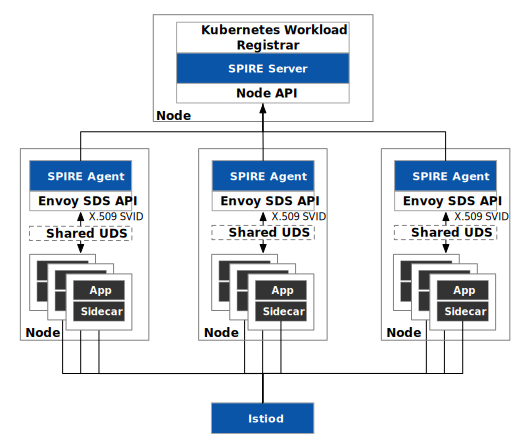

[Istio 1.14](https://istio.io/latest/news/releases/1.14.x/announcing-1.14/) was released in June of this year, and one of the most notable features of this release is support for [SPIRE](https://spiffe.io/docs/latest/spire-about/), which is one of the implementations of [SPIFFE](https://spiffe.io/), a CNCF incubation project. This article explains what SPIRE means for zero-trust architectures and why you would need SPIRE for authentication in Istio.

## Authentication in Kubernetes

We all know that Istio was built for and typically runs on Kubernetes, so before we talk about how to use SPIRE for authentication in Istio, let’s take a look at how Kubernetes handles authentication.

Let’s look at an example of a pod’s token. Whenever a pod gets created in Kubernetes, it gets assigned a default service account from the namespace, assuming we didn’t explicitly assign a service account to it. Here is an example:

```bash
apiVersion: v1
data:
  ca.crt: {CA_CRT}
  namespace: ZGVmYXVsdA==
  token: {TOKEN_STRING}
kind: Secret
metadata:
  annotations:
    kubernetes.io/service-account.name: sleep
    kubernetes.io/service-account.uid: 2c0d00e8-13a2-48d0-9ff8-f987f3325ecf
  creationTimestamp: "2022-06-14T03:01:35Z"
  name: sleep-token-gwhwd
  namespace: default
  resourceVersion: "244535398"
  uid: b8822ceb-9553-4a17-96dc-d525bbaed0e0
type: kubernetes.io/service-account-token
```

Kubernetes manages the identity of Pods with Service Accounts and then specifies the permissions of Pods with a Service Account to the Kubernetes API using RBAC. A service account’s token is stored in a secret, which does not include a declaration of the node or pod where the workload is running. When a malicious actor steals a token, they gain full access to the account and can steal information or carry out sabotage under the guise of that user.

A token can only be used to identify a workload in one cluster, but Istio supports multiple clusters and meshes, as well as Kubernetes environments and virtual machines. A unified workload identity standard can help here.

## An Introduction to SPIFFE and SPIRE

SPIFFE’s (Secure Production Identity Framework for Everyone) goal is to create a zero-trust, fully-identified data center network by establishing an open, unified workload identity standard based on the concept of zero-trust. SPIRE can rotate X.509 SVID certificates and secret keys on a regular basis. Based on administrator-defined policies, SPIRE can dynamically provision workload certificates and Istio can consume them. I’ll go over some of the terms associated with SPIFFE in a little more detail below. 

SPIRE (SPIFFE Runtime Environment) is a SPIFFE implementation that is ready for production. SVID (SPIFFE Verifiable Identity Document) is the document that a workload uses to prove its identity to a resource or caller. SVID contains a SPIFFE ID that represents the service’s identity. It uses an X.509 certificate or a JWT token to encode the SPIFFE ID in a cryptographically verifiable document. The SPIFFE ID is a URI that looks like this: `spiffe://trust_domain/workload_identifier`.

## SPIFFE and Zero Trust Security

The essence of Zero Trust is identity-centric dynamic access control. SPIFFE addresses the problem of identifying workloads.

We might identify a workload using an IP address and port in the era of virtual machines, but IP address-based identification is vulnerable to multiple services sharing an IP address, IP address forgery, and oversized access control lists. Because containers have a short lifecycle in the Kubernetes era, instead of an IP address, we rely on a pod or service name. However, different clouds and software platforms approach workload identity differently, and there are compatibility issues. This is especially true in heterogeneous hybrid clouds, where workloads run on both virtual machines and Kubernetes. It is critical to establish a fine-grained, interoperable identification system at this point.

## Using SPIRE for Authentication in Istio

With the introduction of SPIRE to Istio, we can give each workload a unique identity, which is used by workloads in the service mesh for peer authentication, request authentication, and authorization policies. The SPIRE Agent issues SVIDs for workloads by communicating with a shared UNIX Domain Socket in the workload. The Envoy proxy and the SPIRE agent communicate through the Envoy SDS (Secret Discovery Service) API. Whenever an Envoy proxy needs to access secrets (certificates, keys, or anything else needed to do secure communication), it will talk to the SPIRE agent through Envoy’s SDS API.

The most significant advantage of SDS is the ease with which certificates can be managed. Without this feature, certificates would have to be created as a secret and then mounted into the agent container in a Kubernetes deployment. The secret must be updated, and the proxy container must be re-deployed if the certificate expires. Using SDS, Istio can push the certificates to all Envoy instances in the service mesh. If the certificate expires, the server only needs to push the new certificate to the Envoy instance; Envoy will use the new certificate right away, and the proxy container will not need to be re-deployed.

The architecture of using SPIRE for authentication in Istio is depicted in the diagram below.



Use StatefulSet resources to deploy the SPIRE Server and Kubernetes Workload Registrar in the spire namespace of the Kubernetes cluster, and DaemonSet resources to deploy a SPIRE Agent for each node. Assuming that you used the default DNS name `cluster.local` when you install Kubernetes, [Kubernetes Workload Registrar](https://github.com/spiffe/spire/blob/main/support/k8s/k8s-workload-registrar/README.md) creates identities for the workloads in the Istio mesh in the following format:

- SPRRE Server：`spiffe://cluster.local/ns/spire/sa/server`
- SPIRE Agent：`spiffe://cluster.local/ns/spire/sa/spire-agent`
- Kubernetes Node：`spiffe://cluster.local/k8s-workload-registrar/demo-cluster/node/`
- Kubernetes Workload Pod：`spiffe://cluster.local/{namespace}/spire/sa/{service_acount}`

This way, both the nodes and each workload have their own globally unique identity and can be scaled according to the cluster (trust domain).

The workload authentication process in Istio mesh is shown in the figure below.



The detailed process is as follows:

1. The pilot-agent in the sidecar of the workload calls the SPIRE agent via the shared UDS to get the SVID.
2. SPIRE Agent asks Kubernetes (kubelet on the node to be precise) for information about the workload.
3. The kubelet returns the information queries from the Kubernetes API server to the workload attestor.
4. The attestor compares the results returned by the kubelet with the identity information shared by the sidecar.
5. If they match, returns the SVID to the workload and caches it, if not, the attestation failed.

Please refer to the [Istio documentation](https://istio.io/latest/docs/ops/integrations/spire) to learn how to use SPIRE for authentication in Istio.

## Summary

SPIFFE unifies identity standards in heterogeneous environments, which is the foundation of zero-trust networks. In Istio, whether we use SPIRE or not, authentication is not perceptible to workloads. By using SPIRE to provide authentication for workloads, we can effectively manage workload identity and lay the foundation for a zero-trust network.
