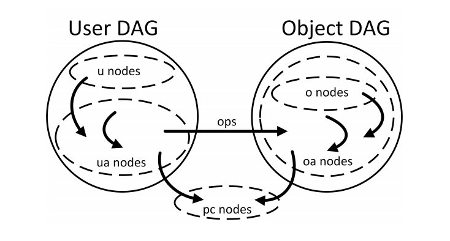
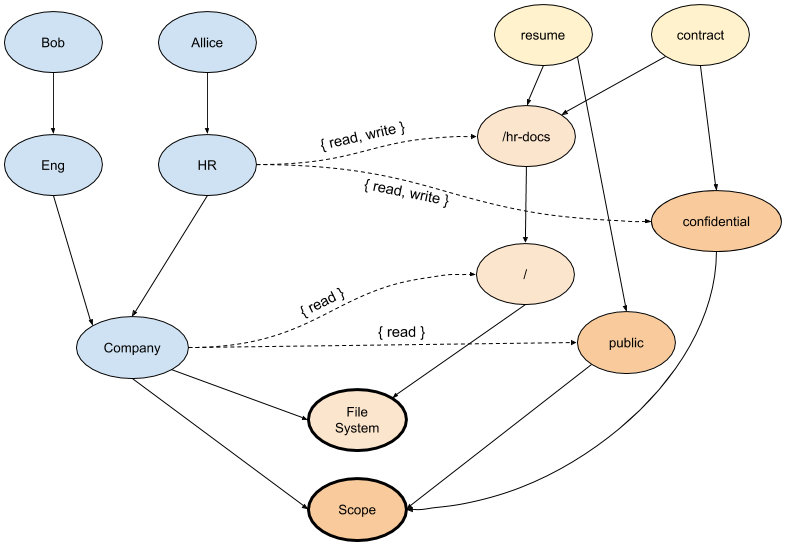
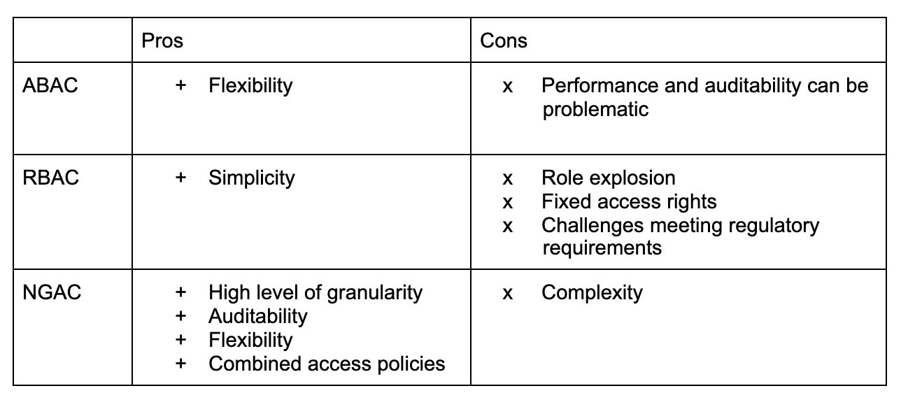

Different companies or software providers have devised countless ways to control user access to functions or resources, such as Discretionary Access Control (DAC), Mandatory Access Control (MAC), Role-Based Access Control (RBAC), and Attribute-Based Access Control (ABAC). In essence, whatever the type of access control model, three basic elements can be abstracted: user, system/application, and policy.

In this article, we will introduce ABAC, RBAC, and a new access control model — Next Generation Access Control (NGAC) — and compare the similarities and differences between the three, as well as why you should consider NGAC.

## What Is RBAC?

RBAC, or Role-Based Access Control, takes an approach whereby users are granted (or denied) access to resources based on their role in the organization. Every role is assigned a collection of permissions and restrictions, which is great because you don’t need to keep track of every system user and their attributes. You just need to update appropriate roles, assign roles to users, or remove assignments. But this can be difficult to manage and scale. Enterprises that use the RBAC static role-based model have experienced role explosion: large companies may have tens of thousands of similar but distinct roles or users whose roles change over time, making it difficult to track roles or audit unneeded permissions. RBAC has fixed access rights, with no provision for ephemeral permissions or for considering attributes like location, time, or device. Enterprises using RBAC have had difficulty meeting the complex access control requirements to meet regulatory requirements of other organizational needs.

### RBAC Example

Here’s an example Role in the “default” namespace in Kubernetes that can be used to grant read access to pods:

```yaml
apiVersion: rbac.authorization.k8s.io/v1
kind: Role
metadata:
  namespace: default
  name: pod-reader
rules:
- apiGroups: ["v1"]
  resources: ["pods"]
  verbs: ["get", "watch", "list"]
```

## What Is ABAC?

ABAC stands for Attribute-Based Access Control. At a high level, [NIST defines](https://www.nist.gov/publications/guide-attribute-based-access-control-abac-definition-and-considerations-1) ABAC as an access control method “where subject requests to perform operations on objects are granted or denied based on assigned attributes of the subject, environment conditions, and a set of policies that are specified in terms of those attributes and conditions.” ABAC is a fine-grained model since you can assign any attributes to the user, but at the same time it becomes a burden and hard to manage:

1. When defining permissions, the relationship between users and objects cannot be visualized.
2. If the rules are a little complex or confusingly designed, it will be troublesome for the administrator to maintain and trace.

This can cause performance problems when there is a large number of permissions to process.

### ABAC Example

Kubernetes initially uses ABAC as access control and is configured via JSON Lines, for example:

Alice can just read pods in namespace “foo”:

```json
 {"apiVersion": "abac.authorization.kubernetes.io/v1beta1", "kind": "Policy", "spec": {"user": "alice", "namespace": "foo", "resource": "pods", "readonly": true}}
```

## What Is NGAC?

NGAC, or Next Generation Access Control, takes the approach of modeling access decision data as a graph. NGAC enables a systematic, policy-consistent approach to access control, granting or denying users administrative capabilities with a high level of granularity. NGAC was developed by [NIST](https://www.nist.gov/) (National Institute of Standards and Technology) and is currently used in [Tetrate Q](https://www.tetrate.io/blog/introducing-tetrate-q/) and [Tetrate Service Bridge](https://www.tetrate.io/tetrate-service-bridge/).

There are several types of entities; they represent the resources you want to protect, the relationships between them, and the actors that interact with the system. The entities are:

1. Users
2. Objects
3. User attributes, such as organization unit
4. Object attributes, such as folders
5. Policy classes, such as file system access, location, and time

NIST’s David Ferraiolo and [Tetrate](https://www.tetrate.io/?utm_content=inline-mention)‘s Ignasi Barrera shared how NGAC works at their [presentation](https://www.tetrate.io/blog/unpacking-next-generation-access-control-ngac-and-tetrate-q/) on Next Generation Access Control at Service Mesh Day 2019 in San Francisco.

NGAC is based on the assumption that you can represent the system you want to protect in a graph that represents the resources you want to protect and your organizational structure, in a way that has meaning to you and that adheres to your organization semantics. On top of this model that is very particular to your organization, you can overlay policies. Between the resource model and the user model, the permissions are defined. This way NGAC provides an elegant way of representing the resources you want to protect, the different actors in the system, and how both worlds are tied together with permissions.



Image via [Linear Time Algorithms to Restrict Insider Access using Multi-Policy Access Control Systems](https://tsapps.nist.gov/publication/get_pdf.cfm?pub_id=922390)

### NGAC Example

The following example shows a simple NGAC graph with a User DAG representing an organization structure, an Object DAG representing files and folders in a filesystem, a categorization of the files, and two different policies — file system and scope — that can be combined to make access decisions. The association edges between the two DAGs define the permissions the actors have on the target resources.



In this graph we can see a representation of two files, “resume” and “contract” in the “/hr-docs” folder, each linked to a category (“public/confidential”). There are also two policy classes, “File System” and “Scope,” where the objects in the graph are attached — these need to be satisfied in order to get access to each file.

User Allice has read and write access to both files in the example, because a path links Allice to each of the files and the paths grant permissions on both policy classes. However, user Bob only has access to the “resume” file, because although there exists a path from Bob to the “contract” file that satisfies the “File System” policy class with “read” permissions, there is no path granting permissions on the “Scope” policy class. So, access to the “contract” file is denied to Bob.

## Why Choose NGAC?

The need to keep track of attributes of all objects creates a manageability burden in the case of ABAC. RBAC reduces the burden since we extract all access information to roles, but this paradigm suffers from role explosion problems and can also become unmanageable. With NGAC we have everything we need in graphs — in a compact, centralized fashion.

When access decisions are complex, processing times of ABAC can rise exponentially. RBAC becomes especially hard to manage at scale, while NGAC scales linearly.

Where NGAC really shines is in flexibility. It can be configured to allow or disallow access based not only on object attributes, but also on other conditions — time, location, phase of the moon, and so on.

Other key advantages of NGAC include the ability to set policies consistently (to meet compliance requirements) and the ability to set ephemeral policies. For example, NGAC could grant a developer one-time access to resources during an outage, without leaving unnecessary permissions in place that could later lead to a security breach. NGAC can evaluate and combine multiple policies in a single access decision, while keeping its linear time complexity.

## Summary

The following table compares ABAC, RBAC, and NGAC in several aspects.



In conclusion:

- RBAC is simpler and has good performance, but can suffer at scale.
- ABAC is flexible, but performance and auditability are a problem.
- NGAC fixes those gaps by using a novel, elegant revolutionary approach: overlay access policies on top of an existing representation of the world, provided by the user. You can model RBAC and ABAC policies as well.

## References

- [Guide to Attribute-Based Access Control (ABAC) Definition and Considerations](https://nvlpubs.nist.gov/nistpubs/specialpublications/NIST.SP.800-162.pdf)
- [Deploying ABAC policies using RBAC Systems](https://www.ncbi.nlm.nih.gov/pmc/articles/PMC6953980/)
- [RBAC vs. ABAC: What’s the Difference?](https://www.comparitech.com/net-admin/rbac-vs-abac/)
- [Role Explosion: The Unintended Consequence of RBAC](https://www.linkedin.com/pulse/role-explosion-unintended-consequence-rbac-oren-ohayon-harel/)
- [Exploring the Next Generation of Access Control Methodologies](https://www.nist.gov/publications/exploring-next-generation-access-control-methodologies)