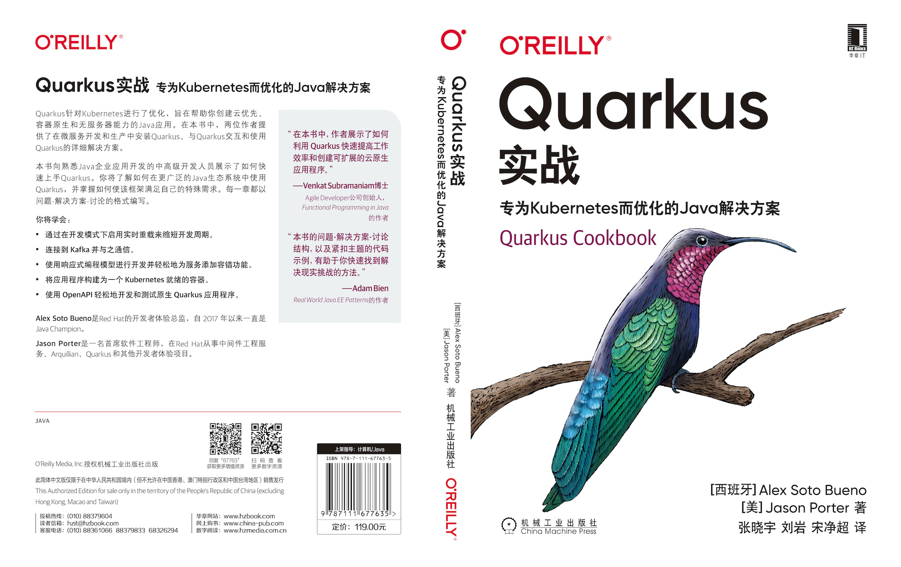

In March 2021, "Quarkus Cookbook - A Java Solution Optimized for Kubernetes" has been published by Machinery Industry Press and is available for purchase.

## Translator's Preface

Quarkus is a new technology framework that is different from the traditional Java architecture. It is built on a familiar technology stack, using many proven technologies such as JPA, JAX-RS, Eclipse Vert.x, Eclipse MicroProfile and CDI, and integrating it with Kubernetes. Kubernetes and tightly integrated. Users can leverage Kubernetes' efficient scheduling operations and maintenance capabilities to maximize resource savings.

The cloud-native flame has turned into a blaze of fire since the community Kubernetes burst into the limelight. Cloud-native related technologies are springing up. Yan Liu, Jingchao Song, and I are all members of the cloud-native community and love to preach about various related technologies, and are avid enthusiasts of this field. One of our common hobbies is to always keep an eye on good foreign technologies or excellent books on mature technologies released.

In the process, we coincidentally found this book, which is not yet translated in China, and we set out to research Quarkus with enthusiasm.

This book uses a very simple way to present problems, propose solutions, and trigger discussions, and portrays the technical points of Quarkus in a detailed and thorough way. With this book, users can learn the content on their own and use Quarkus to improve the productivity of Java-related R&D, making you invincible in the fast-paced world of microservice builds and cloud-based application development.

Throughout the translation process, we received full help from Huazhang Publishing and Editor Li Zhongming, and we would like to express our sincere thanks.

Finally, we would like to thank you for having the chance to read this book, and hope that our three people's humble efforts can help you, who admire cloud-native technologies, to enjoy the same exhilaration as we do on the technical path of Quarkus.

Translated by Xiaoyu Zhang, Yan Liu, and Jimmy Song