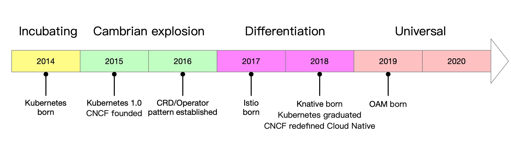

Just the other day, Java just celebrated its [25th birthday](https://www.infoworld.com/article/3544229/java-programming-language-celebrates-25-years.html), and from the time of its birth it was called "write once, run everywhere", but more than 20 years later, there is still a deep gap between programming and actual production delivery. the world of IT is never short of concepts, and if a concept doesn't solve the problem, then it's time for another layer of concepts. it's been 6 years since Kubernetes was born, and it's time for the post-Kubernetes era - the era of cloud-native applications!

This white paper will take you on a journey to explore the development path of cloud-native applications in the post-Kubernetes era.

Highlights of the ideas conveyed include.

- Cloud-native has passed through a savage growth period and is moving towards uniform application of standards.
- Kubernetes' native language does not fully describe the cloud-native application architecture, and the development and operation functions are heavily coupled in the configuration of resources.
- Operator's expansion of the Kubernetes ecosystem has led to the fragmentation of cloud-native applications, and there is an urgent need for a unified application definition standard.
- The essence of OAM is to separate the R&D and O&M concerns in the definition of cloud-native applications, and to further abstract resource objects, simplify and encompass everything.
- "Kubernetes Next Generation" refers to the fact that after Kubernetes became the infrastructure layer standard, the focus of the cloud-native ecology is being overtaken by the application layer, and the last two years have been a powerful exploration of the hot Service Mesh process, and the era of cloud-native application architecture based on Kubernetes is coming.

Kubernetes has become an established operating platform for cloud-native applications, and this white paper will expand with Kubernetes as the default platform, including an explanation of the OAM-based hierarchical model for cloud-native applications.