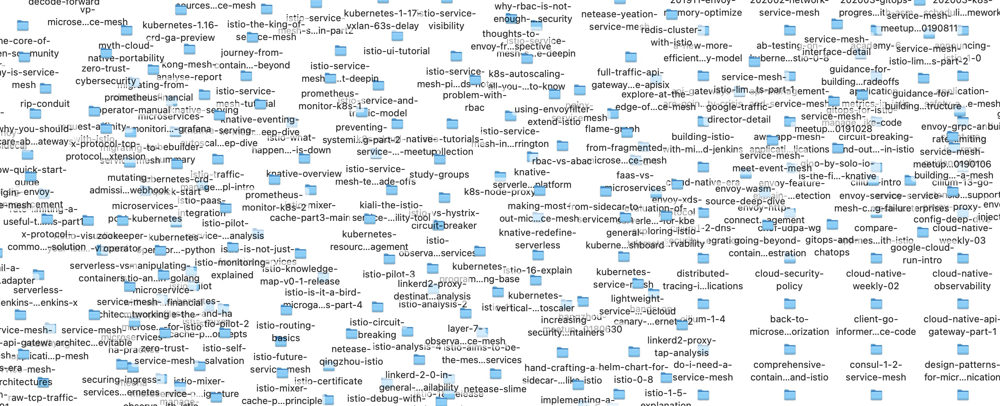

The [ServiceMesher website](https://www.servicemesher.com) has lost connection with the webhook program on the web publishing server because the [GitHub](https://github.com/servicemesher/website) where the code is hosted has has been "lost" and the hosting server is temporarily unable to log in, so the site cannot be updated. Today I spent a day migrating all the blogs on ServiceMesher to the Cloud Native Community website [cloudnative.to](https://cloudnative.to), and as of today, there are 354 blogs on the Cloud Native Community.

Now we plan to archive [ServiceMesher official GitHub](https://github.com/servicemesher/) (all pages under the [servicemesher.com](https://www.servicemesher.com) domain) We are no longer accepting new PRs, so please submit them directly to the [Cloud Native Community](https://github.com/cloudnativeto/cloudnative.to). Thank you all!

