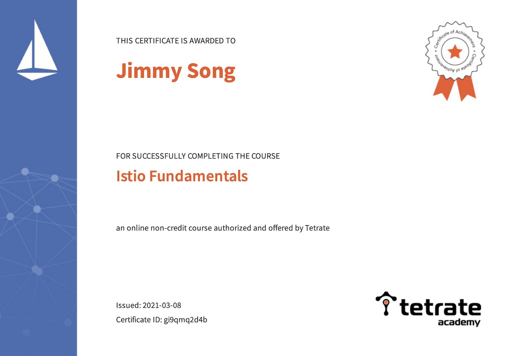

Tetrate Academy has recently released the Istio Fundamentals Course, which is now available for free. Sign up at [Tetrate Academy](https://academy.tetrate.io/courses/istio-fundamentals) now!

## Course curriculum

Here is the curriculum:

- Service Mesh and Istio Overview
- Installing Istio
- Observability: Telemetry and Logs
- Traffic Management
- Security
- Advanced Features
- Troubleshooting
- Real World Examples

There are self-assessment questions at the end of each course. I have passed the course, and here is the certificate after passing the course.

## More

In the future, Tetrate will release the Certified Istio Administrator (CIA) exam and welcome all Istio users and administrators to follow and register for it.