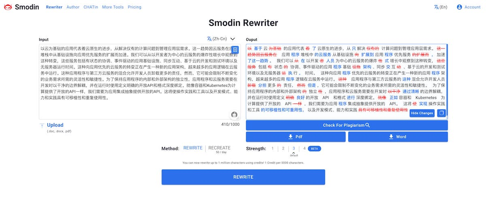
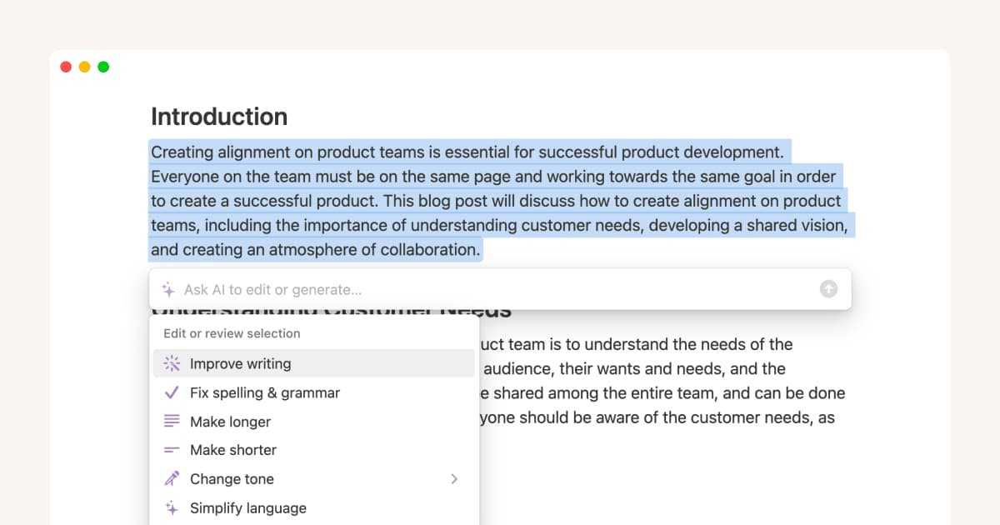
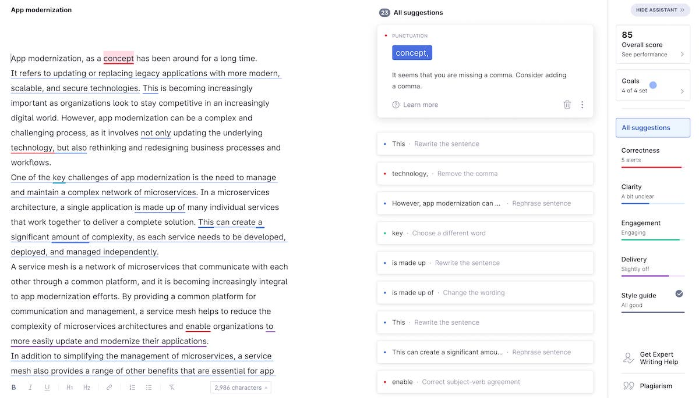

人工智能（AI）正在改变我们的生活，使我们的工作更加高效和智能化。在这个快速发展的领域中，有许多 AI 实用工具可以帮助我们更好地完成工作。在未来熟练使用各种 AI 工具优化你的工作流并提高工作效率将是每个人的必备技能，是时候收集一些便宜好用的实用 AI 工具了。下面是笔者推荐的一些值得收藏的实用 AIGC 工具，你可以直接上手使用这些工具，不需要额外的编程知识。这些工具大多可以免费使用，或者提供免费使用额度，或者使用成本很低。

注意：本列表暂时只关注文本工具，不涉及以下内容：

- 图像、声音、视频等多媒体内容生成和编辑，因为编辑那些内容需要更多专业知识，一般供专业人士使用；
- 必须付费才能使用的工具或者笔者认为收费过高的工具；



AIGC（AI-Generated Content）可以自动生成各种文本内容，如文章、新闻、产品描述、广告语等，它使用人工智能技术，通过对大量文本数据的学习和分析来生成通顺、连贯、语法正确的文本内容。对于需要大量重复性内容的场景（如电商平台的商品描述、新闻媒体的稿件生成等），它能大幅提高内容创作效率。AIGC 工具的实现方式有很多种，如基于语言模型的自动生成文本、基于模板的文本生成、基于知识图谱的自动生成文本等。随着技术的不断进步，AIGC 工具在自动生成文本方面的能力也在不断提升，能够生成更加贴近人类写作风格的文本内容。



## 1. ChatGPT


[ChatGPT](https://chat.chatgpt.com/) 是一个基于 GPT 技术的智能聊天机器人，可以与用户进行自然语言交互。它使用深度学习技术和大规模训练的语言模型来理解用户的问题并提供有用的答案。

ChatGPT 可以回答各种问题，用户可以直接在网站上输入问题或话题，并获得快速和准确的答案。需要注意的是，ChatGPT 是一个在线聊天机器人，它的回答可能不是 100% 准确。此外，ChatGPT 模型训练的数据截止到 2021 年，它还处于早期开发阶段，仍在不断改进和优化中。

**推荐理由**

ChatGPT 的回答速度超快，几秒就能得到答案，特别适合需要快速回复的场合。还可以用 OpenAI 的 API 做自己的工具。但是 ChatGPT 的免费版响应速度有时会慢，而且在追问时经常需要刷新页面，问题和答案的字数也有限制。

比较常用的功能包括：

- 编写代码
- 翻译
- 文章润色
- 总结某一篇文章（你可以输出一个 URL）
- 学习一个你不了解的知识领域

另外推荐一款 [ChatGPT 桌面应用](https://github.com/lencx/ChatGPT) 以及 [ChatGPT 提示项目](https://github.com/f/awesome-chatgpt-prompts)。

### ChatGPT Plus

[ChatGPT Plus](https://chat.chatgpt.com/plus) 是 ChatGPT 的增强版，它使用 GPT-3 技术，提供了更加强大和智能的自然语言处理功能。它可以帮助用户完成各种任务，如自动生成文章、翻译、问答、语音转换和聊天机器人等。

ChatGPT Plus 的界面简洁美观，使用起来非常直观和友好。用户可以使用多种方式输入文本，如键盘输入、语音输入和图像输入等。ChatGPT Plus 还提供了多种语言和风格选择，可以帮助用户轻松生成高质量的文本和语音。

## 2. Smodin



[Smodin.io](https://smodin.io/) 是一个基于人工智能和自然语言处理技术的在线工具，可以帮助用户自动生成文章、新闻稿、博客和社交媒体帖子等内容。该网站使用深度学习技术和语言模型来自动化生成高质量的文本，并提供了多种语言和风格选择。

[Smodin.io](http://Smodin.io) 的使用非常简单，只需要输入您需要生成的主题、关键词和所需的语言和风格，然后点击 “生成” 按钮即可获得一篇高质量的文章。您还可以根据需要进行微调和编辑，以满足您的具体需求。

除了自动生成文本外，[Smodin.io](http://Smodin.io) 还提供了其他有用的功能，如语法和拼写检查、SEO 优化建议和实时翻译等。该网站的使用非常灵活和方便，适合需要高质量文本的个人和企业用户，如营销人员、编辑、作家和博主等。

需要注意的是，虽然 [Smodin.io](http://Smodin.io) 可以为您节省大量时间和精力，但由于是自动生成的文本，可能会存在一定的语法或逻辑错误，因此在使用时需要进行适当的审查和编辑。

**推荐理由**

该网站支持 40 多种语言，**对于中文的改写功能比较强悍**，限制一次性输入 1000 字，可以迅速的返回改写结果，免费用户有调用次数限制，付费用户可无限制。付费分为两个档次，价格比较便宜。

## 3. Bing


[Bing](https://bing.com) 是微软公司开发的搜索引擎，集成了人工智能技术，可以提供更加智能化的搜索结果。最近，微软宣布向 Bing 中添加了一项新功能，即 “聊天”，用户可以在聊天框中输入问题，Bing 会自动回答问题，就像一个智能聊天机器人一样。Bing 还提供多种对话样式可供选择。

需要注意的是，聊天功能目前还处于测试阶段，可能存在一些问题和限制。此外，Bing 在一些国家和地区的可用性可能会受到限制。但是，它仍然是一款非常有用的搜索引擎，可以帮助用户快速找到所需的信息。

**推荐理由**

新必应集成的聊天功能比较稳定，因为它可以联网和实时爬取因特网中的数据，你可以把它作为搜索引擎的辅助工具，或者询问它一些实时的信息。

关于新必应与 ChatGPT 的区别请见我的[前一篇博客](/blog/new-bing-chat)。

## 4. GitHub Copilot


[GitHub Copilot](https://copilot.github.com/) 是一款由 OpenAI 和 GitHub 共同开发的 AI 代码助手，可以帮助开发人员更快、更准确地编写代码。它使用了自然语言处理和机器学习等技术，可以自动为用户生成高质量的代码，提高了开发效率和代码质量。

GitHub Copilot 可以与多种开发工具和编程语言集成，如 VS Code、Visual Studio、Python、JavaScript 等。用户只需要在编辑器中输入少量的自然语言描述，Copilot 就可以自动为用户生成高质量的代码。例如，当用户输入 “Create a function that takes two arrays as arguments and returns their dot product.” 时，Copilot 可以自动为用户生成如下代码：

```go
function dotProduct (arr1, arr2) {
  return arr1.map ((n, i) => n * arr2 [i]).reduce ((a, b) => a + b);
}
```

需要注意的是，GitHub Copilot 目前还处于 beta 版本，仍在不断优化和改进中。此外，GitHub Copilot 的代码生成质量和准确性可能会受到一些因素的影响，如输入的描述、编程语言、编码规范等。

**推荐理由**

GitHub Copilot 的代码生成速度非常快，可以帮助开发人员节省大量的时间和精力。此外，GitHub Copilot 还可以从用户的代码库中学习，提高了代码生成的质量和准确性。

## 5. Notion



[Notion](https://www.notion.so/) 是一款集笔记、待办事项、项目管理、知识库和团队协作等功能于一体的综合性工具。它提供了强大的编辑和组织功能，可以帮助用户轻松创建各种类型的文档，包括文本、图片、视频、表格和数据库等。

Notion 的界面简洁美观，使用起来非常直观和友好。用户可以使用多种方式组织和查找自己的文档，如标签、目录和搜索等。此外，Notion 还提供了丰富的协作和分享功能，可以帮助用户轻松与团队成员协作和共享文档。

对于 AI 开发人员来说，Notion 是一个非常好用的工具，可以帮助他们轻松管理项目、记录实验数据、分享笔记、翻译和文档等。Notion 还提供了丰富的第三方应用程序和 API，可以轻松集成其他工具和服务。

需要注意的是，Notion 的免费版本有一些限制，如文件上传大小限制和 API 调用次数限制等。但是，付费版本提供了更多的功能和服务，如无限制的文件上传、API 调用和团队成员数等，适合团队和企业用户使用。

**推荐理由**

Notion 提供了丰富的模板和插件，可以帮助用户快速创建各种类型的文档和项目，如产品路线图、项目计划和工作日志等。此外，Notion 的 API 和 Webhook 功能也非常强大，用户可以利用这些功能轻松集成其他工具和服务。免费用户可以创建无限多的文档，但是只有 20 次调用 Notion AI 的权限。超过该次数需要付费 $10 / 月 订阅（注意：Notion AI 功能需要单独订阅）。

Notion 是我最喜欢的 AI 文本编辑器，它对中文支持很好。而且，它支持 Markdown 格式，方便导出。它可以代替 Smodin 的部分功能，但是对于文本改写的效果还有待验证。

## 6. Grammarly



[Grammarly](https://app.grammarly.com/) 是一款使用人工智能帮助用户提高写作能力的写作助手。它可以识别和纠正语法错误、拼写错误和标点符号错误，还可以提供改善写作清晰度和风格的建议。Grammarly 可以作为浏览器扩展、桌面应用程序和移动应用程序使用，可用于各种写作任务，如电子邮件、社交媒体帖子和学术论文。Grammarly 有免费版本和高级版本，具有其他功能。

Grammarly 的使用非常简单，只需在浏览器中安装其扩展程序或在电脑或移动设备上下载其应用程序，然后在需要的文本框中开始输入即可。Grammarly 会自动检查文本，并在需要时提供建议和纠正错误。用户还可以选择不同的写作风格和语言设置，以适应他们的写作需求。

除了基本的拼写和语法检查外，Grammarly 还提供了一些高级功能，如词汇增强、句子结构调整、文本简化和风格建议等。这些功能可以帮助用户改善写作技巧，提高写作质量。此外，Grammarly 还提供了一些其他有用的工具，如写作目标设定、批注和评论等，可以帮助用户更好地组织和管理自己的写作任务。

需要注意的是，尽管 Grammarly 可以提供有用的建议和纠正错误，但它并不能完全代替人类编辑或审查。在使用 Grammarly 时，用户仍应该进行适当的审查和编辑，以确保写作质量和准确性。

**推荐理由**

Grammarly 的语法检查和纠错功能非常准确和实用，可以帮助用户快速纠正拼写错误和语法错误。此外，Grammarly 还提供了一些高级功能，如句子结构调整和文本简化，可以帮助用户改善写作风格和质量。对于需要频繁写作的人来说，Grammarly 是一个非常有用的工具，可以提高写作效率和质量。

**注意：Grammarly 不支持中文。**

## 7. Quillbot


[Quillbot](https://quillbot.com/) 是一款使用人工智能技术帮助用户改写和翻译文本的工具。它可以帮助用户将现有文本转化为更加简洁、清晰和易于理解的版本，以满足不同的写作需求。

Quillbot 的使用非常简单，只需将需要改写或翻译的文本粘贴到指定的文本框中，然后选择所需的改写或翻译选项，即可获得高质量的改写或翻译结果。Quillbot 还提供了多种语言和风格的选择，以满足不同用户的需求。

除了改写和翻译文本外，Quillbot 还提供了其他有用的功能，如语法检查、拼写检查、同义词替换和学术论文检查等。这些功能可以帮助用户提高写作质量和效率，节省时间和精力。

需要注意的是，尽管 Quillbot 可以为用户节省大量时间和精力，但改写和翻译文本需要一定的技巧和经验，因此在使用时需要进行适当的审查和编辑。

**推荐理由**

Quillbot 的改写和翻译功能非常强大和实用，可以帮助用户快速转化现有文本为更加简洁、清晰和易于理解的版本。此外，Quillbot 还提供了其他有用的功能，如语法检查、拼写检查和同义词替换等，可以帮助用户提高写作质量和效率。Quillbot 提供多款插件，可以轻松集成到浏览器和其他应用程序中使用。

**注意：Quillbot 不支持中文。**

## 8. ChatPDF


ChatPDF 是一个可以让你和任何 PDF 文件进行交流的工具，就像和一个人聊天一样。它的原理是通过分析 PDF 文件来创建语义索引，然后根据你的问题，把相关的段落发送给一个文本生成的 AI，让它给你解释。

ChatPDF 是由德国开发者 Mathis Lichtenberger 开发的，他之前还开发过其他数据处理工具 firefoo。ChatPDF 目前是免费使用的，但是有一个 120 页的限制。

你可以用它来快速地从大型 PDF 文件中提取信息，比如手册、论文、合同、书籍等。它支持中文和英文，并且可以自动翻译。

ChatPDF 还有一个 App 版本，可以在 iPhone, iPad, iPod touch 或 Mac OS X 13.0 或更高版本上使用。

**推荐理由**

你可以用它快速获取 PDF 中的关键信息，对于 200 页以内的 PDF 格式书籍已经足够使用。如果要处理超过 120 需要升级账号到  Plus 级别。

下表展示了免费账户和 Plus 账号的区别。

| 类别     | 免费       | Plus         |
| -------- | ---------- | ------------ |
| 页数限制 | 120 页     | 2000 页      |
| 大小限制 | 10MB       | 32MB         |
| 次数限制 | 3 PDF / 天   | 50 PDF / 天    |
| 问题限制 | 50 问题 / 天 | 1000 问题 / 天 |

## 结论

这些 AI 实用工具都具有高效、易用、可扩展的特点，可以帮助人们更好地完成各种任务。如果您正在寻找一款优秀的 AI 工具，那么这些工具都是值得考虑的。如果你有更多好用的实用 AI 工具，欢迎在评论区补充。本推荐列表将持续更新，敬请期待。
