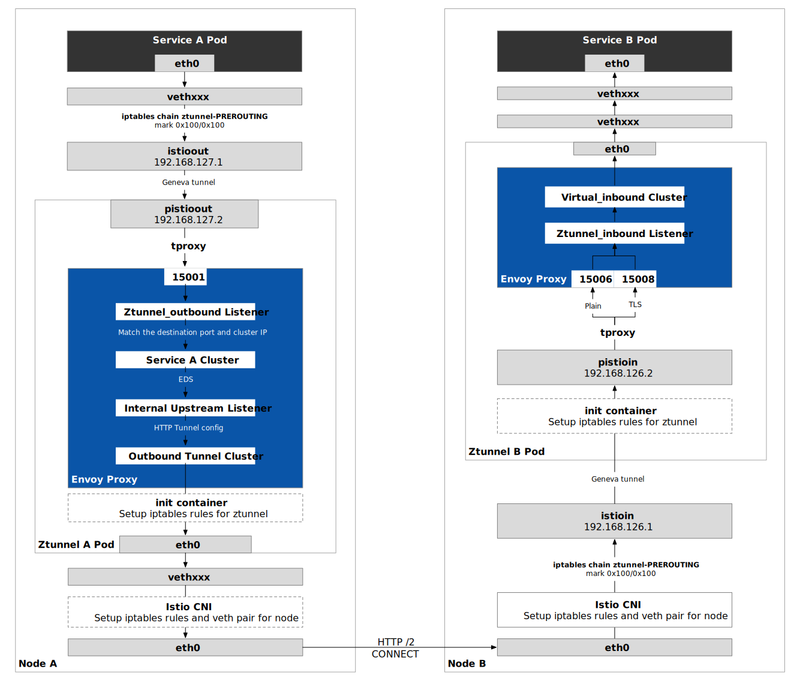
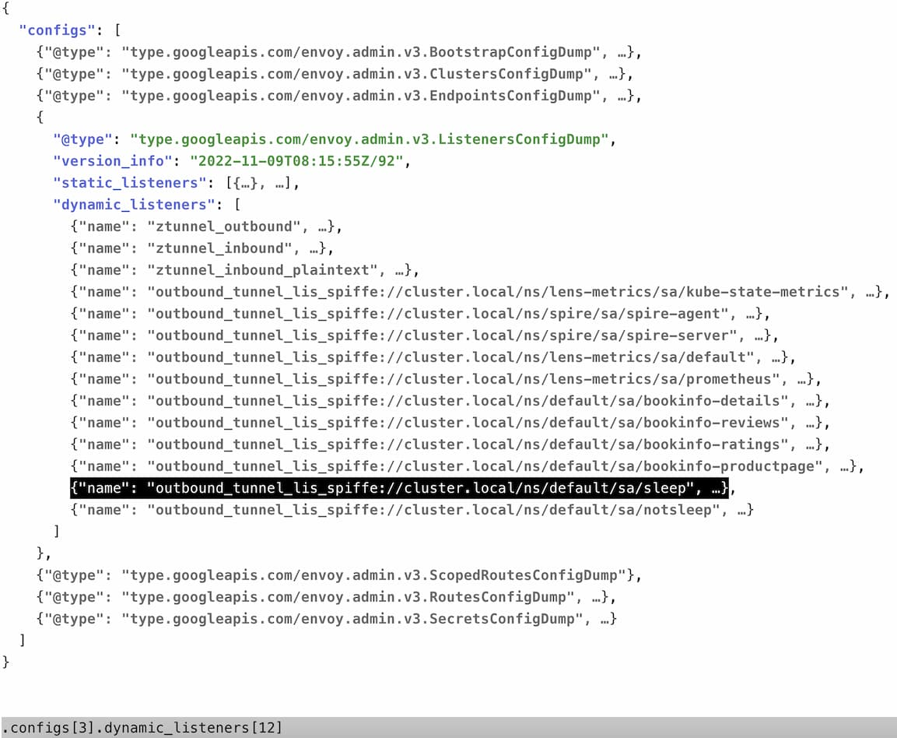

本文通过动手操作，带领读者一步步了解 Istio ambient 模式中的四层流量路径。如果你还不了解什么是 Ambient 模式，以下文章可以帮助你了解：

- [关于 Istio 推出 Ambient 数据平面模式的看法](/blog/istio-ambient-mode/)
- [Istio 无 sidecar 代理数据平面 ambient 模式简介](https://lib.jimmysong.io/blog/introducing-ambient-mesh/)
- [Istio 服务网格 ambient 模式安全详解](https://lib.jimmysong.io/blog/ambient-security/)
- [什么是 Ambient Mesh，它与 sidecar 模式有什么区别？](https://lib.jimmysong.io/blog/what-is-ambient-mesh/)

如果你想略过实际动手步骤，只是想知道 Ambient 模式中的四层流量路径，请看下面服务 A 的一个 Pod 访问不同节点上服务 B 的 Pod 的四层流量路径图。



下面我们将动手实验，深入探究 `sleep` 服务的 Pod 访问不同节点上 `productpage` 服务的 Pod 的四层流量路径。

## 环境说明

在开始动手操作之前，需要先说明一下笔者的演示环境，本文中对应的对象名称：

- 服务 A Pod：`sleep-55697f8897-sht4n`
- 服务 B Pod：`productpage-v1-5586c4d4ff-qxz9f`
- Pod ztunnel A：`ztunnel-hptxk`
- 节点 A：`gke-jimmy-cluster-default-pool-d5041909-68vq`

因为这些名称将在后续的命令行中用到，文中将使用代称，以便你在自己的环境中实验，请读者对号入座。

## 动手操作 {#hands-on}

笔者在 GKE 中安装了 Ambient 模式的 Istio，请参考[该步骤](/blog/istio-ambient-mode/#setup)安装，注意不要安装 Gateway，以免启用 L7 功能，否则流量路径将于 L4 流量不同。

我们将分别检视 Pod 的 outbound 和 inbound 流量。

## Outbound 流量 {#outbound}

**注意：以下操作都在节点 A 上进行，路由规则发生在 Linux 内核空间。**

### 检查节点 A 上的路由规则 {#node-a-rules}

登录到服务 A 所在的节点 A，使用 `iptables-save` 查看规则：


$ iptables-save
/* 省略 */
-A PREROUTING -j ztunnel-PREROUTING*
-A PREROUTING -m comment --comment "kubernetes service portals" -j KUBE-SERVICES
-A ztunnel-POSTROUTING -m mark --mark 0x100/0x100 -j ACCEPT
-A ztunnel-PREROUTING -m mark --mark 0x100/0x100 -j ACCEPT
/* 省略 */
*mangle
/* 省略 */
-A PREROUTING -j ztunnel-PREROUTING
-A INPUT -j ztunnel-INPUT
-A FORWARD -j ztunnel-FORWARD
-A OUTPUT -j ztunnel-OUTPUT
-A OUTPUT -s 169.254.169.254/32 -j DROP
-A POSTROUTING -j ztunnel-POSTROUTING
-A ztunnel-FORWARD -m mark --mark 0x220/0x220 -j CONNMARK --save-mark --nfmask 0x220 --ctmask 0x220
-A ztunnel-FORWARD -m mark --mark 0x210/0x210 -j CONNMARK --save-mark --nfmask 0x210 --ctmask 0x210
-A ztunnel-INPUT -m mark --mark 0x220/0x220 -j CONNMARK --save-mark --nfmask 0x220 --ctmask 0x220
-A ztunnel-INPUT -m mark --mark 0x210/0x210 -j CONNMARK --save-mark --nfmask 0x210 --ctmask 0x210
-A ztunnel-OUTPUT -s 10.4.4.1/32 -j MARK --set-xmark 0x220/0xffffffff
-A ztunnel-PREROUTING -i istioin -j MARK --set-xmark 0x200/0x200
-A ztunnel-PREROUTING -i istioin -j RETURN
-A ztunnel-PREROUTING -i istioout -j MARK --set-xmark 0x200/0x200
-A ztunnel-PREROUTING -i istioout -j RETURN
-A ztunnel-PREROUTING -p udp -m udp --dport 6081 -j RETURN
-A ztunnel-PREROUTING -m connmark --mark 0x220/0x220 -j MARK --set-xmark 0x200/0x200
-A ztunnel-PREROUTING -m mark --mark 0x200/0x200 -j RETURN
-A ztunnel-PREROUTING ! -i veth300a1d80 -m connmark --mark 0x210/0x210 -j MARK --set-xmark 0x40/0x40
-A ztunnel-PREROUTING -m mark --mark 0x40/0x40 -j RETURN
-A ztunnel-PREROUTING ! -s 10.4.4.18/32 -i veth300a1d80 -j MARK --set-xmark 0x210/0x210
-A ztunnel-PREROUTING -m mark --mark 0x200/0x200 -j RETURN
-A ztunnel-PREROUTING -i veth300a1d80 -j MARK --set-xmark 0x220/0x220
-A ztunnel-PREROUTING -p udp -j MARK --set-xmark 0x220/0x220
-A ztunnel-PREROUTING -m mark --mark 0x200/0x200 -j RETURN
-A ztunnel-PREROUTING -p tcp -m set --match-set ztunnel-pods-ips src -j MARK --set-xmark 0x100/0x100


你会看到 mangle 表中有以上规则，其中有一条是在 `ztunnel-PREROUTING` 链中增加了一条规则：

```
-A ztunnel-PREROUTING -p tcp -m set --match-set ztunnel-pods-ips src -j MARK --set-xmark 0x100/0x100
```

这条规则给 `ztunnel-pods-ips` 的 IP 集中的所有所有 TCP 数据包都会被打上 `0x100/0x100` 的标记。



`ztunnel-pods-ips` 是由 Istio CNI 创建的 [IP 集（IP Set）](https://ipset.netfilter.org/)，这里面保存着该节点上 Ambient Mesh 中的所有 Pod 的 IP 地址。IP 集是 Linux 内核中的一个框架，可由 [ipset](https://ipset.netfilter.org/ipset.man.html) 实用程序管理。IP 集可以存储不同类型的数据，例如 IP 地址、网络、（TCP/UDP）端口号、MAC 地址、接口名称或它们的组合，从而确保在条目与集合匹配时具有闪电般的速度。

通过设置 IP 集，可以确保 Ambient Mesh 仅拦截其所管理的 Pod 中的数据包，而不影响其他 Pod。



登录到服务 A 所在的节点 A，查看 iptables 规则。

```bash
$ iptables -t nat -L
Chain PREROUTING (policy ACCEPT)
target     prot opt source               destination
# 数据包首先进入 ztunnel-PREROUTING 链处理
ztunnel-PREROUTING  all  --  anywhere             anywhere
# 然后进入 KUBE-SERVICES 链处理
KUBE-SERVICES  all  --  anywhere             anywhere             /* kubernetes service portals */

Chain INPUT (policy ACCEPT)
target     prot opt source               destination         

Chain OUTPUT (policy ACCEPT)
target     prot opt source               destination         
KUBE-SERVICES  all  --  anywhere             anywhere             /* kubernetes service portals */

Chain POSTROUTING (policy ACCEPT)
target     prot opt source               destination         
ztunnel-POSTROUTING  all  --  anywhere             anywhere            
KUBE-POSTROUTING  all  --  anywhere             anywhere             /* kubernetes postrouting rules */
IP-MASQ    all  --  anywhere             anywhere             /* ip-masq: ensure nat POSTROUTING directs all non-LOCAL destination traffic to our custom IP-MASQ chain */ ADDRTYPE match dst-type !LOCAL

/* Omit KUBE-SVC chains */

Chain ztunnel-POSTROUTING (1 references)
target     prot opt source               destination         
ACCEPT     all  --  anywhere             anywhere             mark match 0x100/0x100

Chain ztunnel-PREROUTING (1 references)
target     prot opt source               destination   
# 通过所有被打上 0x100/0x100 标记的数据包
ACCEPT     all  --  anywhere             anywhere             mark match 0x100/0x100
```

注意最后一条链，所有该节点的外出流量都会被打上 `0x100/0x100` 的标记。

我们再查看一下该节点的路由规则：

```bash
$ ip rule
0:      from all lookup local
100:    from all fwmark 0x200/0x200 goto 32766
101:    from all fwmark 0x100/0x100 lookup 101
102:    from all fwmark 0x40/0x40 lookup 102
103:    from all lookup 100
32766:  from all lookup main
32767:  from all lookup default
```

你会看到所有带有 `0x100/0x100` 标记的数据包会经过 101 路由表。我们再查看一下该路由表：

```bash
$ ip route show table 101
default via 192.168.127.2 dev istioout 
10.4.2.19 dev veth52b75946 scope link 
```

你会看到 `101` 路由表中带有关键字 `via` ，这表示数据包将通过网关传输，查看 [ip route 命令的用法](http://linux-ip.net/html/tools-ip-route.html#tools-ip-route-show)。所有数据包被通过 `istioout` 网卡发送到网关（IP 是 `192.168.127.2`）。另一行表示是当前节点上 ztunnel pod 的路由链路。


所谓路由表（Routing Table），指的是路由器或者其他互联网网络设备上存储的表，该表中存有到达特定网络终端的路径。路由器的主要工作就是为经过路由器的每个数据包寻找一条最佳的传输路径，并将该数据有效地传送到目的站点。为了完成这项工作，在路由器中保存着各种传输路径的相关数据，供路由选择时使用，表中包含的信息决定了数据转发的策略。路由表根据其建立的方法，可以分为**动态路由表**和**静态路由表**。

101 路由表是由 Istio CNI 创建的，它的作用是将带有 `0x100/0x00` fwmark 的数据包转发到 ztunnel 中。

在 Linux 系统中，用户可以自定义编号 1 到 252 的路由表，Linux 系统维护了 4 个路由表：

- 0：系统保留表
- 253：defulte 表，没特别指定的默认路由都放在改表
- 254：main 表，没指明路由表的所有路由放在该表，默认表，我们使用 `ip route list` 或 `route -n` 或 `netstat -rn` 查看的路由记录即为 main 表中的记录
- 255：locale 表，保存本地接口地址，广播地址、NAT地址 由系统维护，用户不得更改



我们再查看一下 `istioout` 网卡：

```bash
$ ip addr show istioout
24: istioout: <BROADCAST,MULTICAST,UP,LOWER_UP> mtu 1410 qdisc noqueue state UNKNOWN group default 
    link/ether 62:59:1b:ad:79:01 brd ff:ff:ff:ff:ff:ff
    inet 192.168.127.1/30 brd 192.168.127.3 scope global istioout
       valid_lft forever preferred_lft forever
    inet6 fe80::6059:1bff:fead:7901/64 scope link 
       valid_lft forever preferred_lft forever
```

`istioout` 网卡的 IP 是 `192.168.127.1`，那么网关 `192.168.127.2` 在哪里呢？答案是在 ztunnel 中。

### 检查 Pod A 上的路由规则 {#pod-a-rules}

**注意：以下操作都在 Pod A 上进行。**

进入Pod ztunnel A，使用 `ip a` 命令检查它的网卡：

```
$ ip a
3: pistioin: <BROADCAST,MULTICAST,UP,LOWER_UP> mtu 1410 qdisc noqueue state UNKNOWN group default qlen 1000
    link/ether b6:11:a2:e0:b8:3c brd ff:ff:ff:ff:ff:ff
    inet 192.168.126.2/30 scope global pistioin
       valid_lft forever preferred_lft forever
4: pistioout: <BROADCAST,MULTICAST,UP,LOWER_UP> mtu 1410 qdisc noqueue state UNKNOWN group default qlen 1000
    link/ether a2:26:49:bf:89:ad brd ff:ff:ff:ff:ff:ff
    inet 192.168.127.2/30 scope global pistioout
       valid_lft forever preferred_lft forever
```

你将发现其中有两个网卡：

- `pistioin` ：IP 为 `192.168.126.2`
- `pistioout`：IP 为 `192.168.127.2`



这两个网卡都是由 ztunnel 中的 init 容器创建的，其 IP 地址也是固定的，如果你查看 ztunnel 的 YAML 配置将发现其中的网卡创建命令，在此我们按下不表，因为 Ambient 模式还在开发初期，这些启动命令未来可能有很大变化，感兴趣的读者可以自行查阅。



自 Pod A 的流量进入 ztunnel 之后，如何对流量进行处理呢？答案是 iptables，查看 ztunnel A 中的 iptables 规则：

```bash
$ iptables-save
/* omit */
*mangle
:PREROUTING ACCEPT [185880:96984381]
:INPUT ACCEPT [185886:96984813]
:FORWARD ACCEPT [0:0]
:OUTPUT ACCEPT [167491:24099839]
:POSTROUTING ACCEPT [167491:24099839]
-A PREROUTING -j LOG --log-prefix "mangle pre [ztunnel-hptxk] "
-A PREROUTING -i pistioin -p tcp -m tcp --dport 15008 -j TPROXY --on-port 15008 --on-ip 127.0.0.1 --tproxy-mark 0x400/0xfff
-A PREROUTING -i pistioout -p tcp -j TPROXY --on-port 15001 --on-ip 127.0.0.1 --tproxy-mark 0x400/0xfff
-A PREROUTING -i pistioin -p tcp -j TPROXY --on-port 15006 --on-ip 127.0.0.1 --tproxy-mark 0x400/0xfff
/* omit */
```

可以看到 ztunnel A 中的所有发往 `pistioin` 网卡的 TCP 流量被 tproxy 发送到了 `15001` 端口，这就是 Envoy 的 outbound 端口。



`tproxy` 是 Linux 内核在 2.2 版本以来支持的透明代理（Transparent proxy），其中的 t 代表 transparent，即透明。你需要在内核配置中启用 `NETFILTER_TPROXY` 和策略路由。详见 [tproxy 文档](http://lxr.linux.no/linux+v3.10/Documentation/networking/tproxy.txt)。



以上就是 Pod 中出口流量的透明劫持过程。

### 检查 ztunnel A 上的 Envoy 配置 {#ztunnel-a-envoy}

注意：Ztunnel 中的 Envoy 过滤器规则与 Sidecar 模式中的 Envoy 过滤器规则完全不同，我们不使用 `istioctl proxy-config` 命令来检视 Listener、Cluster、Endpoint 等配置，而是直接导出 ztunnel 中的 Envoy 完整配置。 

我们直接在自己的本地机器上远程获取 ztunnel A 中的 Envoy 配置：

```bash
kubectl exec -n istio-system ztunnel-hptxk -c istio-proxy -- curl "127.0.0.1:15000/config_dump?include_eds">all-include-eds.json
```

注意：不要使用 `istioctl proxy-config all ztunnel-hptxk -n istio-system` 命令来获取 Envoy 配置，因为这样获取的配置中不包含 EDS 部分。

建议使用 [fx](https://github.com/antonmedv/fx) 来解析 Json 文件，将更便于检视超大的 Json 数据：

```bash
cat all-include-eds.json|fx
```



在这个 Envoy 配置中包含了该节点上的所有 Pod 访问的流量规则配置，在 `ztunnel_outbound` Listener，根据目的地端口和 IP 的匹配可以查找到这样一个 matcher：

```json
"10.8.14.40": {
 "matcher": {
  "matcher_tree": {
   "input": {
    "name": "port",
    "typed_config": {
     "@type": "type.googleapis.com/envoy.extensions.matching.common_inputs.network.v3.DestinationPortInput"
    }
   },
   "exact_match_map": {
    "map": {
     "9080": {
      "action": {
       "name": "spiffe://cluster.local/ns/default/sa/notsleep_to_http_productpage.default.svc.cluster.local_outbound_internal",
       "typed_config": {
        "@type": "type.googleapis.com/google.protobuf.StringValue",
        "value": "spiffe://cluster.local/ns/default/sa/notsleep_to_http_productpage.default.svc.cluster.local_outbound_internal"
       }
      }
     }
    }
   }
  }
 }
}
```

注意：`10.8.14.40` 是服务 B 的 Cluster IP。

流量将被路由到 `spiffe://cluster.local/ns/default/sa/sleep_to_http_productpage.default.svc.cluster.local_outbound_internal` 集群。

我们再查看一下该集群的配置：

```json

 "version_info": "2022-11-08T06:40:06Z/63",
 "cluster": {
  "@type": "type.googleapis.com/envoy.config.cluster.v3.Cluster",
  "name": "spiffe://cluster.local/ns/default/sa/sleep_to_http_productpage.default.svc.cluster.local_outbound_internal",
  "type": "EDS",
  "eds_cluster_config": {
   "eds_config": {
    "ads": {},
    "initial_fetch_timeout": "0s",
    "resource_api_version": "V3"
   }
  },
  "transport_socket_matches": [
   {
    "name": "internal_upstream",
    "match": {
     "tunnel": "h2"
    },
    "transport_socket": {
     "name": "envoy.transport_sockets.internal_upstream",
     "typed_config": {
      "@type": "type.googleapis.com/envoy.extensions.transport_sockets.internal_upstream.v3.InternalUpstreamTransport",
      "passthrough_metadata": [
       {
        "kind": {
         "host": {}
        },
        "name": "tunnel"
       },
       {
        "kind": {
         "host": {}
        },
        "name": "istio"
       }
      ],
      "transport_socket": {
       "name": "envoy.transport_sockets.raw_buffer",
       "typed_config": {
        "@type": "type.googleapis.com/envoy.extensions.transport_sockets.raw_buffer.v3.RawBuffer"
       }
      }
     }
    }
   },
   {
    "name": "tlsMode-disabled",
    "match": {},
    "transport_socket": {
     "name": "envoy.transport_sockets.raw_buffer",
     "typed_config": {
      "@type": "type.googleapis.com/envoy.extensions.transport_sockets.raw_buffer.v3.RawBuffer"
     }
    }
   }
  ]
 },
 "last_updated": "2022-11-08T06:40:06.619Z"
}
```

该 Cluster 配置使用 EDS 获取端点，对所有具有 `tunnel: h2` 元数据的字节流应用 [`InternalUpstreamTransport`](https://www.envoyproxy.io/docs/envoy/latest/api-v3/extensions/transport_sockets/internal_upstream/v3/internal_upstream.proto#envoy-v3-api-msg-extensions-transport-sockets-internal-upstream-v3-internalupstreamtransport)：内部地址定义位于同一代理实例中的环回用户空间 socket。除了常规字节流之外，该扩展还允许跨用户空间 socket 传递额外的结构化状态（`passthrough_metadata`）。目的是促进下游过滤器和上游内部连接之间的通信。与上游连接共享的所有过滤器状态对象也通过此传输 socket 与下游内部连接共享。

对于，我们再检查下 EDS，我们会发现有很多类似这样的 `endpoint_config`：

```json
{
 "endpoint_config": {
  "@type": "type.googleapis.com/envoy.config.endpoint.v3.ClusterLoadAssignment",
  "endpoints": [
   {
    "locality": {},
    "lb_endpoints": [
     {
      "endpoint": {
       "address": {
        "envoy_internal_address": {
         "server_listener_name": "outbound_tunnel_lis_spiffe://cluster.local/ns/default/sa/sleep",
         "endpoint_id": "10.4.1.39:9080"
        }
       },
       "health_check_config": {}
      },
      "health_status": "HEALTHY",
      "metadata": {
       "filter_metadata": {
        "envoy.transport_socket_match": {
         "tunnel": "h2"
        },
        "tunnel": {
         "address": "10.4.1.39:15008",
         "destination": "10.4.1.39:9080"
        }
       }
      },
      "load_balancing_weight": 1
     }
    ]
   }
  ],
  "policy": {
   "overprovisioning_factor": 140
  }
 }
}
```

**问题**： `server_listener_name` 的值为 `outbound_tunnel_lis_spiffe://cluster.local/ns/default/sa/sleep` 的 `endpoint_config` 出现了很多次，而全部的 `endpoint_config` 值共有几百个，`spiffe://cluster.local/ns/default/sa/sleep_to_http_productpage.default.svc.cluster.local_outbound_internal` 究竟如何获取到它的上游端点呢？

我们再看下这个监听器 `outbound_tunnel_lis_spiffe://cluster.local/ns/default/sa/sleep`：

```json
{
 "name": "outbound_tunnel_lis_spiffe://cluster.local/ns/default/sa/sleep",
 "active_state": {
  "version_info": "2022-11-08T06:40:06Z/63",
  "listener": {
   "@type": "type.googleapis.com/envoy.config.listener.v3.Listener",
   "name": "outbound_tunnel_lis_spiffe://cluster.local/ns/default/sa/sleep",
   "filter_chains": [
    {
     "filters": [
      {
       "name": "envoy.filters.network.tcp_proxy",
       "typed_config": {
        "@type": "type.googleapis.com/envoy.extensions.filters.network.tcp_proxy.v3.TcpProxy",
        "stat_prefix": "outbound_tunnel_lis_spiffe://cluster.local/ns/default/sa/sleep",
        "cluster": "outbound_tunnel_clus_spiffe://cluster.local/ns/default/sa/sleep",
        "access_log": [
         {
          "name": "envoy.access_loggers.file",
          "typed_config": {
           "@type": "type.googleapis.com/envoy.extensions.access_loggers.file.v3.FileAccessLog",
           "path": "/dev/stdout",
           "log_format": {
            "text_format_source": {
             "inline_string": "[%START_TIME%] \"%REQ(:METHOD)% %REQ(X-ENVOY-ORIGINAL-PATH?:PATH)% %PROTOCOL%\" %RESPONSE_CODE% %RESPONSE_FLAGS% %RESPONSE_CODE_DETAILS% %CONNECTION_TERMINATION_DETAILS% \"%UPSTREAM_TRANSPORT_FAILURE_REASON%\" %BYTES_RECEIVED% %BYTES_SENT% %DURATION% %RESP(X-ENVOY-UPSTREAM-SERVICE-TIME)% \"%REQ(X-FORWARDED-FOR)%\" \"%REQ(USER-AGENT)%\" \"%REQ(X-REQUEST-ID)%\" \"%REQ(:AUTHORITY)%\" \"%UPSTREAM_HOST%\" %UPSTREAM_CLUSTER% %UPSTREAM_LOCAL_ADDRESS% %DOWNSTREAM_LOCAL_ADDRESS% %DOWNSTREAM_REMOTE_ADDRESS% %REQUESTED_SERVER_NAME% %ROUTE_NAME% outbound tunnel\n"
            }
           }
          }
         }
        ],
        "tunneling_config": {
         "hostname": "%DYNAMIC_METADATA(tunnel:destination)%",
         "headers_to_add": [
          {
           "header": {
            "key": "x-envoy-original-dst-host",
            "value": "%DYNAMIC_METADATA([\"tunnel\", \"destination\"])%"
           }
          }
         ]
        }
       }
      }
     ]
    }
   ],
   "use_original_dst": false,
   "listener_filters": [
    {
     "name": "set_dst_address",
     "typed_config": {
      "@type": "type.googleapis.com/xds.type.v3.TypedStruct",
      "type_url": "type.googleapis.com/istio.set_internal_dst_address.v1.Config",
      "value": {}
     }
    }
   ],
   "internal_listener": {}
  },
  "last_updated": "2022-11-08T06:40:06.750Z"
 }
}
```

注意：其中的 [`tunneling_config`](https://www.envoyproxy.io/docs/envoy/latest/api-v3/extensions/filters/network/tcp_proxy/v3/tcp_proxy.proto#envoy-v3-api-msg-extensions-filters-network-tcp-proxy-v3-tcpproxy-tunnelingconfig) 部分，该部分用来配置上游 HTTP CONNECT 隧道。

监听器中首先执行监听器过滤器，`set_dst_address` 过滤器将上游地址设置为下游的目的地址。根据上一步 EDS 中选择的端点的 `metadata` 里的参数设置目的地址。假如前面集群选择的端点是 `10.4.1.39:9080` ，那么这里的 tunnel 监听器就会把 `10.4.1.39:9080` 设置为目的地址。另外该监听器中的 `TcpProxy` 过滤器将流量传给上游 `outbound_tunnel_clus_spiffe://cluster.local/ns/default/sa/sleep` 集群。TCP 过滤器上设置了 HTTP CONNECT 隧道（承载发送到 `10.4.1.39:9080` 的流量），供 `productpage` 所在节点的 ztunnel 使用。有多少个端点，就会创建多少条隧道。HTTP 隧道是 Ambient 组件之间安全通信的承载协议。

`outbound_tunnel_clus_spiffe://cluster.local/ns/default/sa/sleep` 集群的配置：

```json
{
 "version_info": "2022-11-08T06:40:06Z/63",
 "cluster": {
  "@type": "type.googleapis.com/envoy.config.cluster.v3.Cluster",
  "name": "outbound_tunnel_clus_spiffe://cluster.local/ns/default/sa/sleep",
  "type": "ORIGINAL_DST",
  "connect_timeout": "2s",
  "lb_policy": "CLUSTER_PROVIDED",
  "cleanup_interval": "60s",
  "transport_socket": {
   "name": "envoy.transport_sockets.tls",
   "typed_config": {
    "@type": "type.googleapis.com/envoy.extensions.transport_sockets.tls.v3.UpstreamTlsContext",
    "common_tls_context": {
     "tls_params": {
      "tls_minimum_protocol_version": "TLSv1_3",
      "tls_maximum_protocol_version": "TLSv1_3"
     },
     "alpn_protocols": [
      "h2"
     ],
     "tls_certificate_sds_secret_configs": [
      {
       "name": "spiffe://cluster.local/ns/default/sa/sleep~sleep-55697f8897-sht4n~b6bd46f1-4c5e-41e6-9e87-5fece677b20d",
       "sds_config": {
        "api_config_source": {
         "api_type": "GRPC",
         "grpc_services": [
          {
           "envoy_grpc": {
            "cluster_name": "sds-grpc"
           }
          }
         ],
         "set_node_on_first_message_only": true,
         "transport_api_version": "V3"
        },
        "resource_api_version": "V3"
       }
      }
     ]
    }
   }
  },
  "original_dst_lb_config": {},
  "typed_extension_protocol_options": {
   "envoy.extensions.upstreams.http.v3.HttpProtocolOptions": {
    "@type": "type.googleapis.com/envoy.extensions.upstreams.http.v3.HttpProtocolOptions",
    "explicit_http_config": {
     "http2_protocol_options": {
      "allow_connect": true
     }
    }
   }
  }
 },
 "last_updated": "2022-11-08T06:40:06.623Z"
}
```

我们看到它额类型是 `ORIGINAL_DST`，并且配置了 `UpstreamTlsContext` 将流量进行 TLS 加密后直接发送到目的地址，即上文中选择的端点。

## Inbound 流量 {#inbound}

入口流量

## 参考{#reference}

- [安装 Ambient Mesh - istio.io](https://istio.io/latest/blog/2022/get-started-ambient/)
- [深入 Ambient Mesh - 流量路径 - mp.weixin.qq.com](https://mp.weixin.qq.com/s/PpP0pmxdJR8PknHeR-pVHQ)
- [一文读懂 Ambient Mesh 七层服务治理 - mp.weixin.qq.com](https://mp.weixin.qq.com/s/TXMyxbzBSfuYNquOZJmZTg)
- [深度剖析！Istio共享代理新模式Ambient Mesh - mp.weixin.qq.com](https://mp.weixin.qq.com/s/B0q73ACAvmY4SjW42A2GVw)
