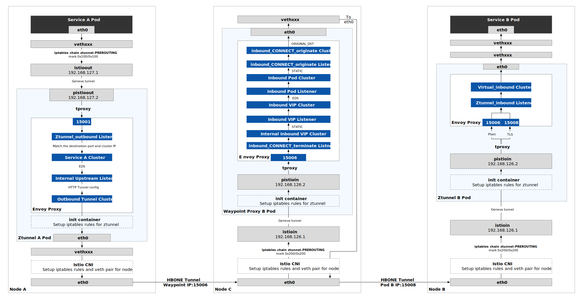

在[上一篇博客中](/blog/ambient-mesh-l4-traffic-path/)我介绍了 Ambient 模式中的透明流量劫持和四层流量路由，在这一篇博客中，我将向你介绍在 Istio 的 Ambient 模式中，七层流量是如何路由的。

下图展示了 Ambient 模式中七层网络流量路径。



注意：Waypoint Proxy 可以位于应用程序所在节点，甚至图中的服务 A、服务 B 和 Waypoint Proxy 都可以位于同一个节点，之所以将它们画在三个节点上是为了方便展示，但是对于实际的流量路径没有大的影响，只不过是不再通过 eth0 发送到另外一个节点。

下文我们将从手操作探究图中过程。

## 环境说明 {#environment}

我们继续使用上一篇博客中部署的 Ambient 模式的 Istio，[查看环境说明](/blog/ambient-mesh-l4-traffic-path/#environment)。为了说明七层网路路由，我们需要在此基础上再创建一个 Gateway：

```bash
kubectl apply -f - <<EOF
apiVersion: gateway.networking.k8s.io/v1alpha2
kind: Gateway
metadata:
 name: productpage
 annotations:
   istio.io/service-account: bookinfo-productpage
spec:
 gatewayClassName: istio-mesh
EOF
```

执行完该命令后，`default` 命名空间下会创建了一个 Waypoint proxy，在我的环境中这个 pod 的名字是 `bookinfo-productpage-waypoint-proxy-6f88c55d59-4dzdx`，专门用于处理发往 productpage 服务（服务 B）的 L7 流量，我将它称之为 Waypoint Proxy B。

Waypoint 代理可以位于与工作负载相同或者不同的节点上，它也可以部署在独立的命名空间中，不论它位于哪个节点，对于 L7 流量路径没有影响。

Ambient mesh 中透明流量的方式在 L4 和 L7 网络中没有什么不同，因此在这篇博客中我们将略过 Inbound 和 Outbound 流量劫持部分，你可以查看[上一篇博客](/blog/ambient-mesh-l4-traffic-path/)了解详情。

下面我们将直接从流量被劫持到 Ztunnel A 后，被转发到 Envoy 的 15006 端口开始。

## Ztunnel A 上的出站流量路由 {#ztunel-a-outbound}

使用下面的命令导出 Ztunnel A 上的 Envoy 代理配置：

```bash
kubectl exec -n istio-system ztunnel-hptxk -c istio-proxy -- curl "127.0.0.1:15000/config_dump?include_eds">ztunnel-a-all-include-eds.json
```

查看 `ztunnel-a-all-include-eds.json` 文件中的 Listener 配置部分，根据目的端口和来源 IP 的匹配关系，你将看到 `ztunnel_outbound` 监听器中有如下配置：


{
  "10.8.4.226": {
    "matcher": {
    "matcher_tree": {
      "input": {
      "name": "port",
      "typed_config": {
        "@type": "type.googleapis.com/envoy.extensions.matching.common_inputs.network.v3.DestinationPortInput"
      }
      },
      "exact_match_map": {
      "map": {
        "9080": {
        "action": {
          "name": "spiffe://cluster.local/ns/default/sa/sleep_to_server_waypoint_proxy_spiffe://cluster.local/ns/default/sa/bookinfo-productpage",
          "typed_config": {
          "@type": "type.googleapis.com/google.protobuf.StringValue",
          "value": "spiffe://cluster.local/ns/default/sa/sleep_to_server_waypoint_proxy_spiffe://cluster.local/ns/default/sa/bookinfo-productpage"
          }
        }
        }
      }
      }
    }
    }
  }
}


`10.8.4.226` 是目标服务的 Cluster  IP，服务端口是 9080。流量将被路由到 `spiffe://cluster.local/ns/default/sa/sleep_to_server_waypoint_proxy_spiffe://cluster.local/ns/default/sa/bookinfo-productpage` 集群，查看该集群的配置：


{
 "version_info": "2022-11-17T03:27:45Z/82",
 "cluster": {
  "@type": "type.googleapis.com/envoy.config.cluster.v3.Cluster",
  "name": "spiffe://cluster.local/ns/default/sa/sleep_to_server_waypoint_proxy_spiffe://cluster.local/ns/default/sa/bookinfo-productpage",
  "type": "EDS",
  "eds_cluster_config": {
   "eds_config": {
    "ads": {},
    "initial_fetch_timeout": "0s",
    "resource_api_version": "V3"
   }
  },
  /* 省略 */
}


该集群使用 EDS 服务发现。查看该集群的 EDS 信息：


{ 
 "@type": "type.googleapis.com/envoy.config.endpoint.v3.ClusterLoadAssignment",
 "endpoints": [
  {
   "locality": {},
   "lb_endpoints": [
    {
     "endpoint": {
      "address": {
       "socket_address": {
        "address": "10.4.3.10",
        "port_value": 15006
       }
      },
      "health_check_config": {}
     },
     "health_status": "HEALTHY",
     "load_balancing_weight": 1
    }
   ]
  }
 ],
 "policy": {
  "overprovisioning_factor": 140
 }
}


注意：这里还是缺少输出 `cluster_name` 字段。

在这里直接将流量转发给 Waypoint Proxy 的端点 `10.4.3.10:15006`。

## Waypoint Proxy B 上的流量转发 {#waypoint-proxy-b}

我们再导出 Waypoint Proxy B 中的 Envoy 配置：

```bash
kubectl exec -n default bookinfo-productpage-waypoint-proxy-6f88c55d59-4dzdx -c istio-proxy -- curl "127.0.0.1:15000/config_dump?include_eds">waypoint-a-all-include-eds.json
```

查看 `inbound_CONNECT_terminate` 监听器的配置：


{
  "name": "inbound_CONNECT_terminate",
  "active_state": {
    "version_info": "2022-11-17T03:27:45Z/82",
    "listener": {
    "@type": "type.googleapis.com/envoy.config.listener.v3.Listener",
    "name": "inbound_CONNECT_terminate",
    "address": {
      "socket_address": {
      "address": "0.0.0.0",
      "port_value": 15006
      }
    },
    "filter_chains": [{
      "filters": [{
        "name": "capture_tls",
        "typed_config": {
        "@type": "type.googleapis.com/udpa.type.v1.TypedStruct",
        "type_url": "type.googleapis.com/istio.tls_passthrough.v1.CaptureTLS"
        }
      },
      {
        "name": "envoy.filters.network.http_connection_manager",
        "typed_config": {
        "@type": "type.googleapis.com/envoy.extensions.filters.network.http_connection_manager.v3.HttpConnectionManager",
        "stat_prefix": "inbound_hcm",
        "route_config": {
          "name": "local_route",
          "virtual_hosts": [{
          "name": "connect",
          "domains": [
            "*"
          ],
          "routes": [{...},
            {
            "match": {
              "headers": [{
              "name": ":authority",
              "exact_match": "10.8.4.226:9080"
              }],
              "connect_matcher": {}
            },
            "route": {
              "cluster": "inbound-vip|9080|internal|productpage.default.svc.cluster.local",
              "upgrade_configs": [{
              "upgrade_type": "CONNECT",
              "connect_config": {}
              }]
            }
            }
          ]
          }],
          "validate_clusters": false
        },
        "http_filters": [...],
        "tracing": {...},
        "http2_protocol_options": {
          "allow_connect": true
        },
        "use_remote_address": false,
        "upgrade_configs": [{
          "upgrade_type": "CONNECT"
        }],
        "stream_idle_timeout": "0s",
        "normalize_path": true,
        "request_id_extension": {...},
        "path_with_escaped_slashes_action": "KEEP_UNCHANGED"
        }
      }
      ],
      "transport_socket": {...},
      "name": "inbound_CONNECT_terminate"
    }]
    },
    "last_updated": "2022-11-17T06:24:51.467Z"
  }
}


目的地为 `10.8.4.226:9080` 的 TCP 流量将被转发到 `inbound-vip|9080|internal|productpage.default.svc.cluster.local`，并将 HTTP 类型修改为 `CONNECT`，查看该集群的配置：


{
 "version_info": "2022-11-17T03:27:45Z/82",
 "cluster": {
  "@type": "type.googleapis.com/envoy.config.cluster.v3.Cluster",
  "name": "inbound-vip|9080|internal|productpage.default.svc.cluster.local",
  "type": "STATIC",
  "transport_socket": {
   "name": "envoy.transport_sockets.internal_upstream",
   "typed_config": {
    "@type": "type.googleapis.com/envoy.extensions.transport_sockets.internal_upstream.v3.InternalUpstreamTransport",
    "passthrough_metadata": [
     {
      "kind": {
       "cluster": {}
      },
      "name": "istio"
     }
    ],
    "transport_socket": {
     "name": "envoy.transport_sockets.raw_buffer",
     "typed_config": {
      "@type": "type.googleapis.com/envoy.extensions.transport_sockets.raw_buffer.v3.RawBuffer"
     }
    }
   }
  },
  "common_lb_config": {},
  "load_assignment": {
   "cluster_name": "inbound-vip|9080|internal|productpage.default.svc.cluster.local",
   "endpoints": [
    {
     "lb_endpoints": [
      {
       "endpoint": {
        "address": {
         "envoy_internal_address": {
          "server_listener_name": "inbound-vip|9080||productpage.default.svc.cluster.local"
         }
        }
       }
      }
     ]
    }
   ]
  }
 },
 "last_updated": "2022-11-17T03:27:46.137Z"
}


该集群的端点是一个内部监听器 `inbound-vip|9080||productpage.default.svc.cluster.local`：


{
 "name": "inbound-vip|9080||productpage.default.svc.cluster.local",
 "active_state": {
  "version_info": "2022-11-17T03:27:45Z/82",
  "listener": {
   "@type": "type.googleapis.com/envoy.config.listener.v3.Listener",
   "name": "inbound-vip|9080||productpage.default.svc.cluster.local",
   "filter_chains": [{
    "filters": [{
      "name": "restore_tls",
      "typed_config": {
       "@type": "type.googleapis.com/udpa.type.v1.TypedStruct",
       "type_url": "type.googleapis.com/istio.tls_passthrough.v1.RestoreTLS"
      }
     },
     {
      "name": "envoy.filters.network.http_connection_manager",
      "typed_config": {
       "@type": "type.googleapis.com/envoy.extensions.filters.network.http_connection_manager.v3.HttpConnectionManager",
       "stat_prefix": "inbound_0.0.0.0_9080",
       "route_config": {
        "name": "inbound-vip|9080|http|productpage.default.svc.cluster.local",
        "virtual_hosts": [{
         "name": "inbound|http|9080",
         "domains": [
          "*"
         ],
         "routes": [{
          "match": {
           "prefix": "/"
          },
          "route": {
           "cluster": "inbound-vip|9080|http|productpage.default.svc.cluster.local",
           "timeout": "0s",
           "max_stream_duration": {
            "max_stream_duration": "0s",
            "grpc_timeout_header_max": "0s"
           }
          },
          "decorator": {
           "operation": ":9080/*"
          },
          "name": "default"
         }]
        }],
        "validate_clusters": false
       }
      },
      "server_name": "istio-envoy",
      "use_remote_address": false,
      "forward_client_cert_details": "APPEND_FORWARD",
      "set_current_client_cert_details": {
       "subject": true,
       "dns": true,
       "uri": true
      },
      "upgrade_configs": [{
       "upgrade_type": "websocket"
      }],
      "stream_idle_timeout": "0s",
      "normalize_path": true,
      "request_id_extension": {
       "typed_config": {
        "@type": "type.googleapis.com/envoy.extensions.request_id.uuid.v3.UuidRequestIdConfig",
        "use_request_id_for_trace_sampling": true
       }
      },
      "path_with_escaped_slashes_action": "KEEP_UNCHANGED"
     }
    ],
    "name": "inbound-vip|9080||productpage.default.svc.cluster.local-http"
   }],
   "listener_filters": [{
     "name": "set_dst_address",
     "typed_config": {
      "@type": "type.googleapis.com/xds.type.v3.TypedStruct",
      "type_url": "type.googleapis.com/istio.set_internal_dst_address.v1.Config",
      "value": {}
     }
    },
    {
     "name": "envoy.filters.listener.metadata_to_peer_node",
     "typed_config": {
      "@type": "type.googleapis.com/udpa.type.v1.TypedStruct",
      "type_url": "type.googleapis.com/istio.telemetry.metadatatopeernode.v1.Config"
     }
    }
   ],
   "traffic_direction": "INBOUND",
   "internal_listener": {}
  },
  "last_updated": "2022-11-17T03:27:46.300Z"
 }
}


数据包被转发到 `inbound-vip|9080|http|productpage.default.svc.cluster.local` 集群：


{
 "version_info": "2022-11-17T03:27:45Z/82",
 "cluster": {
  "@type": "type.googleapis.com/envoy.config.cluster.v3.Cluster",
  "name": "inbound-vip|9080|http|productpage.default.svc.cluster.local",
  "type": "EDS",
  "eds_cluster_config": {
   "eds_config": {
    "ads": {},
    "initial_fetch_timeout": "0s",
    "resource_api_version": "V3"
   },
   "service_name": "inbound-vip|9080|http|productpage.default.svc.cluster.local"
  },
  "transport_socket": {
   "name": "envoy.transport_sockets.internal_upstream",
   "typed_config": {
    "@type": "type.googleapis.com/envoy.extensions.transport_sockets.internal_upstream.v3.InternalUpstreamTransport",
    "transport_socket": {
     "name": "envoy.transport_sockets.raw_buffer",
     "typed_config": {
      "@type": "type.googleapis.com/envoy.extensions.transport_sockets.raw_buffer.v3.RawBuffer"
     }
    }
   }
  },
  "metadata": {
   "filter_metadata": {
    "istio": {
     "services": [{
      "namespace": "default",
      "name": "productpage",
      "host": "productpage.default.svc.cluster.local"
     }]
    }
   }
  },
  "common_lb_config": {}
 },
 "last_updated": "2022-11-17T03:27:46.138Z"
}


该集群是 EDS 类型，查看 Endpoint 配置：


{
 "endpoint_config": {
  "@type": "type.googleapis.com/envoy.config.endpoint.v3.ClusterLoadAssignment",
  "cluster_name": "inbound-vip|9080|http|productpage.default.svc.cluster.local",
  "endpoints": [{
   "locality": {
    "region": "us-west2",
    "zone": "us-west2-a"
   },
   "lb_endpoints": [{
    "endpoint": {
     "address": {
      "envoy_internal_address": {
       "server_listener_name": "inbound-pod|9080||10.4.0.5"
      }
     },
     "health_check_config": {}
    },
    "health_status": "HEALTHY",
    "metadata": {
     "filter_metadata": {
      "istio": {
       "workload": "productpage-v1;default;productpage;v1;Kubernetes"
      }
     }
    },
    "load_balancing_weight": 1
   }]
  }],
  "policy": {
   "overprovisioning_factor": 140
  }
 }
}


数据包被转发到 `inbound-pod|9080||10.4.0.5` 监听器：



{
 "name": "inbound-pod|9080||10.4.0.5",
 "active_state": {
  "version_info": "2022-11-17T03:27:45Z/82",
  "listener": {
   "@type": "type.googleapis.com/envoy.config.listener.v3.Listener",
   "name": "inbound-pod|9080||10.4.0.5",
   "filter_chains": [{
    "filters": [{
      "name": "restore_tls",
      "typed_config": {
       "@type": "type.googleapis.com/udpa.type.v1.TypedStruct",
       "type_url": "type.googleapis.com/istio.tls_passthrough.v1.RestoreTLS"
      }
     },
     {
      "name": "envoy.filters.network.http_connection_manager",
      "typed_config": {
       "@type": "type.googleapis.com/envoy.extensions.filters.network.http_connection_manager.v3.HttpConnectionManager",
       "stat_prefix": "inbound_0.0.0.0_9080",
       "route_config": {
        "name": "inbound-pod|9080||10.4.0.5",
        "virtual_hosts": [{
         "name": "inbound|http|9080",
         "domains": [
          "*"
         ],
         "routes": [{
          "match": {
           "prefix": "/"
          },
          "route": {
           "cluster": "inbound-pod|9080||10.4.0.5",
           "timeout": "0s",
           "max_stream_duration": {
            "max_stream_duration": "0s",
            "grpc_timeout_header_max": "0s"
           }
          },
          "decorator": {
           "operation": ":9080/*"
          },
          "name": "default"
         }]
        }],
        "validate_clusters": false
       },
       "http_filters": [{
        "name": "envoy.filters.http.rbac",
        "typed_config": {
         "@type": "type.googleapis.com/envoy.extensions.filters.http.rbac.v3.RBAC",
         "rules": {
          "policies": {
           "ns[default]-policy[productpage-viewer]-rule[0]": {
            "permissions": [{
             "and_rules": {
              "rules": [{
               "any": true
              }]
             }
            }],
            "principals": [{
             "and_ids": {
              "ids": [{
               "or_ids": {
                "ids": [{
                  "authenticated": {
                   "principal_name": {
                    "exact": "spiffe://cluster.local/ns/default/sa/sleep"
                   }
                  }
                 },
                 {
                  "authenticated": {
                   "principal_name": {
                    "exact": "spiffe://cluster.local/ns/istio-system/sa/istio-ingressgateway-service-account"
                   }
                  }
                 }
                ]
               }
              }]
             }
            }]
           }
          }
         },
         "shadow_rules_stat_prefix": "istio_dry_run_allow_"
        }
       }],
       "server_name": "istio-envoy",
       "use_remote_address": false,
       "forward_client_cert_details": "APPEND_FORWARD",
       "set_current_client_cert_details": {
        "subject": true,
        "dns": true,
        "uri": true
       },
       "upgrade_configs": [{
        "upgrade_type": "websocket"
       }],
       "stream_idle_timeout": "0s",
       "normalize_path": true,
       "request_id_extension": {
        "typed_config": {
         "@type": "type.googleapis.com/envoy.extensions.request_id.uuid.v3.UuidRequestIdConfig",
         "use_request_id_for_trace_sampling": true
        }
       },
       "path_with_escaped_slashes_action": "KEEP_UNCHANGED"
      }
     }
    ],
    "name": "inbound-pod|9080||10.4.0.5-http"
   }],
   "listener_filters": [{
    "name": "set_dst_address",
    "typed_config": {
     "@type": "type.googleapis.com/xds.type.v3.TypedStruct",
     "type_url": "type.googleapis.com/istio.set_internal_dst_address.v1.Config",
     "value": {}
    }
   }],
   "traffic_direction": "INBOUND",
   "internal_listener": {}
  },
  "last_updated": "2022-11-17T03:27:46.339Z"
 }
}



数据包被转发到 `inbound-pod|9080||10.4.0.5` 集群：


{
 "version_info": "2022-11-17T03:27:45Z/82",
 "cluster": {
  "@type": "type.googleapis.com/envoy.config.cluster.v3.Cluster",
  "name": "inbound-pod|9080||10.4.0.5",
  "type": "STATIC",
  "transport_socket": {
   "name": "envoy.transport_sockets.internal_upstream",
   "typed_config": {
    "@type": "type.googleapis.com/envoy.extensions.transport_sockets.internal_upstream.v3.InternalUpstreamTransport",
    "passthrough_metadata": [
     {
      "kind": {
       "host": {}
      },
      "name": "tunnel"
     },
     {
      "kind": {
       "host": {}
      },
      "name": "istio"
     }
    ],
    "transport_socket": {
     "name": "envoy.transport_sockets.raw_buffer",
     "typed_config": {
      "@type": "type.googleapis.com/envoy.extensions.transport_sockets.raw_buffer.v3.RawBuffer"
     }
    }
   }
  },
  "common_lb_config": {},
  "load_assignment": {
   "cluster_name": "inbound-pod|9080||10.4.0.5",
   "endpoints": [
    {
     "lb_endpoints": [
      {
       "endpoint": {
        "address": {
         "envoy_internal_address": {
          "server_listener_name": "inbound_CONNECT_originate",
          "endpoint_id": "10.4.0.5:9080"
         }
        }
       },
       "metadata": {
        "filter_metadata": {
         "tunnel": {
          "destination": "10.4.0.5:9080",
          "address": "10.4.0.5:15008"
         }
        }
       }
      }
     ]
    }
   ]
  }
 },
 "last_updated": "2022-11-17T03:27:46.139Z"
}


该集群是 `STATIC` 类型，其中包含了 HBONE 隧道配置（HTTP/2 CONNECT 地址是 `10.4.0.15008`），端点是 Envoy 内部监听器 `inbound_CONNECT_originate`：


{
 "name": "inbound_CONNECT_originate",
 "active_state": {
  "version_info": "2022-11-17T03:27:45Z/82",
  "listener": {
   "@type": "type.googleapis.com/envoy.config.listener.v3.Listener",
   "name": "inbound_CONNECT_originate",
   "filter_chains": [
    {
     "filters": [
      {
       "name": "envoy.filters.network.tcp_proxy",
       "typed_config": {
        "@type": "type.googleapis.com/envoy.extensions.filters.network.tcp_proxy.v3.TcpProxy",
        "stat_prefix": "inbound_CONNECT_originate",
        "cluster": "inbound_CONNECT_originate",
        "tunneling_config": {
         "hostname": "%DYNAMIC_METADATA(tunnel:destination)%",
         "headers_to_add": [
          {
           "header": {
            "key": "x-envoy-original-dst-host",
            "value": "%DYNAMIC_METADATA([\"tunnel\", \"destination\"])%"
           }
          }
         ]
        }
       }
      }
     ]
    }
   ],
   "use_original_dst": false,
   "listener_filters": [
    {
     "name": "set_dst_address",
     "typed_config": {
      "@type": "type.googleapis.com/xds.type.v3.TypedStruct",
      "type_url": "type.googleapis.com/istio.set_internal_dst_address.v1.Config",
      "value": {}
     }
    }
   ],
   "internal_listener": {}
  },
  "last_updated": "2022-11-17T03:27:46.339Z"
 }
}


说明：

- `listener_filters` 中的 `set_dst_address` 将目的地地址设置为 `10.4.0.5.15008`；
- 在隧道中新增了一个 Header：`x-envoy-original-dst-host`，它的值是 `10.4.0.5:9080`；
- 该集群的端点是 `inbound_CONNECT_originate` 集群；

查看 `inbound_CONNECT_originate` 集群：


{
 "version_info": "2022-11-17T03:27:45Z/82",
 "cluster": {
  "@type": "type.googleapis.com/envoy.config.cluster.v3.Cluster",
  "name": "inbound_CONNECT_originate",
  "type": "ORIGINAL_DST",
  "connect_timeout": "2s",
  "lb_policy": "CLUSTER_PROVIDED",
  "cleanup_interval": "60s",
  "transport_socket": {
   "name": "envoy.transport_sockets.tls",
   "typed_config": {
    "@type": "type.googleapis.com/envoy.extensions.transport_sockets.tls.v3.UpstreamTlsContext",
    "common_tls_context": {
     "tls_params": {
      "tls_minimum_protocol_version": "TLSv1_3",
      "tls_maximum_protocol_version": "TLSv1_3"
     },
     "alpn_protocols": [
      "h2"
     ],
     "tls_certificate_sds_secret_configs": [
      {
       "name": "default",
       "sds_config": {
        "api_config_source": {
         "api_type": "GRPC",
         "grpc_services": [
          {
           "envoy_grpc": {
            "cluster_name": "sds-grpc"
           }
          }
         ],
         "set_node_on_first_message_only": true,
         "transport_api_version": "V3"
        },
        "initial_fetch_timeout": "0s",
        "resource_api_version": "V3"
       }
      }
     ],
     "combined_validation_context": {
      "default_validation_context": {
       "match_subject_alt_names": [
        {
         "prefix": "spiffe://cluster.local/"
        }
       ]
      },
      "validation_context_sds_secret_config": {
       "name": "ROOTCA",
       "sds_config": {
        "api_config_source": {
         "api_type": "GRPC",
         "grpc_services": [
          {
           "envoy_grpc": {
            "cluster_name": "sds-grpc"
           }
          }
         ],
         "set_node_on_first_message_only": true,
         "transport_api_version": "V3"
        },
        "initial_fetch_timeout": "0s",
        "resource_api_version": "V3"
       }
      }
     }
    }
   }
  },
  "typed_extension_protocol_options": {
   "envoy.extensions.upstreams.http.v3.HttpProtocolOptions": {
    "@type": "type.googleapis.com/envoy.extensions.upstreams.http.v3.HttpProtocolOptions",
    "explicit_http_config": {
     "http2_protocol_options": {
      "allow_connect": true
     }
    }
   }
  }
 },
 "last_updated": "2022-11-17T03:27:46.140Z"
}


该集群的类型是 `ORIGINAL_DST`，直接与上游建立 HBONE 隧道，将数据包发送到 Pod B 的 15008 端口。在节点 B 的 Ztunnel 的流量劫持和路由方式就跟 L4 是一样的了，在这里不再赘述。

## 总结 {#summary}

L7 流量路由是在 L4 的基础上增加了 Waypoint 代理，该代理中 Envoy 处理比较复杂。Waypoint 代理使用 Gateway API 生成基于 Deployment 部署的，我们可以根据个别服务的负载情况，单独扩缩容其 Waypoint 代理，也可以创建 HPA 来动态扩容。

## 参考 {#reference}

- [Original destination - envoyproxy.io](https://www.envoyproxy.io/docs/envoy/latest/intro/arch_overview/upstream/service_discovery#arch-overview-service-discovery-types-original-destination)
- [一文读懂 Ambient Mesh 七层服务治理 - mp.weixin.qq.com](https://mp.weixin.qq.com/s/TXMyxbzBSfuYNquOZJmZTg)
