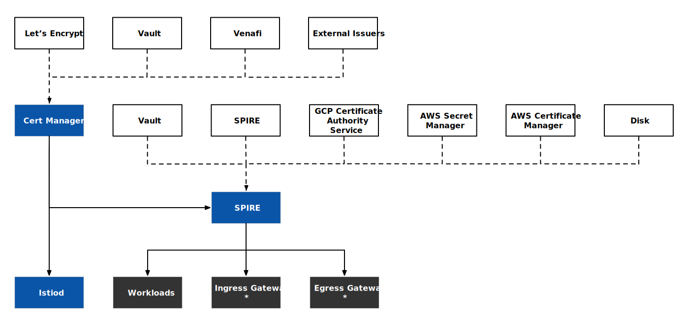
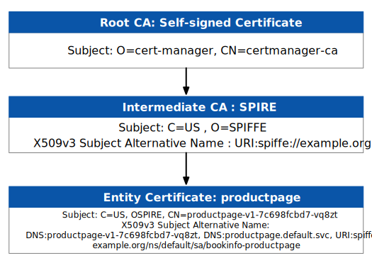

在[上一篇博客](/blog/istio-certificates-management/)中我介绍了 Istio 中是如何管理证书的，这篇文章将指导你如何使用外置 CA，通过集成 [SPIRE](https://spiffe.io/) 和 [cert-manager](https://cert-manager.io/) 实现细粒度的证书管理和自动证书轮换。

如果你还不了解什么是 SPIRE 以及为什么我们要使用 SPIRE，推荐你阅读以下内容：

- [为什么 Istio 要使用 SPIRE 做身份认证？](/blog/why-istio-need-spire/)
- [如何在 Istio 中集成 SPIRE？](/blog/how-to-integrate-spire-with-istio/)
- [零信任的基石：使用 SPIFFE 为基础设施创建通用身份](https://lib.jimmysong.io/spiffe/)

## 证书签发管理流程简介 {#intro}

下图展示了本文中使用的基于 cert-manager 和 SPIRE 的证书信任链：



从图中你可以看出：

- cert-manager 作为根 CA 为 *istiod* 和 SPIRE 颁发证书，我们使用了[自签名 Issuer](https://cert-manager.io/docs/configuration/selfsigned/)，你还可以为其配置使用 Let's Encrypt、Vault、Venafi 等内置 Issuer，或其他外置的 Issuer；另外你也可以选择使用其他 [UpstreamAuthority](https://spiffe.io/docs/latest/deploying/spire_server/)，例如 Vault、SPIRE 联邦等；
- SPIRE 为 Istio 网格内工作负载和 Ingress Gateway、Egress Gateway 颁发 SVID 证书，用于服务间 mTLS；
- 其中网格外访问 Ingress Gateway 时的使用的证书及 Egress Gateway 访问网格外服务使用的证书需要额外配置；

下图展示了在 Istio 中集成 SPRIE 和 cert-manger 后的证书颁发和更新流程。


1. SPIRE Server 中的 Kubernetes Workload Registar 自动注册 Kubernetes 中的工作负载，为所有工作负载生成 SPIFFE 标准的身份；
2. cert-manager 为 *istiod* 颁发并管理 CA 证书；
3. 工作负载中的 Envoy 代理通过 UNIX Domain Socket（UDS）通过 SDS API 向同节点上的 SPIRE Agent 发送 CSR 请求；
4. SPIRE Agent 向 SPIRE Server 发送 CSR；
5. SPIRE Server 向 SPIRE Agent 返回签名后的证书；
6. SPIRE Agent 向工作负载返回签名后的证书；
7. SPIRE 负责工作负载的证书管理和更新；

在了解了大致流程后，下面我们将从手安装各个组件。

## 安装 cert-manager {#install-cert-manager}

运行下面的命令安装 cert-manager，我们将使用它来实现自动证书轮换：

```bash
kubectl apply -f https://github.com/cert-manager/cert-manager/releases/download/v1.10.1/cert-manager.yaml
```

根 CA 是用自签名证书，运行下面的命令配置根 CA：

```yaml
cat << EOF | kubectl apply -f -
---
apiVersion: cert-manager.io/v1
kind: Issuer
metadata:
  name: selfsigned
  namespace: cert-manager
spec:
  selfSigned: {}
---
apiVersion: cert-manager.io/v1
kind: Certificate
metadata:
  name: selfsigned-ca
  namespace: cert-manager
spec:
  isCA: true
  duration: 21600h
  secretName: selfsigned-ca
  commonName: certmanager-ca
  subject:
    organizations:
      - cert-manager
  issuerRef:
    name: selfsigned
    kind: Issuer
    group: cert-manager.io
---
apiVersion: cert-manager.io/v1
kind: ClusterIssuer
metadata:
  name: selfsigned-ca
spec:
  ca:
    secretName: selfsigned-ca
EOF
```

然后为 *istiod* 配置证书：

```yaml
kubectl create namespace istio-system
cat << EOF | kubectl apply -f -
---
apiVersion: cert-manager.io/v1
kind: Certificate
metadata:
  name: cacerts
  namespace: istio-system
spec:
  secretName: cacerts
  duration: 1440h
  renewBefore: 360h
  commonName: istiod.istio-system.svc
  isCA: true
  usages:
    - digital signature
    - key encipherment
    - cert sign
  dnsNames:
    - istiod.istio-system.svc
  issuerRef:
    name: selfsigned-ca
    kind: ClusterIssuer
    group: cert-manager.io
EOF
```

现在我们已经安装好了 cert-manager，并创建了名为 `selfsigned-ca` 的 `clusterIssuer`，接下来，我们来安装 SPIRE 并将 cert-manager 作为 SPIRE 的  [`UpstreamAuthority`](https://github.com/spiffe/spire/blob/main/doc/plugin_server_upstreamauthority_cert_manager.md)。

## 安装 SPIRE {#install-spire}

运行下面的命令快速安装 SPIRE：

```bash
kubectl apply -f https://gist.githubusercontent.com/rootsongjc/5dac0518cc432cbf844114faca74aa40/raw/814587f94bbef8fb1dd376282249dcb2a8f7fa1b/spire-with-cert-manager-upstream-authority-quick-start.yaml
```

该 YAML 文件比起 Istio 1.16 安装包中的 `samples/security/spire/spire-quickstart.yaml` 文件增加了对 cert-manager 的适配，如：

- 为 `spire-server-trust-role` ClusterRole 增加了对 `cert-manager.io` API 组的权限；
- 在 SPIRE Server 的配置中增加了 `UpstreamAuthority "cert-manager"` 配置； 



SPIRE Server 配置中的 `trust_domain` 应与安装 Istio 时指定的 `TRUST_DOMAIN` 环境变量的值保持一致。



该命令中会安装 [Kubernetes Workload Registrar](https://github.com/spiffe/spire/blob/main/support/k8s/k8s-workload-registrar/README.md)，自动注册 Kubernetes 中的工作负载。所有工作负载将根据其服务账户注册 SPIFFE 标准的服务身份格式 `spiffe://<trust-domain>/ns/<namespace>/sa/<service-account>`。

如果你想调整 SPIRE CA 和 SVID 证书的 TTL，可以在 SPIRE Server 的配置中修改 `ca_ttl`（默认 24h） 和 `default_svid_ttl`（默认 1h），详见 [SPIRE Server 配置](https://spiffe.io/docs/latest/deploying/spire_server/)。

## 安装 Istio {#install-istio}

运行下面的命令安装 Istio 并启用 CA 证书自动轮换：

```yaml
istioctl operator init
istioctl install --skip-confirmation -f - <<EOF
apiVersion: install.istio.io/v1alpha1
kind: IstioOperator
metadata:
  namespace: istio-system
spec:
  profile: default
  meshConfig:
    # 信任域应与 SPIRE Server 中配置的信任域相同
    trustDomain: example.org
  values:
    global:
    # 自定义 sidecar 模板
    sidecarInjectorWebhook:
      templates:
        spire: |
          spec:
            containers:
            - name: istio-proxy
              volumeMounts:
              - name: workload-socket
                mountPath: /run/secrets/workload-spiffe-uds
                readOnly: true
            volumes:
              - name: workload-socket
                csi:
                  driver: "csi.spiffe.io"
                  readOnly: true
  components:
    pilot:
      k8s:
        env:
          # 如果启用，如果用户引入新的中间插件 CA，用户不需要重新启动 istiod 来获取证书。Istiod 会获取新添加的中间插件 CA 的证书并更新它。不支持插入新的 Root-CA。
          - name: AUTO_RELOAD_PLUGIN_CERTS
            value: "true" 
    ingressGateways:
      - name: istio-ingressgateway
        enabled: true
        label:
          istio: ingressgateway
        k8s:
          overlays:
            - apiVersion: apps/v1
              kind: Deployment
              name: istio-ingressgateway
              patches:
                - path: spec.template.spec.volumes.[name:workload-socket]
                  value:
                    name: workload-socket
                    csi:
                      driver: "csi.spiffe.io"
                      readOnly: true
                - path: spec.template.spec.containers.[name:istio-proxy].volumeMounts.[name:workload-socket]
                  value:
                    name: workload-socket
                    mountPath: "/run/secrets/workload-spiffe-uds"
                    readOnly: true
EOF
```

因为我们要使用 Istio Operator 中声明的 `spire` 模板来部署工作负载，因此我们运行下面的命令部署 Bookinfo 应用：

```bash
istioctl kube-inject -f bookinfo-with-spire-template.yaml | kubectl apply -f -
```

**注意**：上面命令中使用的 `bookinfo-with-spire-template.yaml` 文件可以在[这个 Gist](https://gist.githubusercontent.com/rootsongjc/5dac0518cc432cbf844114faca74aa40/raw/5f4ce4c857cfb9f45121b6e4d26d01b8d4e29b84/) 中找到，与 Istio 安装包中的 `samples/bookinfo/platform/kube/bookinfo.yaml` 文件唯一的区别就是每个 Deployment 的 template 中都增加了以下注解：

```yaml
annotations:
  inject.istio.io/templates: "sidecar,spire"
```

使用下面的命令可以检查 SPIRE 是否给工作负载颁发了身份证明：

```bash
kubectl exec -i -t spire-server-0 -n spire -c spire-server -- /bin/sh -c "bin/spire-server entry show -socketPath /run/spire/sockets/server.sock"
```

你可以在输出结果中看到 protuctpage 服务的身份信息：

```
Entry ID         : 68182621-aa9d-448d-9020-9b6ab3640b94
SPIFFE ID        : spiffe://example.org/ns/default/sa/bookinfo-productpage
Parent ID        : spiffe://example.org/k8s-workload-registrar/demo-cluster/node/gke-jimmy-cluster-default-pool-d5041909-5tzd
Revision         : 1
TTL              : default
Selector         : k8s:node-name:gke-jimmy-cluster-default-pool-d5041909-5tzd
Selector         : k8s:ns:default
Selector         : k8s:pod-uid:6244a82c-2862-4452-a592-f79a41e5ccff
DNS name         : productpage-v1-6999d7b9d9-7szxm
DNS name         : productpage.default.svc
```

查看 `productpage` pod 的证书信任链：

```bash
istioctl proxy-config secret deployment/productpage-v1 -o json | jq -r \
'.dynamicActiveSecrets[0].secret.tlsCertificate.certificateChain.inlineBytes' | base64 --decode > chain.pem
```

查看根证书：

```bash
istioctl proxy-config secret deployment/productpage-v1 -o json | jq -r \
'.dynamicActiveSecrets[1].secret.validationContext.trustedCa.inlineBytes' | base64 --decode > root.pem
```

使用文本编辑器打开 `chain.pem` 文件，你将可看到其中有两个证书，将这两个证书分别保存到独立的文件中，然后使用 `openssl` 命令 `openssl x509 -noout -text -in $FILE` 解析证书内容，你将看到如下的证书信任链。



查看 Istiod 的证书：

```bash
istioctl proxy-config secret deployment/istiod -o json | jq -r \
'.dynamicActiveSecrets[0].secret.tlsCertificate.certificateChain.inlineBytes' | base64 --decode > chain.pem
```

从证书信任链中我们可以看到：

- cert-manager 做为 PKI 的根节点为 *istiod* 颁发证书；
- SPIRE 作为中间 CA 再为各个工作负载颁发证书；
- Istio 网格中工作负载的 X509 v3 主体别名中的 URI 遵循了 SPIFF 身份规范；

## 设置证书自动轮换 {#cert-auto-rotate}

如果你要修改 *istiod* 证书的轮换周期，从 60 天（1440 小时）缩短到 30 天（720 小时），运行下面的命令：

```bash
cat << EOF | kubectl apply -f -
---
apiVersion: cert-manager.io/v1
kind: Certificate
metadata:
  name: cacerts
  namespace: istio-system
spec:
  secretName: cacerts
  duration: 720h 
  renewBefore: 360h
  commonName: istiod.istio-system.svc
  isCA: true
  usages:
    - digital signature
    - key encipherment
    - cert sign
  dnsNames:
    - istiod.istio-system.svc
  issuerRef:
    name: selfsigned-ca
    kind: ClusterIssuer
    group: cert-manager.io
EOF
```

运行下面的命令查看 *istiod* 的日志：

```bash
kubectl logs -l app=istiod -n istio-system -f
```

过两分钟后，你将看到类似如下的证书更改记录：

```
2022-12-23T03:48:42.697360Z	info	Update Istiod cacerts
2022-12-23T03:48:42.697503Z	info	Using kubernetes.io/tls secret type for signing ca files
2022-12-23T03:48:42.778241Z	info	Istiod has detected the newly added intermediate CA and updated its key and certs accordingly
2022-12-23T03:48:42.779459Z	info	x509 cert - Issuer: "CN=istiod.istio-system.svc", Subject: "", SN: d7acac2301045f741e5e30cff380deaf, NotBefore: "2022-12-23T03:46:42Z", NotAfter: "2032-12-20T03:48:42Z"
2022-12-23T03:48:42.779561Z	info	x509 cert - Issuer: "CN=certmanager-ca,O=cert-manager", Subject: "CN=istiod.istio-system.svc", SN: 164bf045670a1716ed3f0f1c89b56122, NotBefore: "2022-12-23T03:48:14Z", NotAfter: "2023-01-22T03:48:14Z"
2022-12-23T03:48:42.779642Z	info	x509 cert - Issuer: "CN=certmanager-ca,O=cert-manager", Subject: "CN=certmanager-ca,O=cert-manager", SN: 8533dbfe0b84ed1fc4e3c76be7ef612f, NotBefore: "2022-12-20T07:50:12Z", NotAfter: "2025-06-07T07:50:12Z"
2022-12-23T03:48:42.779657Z	info	Istiod certificates are reloaded
```

要修改工作负载证书的自动轮换周期，你可以设置 `pilot-agent` 命令的环境变量 `SECRET_TTL`，默认值为 `24h0m0s`。

## 总结 {#summary}

在本文中，我们使用了 cert-manager 作为 PKI，将 SPIRE 集成到我们的证书信任链中，并为 Istio 网格中的工作负载创建身份和证书。通过使用 cert-manager，你不用担心 *istiod* 证书过期的问题，还可以根据需要更新证书。你还可以根据需要将 cert-manager 集成到其他证书供应商，如 [Let's Encrypt](https://letsencrypt.org/)、[HashiCorp Vault](https://www.vaultproject.io/)、[Venafi](https://www.venafi.com/) 等。你也可以使用 [istio-csr](https://github.com/cert-manager/istio-csr) 直接让 cert-manager 来管理 Istio 中的证书，参考[使用 istio-csr 将外部 CA 与证书管理器集成](https://istio.tetratelabs.io/zh/blog/external-ca-integration-with-cert-manager-using-istio-csr/)，或[使用 Vault 来存储证书](https://lib.jimmysong.io/blog/how-to-use-hashicorp-vault-as-a-more-secure-way-to-store-istio-certificates/)。

## 参考 {#reference}

- [将 Istio 纳入信任链：使用现有 PKI 作为信任根 - lib.jimmysong.io](https://lib.jimmysong.io/blog/istio-trust/)
- [在生产中大规模自动化 Istio CA 轮换 - lib.jimmysong.io](https://lib.jimmysong.io/blog/automate-istio-ca-rotation-in-production-at-scale/)
- [如何使用 Hashicorp Vault 作为一种更安全的方式来存储 Istio 证书 - lib.jimmysong.io](https://lib.jimmysong.io/blog/how-to-use-hashicorp-vault-as-a-more-secure-way-to-store-istio-certificates/)
- [如何在 Istio 中集成 SPIRE - lib.jimmysong.io](https://lib.jimmysong.io/blog/istio-spire-integration/)
- [SPIRE Server Configuration Reference - spiffe.io](https://spiffe.io/docs/latest/deploying/spire_server/#built-in-plugins)
- [Server plugin: UpstreamAuthority "cert-manager" - github.com](https://github.com/spiffe/spire/blob/v1.5.3/doc/plugin_server_upstreamauthority_cert_manager.md)
- [Configuring SPIRE - spiffe.io](https://spiffe.io/docs/latest/deploying/configuring/)
- [使用 istio-csr 将外部 CA 与证书管理器集成 -  istio.tetratelabs.io](https://istio.tetratelabs.io/zh/blog/external-ca-integration-with-cert-manager-using-istio-csr/)
