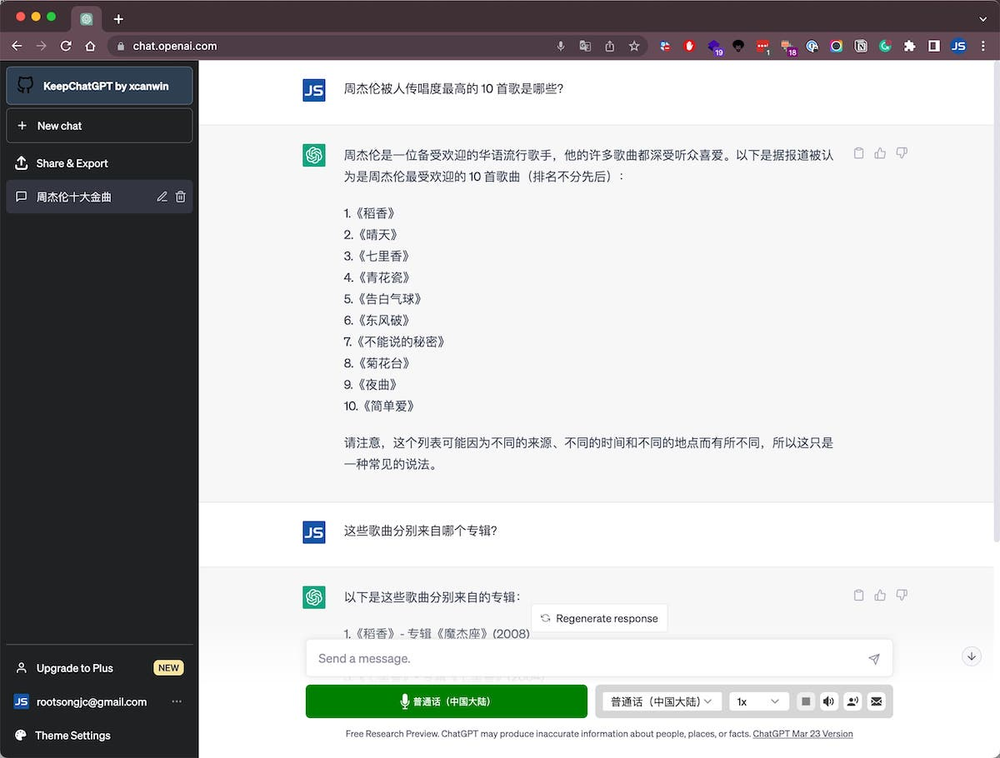

ChatGPT 是一个强大的工具，可以根据提示生成文本响应。然而，使用浏览器版本可能会很繁琐和耗时。幸运的是，有几个浏览器扩展可以帮助您更有效地使用 ChatGPT。在本文中，我们将讨论几个我个人测试并推荐的最有用的 ChatGPT 浏览器扩展。这些插件都是完全免费的，不存在订阅或者后期收费选项，大家可以放心使用。

下图展示了安装了插件的 Chrome 浏览器中的 ChatGPT 页面。

## ChatGPT Prompt Genius

GitHub:<https://github.com/benf2004/ChatGPT-Prompt-Genius>

这个项目是一个多功能的 ChatGPT 浏览器扩展，它可以帮助你发现、分享、导入和使用最好的 ChatGPT 提示。你也可以把你的聊天记录保存在本地，方便以后查看和参考。你可以使用扩展的提示模板功能，轻松地找到并添加提示到你的收藏。你可以在 ChatGPT 页面上搜索、分类和选择提示，找到有创意和有用的方式使用 ChatGPT。还可以添加一些主题，比如短信、温馨的壁炉和黑客。

## ChatGPT for Google

在搜索引擎结果中同时显示 ChatGPT 的回答，功能点如下：

- 支持所有主流的搜索引擎
- 在获得搜索结果后可直接开始聊天
- 支持 OpenAI 官方 API
- 从插件弹窗里快速使用 ChatGPT
- 支持 Markdown 渲染
- 支持代码高亮
- 支持深色模式
- 可自定义 ChatGPT 触发模式

你可以在 [Chrome 网上应用商店](https://chrome.google.com/webstore/detail/chatgpt-for-google/jgjaeacdkonaoafenlfkkkmbaopkbilf) 下载。

## KeepChatGPT

GitHub:<https://github.com/xcanwin/KeepChatGPT>

让我们在使用 ChatGPT 过程中更高效、更顺畅，完美解决 ChatGPT 网络错误，不再频繁地刷新网页，足足省去 10 个多余的步骤。还可以取消后台监管审计。

解决了这几类报错：

1. NetworkError when attempting to fetch resource.
2. Something went wrong. If this issue persists please contact us through our help center at [help.openai.com](http://help.openai.com/) .
3. This content may violate our content policy.
4. Conversation not found.

## TalkBerry

这个 Chrome 扩展的主要内容是让你可以用语音和 ChatGPT 交流，而不需要打字。它的功能有：

- 选择你想要聊天的语言，支持多种语言。
- 点击麦克风按钮，开始对话，ChatGPT 会用语音回复你。
- 用语音命令控制 ChatGPT，比如说“停止”或“继续”。
- 在设置菜单中调整语音识别和文本转语音的选项。

这个扩展可以让你更方便地使用 ChatGPT，也可以帮助你学习外语或提高口语能力。它是一个免费和开源的项目，你可以在 [Chrome 网上应用商店](https://www.notion.so/ChatGPT-5523efe226d744b59f136565ddf3cc90) 下载。

需要注意的是，你无法关闭用语音朗读，除非你卸载掉该扩展。

## WebChatGPT

这个免费的扩展程序将相关的网络结果添加到您对 ChatGPT 的提示中，以获得更准确和最新的对话。

- 为您的查询获取网络结果
- 从任何 URL 中提取网页文本
- 添加和使用提示模板
- 使用 Duckduckgo bangs 从数千个网站中获取搜索结果

当你不想使用时，也可以在 ChatGPT 页面上随时关闭它。你可以在 [Chrome 网上应用商店](https://chrome.google.com/webstore/detail/webchatgpt-chatgpt-with-i/lpfemeioodjbpieminkklglpmhlngfcn?hl=zh-CN) 下载该扩展。

## 总结

这几个 ChatGPT 浏览器扩展可以帮助您更有效地使用 ChatGPT。无论您需要更便捷的界面、带有有用功能的侧边栏，都有一款扩展可以帮助。我建议尝试每个扩展，以确定哪个最适合您的需求。有了这些工具，您可以改善您的 ChatGPT 体验，快速轻松地生成高质量的文本响应。以后再发现其他更好的插件，笔者会在本文中更新，也欢迎读者朋友们有推荐的插件可以在评论中留言。