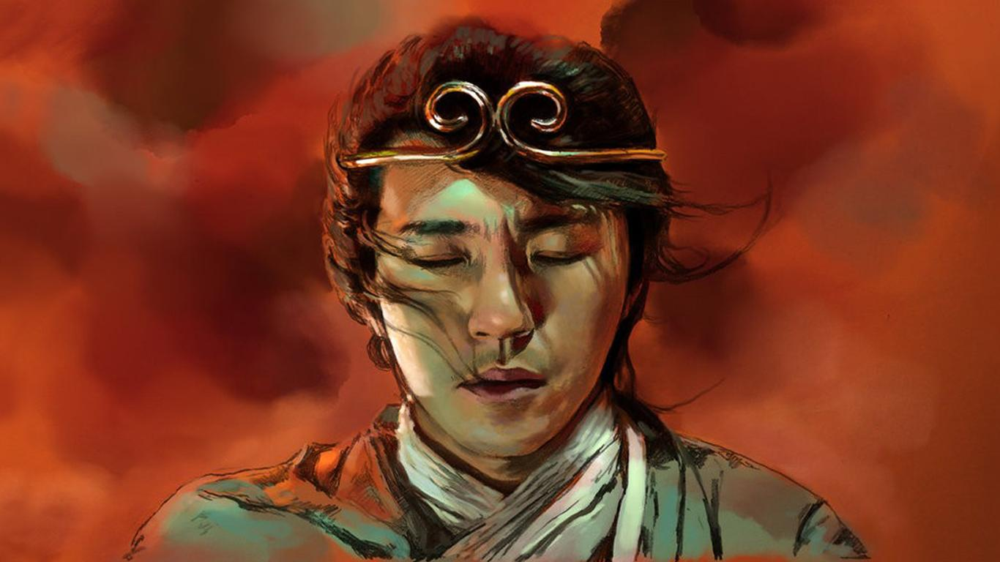

我觉得大部分应该都看过周星驰的电影《大话西游》，因此就拿这部电影中的角色，使用 ChatGPT 来写神仙故事。在这个故事中，我创造了一个角色，其性格特点借鉴了《教父》电影中柯里昂。通过 ChatGPT 来创作这个故事，我们看到了 ChatGPT 的强大创作能力。希望大家喜欢这个故事，也希望 ChatGPT 能够继续为我们带来更多优秀的创意！

## 主要人物

以下是这个故事中的主要人物。

- 至尊宝：「齐天大圣帮」的首领，聪明狡猾，还有些幽默，懂得如何利用人性和政治来掌握和巩固统治。拥有《教父》中的唐·维托·柯里昂的性格。
- 紫霞仙子：温柔善良的仙女，居住在天宫，是玉帝的女儿，也是至尊宝的好友和情人。
- 太上老君：天庭的一把手，负责保卫天庭和炼制丹药。
- 白晶晶：孙悟空的初恋情人，但最终因为误会而分手，最后成为太上老君的妻子，但一直暗中帮助孙悟空。
- 孙悟空：曾为太上老君的手下，负责看管蟠桃园，负责蟠桃的黑市交易，后来因受到太上老君的不公正对待而出走。与至尊宝邂逅并萌发情愫，叛变到至尊宝利益集团，并成为「齐天大圣帮」的一把手。

下面将讲述了一段使用 ChatGPT 创作的神仙故事，将周星驰的《大话西游》和《教父》电影中的柯里昂角色结合在一起，创造了一个新的神仙故事。在这个故事中，至尊宝和孙悟空联手建立了一个掌控蟠桃园的势力，但最终被天庭打败。这个故事充满了政治斗争、阴谋诡计和爱情故事，非常吸引人。

## 天庭之争与至尊宝的计划

很久很久以前，在天庭中，有一颗传说中的神奇果实——蟠桃。这颗果实不仅具有不老不死的神奇效果，而且还能增强修为和提升功力。因此，蟠桃是天庭中的必需品，具有极高的经济价值。

掌管蟠桃园的太上老君，一直将这颗果实看得非常重要。他认为蟠桃园必须严加保护，不能让外界得到其中的果实。因此，他下令将蟠桃园重重地包围起来，并派遣强大的天兵天将来守卫。

然而，这个世界并不像太上老君想象的那么完美。在太上老君的手下中，有一个叫孙悟空的猴子，他从小就淘气不羁，喜欢捣乱，因此被太上老君赶出了天庭。他流浪四方，后来偶然得到了一件神器——定海神针，因此修为大增，成为了一位修真强者。

一天，孙悟空的初恋情人现已为太上老君妻子的白晶晶来找孙悟空，告诉他太上老君一直在控制着蟠桃园，对于蟠桃的分配极不公正。至尊宝决定带着齐天大圣帮派前往蟠桃园，查看事实。

当他们到达蟠桃园时，看到了许多人在排队等待领取蟠桃，但却只有很少一部分人能够领到。他们发现太上老君和他的手下在私自将蟠桃偷运到黑市进行交易，从中牟取巨额利润。而且太上老君对待其他手下的态度非常不公。他们不仅没有得到应有的待遇，还要承担巨大的压力和风险。看到这一切，孙悟空感到十分不满，开始思考如何改变这个不公平的局面。

在寻找解决方案的过程中，孙悟空邂逅了至尊宝。至尊宝是一位聪明狡猾的人，懂得如何利用人性和政治来掌握和巩固统治。他向孙悟空介绍了自己的计划：建立一个控制蟠桃园的集团，替天行道。

孙悟空被至尊宝的计划所吸引，并加入了他的团队。他们开始秘密地运作，并与其他反对太上老君的势力联系起来。随着至尊宝的逐渐壮大，他的齐天大圣帮也逐渐成为了天庭的一股不可忽视的势力。其他的仙神们也开始注意到了这个庞大的帮派，有些仙神甚至开始想着入驻其中，与至尊宝联手。「齐天大圣帮」的崛起，引起了太上老君和天庭其他高层的注意。他们开始对「齐天大圣帮」进行调查和打击，试图摧毁这个势利。

然而，至尊宝并不是一个好对付的人。他心机深沉，擅长利用人性和政治，巩固自己的地位和统治力。他在帮派中建立起了自己的人脉和势力，利用他们来维持自己的统治。太上老君虽然是天庭的一把手，但在至尊宝的眼中，他只是一个懒散、贪婪的老头子。至尊宝知道，只要太上老君有了合适的刺激，他就会向着齐天大圣帮投靠过来。

## 白晶晶与紫霞仙子的冒险

齐天大圣帮的势力范围越来越大，但白晶晶却开始对至尊宝感到担忧。她认为至尊宝过于狡猾，甚至有些阴险，不断地扩张势力，将齐天大圣帮变成了一个强大的黑帮。白晶晶担心这样会引来天庭的报复，而至尊宝却认为自己已经足够强大，不需要害怕天庭。

一天，至尊宝派遣了孙悟空前往蟠桃园，半夜里偷偷地将所有的蟠桃都偷走了，留下了一张纸条：「如果想要蟠桃，就来找我。」

当天，太上老君发现蟠桃园里所有的蟠桃都不翼而飞，顿时大怒。他发动了全天庭的力量来寻找蟠桃的下落，但是毫无所获。就在他准备要宣布天庭进入紧急状态的时候，一位仙女前来报告，称她看到了一个叫做「齐天大圣帮」的帮派在私自贩卖蟠桃。

太上老君顿时明白了一切，他意识到至尊宝早已经将自己的统治范围扩展到了蟠桃这个重要的资源上。他决定要亲自率领天兵天将前往齐天大圣帮，将蟠桃夺回来，并且惩罚那些不敬天庭的人。

白晶晶听到了天庭中的消息，称天庭打算派遣强大的天兵天将来摧毁齐天大圣帮。白晶晶想到了之前孙悟空曾经提到过的一个地方，那是一座神秘的古墓，据说里面有一种可以让人变得不死不灭的宝物。她认为只有拥有这种宝物，齐天大圣帮才有可能抵御天庭的攻击。

于是，白晶晶和紫霞仙子暗中前往古墓，试图寻找那种不死不灭的宝物。在路上，她们遇到了一只猴子，这只猴子正是孙悟空。孙悟空告诉她们，那种宝物是存在的，但在寻找的过程中，她们必须面对一系列危险和考验。

在古墓中，她们遇到了各种各样的陷阱和怪物，但是她们仍然坚持着前行，最终找到了那种神秘的宝物。这个宝物是一个名为「紫金红葫芦」的法宝，传说只有真正的齐天大圣才能够掌控它。

白晶晶和紫霞仙子把这个法宝带回给至尊宝，但是至尊宝并不相信这个神话，觉得这只是一个骗局，于是把法宝扔到了一边。但是孙悟空却相信这个神话，他试图掌控这个法宝。在试图控制这个法宝的过程中，孙悟空发现这个法宝确实有神奇的力量，他掌控了这个法宝，并开始展现出齐天大圣的强大力量。

## 齐天大圣帮的覆灭

在孙悟空和法宝的帮助下，齐天大圣帮的统治一直稳固，但却一直受到天庭的监视和打压。终于，在一次意外的机会下，天庭得到了一份密报，揭示了齐天大圣帮的诸多罪行，包括勾结妖魔，行凶杀人等等。天庭立即派出军队前来剿灭齐天大圣帮，经过一番激战，齐天大圣帮最终被打败。

在此期间，至尊宝被抓捕入狱，紫霞仙子得知消息后便来救他。但是，天庭方面早有准备，紫霞仙子前来时遭到了埋伏，最终无法成功营救至尊宝。之后，至尊宝被判处死刑，他与紫霞仙子在狱中进行了最后的告别，他深情地看着紫霞仙子，心中默念着她的名字。

走向刑场的那一刻，至尊宝的心中充满了悔恨和愧疚，他意识到自己的行为给紫霞仙子带来了无尽的痛苦和伤害。但是，他也清楚，这一刻已经无法挽回，他只能在临死之前，深深地感激和珍惜紫霞仙子对自己的爱和付出。

## 写在最后

在这个故事中，我借鉴了《教父》电影中柯里昂的性格特点，创造了一个与至尊宝原有形象反转的角色。这个故事只是对 AI 帮助故事创作的一次尝试，你可以在创作中的应用 AI 实现：

- 文本生成：AI 可以通过学习大量的文本数据，生成类似的文章、小说等创作。
- 角色生成：AI 可以生成各种形象的角色，包括外貌、特点、性格等等。
- 情节生成：AI 可以通过学习大量的情节，生成各种类型的情节，包括悬疑、爱情、冒险等等。
- 对话生成：AI 可以生成对话，帮助创作者更好地塑造角色，表达情感。

当然，这些技术只是辅助创作。最终的创作仍然需要创作者的灵感和创造力。AI 大大提高了创作的效率，并给予创作者更多灵感。但是，要想创造出别具一格的作品，还需要作者有“腹有诗书气自华”的素养。只有做到博览群书，才能够训练 AI 为你服务，而不是被 AI 绑架。